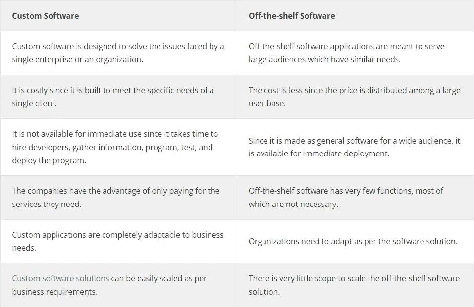

# 为您的企业使用定制应用开发服务的主要原因？

> 原文：<https://medium.com/codex/top-reasons-to-use-custom-app-development-services-6d08304e3edf?source=collection_archive---------10----------------------->

全球企业都在寻找定制的企业软件解决方案，以获得根据其需求量身定制的独特特性和功能。定制应用开发服务可帮助企业解决因传统现成软件包而面临的诸多问题。

为满足特定业务需求而开发的软件是一个吸引人的想法。然而，[定制软件工程](https://www.tntra.io/engineering) 是一项耗时耗力的工作。预计 2021 年全球 IT 支出约为 517 亿美元。定制软件解决方案虽然昂贵，但有助于提高公司生产力和扩大客户群。

像 BoTree Technologies 这样的软件开发公司可以帮助企业实现其业务目标。虽然现成的软件为具有类似需求的受众提供解决方案，但是[定制软件开发公司](https://botreetechnologies.medium.com/top-10-custom-software-development-companies-in-2022-5045e31cadd3)可以处理您企业的独特需求。

# 现成软件和定制软件解决方案之间的区别

> **阅读更多:**[**2022 年定制软件开发指南**](https://www.botreetechnologies.com/blog/what-to-know-about-custom-software-development/)

# 使用定制应用程序开发服务的 7 大理由

一些商业组织正在利用定制的业务应用程序，因为它在不同的领域都有成功的记录。此外，由于它们有助于设计提高效率的应用程序，因此有助于组织在竞争中脱颖而出。

全球定制软件开发的 7 大优势如下-

1.  **整合:**

*   在定制应用程序开发公司的帮助下，组织可以在其软件解决方案中集成尖端功能。软件服务的集成提供了促进和管理组织和开发定制软件的公司之间的交互和合作的能力。
*   一个能与你的企业和员工很好合作的开发者是必要的。此外，能够很好地适应你公司文化和价值观的开发团队更有可能产生更好的结果。
*   定制软件开发确保了定制、成本效益、可伸缩性等等，以及与客户团队的集成。

**2。性价比:**

*   成本效益是选择定制应用程序开发的最重要的原因之一。此外，定制应用程序开发人员本质上是透明的，并且从一开始就把一切都设置得很清楚。
*   雇用最好的开发团队可以确保个性化的应用程序，可以帮助公司以比竞争对手更便宜的方式接触到受众。一个负担得起的定制 web 应用程序可以帮助您降低流程成本，并向客户提供负担得起的产品和服务。

**3。保护数据:**

*   一些商业组织处理关键数据和信息。例如，保险、医疗保健等领域的公司会保留大量客户个人信息的记录。鉴于关键信息的数量，网络攻击的风险始终是一个令人担忧的问题。
*   2022 年上半年，全球恶意软件[28 亿，勒索软件攻击 2.36 亿次。](https://www.techrepublic.com/article/top-cybersecurity-threats/)企业不断面临安全威胁，如恶意软件攻击、勒索软件攻击、网络钓鱼攻击、供应链问题等。
*   定制软件开发服务提供商拥有为不同领域的客户工作的经验。他们经验丰富的工程师可以帮助开发健壮和安全的软件应用程序。
*   自定义应用程序开发人员建立的数据安全措施有助于确保关键数据的安全。

> **阅读更多:** [**美国定制软件开发费用是多少？**](https://www.botreetechnologies.com/blog/cost-of-custom-software-development-us/)

**4。易于维护:**

*   一个[定制应用开发公司](https://www.botreetechnologies.com/custom-application-development) 提供的不仅仅是短期的便利。随着时间的推移，定制的应用程序使维护变得更容易、更便宜。
*   商业组织必须花费大约 10%的开发预算来更新他们的软件系统。频繁而轻松地升级应用程序有助于确保企业使用最新版本的操作系统，保持系统的新鲜度，并与最新的用户界面/UX 趋势保持一致。
*   易于维护也确保了应用程序能够确保数据安全。因此，经验丰富的定制开发人员有助于应用程序的部署后维护。

**5。可扩展性:**

*   没有短期使用的商业应用。随着业务的增长，他们预计其应用程序也会增长。因此，可伸缩性是雇佣一家[企业软件开发公司](https://www.botreetechnologies.com/enterprise-software-development-company)的主要优势。
*   定制软件的设计和开发通常考虑到可伸缩性选项。常规的现成软件程序有其自身的限制，因此不能超出限制运行。
*   定制程序可以修改，以随着业务的发展而增长，同时确保高生产率和投资回报率。

**6。可靠性:**

*   对于任何企业来说，应用程序的可靠性都是一个关键因素。由于对应用程序的高度控制，由[专门的软件开发团队](https://www.botreetechnologies.com/blog/how-to-hire-a-dedicated-software-development-team-in-2022/)设计和部署的解决方案更加安全可靠。
*   定制开发人员使用质量和最新的安全标准来确保最终软件产品的质量。

**7。唯一解决方案:**

*   选择定制软件的主要原因之一是拥有解决方案来控制它。由于企业可以控制应用程序，他们可以随时进行更改，添加必要的信息，并实现客户反馈。
*   由开发人员开发的成功的应用程序将所有客户视为具有特定需求的个体。

> **查看我们的成功案例:** [**可定制企业内容管理系统网站**](https://www.botreetechnologies.com/case-studies/customizable-enterprise-cms)

## 结论

如果顾客是上帝，企业必须尽一切努力以可承受的价格提供高质量的产品和服务。

最佳定制软件开发公司可以接管开发定制解决方案的繁琐和耗时的过程。此外，由于这样的企业组织拥有定制应用程序所需的经验和技术知识，他们可以帮助构建您的企业所需的应用程序。

BoTree Technologies 是全球定制软件开发领域的领先企业。如果您正在寻找一家 [Django 开发公司](https://www.botreetechnologies.com/django-development)来帮助您开发定制应用程序，请立即联系我们。

[**联系我们**](https://www.botreetechnologies.com/contact) **今天免费咨询。**

**常见问题解答**

1.  **什么是定制软件开发？**

*   [定制软件开发](https://topappdevelopmentcompanies.com/software/custom-software-development-which-industries-does-it-benefit)是根据特定用户的定制需求为他们设计、创建、部署和维护软件的过程。
*   定制应用程序开发项目以征求建议书(RFP)开始。RFP 允许像 BoTree Technologies 这样的软件开发公司创建定制的、个性化的响应。

**2。定制企业软件解决方案的优势是什么？**

*   定制软件工程优势是
*   解决方案是量身定制的
*   保证投资回报率
*   安全可靠
*   适应性
*   使用方便
*   如果您正在寻找一家定制应用程序开发公司，能够为您提供定制软件开发的[优势](https://topdigital.agency/7-key-benefits-of-custom-app-development/)，请立即联系 BoTree Technologies。

**3。你应该如何为自己选择一家定制软件开发公司？**

*   这些是您在投资定制应用开发服务时需要考虑的一些因素
*   你愿意花多少钱？
*   项目的范围是什么？
*   了解您的实际需求
*   请求推荐
*   对公司进行背景调查
*   看看他们的投资组合

*原载于 2022 年 12 月 12 日 https://www.botreetechnologies.com**的* [*。*](https://www.botreetechnologies.com/blog/reasons-to-use-custom-app-development-services/)