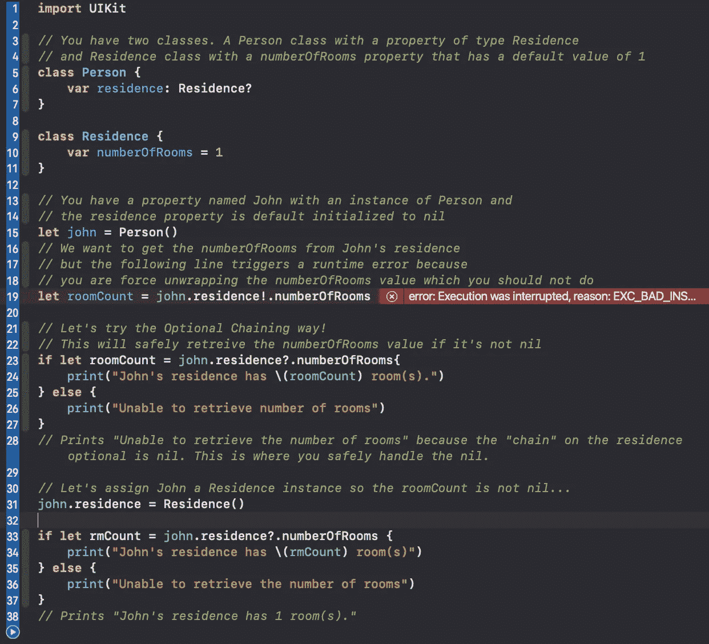

# iOS 开发人员最近的热门采访话题

> 原文：<https://medium.com/codex/top-recent-interview-topics-for-ios-developers-378bea6504e2?source=collection_archive---------6----------------------->

由[路](https://unsplash.com?utm_source=medium&utm_medium=referral)上[车头](https://unsplash.com/@headwayio?utm_source=medium&utm_medium=referral)拍摄

自 2022 年 4 月以来，我采访了一些知名公司，了解他们的 iOS 开发者职位。苹果、达美航空、GrubHub 和摩根大通等公司似乎都在寻找对一些基本和高级 iOS 技术有专门知识的 iOS 开发人员。

以下是我在最近的采访中对热门 iOS 技术的分析。

# 1.类和结构

谈到 iOS 开发，这可能是你需要知道的最基本的知识。人们总是会问*什么是类和结构，以及定义它们之间的异同*。我想这是一种面试策略，看看我是否知道一些基本知识，或者这是他们衡量我沟通技巧的一种方式。然而，让我们来看看这两种结构:

## 结构和类都可以:

*   定义存储值的属性
*   定义提供功能的方法
*   定义初始化器来设置它们的初始状态
*   可以扩展它们的功能，使其超出默认的实现
*   符合协议以提供某种标准功能

## 类别的其他功能包括:

*   使一个类能够从另一个类继承特征的继承
*   类型转换允许你在运行时检查类实例的类型
*   类实例的反初始化允许你释放分配给它的任何资源。
*   引用计数允许对一个类实例的多个引用。

当它归结为对类和结构差异的简单响应时，请记住**类是引用类型**，这意味着当您复制一个类时，您最终会得到对一个数据实例的两个引用。然而，**struct 是值类型**，这意味着当你复制一个 struct 时，你会得到两个唯一的数据副本。

# 2.应用程序生命周期和方法

为了确保你创建的应用程序具有流畅的用户体验，你必须熟悉应用程序生命周期的不同状态和方法。拥有数百万用户的应用程序的公司希望找到一个熟悉这些状态和方法的候选人，因为这可以确保他们提交的代码不会影响他们应用程序的性能，从而影响用户的体验。让我们来分解状态和方法:

## 各国:

*   **未运行** —应用程序未启动或在一段时间后终止。
*   **活动**—app 正在运行，你可以在前台看到，正在接收事件。
*   **不活动** —应用程序仍在前台，但由于另一个事件(如电话)而停止接收事件。
*   **后台** —当用户点击 home 键或打开另一个应用时，曾经活跃的应用现在被设置为后台状态，但仍在执行代码和事件。后台状态也是当它需要额外的执行时间并且在被置于挂起状态之前的状态。
*   **暂停** —在这种状态下，应用被置于后台并停止执行代码，但仍保留在内存中。现在在前台的应用程序优先于暂停的应用程序，暂停的应用程序也可以从内存中清除，无需任何通知来释放系统资源。

## 方法:

*   **viewDidLoad** —仅在视图控制器加载到内存后调用一次。
*   **viewWillAppear** —当视图被添加到视图层次结构中时调用。
*   **viewDidAppear** —当视图被加载并对用户可见时调用。API 调用、数据存储查询和定位服务激活等任务都可以在这里执行。
*   **视图消失** —通知视图控制器它将从视图层次结构中消失。
*   **视图消失** —通知视图控制器它已经从视图层次结构中删除。

# **3。可选链接**

了解如何以及何时使用可选链接可以让面试官确信，当处理从 web 服务查询的数据时，可能会出现数据为零的情况，如果处理不当，可能会导致崩溃。**可选链接**被认为是*优雅地失败*，并被大量用于强制解包。让我们在实践中看到这一点。

现在您已经了解了什么是可选链接，想象一下当从数据库或 REST API 中检索数据时，这是如何发挥作用的。您不能总是保证会收到数据，所以最好确保在查询返回 nil 时正确处理它👍🏼

# 4.弱引用属性与强引用属性

大多数面试官希望我理解自动引用计数(ARC)的概念，这是 iOS 的内存管理系统。ARC 的基本职责是确保没有内存泄漏，这可能导致应用程序崩溃，使其成为一个可怕的用户体验。使用**弱**属性引用确保该属性的实例在不使用时可以初始化和反初始化，允许应用程序释放内存。默认情况下，属性被设置为**强**引用，它们将保留周期增加 1。强引用的对象只要还在使用中，ARC 就不会将它们从内存中移除。

# 5.并发性(异步/等待)

最后但同样重要的是，并发性。Swift 5.5 中引入的使用 Async/Await 的并发性允许代码暂停并在稍后恢复。使用的传统方法是闭包，管理回调是一件痛苦的事情，尤其是在处理多个实例时。当处理需要查询数据的网络请求时，并发性是理想的，但它可以保持用户界面的响应性。随着现代 iPhones 配备了强大的多核 CPU，运行异步代码变得轻而易举，使应用程序更加响应迅速。我学到的关于并发性的一个好处是，你可以拥有一组 API 端点，将这些端点分组到单个 **TaskGroup** 中，并从这些端点异步查询数据。如果 TaskGroup 偶然未能查询一个端点的数据，但成功地查询了其他端点，您可以为失败的查询抛出错误，但仍然从其他端点捕获数据。这只是并行性的一个尝试，但足以让面试官理解你的观点。

如果你开始学习 iOS 开发，当你准备开始申请时，一定要跟进上面讨论的主题。如果你刚刚开始学习 iOS 开发，不知道从哪里以及如何开始，一定要看看我的另一篇[文章](/codex/8-tips-for-self-taught-ios-developer-newcomers-6cd087129a08)，它有助于定义一个自学路线图。

如果你觉得这篇文章或我的其他文章有帮助，请给它一个👏🏻并且一定要关注我获取更多内容。在那之前，编码快乐！