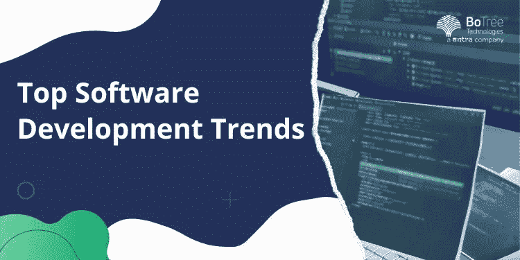

# 2023 年顶级软件开发趋势

> 原文：<https://medium.com/codex/top-software-development-trends-in-2023-9b81d46ec514?source=collection_archive---------9----------------------->

当讨论每天都在攀登新高度的技术时，软件开发领域已经成为最有前途的领域之一。因此，为提供[软件开发服务](https://www.botreetechnologies.com/blog/what-services-does-a-software-development-firm-provide/) 的企业带来了前所未有的重大机遇。

来自商业研究公司的一份[报告称，全球应用软件开发市场的规模预计将在 2022 年达到 2603.8 亿美元，到 2026 年将以 28.19%的复合年增长率(CAGR)达到 7031.3 亿美元。](https://www.thebusinessresearchcompany.com/report/application-development-software-global-market-report#:~:text=The%20global%20application%20software%20development,least%20in%20the%20short%20term.)

在这个数字化的新世界里，机会是无限的。但这种迅猛增长也有其负面影响。Statista 的数据显示[谷歌 Play 商店拥有令人难以置信的 268 万个应用](https://www.statista.com/statistics/266210/number-of-available-applications-in-the-google-play-store/)，而[苹果的应用商店拥有 164 万个应用](https://www.statista.com/statistics/779768/number-of-available-apps-in-the-apple-app-store-quarter/)。

这些都不是小数字，但这也意味着争取新用户的激烈竞争。这就是为什么通过从其他类似的应用程序中脱颖而出来确保你的应用程序获得更多下载是至关重要的。

一个[企业软件开发公司](https://www.botreetechnologies.com/enterprise-software-development-company) 需要了解[最新的软件开发趋势](https://www.botreetechnologies.com/blog/software-development-trends/) 来开发前沿的应用程序，以便在这场竞争浪潮中生存下来。

# 2023 年将遵循的顶级软件开发趋势

为了获得富有成效的[定制软件开发](https://www.botreetechnologies.com/blog/customized-software-what-is-it-types-and-examples/)体验，以下是你需要遵循的顶级软件开发趋势:

*   **Web 3.0 的到来和演进**
*   随着更具沉浸感和更有效的用户体验占据中心舞台，Web 3.0 将以高度精炼的交互性彻底改变世界。借助 Web 3.0，应用程序用户可以高度控制他们访问的数据，从而提供出色的整体体验。
*   除此之外，Web 3.0 还将允许取消中介，从而为用户带来更多优势。这种去中心化也将避免任何安全漏洞和数据黑客，带来方方面面的安全。

**Web 3.0 将产生重大影响的几个行业如下:**

*   **保险**
*   Web 3.0 的高度透明属性将消除任何虚假索赔的机会，这是当今各种保险公司面临的一个巨大问题。这将提高透明度，防止任何欺诈性索赔。
*   **社交媒体**
*   许多人一直在使用社交媒体平台与家人、朋友和亲戚交流。简而言之，过多的信息可能会被错误地使用。随着 Web 3.0 带来的更多控制，人们将更加关注数据安全。
*   **在线流媒体服务**
*   Web 3.0 的发展将显示在线流媒体领域的安全增长，因为到目前为止，用户数据被用于显示 Web 2.0 下的相关广告。
*   Web 3.0 将改变这一切，而[软件开发工具](https://www.botreetechnologies.com/blog/top-software-development-tools/) 正在确保这将在 2023 年赢得最高荣誉。
*   人们认为 Web 3.0 为流媒体平台提供了一种安全可靠的机制。流行的网飞和 Spotify 在 Web 2.0 期间面临的问题可能会随着 Web 3.0 而消失。Web3 将使用户能够从他们与平台共享的数据中获得补偿。
*   **开发运维将成为新的常态**

*   DevOps 是开发和运营两个术语的合并，是一个软件部署和交付过程，将两者结合在一个统一的过程中。它以更快的速度交付更高质量的代码，这意味着集成、部署以及基础设施管理所需的时间更少。
*   随着与组织的相关性增加，它现在也成为开发人员需要掌握的一项技能。DevOps 帮助一家企业软件开发公司快速处理反馈，加快了应用和平台部署的速度。
*   由于产品经理在轻松提供完美产品方面的灵活性，DevOps 趋势只会在 2023 年上升。
*   **加速人工智能在整个领域的应用**
*   人工智能对大众来说越来越实惠，它的采用也见证了随后的高峰。这项技术使得高效完成复杂到人类无法完成的任务成为可能。
*   人工智能的日益普及将对这项技术产生巨大影响。机器学习将大大提高系统能力，而不需要太多不必要的编程来支持它。
*   作为技术本身，人工智能将对任何软件开发公司产生巨大的影响。
*   **网络安全及其有利需求**
*   无论是任何软件开发服务；网络安全正迅速成为最受青睐的领域之一。随着我们走向一个更加数字化的世界，这种偏好和必要性只会找到越来越多的接受者。
*   从生物识别到不同的渗透测试工具，未来几年对网络安全的投资肯定会增加。此外，每家企业软件开发公司都需要尽早进行这些投资，因为它们可以节省大量的修复费用。
*   要做到这一点，应该高度重视复杂的防病毒软件、最新的防火墙迭代、数据加密投资和数据流量监控。
*   **更好的接受区块链技术**

*   在最初的日子里，全世界都认为区块链只适用于比特币和其他相关货币。转移到现在，人们已经认识到，区块链本质上是一种分布式账本，具有彻底改变行业的巨大潜力。
*   以下是区块链在未来将如何影响软件开发服务的几点建议:
*   更好的解释和验证数据的能力。
*   区块链将确保整个供应链流程中更好的问责制和透明度，这是目前的技术需要帮助处理的事情。
*   更好地与物联网(IoT)实施集成，通过第三方解决方案进行验证。
*   这将彻底改变公司开发安全应用的方式。
*   **元宇宙的到来**
*   增强和虚拟现实技术将以元宇宙的形式不断发展，改变商业企业的工作方式。他们的模拟能力提高了元宇宙的倾斜度，发现它在外科手术规划、产品展示等实际领域中的效用。
*   与任何行业相比，汽车行业将利用这种“元宇宙”式的生活方式来提高家庭成员和乘客出行时的安全性。
*   就嵌入式软件开发趋势而言，元宇宙将在 2023 年带来巨大的变化。

# 总结事情

我们希望这六大趋势能对你的决策有很大的帮助。作为一家初创公司或企业，在构建能够满足所有客户期望的应用程序时，您必须牢记这些原则。

博客中提到的所有技术和趋势，要么对社会有重大影响，要么对 2023 年及以后的软件发展趋势有重大影响。web 3.0、物联网、云服务和人工智能采用等软件发展趋势具有加速商业潜力的巨大能力。

如果您正在为您的[离岸软件开发](https://www.botreetechnologies.com/blog/how-to-partner-with-an-offshore-software-development-firm/)、**、**寻找最完美的[软件开发服务](https://www.botreetechnologies.com/blog/what-services-does-a-software-development-firm-provide/)、**、**，那么 BotTree Technologies 将提供最适合敏捷软件开发[趋势](https://www.botreetechnologies.com/blog/agile-software-development-in-python/)、**、**的服务，帮助您长期保持高度相关性。

*原载于 2022 年 12 月 2 日*[*https://technical nick . in*](https://technicalnick.in/tech/top-software-development-trends-in-2023/)*。*