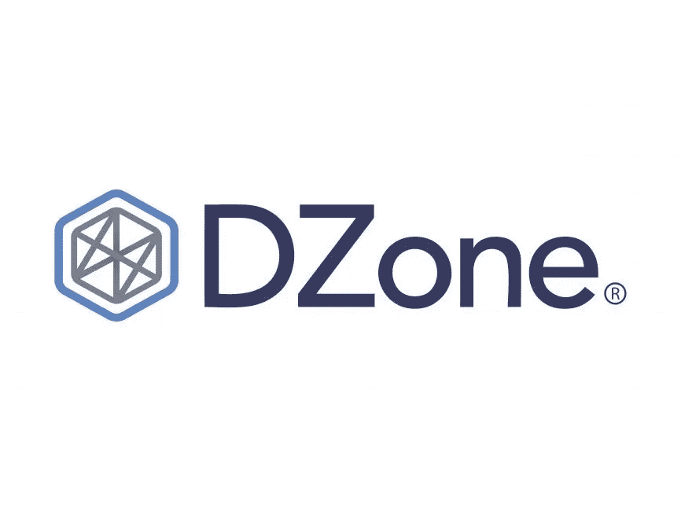
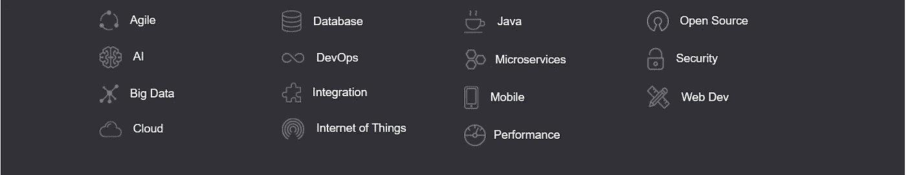
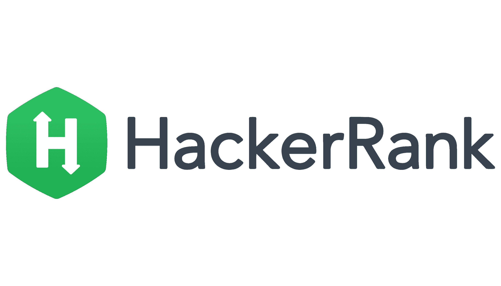
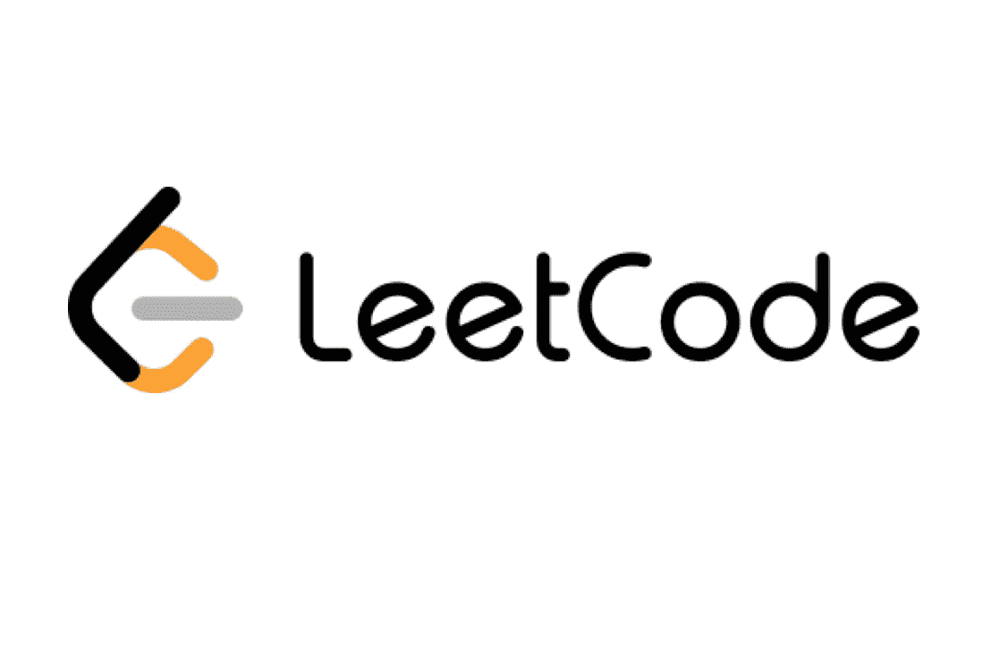
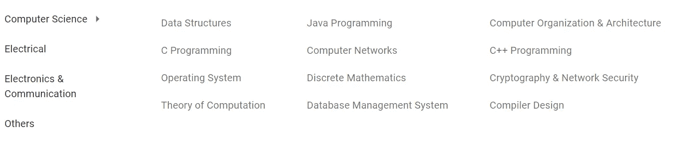
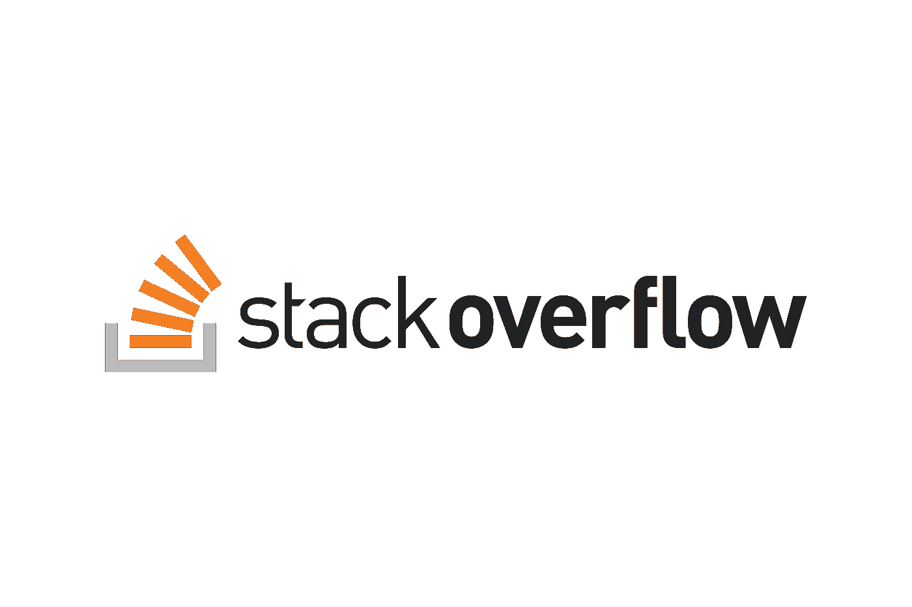

# 2022 年计算机科学本科生应该使用的顶级网站

> 原文：<https://medium.com/codex/top-websites-that-computer-science-undergraduate-should-use-in-2022-ff3a8b5d3a5e?source=collection_archive---------10----------------------->

## 计算机科学领域最重要的网站

## 这些是每个软件工程师在 2022 年成为更好、更有能力的软件工程师可以使用和学习的最佳网站。这篇文章包括了几乎 95%的问题解决网站，可以用来解决计算机科学本科生的问题。

照片由 [Aaron Burden](https://unsplash.com/@aaronburden?utm_source=medium&utm_medium=referral) 在 [Unsplash](https://unsplash.com?utm_source=medium&utm_medium=referral)

我们周围的几乎每个人都会接受的一个事实是，即使在任何领域，也没有一个超人知道计算机科学领域的所有事情。作为一名大学生，当我被要求回答一个问题时，我(我相信几乎每个人)的第一个解决方法是在互联网上搜索整个问题的答案(这可能也是一个有效的方法)😆).如果我们的搜索中有匹配的问题或非常匹配的问题，搜索引擎通常会从一些网站上给出。我们将会看到那些网站和它们所包含的内容。我们将按照字母顺序逐一查看它们，其中没有任何排序。

## [Dzone](https://dzone.com/)

[https://dzone.com/](https://dzone.com/)

Dzone 是一个主要针对计算机科学相关人士的网站。它成立于 2005 年。DZone 提供了技术专业人员建设未来所需的信息、工具和策略。Dzone 为初学者到专家提供编程、Web 开发和 DevOps 新闻、教程和工具。据该公司称，拥有超过 2M 会员的数百种免费出版物完全免费。大约有 70000 篇技术文章，300 多张参考卡片(你可以使用备忘单来帮助你浏览特定的技术，这些课程很容易阅读和理解)。在 Dzone 的技术库中，它们的内容分为 14 个不同的技术类别。

Dzone 竞争的技术类别(图片来自[此处](https://dzone.com/)

Dzone 中的内容主要是由阅读、评论和向 Dzone 提交文章的开发者创建的。然后编辑团队审查并发布高质量的内容。Dzone 网站与社区共享选定的内容。

## [**GeeksforGeeks**](https://www.geeksforgeeks.org/)

来源 https://www.geeksforgeeks.org/

极客的计算机科学门户。GeeksforGeeks 成立的目的是为具体问题提供精心编写、深思熟虑和完全详细的答案。核心团队由技术和计算机科学爱好者组成，他们一直在不懈地努力寻找他们一直在努力应对的挑战的答案。GeeksforGeeks 最初是一个博客，后来已经发展成为计算机科学、编程、证书课程、消除疑虑和技术行业更新领域最成功的初创公司之一，还会有更多。

有针对在校学生和在职专业人员的课程。公考过去的纸质考题有很多都有明确的解释。也有学校水平的技术相关和数学相关的材料。我们可以利用 Geeksforgeeks 网站上的资源轻松备考。

GeeksforGeeks 上的信息被分成了几个类别，以便于用户使用。无论你对学习算法、数据结构还是编程语言本身感兴趣，GeeksforGeeks 都能满足你！即使你在寻找面试准备材料，GeeksforGeeks 也提供了大量公司特有的面试经验供你学习，让用户深入了解公司的招聘流程。此外，它还为个人通过 contribute 选项分享他们的专业知识提供了一个极好的平台。

许多编程问题的解决方案都可以在极客论坛中找到。大多数解决方案都可以用多种著名的编程语言实现，如 Java、Python、C、C++等。我们甚至可以尝试编辑他们的解决方案，并使用他们网站上内置的解释器和编译器运行程序。

## [**Guru99**](https://www.guru99.com/)

来源:[https://www.guru99.com/](https://www.guru99.com/)

**Guru99** 是全球计算机科学相关人士著名的学习工具之一。他们的主要动机是**“有趣的&全民免费教育”。**Guru99.com 主要是一个教学资源网站。有 Python、测试、SAP、Java、SQL、Selenium、加密货币、VPN 的顶级教程。他们也有一些认证测验。对于那些希望在数据科学领域和大数据领域开创新事业的人来说，Guru99 也是一个很好的来源。还有数据分析教程。我们甚至可以在那里运行一些编程语言，比如 Python、Javascript 和 Java。

## [哈克兰 ](https://www.hackerrank.com/)

来源:[https://www.hackerrank.com/](https://www.hackerrank.com/)

HackerRank 是一家专注于个人和公司竞争性编程挑战的技术初创公司，其中开发人员根据给定的标准竞争编程。HackerRank 的编程挑战涵盖了众多计算机科学领域，可以用一系列编程语言(包括 Java、C++、PHP、Python、SQL 和 JavaScript)来解决。

当程序员提交一个解决编程挑战的方案时，他们输出的正确性在消费者端被评定。然后，程序员在 HackerRank 记分牌上进行国际排名，并根据他们的成就授予徽章，以鼓励人们参与竞争。除了单独的编码任务，HackerRank 还举办竞赛，让用户在给定的时间内就相同的编程问题进行竞赛，并在最后打分。HackerRank 是竞争性计算机编程中不断扩大的游戏化趋势的一部分，开发者可以免费使用他们面向消费者的网站。我们可以从不同的计算机科学主题中得到选择性的 hackerank 编程问题，如数据结构、算法、动态规划、贪婪方法等。轻松学习特定主题将非常棒。

最近 Hacerank 开始认证计算机科学的多种技能，如编程语言。Hacerank 证书和徽章通常也放在简历中用于面试。

## [leet code](https://leetcode.com/)

资料来源:https://leetcode.com/

LeetCode 是最著名的在线评判平台之一，通过回答编码问题来练习你的编码能力。它包括超过 2000 个不同的挑战，支持超过 18 种编程语言，并有一个充满活力的社区，总是愿意帮助您的解决方案。如果你想提高你的编码能力，这个在线评判平台是你可以利用的最好的平台之一。

LeetCode 的大部分材料都是免费的，但 LeetCode Premium 通过让您访问高级挑战和解决方案、内置调试器、自动完成工具和带反馈的面试模拟，扩展了这些优势。如果你用它来准备技术面试，它甚至会更有用，因为它让你可以访问特定公司的编程问题，你可以用它来更好地了解在谷歌、脸书和微软等公司的面试中你会被问到什么问题，如果你看中了这些公司，它是理想的在线评委。然而，作为一个面试准备工具，它在其他方面有所欠缺。LeetCode 的一个缺点是，虽然您可以看到问题的解决方案，但您无法获得您用来回答这些编程挑战的 DS & A/系统设计思想的详细解释，而这是学习过程的重要部分。

精通这些问题需要时间，就像其他天赋一样。我们学习如何使用各种技术解决问题。我们最终将能够将这些策略应用于更广泛的挑战。

## [**中等**](/)

来源:https://medium.com/

Medium 是一家美国在线出版平台。它发布多个主题，不仅仅是计算机科学相关的主题。对于博客作者和读者来说，媒介是最好的场所之一。这是一项基于订阅的服务。中等作者因其作品的质量而获得报酬，而其他博客则因广告投放而获得报酬。对于有一些经验的博主来说，它实际上是一个优越的平台。您可以成为中型合作伙伴计划的成员，并立即开始赚钱。

Medium 是一个学习新事物和与他人分享新事物的好地方，甚至在技术方面也是如此。如今，当我们搜索任何与计算机相关的内容时，大多数都来自于媒体。Medium 在全球拥有庞大的 It 专业人员社区，可以提供更多基于技术的内容。medium 中有许多与计算机科学相关的出版物，主要发布与技术相关的内容和文章。这使得[媒体](https://medium.com/u/504c7870fdb6?source=post_page-----ff3a8b5d3a5e--------------------------------)成为阅读新技术内容的更好地方。对于喜欢听而不是读的人来说，还有一个音频叙述工具。

## [T5【内科学】T6](https://www.nesoacademy.org/)

来源:[https://www.nesoacademy.org/](https://www.nesoacademy.org/)

Neso Academy 提供关于工程课程、竞争性考试和许多其他主题的世界级学习材料。每天都有成千上万的学生访问 Neso 学院，从他们的图书馆学习各种各样的主题。使 Neso 学院成为全球课堂，他们练习各种挑战，并与老师和其他学生交流。Neso Academy 因其拥有 146 万多订户的 youtube 频道而闻名。他们致力于确保学生获得最大可能的学习体验。他们相信普及教育，并正努力从根本上重塑它。

有各种类型的内容，如计算机相关的，电子相关的，数学相关的等等。下图显示了 Neso 学院中可用的主题。

来自 Neso 学院

## [**栈溢出**](https://stackoverflow.com/)

资料来源:https://stackoverflow.com/

栈溢出是一个专业人士和爱好者的问答平台。所有类型的问题都可以在这里提出，社区中会有人回答这些问题。当人们认为所提问题的答案正确时，他们会投赞成票，这就是 StackOverflow 的工作方式。

如今，IT 专业人士最常用的网站之一是 StackOverflow，以澄清他们的疑虑。在这里，我们还可以回答我们知道的问题，以帮助他人，这也将有助于更新我们的知识和学习新的东西。每月有超过 100 万****的游客来到 StackOverflow。StackOverflow 有从简单的编程相关问题到硬软件开发问题的提问，有很多专业人士回答。****

****我相信你知道计算机专业本科生最重要的网站。如果您有任何问题或任何澄清，不要犹豫，通过回复部分与我联系。感谢你花宝贵的时间阅读这篇博客，我相信这将激励你继续阅读我的其他博客[这里](https://sthenusan.medium.com/)。****

*****喜欢这篇文章吗？成为* [*中等会员*](https://sthenusan.medium.com/membership) *继续学习没有任何限制。如果你使用上面的链接，我会收到你的一部分会员费，不需要你额外付费。提前感谢。*****

********

****照片由[蒂姆·莫斯霍尔德](https://unsplash.com/@timmossholder?utm_source=medium&utm_medium=referral)在 [Unsplash](https://unsplash.com?utm_source=medium&utm_medium=referral) 上拍摄****