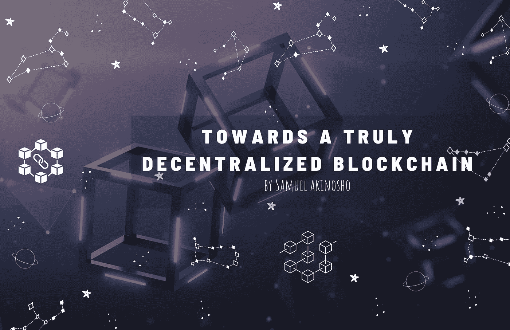
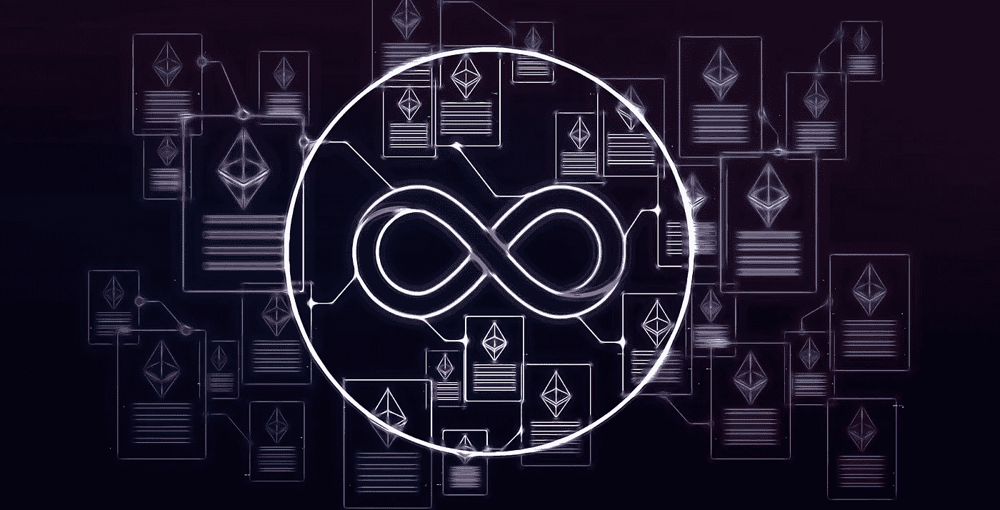
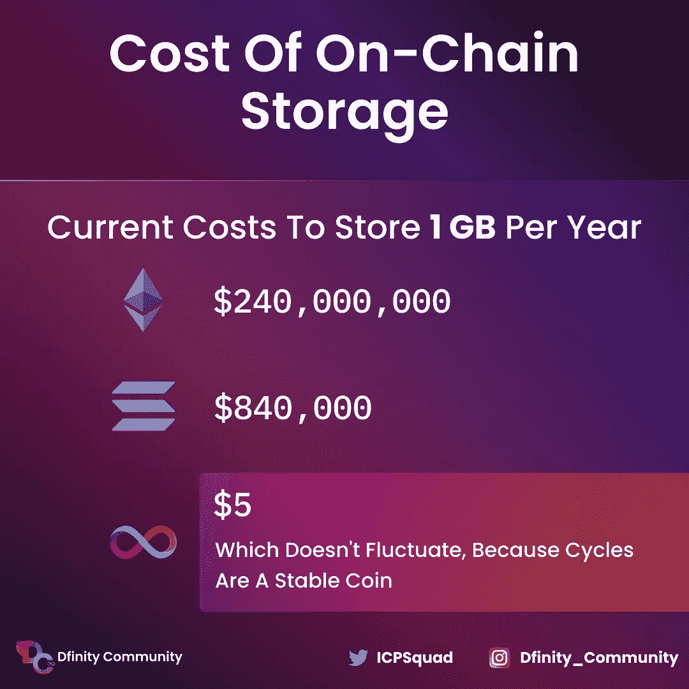
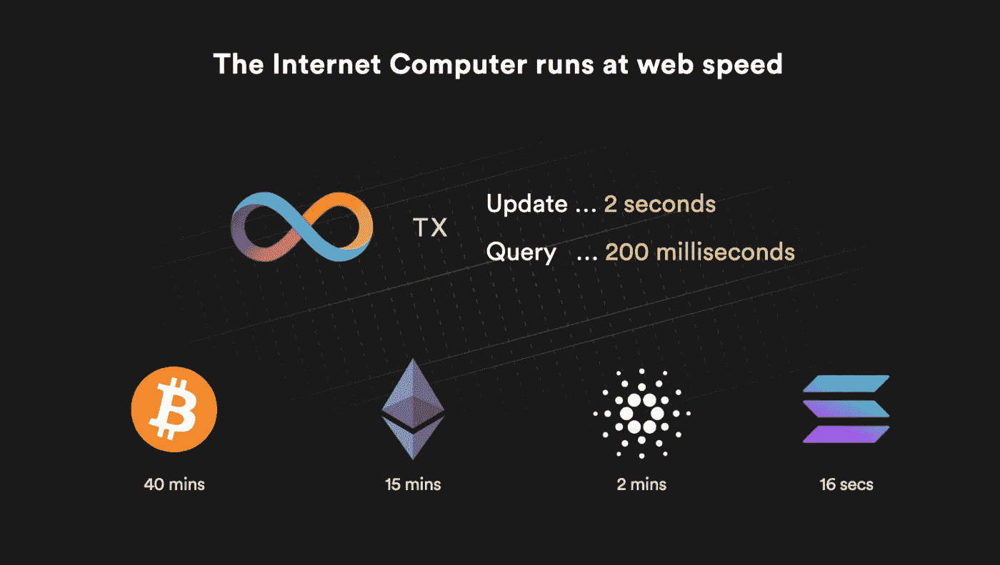
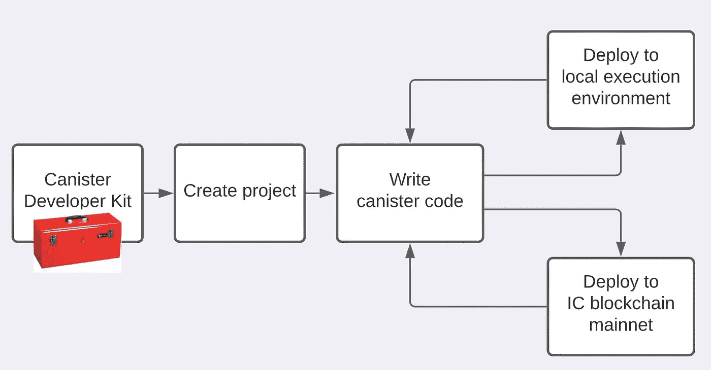

# 走向真正去中心化的区块链。

> 原文：<https://medium.com/codex/towards-a-truly-decentralized-blockchain-19b26328e2b6?source=collection_archive---------12----------------------->



## 今天区块链的问题以及我们为什么需要互联网计算机。

从**区块链——**的定义开始，它有时被称为[分布式账本技术](https://www.investopedia.com/terms/d/distributed-ledger-technology-dlt.asp) (DLT)，它由一个不断增长的记录列表组成，称为*网络*上的*区块*，它们通过使用[密码](https://en.wikipedia.org/wiki/Cryptography) ic 哈希安全地链接在一起，不可更改且透明。

> 所以我们可以简单地将**区块链**定义为一个共享的、不可变的账本，用于记录各种交易和跟踪资产以建立信任。

自去年以来，dapp 行业的年同比增长率超过了 765%，但尽管如此，世界仍未出现超大规模的区块链 dapp，如类似亚马逊的电子商务网站或具有高计算性能的分散式流媒体平台，以与 Twitch 竞争。

如果你想了解更多关于 dapps 的信息，你可以点击这里:

[](https://ethereum.org/en/developers/docs/dapps/) [## dapps | ethereum.org 简介

### 上次编辑:，无效日期时间分散式应用程序(dapp)是建立在分散式网络上的应用程序…

ethereum.org](https://ethereum.org/en/developers/docs/dapps/) 

根据[解密](https://decrypt.co/44321/70-of-ethereum-nodes-are-hosted-on-centralized-services)，2020 年大约 70%的以太坊节点运行在集中式服务上。dapps 通常利用集中式 web 托管和云提供商作为其前端接口，而不是完全在链上运行。这极大地破坏了去中心化，并使 dapps 依赖于云公司，这完全违背了区块链的价值观。

鉴于社交媒体平台和数字市场是存储密集型应用，几乎为每项活动添加了新的状态，开发 dapps 的开发者需要一种更有效的方法来进行链上 web3 开发。在传统的区块链上，网络拥塞只会导致网络变慢，从而增加交易成本(即 gas)并延迟数据块终结。

面对所有这些挑战，以及更多的挑战，将 dapp 的未来限制在小规模项目或需要使用集中存储，一种被称为互联网计算机的特殊的第一层区块链一直在解决这个问题，数以千计的大规模 dapp 已经在他们的链上运行，我们将更深入地探讨它是什么，它的主要功能使它在其他区块链中脱颖而出，以及我们如何在它的基础上进行构建。

[互联网计算机](https://internetcomputer.org)是第一层区块链，允许你创建任意可扩展的 web3 dapps、DeFi 协议、游戏、NFT、社交媒体和元宇宙项目，它们在区块链上端到端运行。它可以存储大量数据，并快速进行大量计算。

## 互联网计算机及其网络神经系统(NNS)



来源——Coincu 新闻

[**互联网计算机**](https://internetcomputer.org/) 是世界上最快、最强大的区块链网络。它是一组协议，允许世界各地的独立数据中心结合在一起，并提供当前集中式互联网云提供商的分散式替代方案。

一组这样的节点组合起来形成一个子网区块链。互联网计算机实质上是由几个独立的子网区块链组成的网络，它可以通过向网络中添加新的节点来无限扩大其容量。

互联网计算机托管着被称为“罐子”的智能合同，允许开发者通过结合由遍布全球的独立数据中心维护的节点计算机的计算能力，在开放的互联网上部署可互操作的应用程序。互联网计算机区块链的一个重要方面是**网络神经系统(NNS)** ，这是一个开放的算法治理系统，它管理网络和令牌组学，支持开发开放的互联网服务和能够超大规模运行的企业系统。NNS 还负责在节点出现故障或需要升级时将其换出，并可以创建新的子网。

为了进一步解释 NNS 如何工作，理解神经系统的意义是很重要的，所以请允许我带你回到大学/高中时代。根据生物学的说法，**神经系统**是动物的一个异常复杂的元素，它通过向身体的许多部分传递信号来组织其活动和感官信息。

> ****神经系统*** *作为你身体的指挥中心，起源于你的大脑，控制着你的动作、思想和对周围环境的直觉反应。**

*网络神经系统(NNS)像身体的神经系统一样，是一个自治的令牌化系统，它以完全开放、分散的方式管理互联网计算机区块链，使其得到有效的改进和发展。*

*你可以进一步阅读 Dfinity 研究员 Lara Schmid 的这篇令人惊叹的文章，了解更多关于网络神经系统的信息。*

*[](/dfinity/the-network-nervous-system-governing-the-internet-computer-1d176605d66a) [## 网络神经系统:管理互联网计算机

### NNS 是一种控制机制，通过它可以组织、跟踪和管理互联网计算机的节点和子网

medium.com](/dfinity/the-network-nervous-system-governing-the-internet-computer-1d176605d66a) 

## 互联网计算机如何促进可扩展性

因为互联网计算机使用的不必要的[复制](https://decentralizedthoughts.github.io/2019-12-06-dce-the-three-scalability-bottlenecks-of-state-machine-replication/)少得多，其智能合同数据的链上存储是业界最低的，存储 1 GB 数据每年仅花费 5 美元。相比之下，在撰写本文时，在以太坊上存储 1 GB 的数据需要花费巨大的[2 . 01 亿美元](https://proderivatives.com/blog/2019/5/10/minimizing-data-storage-cost-on-the-ethereum-network)。索拉纳对 1 GB 的链上存储收费约为[100 万美元](https://docs.solana.com/developing/programming-model/accounts#rent)，雪崩收费 98.8 万美元。由于这种过高的成本，大多数 dapp 开发都局限于具有最小状态的应用程序，它们的事务在最小状态下工作。



来自有限社区的成本分析

互联网计算机上的每个 dapp 都能够在其自己的[罐智能合约环境](https://internetcomputer.org/docs/current/developer-docs/build/install-upgrade-remove/)中存储其所需的数据，dapp 的智能合约逻辑可以即时利用这些数据。

互联网计算机上的罐式智能合同可以接收和响应 HTTP 查询，不像其他区块链，智能合同不能向消费者提供交互式 web 内容。

> *这是历史上第一次，分散式基础设施将自我导向，旨在与拥有领导者和董事会的商业组织运营的专有集中式基础设施竞争。*

## 互联网计算机是如何工作的？

互联网计算机采用逆向气体架构，智能合约为自己的执行、计算和存储付费。应用程序开发人员用周期对他们的智能合约收费，用户不必支付任何“汽油”费用来与这些智能合约通信。

用户可以轻松地通过网络使用链上 dapps，而不需要使用令牌钱包来支付汽油费。在互联网计算机上制造或购买 NFT 根本不需要*汽油费*，NFT 及其相关资产都托管在*链上*，而不是将散列链上和资产存储在云服务器上。

因为没有中央服务器意外关闭的风险，所以互联网计算机是开发具有大的州需求的 dapps 的理想区块链。互联网计算机实质上是由几个独立的子网区块链组成的网络，它可以通过向网络中添加新的节点来无限扩大其容量。

如上所述，互联网计算机通过[网络神经系统](https://dfinity.org/howitworks/network-nervous-system-nns) (NNS)来装载新的节点和子网，这是一个开放的、无许可的、链上的 DAO，任何人都可以通过将 ICP 实用令牌标入投票神经元来参与其中。每个子网都托管罐智能契约，它们是由代码和状态组成的可互操作的计算单元。

互联网计算机上的智能合同执行分为更新和查询调用，提高了网络的可扩展性。更新调用是状态修改事务，而查询调用是以毫秒为单位执行的简单只读请求。

在因特网计算机上，子网中的每个诚实节点处理一个更新调用，而只需要一个节点来处理一个查询调用。每个子网可以独立处理更新和查询调用，而不依赖于其他子网。因此，因特网计算机通过添加更多子网来扩展更新呼叫，并且通过向子网添加更多节点来扩展查询呼叫。



最近的一项性能评估表明，互联网计算机每秒可以处理[超过 11，500 个事务](/dfinity/the-internet-computers-transaction-speed-and-finality-outpace-other-l1-blockchains-8e7d25e4b2ef?source=friends_link&sk=fc92da36925e0249db256c9834242d07)，在托管 dapps 的应用子网上 1 秒结束，以及每秒 250，000 个查询。*互联网电脑的 NNS 只有 2 秒钟。*

## **互联网身份—** 匿名区块链认证系统

从维基百科对互联网身份的定义开始，它被定义为互联网用户在在线社区和网站上建立的[社会身份](https://en.wikipedia.org/wiki/Social_identity)。它也可能是一种积极建构的自我呈现。尽管有些人在网上使用他们的真实身份，但其他人希望保持匿名，使用暴露不同程度的个人身份信息的假名

互联网计算机的互联网身份，像上面的定义一样，允许用户用 Web3 服务和 dapps 创建会话，以及签署传统的区块链交易。用户可以构建识别“锚”,将合适的加密设备(如笔记本电脑的指纹传感器、手机的面部识别系统或便携式 HSM，如 YubiKey 或 Ledger wallet)分配给这些设备。

然后，使用他们分配给他们的锚的任何设备，他们可以注册并认证在互联网计算机上运行的任何 dapp。比如你的互联网身份可以用来登录[网络神经系统](/dfinity/the-network-nervous-system-governing-the-internet-computer-1d176605d66a) app (NNS)，在这里可以存储和[入股 ICP](https://www.dfinitycommunity.com/how-to-stake-icp-tokens-on-the-internet-computers-network-nervous-system-nns/) ，参与互联网电脑的治理。

这提供了高度的简单性，允许用户以非常小的摩擦认证到感兴趣的 dapps，同时受益于最高级别的加密安全性，但不需要直接管理或处理加密密钥材料本身，从而防止错误和密钥材料盗窃。该技术将 dapp 匿名化，如果一个主播被用来与 dapp 联系，dapp 就会看到一个专门创建的假名，从而防止用户在几个 dapp 之间被跟踪。用户可以构建无限数量的识别锚。

要了解有关互联网身份及其工作原理的更多信息，您可以在此处阅读更多信息:

[](https://internetcomputer.org/docs/current/tokenomics/identity-auth/what-is-ic-identity/#how-internet-identity-works) [## 什么是互联网身份？互联网计算机之家

### 互联网身份是由互联网计算机支持的匿名区块链认证框架。用户可以…

internetcomputer.org](https://internetcomputer.org/docs/current/tokenomics/identity-auth/what-is-ic-identity/#how-internet-identity-works) 

## 建立在互联网计算机上

作为一名开发人员，使用 [DFINITY 的开发人员中心](https://internetcomputer.org/developers)来获得软件开发工具包、文档、开发人员论坛、技术库、cycles 水龙头等是非常容易的。

有两种主要的方法或工作流程用于设计在互联网计算机区块链上运行的 dapps。



**本地开发:**您在自己的计算机上启动一个模拟互联网计算机区块链的本地 can 执行环境。然后，您在本地执行环境中编写、编译、安装和迭代更新您的罐。这允许你在本地测试你的滤毒罐而不需要循环。

**链上部署:**一旦你的 dapp 完成，你可以把它部署到互联网计算机区块链 mainnet，使它对世界其他地方可用。要在互联网计算机区块链主网上运行，你的罐子必须包含循环。你可以阅读[代币和循环](https://internetcomputer.org/docs/current/concepts/tokens-cycles)概念来了解更多。

记住这一点，让我们浏览一些实用的代码示例，开始在 Internet 计算机上进行构建。我们将开始为 IC 区块链开发新的滤毒罐和 dapps。

需要注意的是，IC 使用 [***dfx***](https://github.com/dfinity/motoko/blob/master/design/DFX-Interface.md) 命令行接口，在您可以在互联网计算机上构建之前，您必须满足各种条件:

通过运行以下命令，安装名为“dfx sdk”的 DFINITY 罐 SDK:

```
sh -ci “$(curl -fsSL https://smartcontracts.org/install.sh)"
```

要验证`dfx`是否正确安装，运行:

```
dfx — version
```

*DFX SDK 对于 IC 上的本地开发和部署都是必要的。*

在开始本地构建之前，确保已经安装了 node.js。安装 node.js 和 DFX SDK 后，使用以下命令创建一个新的 DFX 项目:

```
dfx new hello
```

通过运行以下命令更改项目目录:

```
cd hello
```

通过运行以下命令启动本地罐环境:

```
dfx start
```

然后，您可以运行以下两个命令来本地部署 dapp:

```
npm installdfx deploy
```

**结论:**基于互联网计算机的产品已经形成了专门的用户群体，而[互联网计算机生态系统展示](https://internetcomputer.org/showcase/)强调了正在进行的大量工作。仅存储成本一项就使在其他第 1 层链上开发任何 dapps 变得困难。

随着互联网计算机 dapp 生态系统的发展和壮大，一组多样化的 web3 用例将为创新、分散的未来铺平道路。*