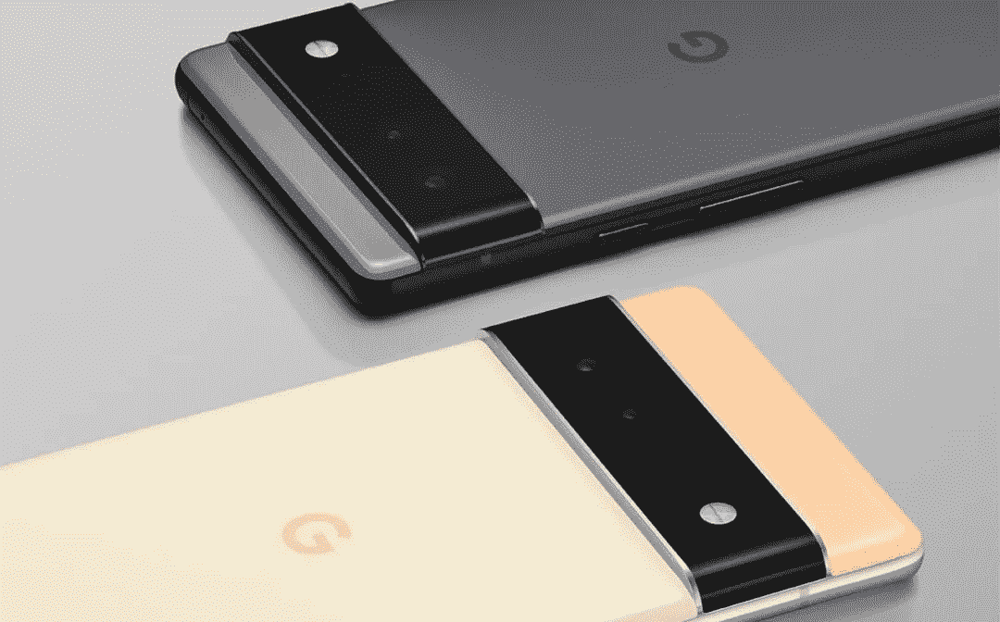
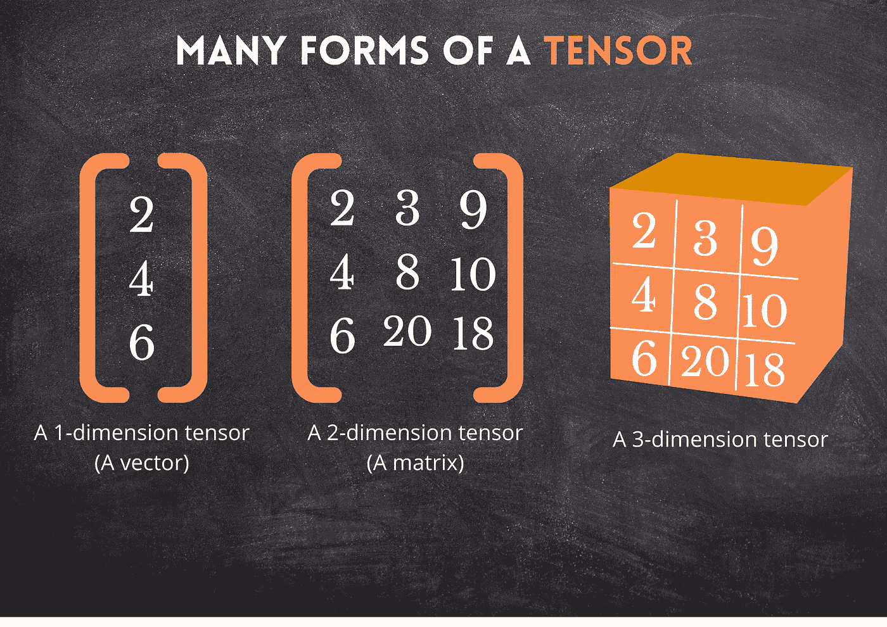
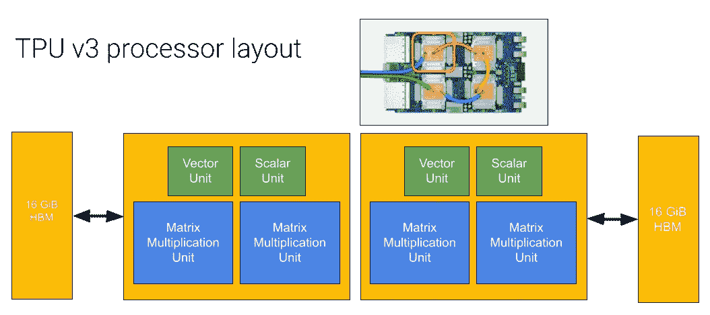
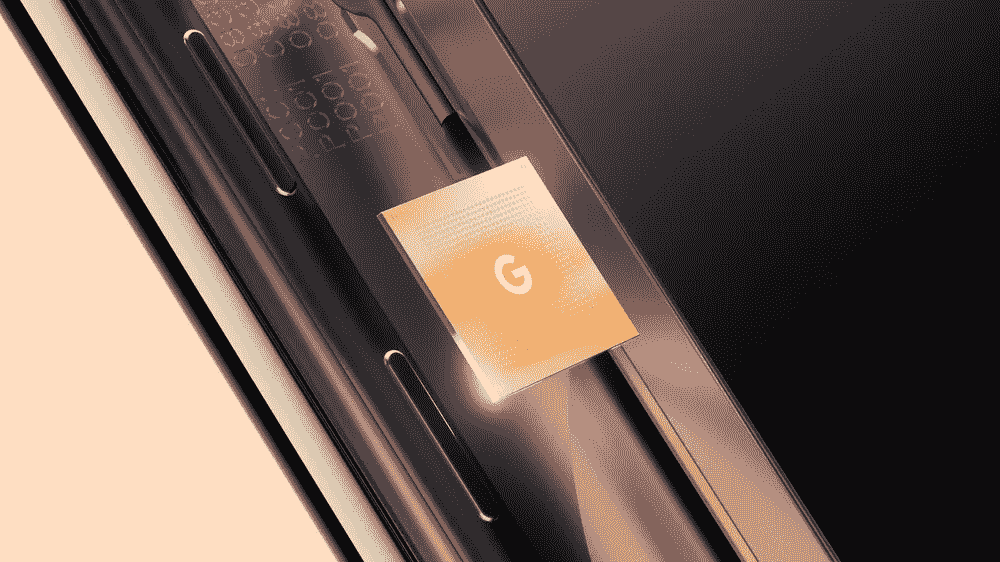
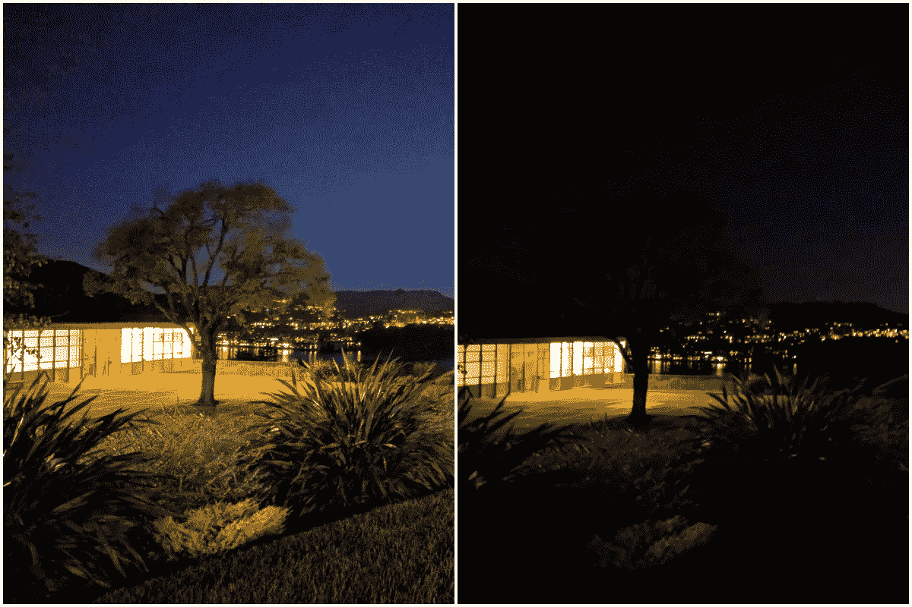

# 手机上的 TPU——谷歌的 Pixel 6。

> 原文：<https://medium.com/codex/tpu-on-a-phone-the-pixel-6-by-google-803eac656b5b?source=collection_archive---------4----------------------->

本月，当谷歌宣布他们的新 Pixel 手机 Pixel 6 时，一个非常有趣的公告出现了。谷歌实际上宣布，这些新手机将搭载 T2 的 TPU 芯片 T3。现在，这对大多数人来说可能很困惑，因为很少有人真正知道什么是 TPU，因此，这种炒作是关于什么的。

 [## 手机上的 TPU-谷歌的 Pixel 6。

### 当谷歌本月宣布他们的新 Pixel 手机 Pixel 6 时，看到了一个非常有趣的公告。谷歌…

writersbyte.com](https://writersbyte.com/tpu-on-a-phone-the-pixel-6-by-google/) 

所以在这篇文章里，我会回答以下问题；

*   **什么是 TPU？**
*   **用在哪里？**
*   **这对移动行业意味着什么？**

# 什么是张量处理单元(TPU)？

我们可以先回答一个更简单的问题。

*什么是张量？*

我们知道 CPU 或 GPU 是什么，我们每天都用它们来完成正常任务，例如办公室工作、游戏，甚至是机器学习练习。但是这个 ***张量*** 需要处理的是什么呢？

简单地说，张量是一个数据容器。它可以保存 n 维的数据值。

如上图所示，张量只是代表有价值数据的一组数字。

** *对于机器学习工程师来说，值得注意的是，张量实际上比简单的数组复杂得多。它存储更多有价值的信息，如点积值和数据点之间的转换描述***

这个数据结构是 Google 主要为 AI 训练开发的。

好了，让我们直接跳到张量处理单元。正如我已经提到的，张量主要用于人工智能训练，因为——正如这里的任何机器学习工程师都知道的——它们的主要部分由矩阵加法和乘法(点积)组成。所有处理单元(CPU、GPU、TPU)都可以轻松完成这些操作，但这些操作的时间复杂性正是这三种设备的不同之处。谷歌自己的人解释了最好的类比。

> CPU 就像打印信件，而 GPU 打印的是整句话，但 TPU 打印的是整页纸。

[来源](https://cloud.google.com/tpu/docs/system-architecture-tpu-vm)

TPU 执行这些矩阵计算的速度如此之快，是因为与必须不断访问内存来挑选或存储数据的 GPU 和 CPU 不同，TPU 有专用的脉动阵列来执行标量、向量和矩阵操作。由于在人工智能算法中，所有的数学都是预定义的，所以 TPU 能够将大量的数据加载到这些阵列中，并同时执行大量的计算，这意味着它们必须更少地访问内存，因此防止了所谓的 [*冯诺依曼瓶颈*](https://www.techopedia.com/definition/14630/von-neumann-bottleneck#:~:text=The%20von%20Neumann%20bottleneck%20is,time%20while%20memory%20is%20accessed.)*这是 CPU 一直以来都存在的问题。*

* [## 苹果活动亮点——2021 年 10 月 18 日

### 在所有技术中。爱好者们，十月被称为科技十月，因为来自世界各地的所有科技巨头…

writersbyte.com](https://writersbyte.com/highlights-from-the-apple-event-18th-october-2021/)  [## 实现“多元线性回归”算法

### 机器学习算法在过去十年中获得了巨大的普及。今天，这些算法被用于…

writersbyte.com](https://writersbyte.com/implementing-multi-variable-linear-regression-algorithm-in-python/) 

因此，这种专用硬件的性能优于 GPU，并且删除了几个无用的组件，这意味着它们的体积更小，功耗也比 GPU 低得多。

# TPU 人在电话上做什么？

[来源](https://www.google.com/url?sa=i&url=https%3A%2F%2Fblog.google%2Fproducts%2Fpixel%2Fgoogle-tensor-debuts-new-pixel-6-fall%2F&psig=AOvVaw3jCHfgoAMHT6MZtqJeWCt2&ust=1629048827157000&source=images&cd=vfe&ved=0CAwQ3YkBahcKEwjwx__4hbHyAhUAAAAAHQAAAAAQAw)

现在回到主要问题，和手机有什么关系？。

告诉我的朋友，你不知道你的手机使用了多少人工智能。当你在手机背面读到“AI 相机”的时候，其实是有所指的。

当你的相机检测到你正在捕捉的场景并相应地调整颜色时，或者当你对你的虚拟助理说话并识别你的话时，你的手机正在利用人工智能。

在此之前，这些计算都是在手机的 CPU 上进行的。正如我们上面讨论的，CPU 在计算方面有其局限性。在板上放置 TPU 意味着 pixel 6 可以利用它来执行更快的机器学习计算，人工智能模型可以运行得更快。

谷歌像素夜间模式演示。[来源](https://www.google.com/url?sa=i&url=https%3A%2F%2Fventurebeat.com%2F2018%2F11%2F14%2Fgoogle-pixel-night-sight%2F&psig=AOvVaw3xDsS_ckudKno8nRAnobxi&ust=1629049678530000&source=images&cd=vfe&ved=0CAwQ3YkBahcKEwi4kc2RibHyAhUAAAAAHQAAAAAQAw)

据谷歌称，这将极大地影响手机的相机质量。谷歌手机已经拍出了令人惊叹的照片，这都要归功于他们建立的令人惊叹的人工智能算法，但他们缺乏的一个领域是视频质量，与竞争对手相比，视频质量被认为是平均水平。

TPU 的加入意味着同样的算法现在可以一帧一帧地用于手机捕捉的视频，并提高其质量。谷歌在他们的预告视频中强调的另一个优势是，现在许多庞大的机器学习模型可以离线运行，而不必连接到谷歌的数据中心。这也意味着您提高了数据安全性。

# 未来？

许多人将谷歌的这一举动称为“游戏规则改变者”。目前，这些张量只能在谷歌手机上找到，主要是因为 TPU 本身是由谷歌在 2015 年设计的，但其他制造商跟上潮流并开始制造这种张量芯片只是时间问题，或者谷歌开始向其他制造商供应，我们将看到其他制造商发布带有 TPU 的手机。

 [## 穆萨阿里-中等

### 阅读媒介上穆萨阿里的作品。一个热爱编程和学习新事物的编程爱好者。哎…

moosa-ali.medium.com](https://moosa-ali.medium.com)*