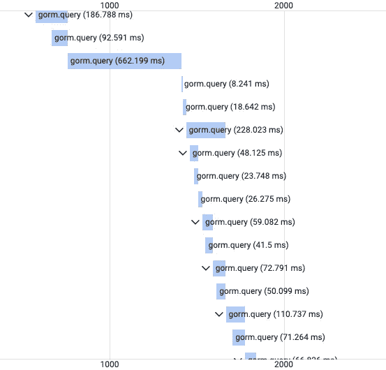
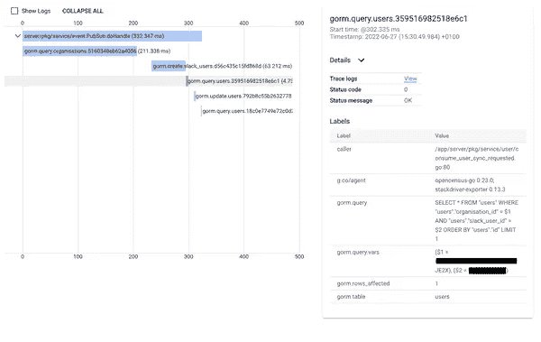

# 使用 OpenCensus 和 Google Cloud Tracing 跟踪 Gorm 查询

> 原文：<https://medium.com/codex/tracing-gorm-queries-with-opencensus-google-cloud-tracing-50bfab69abbb?source=collection_archive---------16----------------------->

在 [incident.io](http://incident.io/) 我们使用 [gorm.io](http://gorm.io/) 作为 Postgres 数据库的 orm 库，这是一个非常强大的工具，我很高兴在 Go & Postgres 应用程序中使用了多年的手工 SQL。你可能已经从我们的[其他博客帖子](https://incident.io/blog/tracing)中看到，我们在追踪方面投入了大量资金，特别是通过 [OpenCensus](https://opencensus.io/) 库使用谷歌云追踪。我们应用程序的大量时间都花在通过 gorm 与 Postgres 对话上，所以我们想在跟踪堆栈中更好地了解这一点。

幸运的是，Gorm 为我们提供了完美的钩子来通过[回调 API](https://gorm.io/docs/write_plugins.html#Callbacks) 进行跟踪，这允许我们为 Gorm 提供在查询生命周期的特定部分调用的函数，允许您在传统的中间件方法中改变查询行为，或者在我们的情况下，提取数据以实现可观察性。

```
func beforeQuery(scope *gorm.DB) {
	// do stuff!
}db.Callback().
	Create().
	Before("gorm:query").
	Register("instrumentation:before_query", beforeQuery)
```

在本文中，我们的目标是将跟踪范围引入到我们的 Gorm 查询中，为了做到这一点，我们需要捕捉开始和结束事件，并相应地处理这些范围。在这些例子中，我将使用由[go.opencensus.io/trace](http://go.opencensus.io/trace)提供的追踪工具，这些工具被用于谷歌云追踪，但是其他追踪库应该有类似的行为。

现在我们有了一个函数，当查询开始时，我们需要开始我们的跨度:

```
func beforeQuery(scope *gorm.DB) {
	db.Statement.Context = startTrace(
    db.Statement.Context,
    db,
    operation,
  )
}func startTrace(
  ctx context.Context,
  db *gorm.DB,
) context.Context {
	// Don't trace queries if they don't have a parent span.
	if span := trace.FromContext(ctx); span == nil {
		return ctx
	} ctx, span := trace.StartSpan(ctx, "gorm.query")
	return ctx
}
```

然后我们也需要结束这个跨度:

```
func afterQuery(scope *gorm.DB) { endTrace(scope) }func endTrace(db *gorm.DB) {
	span := trace.FromContext(db.Statement.Context)
	if span == nil || !span.IsRecordingEvents() {
		return
	} var status trace.Status if db.Error != nil {
		err := db.Error
		if err == gorm.ErrRecordNotFound {
			status.Code = trace.StatusCodeNotFound
		} else {
			status.Code = trace.StatusCodeUnknown
		} status.Message = err.Error()
	}
	span.SetStatus(status)
	span.End()
}db.Callback().
	Query().
	After("gorm:query").
	Register("instrumentation:after_query", afterQuery)
```

现在我们可以在跟踪中看到我们所有的 gorm 查询，太好了！



然而，他们并不十分清楚我们实际在做什么，让我们看看是否可以通过添加以下内容使这些跨度提供更多信息:

*   表名&查询 span 名称的指纹。
*   调用我们的代码行
*   来自选择查询的 WHERE 参数
*   受影响的行数

查询指纹是查询的唯一标识符，与格式和变量无关，因此您可以唯一地标识在数据库中行为相同的查询。

让我们扩展前面的代码:

```
func startTrace(ctx context.Context, db *gorm.DB) context.Context {
	// Don't trace queries if they don't have a parent span.
	if span := trace.FromContext(ctx); span == nil {
		return ctx
	} // start the span
	ctx, span := trace.StartSpan(ctx, fmt.Sprintf("gorm.query.%s", db.Statement.Table)) // set the caller of the gorm query, so we know where in the codebase the
	// query originated.
	//
	// walk up the call stack looking for the line of code that called us. but
	// give up if it's more than 20 steps, and skip the first 5 as they're all
	// gorm anyway
	var (
		file string
		line int
	)
	for n := 5; n < 20; n++ {
		_, file, line, _ = runtime.Caller(n)
		if strings.Contains(file, "/gorm.io/") {
			// skip any helper code and go further up the call stack
			continue
		}
		break
	}
	span.AddAttributes(trace.StringAttribute("caller", fmt.Sprintf("%s:%v", file, line))) // add the primary table to the span metadata
	span.AddAttributes(trace.StringAttribute("gorm.table", db.Statement.Table))
	return ctx
}func endTrace(db *gorm.DB) {
	// get the span from the context
	span := trace.FromContext(db.Statement.Context)
	if span == nil || !span.IsRecordingEvents() {
		return
	} // set the span status, so we know if the query was successful
	var status trace.Status
	if db.Error != nil {
		err := db.Error
		if err == gorm.ErrRecordNotFound {
			status.Code = trace.StatusCodeNotFound
		} else {
			status.Code = trace.StatusCodeUnknown
		} status.Message = err.Error()
	}
	span.SetStatus(status) // add the number of affected rows & query string to the span metadata
	span.AddAttributes(
		trace.Int64Attribute("gorm.rows_affected", db.Statement.RowsAffected),
		trace.StringAttribute("gorm.query", db.Statement.SQL.String()),
	)
	// Query fingerprint provided by github.com/pganalyze/pg_query_go
	fingerprint, err := pg_query.Fingerprint(db.Statement.SQL.String())
	if err != nil {
		fingerprint = "unknown"
	} // Rename the span with the fingerprint, as the DB handle
	// doesn't have SQL to fingerprint before being executed
	span.SetName(fmt.Sprintf("gorm.query.%s.%s", db.Statement.Table, fingerprint)) // finally end the span
	span.End()
}func afterQuery(scope *gorm.DB) {
	// now in afterQuery we can add query vars to the span metadata
	// we do this in afterQuery rather than the trace functions so we
	// can re-use the traces for non-select cases where we wouldn't want
	// to record the vars as they may contain sensitive data // first we extract the vars from the query & map them into a
  // human readable format
	fieldStrings := []string{}
	if scope.Statement != nil {
		fieldStrings = lo.Map(scope.Statement.Vars, func(v any i int) string {
			return fmt.Sprintf("($%v = %v)", i+1, v)
		})
	}
	// then add the vars to the span metadata
	span := trace.FromContext(scope.Statement.Context)
	if span != nil && span.IsRecordingEvents() {
		span.AddAttributes(
			trace.StringAttribute("gorm.query.vars", strings.Join(fieldStrings, ", ")),
		)
	}
	endTrace(scope)
}
```

现在我们终于有了超级丰富的易于扫描的跨度，让我们更容易理解我们的应用程序正在花费时间做什么，耶！



Gorm 为查询生命周期的许多不同部分提供了回调，您可以为它们添加特定的行为，我们目前分别跟踪创建、删除、更新和查询，但是如果您想更进一步，您可以查看 [gorm 文档](https://gorm.io/docs/write_plugins.html)！你可以在这个帖子[这里](https://gist.github.com/arussellsaw/bbedfdefee119b4600ce085b773da4b9)找到所有的代码。

请记住，如果你不小心，你可能会追踪到一些敏感数据。因此，如果适用的话，请确保清理您的查询变量。一个好的做法是只跟踪选择查询，因为它们通常是通过 IDs 完成的，而不是任何敏感信息。