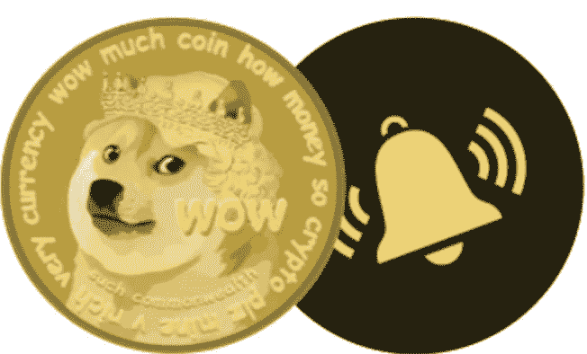

# 用 Python 追踪狗的实时价格

> 原文：<https://medium.com/codex/track-dogecoin-real-time-price-with-python-e09a1cae6b71?source=collection_archive---------6----------------------->

Dogecoin 今天早上暴跌，今晚飙升，我在想，如果有一个警报可以发出邮件说，“嘿，Dogecoin 价格下跌了 20%，是时候买进了”。

Em，为什么不自己用 Python 创建一个。以下是我的总体步骤。

1.  找一个加密价格 API 或者在网上搜索。
2.  如果照片是…