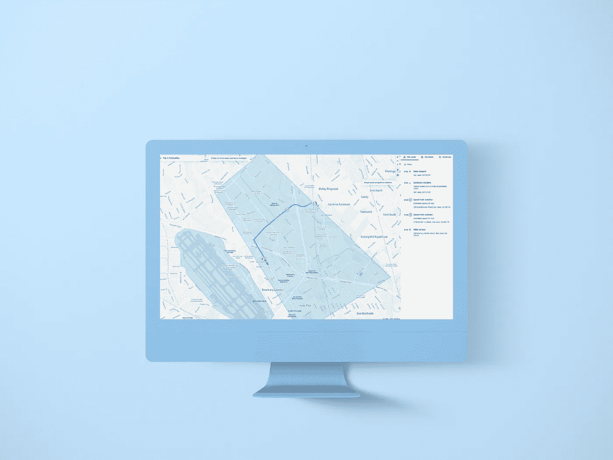
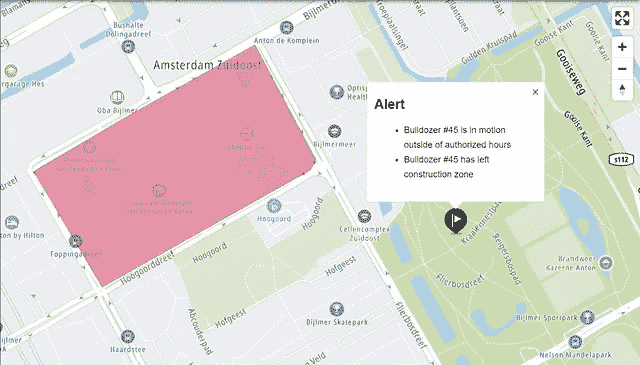
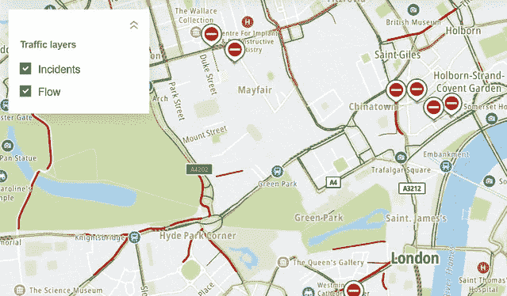

# 使用位置历史 API 跟踪和追踪建筑资产

> 原文：<https://medium.com/codex/tracking-and-tracing-construction-assets-with-the-location-history-api-ed27aa0b23e6?source=collection_archive---------20----------------------->

## TomTom 的位置历史 API 使我们能够安全地存储和检索被跟踪设备的位置和移动。

作者图片

建筑业是一个资产密集型行业。设备的品牌和型号千差万别，有些设备很容易使用现有的物联网(IoT)传感器和数据仪表板进行监控。但是其他设备(包括传统设备)没有连接，因此很难跟踪。更换这样的设备是昂贵的，但幸运的是，还有另一个解决方案。

TomTom 的位置历史 API 使我们能够安全地存储和检索被跟踪设备的位置和移动。作为开发人员，我们有很多方法可以使用位置历史 API(主要是 Objects 服务和 Position History 服务)来构建解决实际建筑行业问题的应用程序。

让我们来看看建筑领域的一些挑战，以及位置历史 API 如何帮助解决这些挑战。

# 有效的资源分配

设备跟踪可以实时了解设备的使用时间和地点。这有助于时间管理，并使建筑工地能够解决员工站在周围等待设备空闲的问题。我们可以将闲置的设备重新分配到另一个工作场所使用，并确保我们可以用于某项工作的所有设备都用于完成某项工作。

此外，准确记录现场使用设备的时间有助于预算决策。记录可以确保公司租赁设备的时间不会超过必要的时间，并确定需要更多设备的情况。在一个特定的地点更多的使用可能意味着直接购买比雇佣更便宜。然后，现场经理可以将这些成本纳入未来类似项目的预算中。

资产跟踪对于出租设备的公司也至关重要，因为未充分利用的设备意味着收入机会的错失。它还提供了每次设备交付的记录，以确保所有的租用都被考虑在内，并确保设备不会被发送到错误的地点。

# 预防损失的措施

资产跟踪可以防止高价值建筑设备被盗。物品越值钱，小偷就越想得到它。虽然保险可能会涵盖更换，但提出索赔的过程可能会很耗时，并且可能会增加保险费。租赁替换设备是额外的费用。设备失窃也意味着生产率下降和完工延迟。在某些情况下，延迟可能导致错过最后期限，从而导致巨额罚款。

一些工厂雇佣了保安人员，但始终监控所有设备既昂贵又困难，尤其是在大型工作或跨多个工厂时。

运载原材料等贵重资产的车辆受益于位置追踪。假设位置历史显示一个昂贵的钢梁以每小时 55 英里的速度在宾夕法尼亚收费公路上移动，而它应该在曼哈顿的一个建筑工地上。在这种情况下，你知道你有一个问题，可以与当局合作，收回你的财产。

位置历史跟踪有助于确保重型机械和昂贵的工具在它们应该在的地方，而不是未经授权被带到别处。如果发生盗窃，位置历史记录可以帮助找回被盗物品。开发人员可以使用地理围栏和 GPS 资产跟踪来触发通知，当设备在非工作时间运行或从特定的地理围栏区域移动时。面包屑追踪可以帮助当局快速定位被盗物品。TomTom 的位置历史服务可以管理和跟踪许多物体的位置。它可以向 TomTom 的地理围栏服务提供对象穿过围栏边界的历史。想象一下，由于一个小偷闯入了一个工地，一堆木材或钢材倾斜着倒在路上。TomTom 的 GPS 追踪可以标记这些沉重的材料。车队经理可以使用相应的应用程序实时跟踪材料。它可以防止在道路上靠近重物的人受伤，并帮助警察将物品归还给合法的所有者。

同样，您可以使用 TomTom 对象服务和地理围栏 API 为可驾驶的机器设置警报。这可用于识别卡车、推土机和起重机等设备何时在下班后被使用或何时被移出地理围栏区域，这可能表明未经授权的使用:

# 资产跟踪有助于预测和规划

我们还可以使用位置跟踪来计划未来的工作。建筑资产的位置历史记录有助于我们了解未来完成类似工作可能需要哪些资产-工人使用的每种设备类型有多少，工人需要它们多长时间，等等。

一个例子是使用 TomTom 的位置历史 API，通过监控移动车辆的活动时间来跟踪跨不同站点(或在公司和站点之间)移动设备所花费的时间。每天花一个小时在路上，一个月加起来可以超过 20 个小时。这是一个惊人的 240 小时或一年 30 天的时间，设备(和带薪驾驶人员)被占用在通勤上。意识和可操作的数据有助于提高员工效率。

更好的是，我们可以通过将行程时间跟踪与 TomTom Traffic API 结合起来来改善行程时间。我们可以利用它来绘制旅行路线，并通过获取道路状况、拥堵和现场事件的实时数据来减少旅行时间。

有了 TomTom，我们可以在火灾发生前扑灭它。这意味着我们可以使用 TomTom 资产跟踪获得员工如何使用设备的实时数据，每天为公司节省数千美元。

# 后续步骤

建筑业只是受益于数字化转型的众多行业之一。资产跟踪减少了盗窃，通过降低现场效率节省了公司的时间和金钱，并确保现场经理可以最大限度地利用宝贵的设备和优化专业人员的时间。开发者可以创建[网络和移动资产跟踪应用](https://developer.tomtom.com/)。这些可以提供实时和历史数据。这意味着公司不仅可以通过有效预测未来的材料和设备需求来跟踪他们的进展，还可以在未来的投标中保持竞争力并增加公司利润。

想了解更多关于在建筑应用中集成 TomTom 的 API？今天就注册一个 TomTom 开发者账户。

*本文原载于*[*https://developer.tomtom.com/blog*](https://developer.tomtom.com/blog)*。*