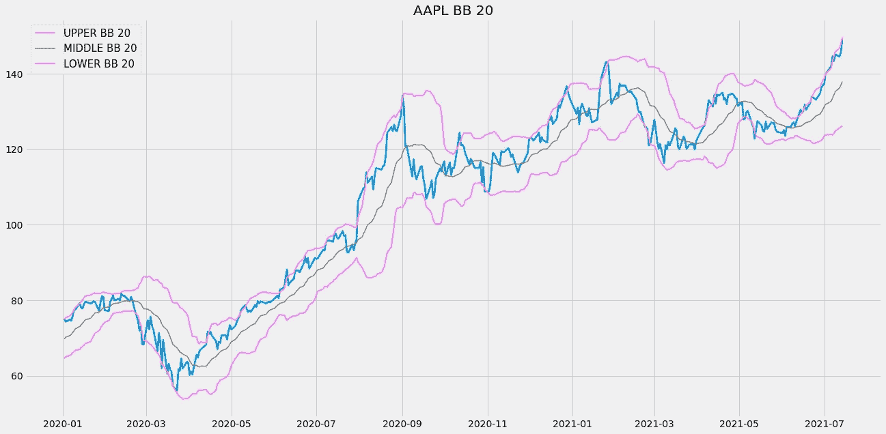
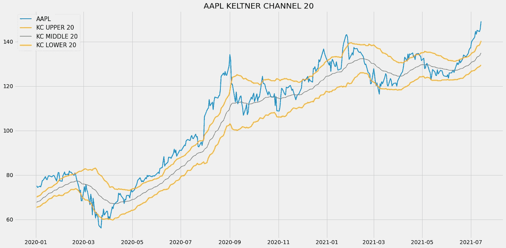
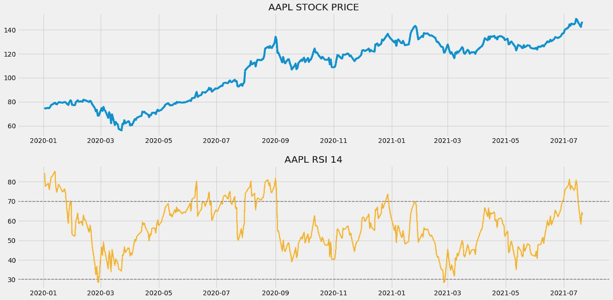
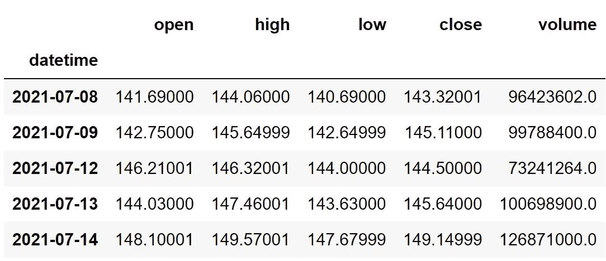
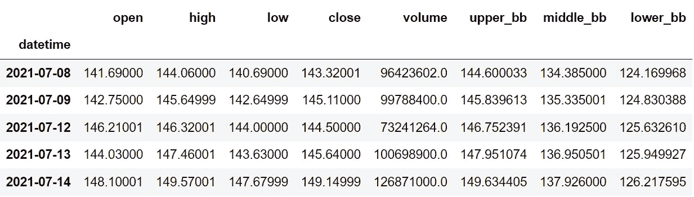
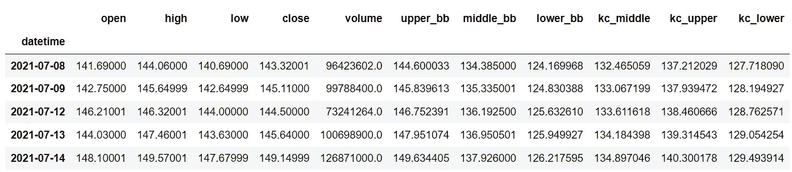
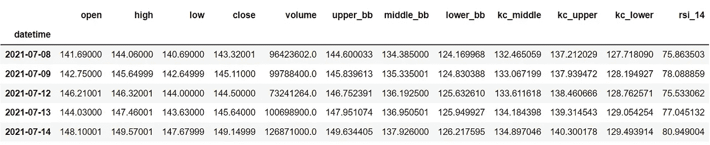
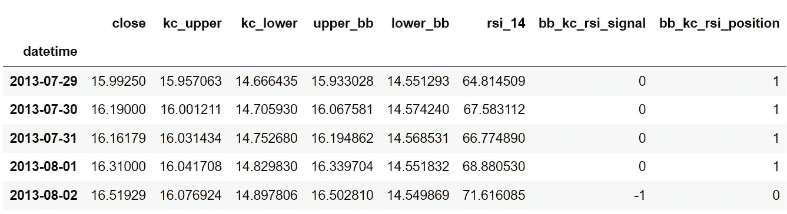

# 在 Python 中使用布林线、凯尔特纳通道和相对强弱指标交易股票

> 原文：<https://medium.com/codex/trading-stocks-using-bollinger-bands-keltner-channel-and-rsi-in-python-980e87e8109d?source=collection_archive---------0----------------------->

## 通过整合三个强有力的指标来提升战略绩效的详细指南


照片由 [JJ 英](https://unsplash.com/@jjying?utm_source=medium&utm_medium=referral)在 [Unsplash](https://unsplash.com?utm_source=medium&utm_medium=referral)

每一个指标布林线，凯尔特纳通道和相对强弱指数都是独一无二的，单独使用时都很强大。但是如果我们试着把这三个指标结合起来，用它们创造一个有效的交易策略，会怎么样呢？结果将是实质性的，我们能够根除与使用技术指标相关的一个最常见的问题，即错误信号。

这正是我们今天的目标。在本文中，我们将首先对指标建立一些基本的直觉，然后，我们将使用 python 从头构建它们，根据它们构建一个交易策略，用真实世界的历史股票数据对策略进行回溯测试，并将结果与 SPY ETF(一种专门设计用于跟踪 S&P 市场指数运动的 ETF)的结果进行比较。

在继续之前，如果你想在没有任何代码的情况下回溯测试你的交易策略，有一个解决方案。这是[的后验区](https://www.backtestzone.com/)。这是一个平台，可以免费对不同类型的可交易资产的任意数量的交易策略进行回溯测试，无需编码。点击这里的链接，你可以马上使用这个工具:[https://www.backtestzone.com/](https://www.backtestzone.com/)

# 布林线

在开始探索布林线之前，有必要知道什么是简单移动平均线。简单的移动平均线就是给定一段时间内股票的平均价格。现在，布林线是在特定的标准差水平上，在给定股票的 SMA 上下绘制的趋势线。为了更好地理解布林线，看看下面的图表，它代表了用 SMA 20 计算的苹果股票的布林线。



作者图片

布林线是观察一段时间内给定股票波动的好方法。当上下波段之间的空间或距离越小时，股票的波动性越低。同样，当上下波段之间的空间或距离越大，股票的波动水平越高。在观察图表时，你可以观察到一条名为“中间 BB 20”的趋势线，它就是苹果股票的 SMA 20。计算股票上限和下限的公式如下:

```
**UPPER_BB = STOCK SMA + SMA STANDARD DEVIATION * 2
LOWER_BB = STOCK SMA - SMA STANDARD DEVIATION * 2**
```

# 凯尔特纳海峡

由切斯特·凯尔特纳创建的凯尔特纳通道是一个技术指标，交易者经常用它来识别市场的波动和方向。凯尔特纳通道由三部分组成:上波段、下波段和中线。现在，让我们讨论一下每个分量是如何计算的。

在开始计算凯尔特纳海峡之前，有必要了解计算中涉及的三个重要输入。第一个是 ATR(平均真实范围)回望期，它只不过是计算 ATR 时考虑的周期数。其次，凯尔特纳通道回望期。该输入或多或少类似于第一个输入，但在这里，我们决定了在计算 Keltner 通道本身时要考虑的周期数。最后的输入是乘数，它是一个确定要与 ATR 相乘的值。作为输入的典型值为:10 为 ATR 回望周期，20 为 Keltner 通道回望周期，2 为乘数。记住这些输入，让我们计算一下 Keltner 通道组件的读数。

计算凯尔特纳通道的第一步是确定 ATR 值，以 10 作为回望周期。

下一步是计算凯尔特纳通道的中线。这个分量不过是股票收盘价的 20 天指数移动平均线。该计算可以表示如下:

```
**MIDDLE LINE 20** = **EMA 20** [ **C.STOCK** ]where,
EMA 20 = 20-day Exponential Moving Average 
C.STOCK = Closing price of the stock
```

最后一步是计算上下波段。让我们从上层乐队开始。其计算方法是，首先将股票收盘价的 20 天指数移动平均值乘以乘数(2)，然后乘以 10 天 ATR。较低波段的计算和较高波段几乎相似，但是我们不是相加，而是用乘数减去 20 天均线。上限和下限的计算可表示如下:

```
**UPPER BAND 20** = **EMA 20** [ **C.STOCK** ] + **MULTIPLIER** * **ATR 10
LOWER BAND 20** = **EMA 20** [ **C.STOCK** ] - **MULTIPLIER** * **ATR 10**where,
EMA 20 = 20-day Exponential Moving Average 
C.STOCK = Closing price of the stock
MULTIPLIER = 2
ATR 10 = 10-day Average True Range
```

这就是计算 Keltner 通道组件的整个过程。现在，让我们来分析一张凯尔特纳通道的图表，以加深对该指标的理解。



作者图片

上面的图表是苹果公司 20 天的凯尔特纳香奈儿的图形表示。我们可以注意到，在收盘价线的两边绘制了两条波段，它们只是上下波段，两条波段之间的灰色线条是中线或 20 日均线。凯尔特纳通道有很多用途，但最常用的是识别市场波动和方向。

市场的波动性可以由上下波段之间的空间决定。如果波段之间的空间较宽，那么市场被认为是不稳定的或显示更大的价格波动。另一方面，如果波段之间的空间很窄，则认为市场处于稳定或盘整状态。另一个流行的用法是识别市场方向。市场方向可以通过跟随中线以及上下波段的方向来确定。

当看到凯尔特纳通道的图表时，它可能类似于布林线。这两个指标之间的唯一区别是它们各自的计算方式。布林线使用标准差来计算，而凯尔特纳通道使用 ATR 来计算读数。

# 相对强度指数

在继续之前，让我们先了解一下在股票交易领域，振荡指标意味着什么。振荡指标是一种技术工具，它构建了一个基于趋势的指标，其值介于高波段和低波段之间。交易者使用这些波段和构建的基于趋势的指标来识别市场状态，进行潜在的买卖交易。同样，振荡指标被广泛用于短期交易，但是在长期投资中没有限制。

由 J. Welles Wilder 于 1978 年创立和发展的相对强度指数是一种动量振荡器，交易者使用它来识别市场是处于超买还是超卖的状态。在继续之前，我们先来探讨一下什么是超买和超卖。当一种资产不断被交易者买入，推动其走向极度看涨的趋势，并注定要盘整时，市场被认为处于超买状态。类似地，当交易者不断卖出某项资产，将其推向熊市趋势并趋于反弹时，市场被视为处于超卖状态。

作为一个振荡器，RSI 的值被限制在 0 到 100 之间。使用相对强度指数评估市场状态的传统方法是，RSI 读数为 70 或以上表明超买状态，类似地，RSI 读数为 30 或以下表示市场处于超卖状态。这些超买和超卖也可以根据你选择的股票或资产来调整。例如，一些资产可能具有 80 和 20 的恒定 RSI 读数。所以在这种情况下，你可以将超买和超卖水平分别设为 80 和 20。RSI 的标准设定是 14 作为回望期。

就价值解释而言，RSI 听起来可能更类似于随机振荡器，但它的计算方式却大不相同。RSI 的计算包括三个步骤:

*   **计算资产损益的指数移动平均线(EMA):**关于指数移动平均线的一句话。EMA 是一种移动平均线(MA ),它自动为最近的数据点分配较大的权重(除了重要性之外),而为遥远过去的数据点分配较小的权重。在这一步，我们将首先计算资产的回报，并将收益与损失分开。使用这些分开的值，可以计算指定数量的期间的两个 EMA。
*   **计算资产的相对实力:**资产的相对实力是通过将资产的收益的指数移动平均值除以资产的损失的指数移动平均值来确定的。它可以用数学方法表示如下:

```
**RS = GAIN EMA / LOSS EMA**where,
RS = Relative Strength
GAIN EMA = Exponential Moving Average of the gains
LOSS EMA = Exponential Moving Average of the losses
```

*   **计算 RSI 值:**在这一步，我们将利用上一步计算的相对强度值来计算 RSI 本身。要计算给定资产在指定时间段内的 RSI 值，我们需要遵循一个公式:

```
**RSI = 100.0 - (100.0 / (1.0 + RS))**where,
RSI = Relative Strength Index
RS = Relative Strength
```

现在让我们来分析一张 RSI 图，它与苹果的历史股票数据一起绘制，以便更好地理解该指标。



作者图片

上面的图表分为两个面板:上面的面板是苹果的收盘价，下面的面板是计算出的苹果的 RSI 14 值。在分析用 RSI 值绘制的面板时，可以看到计算值的趋势和移动与苹果的收盘价相同。所以，我们可以认为 RSI 是一个方向性指标。一些指标是非方向性的，这意味着它们的运动将与实际的股票运动成反比，这有时会使交易者困惑，也很难理解。

在观察 RSI 图时，我们可以看到，RSI 图甚至比市场更早地揭示了趋势反转。简单地说，RSI 在实际市场出现之前显示下跌趋势或上涨趋势。这说明 RSI 是先行指标。领先指标只不过是一种考虑到数据序列的当前值来预测未来变化的指标。RSI 作为领先指标有助于及时警告交易者潜在的趋势反转。领先指标的反义词叫做滞后指标。滞后指标是通过考虑数据序列的历史值来表示当前值的指标。

# 交易策略

现在我们已经对这三个指标有了一些基本的了解，让我们来讨论一下我们将在本文中实施的交易策略。基本上，我们的策略是被 RSI 证实的挤压交易策略。只要下凯尔特纳通道低于下波段，上凯尔特纳通道高于上波段，RSI 显示读数低于 30，我们就会做多(买入股票)。类似地，只要下凯尔特纳通道低于下波段，上凯尔特纳通道高于上波段，RSI 显示读数高于 70，我们就做空(卖出股票)。我们的战略可以表述如下:

```
IF **LOWER_KC < LOWER_BB** AND **UPPER_KC > UPPER_BB** AND **RSI < 30** ==> **BUY**
IF **LOWER_KC < LOWER_BB** AND **UPPER_KC > UPPER_BB** AND **RSI > 70** ==> **SELL**
```

就是这样！我们的理论部分到此结束，让我们进入编程部分，我们将首先使用 Python 从头构建指标，构建讨论的交易策略，对苹果股票数据进行回溯测试，最后将结果与 SPY ETF 的结果进行比较。来做点编码吧！在继续之前，关于免责声明的一个注意事项:本文的唯一目的是教育人们，必须被视为一个信息，而不是投资建议等。

# 用 Python 实现

编码部分分为以下几个步骤:

```
**1\. Importing Packages
2\. Extracting Stock Data from Twelve Data
3\. Bollinger Bands Calculation
4\. Keltner Channel Calculation
5\. RSI Calculation
6\. Creating the Trading Strategy
7\. Creating our Position
8\. Backtesting
9\. SPY ETF Comparison**
```

我们将按照上面列表中提到的顺序，系好安全带，跟随每一个即将到来的编码部分。

## 步骤 1:导入包

将所需的包导入 python 环境是一个不可跳过的步骤。主要的包是处理数据的 Pandas，处理数组和复杂函数的 NumPy，用于绘图的 Matplotlib，以及进行 API 调用的请求。二级包是数学函数的 Math 和字体定制的 Termcolor(可选)。

**Python 实现:**

```
**# IMPORTING PACKAGES** 
import numpy as np
import requests
import pandas as pd
import matplotlib.pyplot as plt
from math import floor
from termcolor import colored as cl

plt.style.use('fivethirtyeight')
plt.rcParams['figure.figsize'] = (20,10)
```

现在我们已经将所有需要的包导入到 python 中。我们用十二数据的 API 端点来拉一下苹果的历史数据。

## 步骤 2:从 12 个数据中提取股票数据

在这一步中，我们将使用 twelvedata.com[提供的 API 端点提取苹果的历史股票数据。在此之前，关于](https://twelvedata.com/)[twelvedata.com](https://twelvedata.com/)的一个说明:十二数据是领先的市场数据提供商之一，拥有大量针对所有类型市场数据的 API 端点。它非常容易与十二数据提供的 API 进行交互，并且拥有有史以来最好的文档。此外，确保您在[twelvedata.com](https://twelvedata.com/)上有一个帐户，只有这样，您才能访问您的 API 密钥(使用 API 提取数据的重要元素)。

**Python 实现:**

```
**# EXTRACTING STOCK DATA** 
def get_historical_data(symbol, start_date):
    api_key = 'YOUR API KEY'
    api_url = f'https://api.twelvedata.com/time_series?symbol={symbol}&interval=1day&outputsize=5000&apikey={api_key}'
    raw_df = requests.get(api_url).json()
    df = pd.DataFrame(raw_df['values']).iloc[::-1].set_index('datetime').astype(float)
    df = df[df.index >= start_date]
    df.index = pd.to_datetime(df.index)
    return df

aapl = get_historical_data('AAPL', '2010-01-01')
aapl.tail()
```

**输出:**



作者图片

**代码解释:**我们做的第一件事是定义一个名为‘get _ historical _ data’的函数，它以股票的符号(‘symbol’)和历史数据的起始日期(‘start _ date’)作为参数。在函数内部，我们定义了 API 键和 URL，并将它们存储到各自的变量中。接下来，我们使用“get”函数提取 JSON 格式的历史数据，并将其存储到“raw_df”变量中。在对原始 JSON 数据进行清理和格式化之后，我们将以干净的 Pandas 数据帧的形式返回它。最后，我们调用创建的函数从 2010 年开始提取苹果的历史数据，并将其存储到‘AAPL’变量中。

## 步骤 3:布林线计算

在这一步，我们将按照之前讨论的方法和公式计算布林线的组成部分。

**Python 实现:**

```
**# BOLLINGER BANDS CALCULATION** 
def sma(data, lookback):
    sma = data.rolling(lookback).mean()
    return sma

def get_bb(data, lookback):
    std = data.rolling(lookback).std()
    upper_bb = sma(data, lookback) + std * 2
    lower_bb = sma(data, lookback) - std * 2
    middle_bb = sma(data, lookback)
    return upper_bb, middle_bb, lower_bb

aapl['upper_bb'], aapl['middle_bb'], aapl['lower_bb'] = get_bb(aapl['close'], 20)
aapl.tail()
```

**输出:**



作者图片

**代码解释:**以上可以分为两部分:SMA 计算，和布林线计算。

sma 计算:首先，我们定义一个名为“SMA”的函数，它以股票价格(“数据”)和周期数(“回看”)作为参数。在函数内部，我们使用 Pandas 包提供的“滚动”函数来计算给定周期数的 SMA。最后，我们将计算出的值存储到“sma”变量中并返回它们。

布林线计算:我们首先定义一个名为“get_bb”的函数，它将股票价格(“数据”)和周期数作为参数(“回看”)。在函数内部，我们使用“滚动”和“标准”函数来计算给定股票数据的标准偏差，并将计算出的标准偏差值存储到“标准”变量中。接下来，我们使用各自的公式计算布林线值，最后，我们返回计算值。我们使用创建的“bb”函数将布林线值存储到我们的“aapl”数据框架中。

## 第 4 步:凯尔特纳渠道计算

在这一步中，我们将按照之前讨论的方法来计算 Keltner 渠道指标的组成部分。

**Python 实现:**

```
**# KELTNER CHANNEL CALCULATION** 
def get_kc(high, low, close, kc_lookback, multiplier, atr_lookback):
    tr1 = pd.DataFrame(high - low)
    tr2 = pd.DataFrame(abs(high - close.shift()))
    tr3 = pd.DataFrame(abs(low - close.shift()))
    frames = [tr1, tr2, tr3]
    tr = pd.concat(frames, axis = 1, join = 'inner').max(axis = 1)
    atr = tr.ewm(alpha = 1/atr_lookback).mean()

    kc_middle = close.ewm(kc_lookback).mean()
    kc_upper = close.ewm(kc_lookback).mean() + multiplier * atr
    kc_lower = close.ewm(kc_lookback).mean() - multiplier * atr

    return kc_middle, kc_upper, kc_lower

aapl['kc_middle'], aapl['kc_upper'], aapl['kc_lower'] = get_kc(aapl['high'], aapl['low'], aapl['close'], 20, 2, 10)
aapl.tail()
```

**输出:**



作者图片

**代码解释:**我们首先定义一个名为“get_kc”的函数，该函数将股票的高(“高”)、低(“低”)和收盘价数据(“收盘”)、凯尔特纳通道的回望期(“kc _ 回望”)、乘数值(“乘数”)和 ATR 的回望期(“atr _ 回望”)作为参数。函数内部的代码可以分为两个部分:ATR 计算和 Keltner 信道计算。

ATR 计算:为了确定平均真实范围的读数，我们首先计算三个差值，并将它们存储到各自的变量中。然后，我们使用“concat”函数将所有三个差异合并到一个数据帧中，并从三个总体差异中取出最大值，以确定真实范围。然后，使用“ewm”和“mean”函数，我们对特定数量的周期的真实范围进行定制移动平均，以获得 ATR 值。

凯尔特纳通道计算:利用之前计算的 ATR 值，我们首先计算凯尔特纳通道的中线，取特定周期数的 ATR 均线。然后是上下波段的计算。我们将 ATR 值代入之前讨论过的上限和下限公式，以获得每个值的读数。最后，我们返回并调用创建的函数来获取苹果的 Keltner 渠道值。

## 步骤 5: RSI 计算

在这一步中，我们将使用之前讨论过的 RSI 公式计算 14 作为回望期的 RSI 值。

**Python 实现:**

```
**# RSI CALCULATION**def get_rsi(close, lookback):
    ret = close.diff()
    up = []
    down = []
    for i in range(len(ret)):
        if ret[i] < 0:
            up.append(0)
            down.append(ret[i])
        else:
            up.append(ret[i])
            down.append(0)
    up_series = pd.Series(up)
    down_series = pd.Series(down).abs()
    up_ewm = up_series.ewm(com = lookback - 1, adjust = False).mean()
    down_ewm = down_series.ewm(com = lookback - 1, adjust = False).mean()
    rs = up_ewm/down_ewm
    rsi = 100 - (100 / (1 + rs))
    rsi_df = pd.DataFrame(rsi).rename(columns = {0:'rsi'}).set_index(close.index)
    rsi_df = rsi_df.dropna()
    return rsi_df[3:]

aapl['rsi_14'] = get_rsi(aapl['close'], 14)
aapl = aapl.dropna()
aapl.tail()
```

**输出:**



作者图片

**代码解释:**首先，我们定义一个名为‘get _ RSI’的函数，它将股票的收盘价(‘close’)和回望期(‘lookback’)作为参数。在这个函数中，我们首先使用 Pandas 包提供的 diff 函数计算股票的回报率，并将其存储到 ret 变量中。这个函数基本上是从以前的值中减去当前的值。接下来，我们在“ret”变量上传递一个 for 循环，以区分收益和损失，并将这些值附加到相关变量(“up”或“down”)。

然后，我们使用 Pandas 软件包提供的“ewm”函数计算“上涨”和“下跌”的指数移动平均值，并将它们分别存储到“上涨 _ewm”和“下跌 _ewm”变量中。使用这些计算出的 EMA，我们按照之前讨论的公式确定相对强度，并将其存储到“rs”变量中。

通过利用计算出的相对强度值，我们按照公式计算 RSI 值。在做了一些数据处理和操作后，我们以熊猫数据框的形式返回计算出的相对强度指数值。最后，我们调用创建的函数来存储 Apple 的 RSI 值，14 作为回顾期。

## 步骤 6:创建交易策略:

在这一步，我们将在 python 中实现讨论过的布林线、凯尔特纳通道和相对强弱指数交易策略。

**Python 实现:**

```
**# TRADING STRATEGY**

def bb_kc_rsi_strategy(prices, upper_bb, lower_bb, kc_upper, kc_lower, rsi):
    buy_price = []
    sell_price = []
    bb_kc_rsi_signal = []
    signal = 0

    for i in range(len(prices)):
        if lower_bb[i] < kc_lower[i] and upper_bb[i] > kc_upper[i] and rsi[i] < 30:
            if signal != 1:
                buy_price.append(prices[i])
                sell_price.append(np.nan)
                signal = 1
                bb_kc_rsi_signal.append(signal)
            else:
                buy_price.append(np.nan)
                sell_price.append(np.nan)
                bb_kc_rsi_signal.append(0)

        elif lower_bb[i] < kc_lower[i] and upper_bb[i] > kc_upper[i] and rsi[i] > 70:
            if signal != -1:
                buy_price.append(np.nan)
                sell_price.append(prices[i])
                signal = -1
                bb_kc_rsi_signal.append(signal)
            else:
                buy_price.append(np.nan)
                sell_price.append(np.nan)
                bb_kc_rsi_signal.append(0)
        else:
            buy_price.append(np.nan)
            sell_price.append(np.nan)
            bb_kc_rsi_signal.append(0)

    return buy_price, sell_price, bb_kc_rsi_signal

buy_price, sell_price, bb_kc_rsi_signal = bb_kc_rsi_strategy(aapl['close'], aapl['upper_bb'], aapl['lower_bb'], aapl['kc_upper'], aapl['kc_lower'], aapl['rsi_14'])
```

**代码解释:**首先，我们定义一个名为‘bb _ KC _ RSI _ strategy’的函数，它将股票价格(‘prices’)、上凯尔特纳通道(‘KC _ Upper’)、下凯尔特纳通道(‘KC _ Lower’)、上布林线(‘Upper _ bb’)、下布林线(‘Lower _ bb’)和相对强弱指数读数(‘RSI’)作为参数。

在该函数中，我们创建了三个空列表(buy_price、sell_price 和 bb_kc_rsi_signal ),在创建交易策略时，这些值将被追加到这些列表中。

之后，我们通过 for 循环实施交易策略。在 for 循环内部，我们传递某些条件，如果条件得到满足，相应的值将被追加到空列表中。如果购买股票的条件得到满足，买入价将被追加到“buy_price”列表中，信号值将被追加为 1，表示购买股票。类似地，如果卖出股票的条件得到满足，卖价将被追加到“sell_price”列表中，信号值将被追加为-1，表示卖出股票。最后，我们返回附加了值的列表。然后，我们调用创建的函数并将值存储到各自的变量中。

## 步骤 7:创建我们的职位

在这一步中，我们将创建一个列表，如果我们持有股票，该列表将指示 1；如果我们不拥有或持有股票，该列表将指示 0。

**Python 实现:**

```
**# POSITION**

position = []
for i in range(len(bb_kc_rsi_signal)):
    if bb_kc_rsi_signal[i] > 1:
        position.append(0)
    else:
        position.append(1)

for i in range(len(aapl['close'])):
    if bb_kc_rsi_signal[i] == 1:
        position[i] = 1
    elif bb_kc_rsi_signal[i] == -1:
        position[i] = 0
    else:
        position[i] = position[i-1]

kc_upper = aapl['kc_upper']
kc_lower = aapl['kc_lower']
upper_bb = aapl['upper_bb'] 
lower_bb = aapl['lower_bb']
rsi = aapl['rsi_14']
close_price = aapl['close']
bb_kc_rsi_signal = pd.DataFrame(bb_kc_rsi_signal).rename(columns = {0:'bb_kc_rsi_signal'}).set_index(aapl.index)
position = pd.DataFrame(position).rename(columns = {0:'bb_kc_rsi_position'}).set_index(aapl.index)

frames = [close_price, kc_upper, kc_lower, upper_bb, lower_bb, rsi, bb_kc_rsi_signal, position]
strategy = pd.concat(frames, join = 'inner', axis = 1)

strategy.tail()
```

**输出:**



作者图片

**代码解释:**首先，我们创建一个名为‘position’的空列表。我们传递两个 for 循环，一个是为“位置”列表生成值，以匹配“信号”列表的长度。另一个 for 循环是我们用来生成实际位置值的循环。

在第二个 for 循环中，我们对“signal”列表的值进行迭代，而“position”列表的值被附加到满足哪个条件上。如果我们持有股票，头寸的价值仍为 1；如果我们卖出或不持有股票，头寸的价值仍为 0。最后，我们正在进行一些数据操作，将所有创建的列表合并到一个数据帧中。

从显示的输出中，我们可以看到，在前四行中，我们在股票中的位置保持为 1(因为交易信号没有任何变化)，但是当交易信号代表买入信号(-1)时，我们的位置突然变为 0。我们的头寸将保持-1，直到交易信号发生一些变化。现在是时候实现一些回溯测试过程了！

## 步骤 8:回溯测试

在继续之前，有必要知道什么是回溯测试。回溯测试是查看我们的交易策略在给定股票数据上表现如何的过程。在我们的例子中，我们将对苹果股票数据的交易策略实施回溯测试过程。

**Python 实现:**

```
**# BACKTESTING**

aapl_ret = pd.DataFrame(np.diff(aapl['close'])).rename(columns = {0:'returns'})
bb_kc_rsi_strategy_ret = []

for i in range(len(aapl_ret)):
    returns = aapl_ret['returns'][i]*strategy['bb_kc_rsi_position'][i]
    bb_kc_rsi_strategy_ret.append(returns)

bb_kc_rsi_strategy_ret_df = pd.DataFrame(bb_kc_rsi_strategy_ret).rename(columns = {0:'bb_kc_rsi_returns'})
investment_value = 100000
number_of_stocks = floor(investment_value/aapl['close'][0])
bb_kc_rsi_investment_ret = []

for i in range(len(bb_kc_rsi_strategy_ret_df['bb_kc_rsi_returns'])):
    returns = number_of_stocks*bb_kc_rsi_strategy_ret_df['bb_kc_rsi_returns'][i]
    bb_kc_rsi_investment_ret.append(returns)

bb_kc_rsi_investment_ret_df = pd.DataFrame(bb_kc_rsi_investment_ret).rename(columns = {0:'investment_returns'})
total_investment_ret = round(sum(bb_kc_rsi_investment_ret_df['investment_returns']), 2)
profit_percentage = floor((total_investment_ret/investment_value)*100)
print(cl('Profit gained from the BB KC RSI strategy by investing $100k in AAPL : {}'.format(total_investment_ret), attrs = ['bold']))
print(cl('Profit percentage of the BB KC RSI strategy : {}%'.format(profit_percentage), attrs = ['bold']))
```

**输出:**

```
**Profit gained from the BB KC RSI strategy by investing $100k in AAPL : 1246706.32**
**Profit percentage of the BB KC RSI strategy : 1246%**
```

**代码解释:**首先，我们使用 NumPy 包提供的‘diff’函数计算苹果股票的回报，并将其作为数据帧存储到‘AAPL _ ret’变量中。接下来，我们传递一个 for 循环来迭代' aapl_ret '变量的值，以计算我们从 RVI 交易策略中获得的回报，这些回报值被追加到' bb_kc_rsi_strategy_ret '列表中。接下来，我们将“bb_kc_rsi_strategy_ret”列表转换为数据帧，并将其存储到“bb_kc_rsi_strategy_ret_df”变量中。

接下来是回溯测试过程。我们将通过投资 10 万美元到我们的交易策略中来回测我们的策略。首先，我们将投资金额存储到“投资值”变量中。之后，我们正在计算使用投资金额可以购买的苹果股票数量。你可以注意到，我使用了 Math 软件包提供的“floor”函数，因为当投资金额除以苹果股票的收盘价时，它会输出一个十进制数。股票数量应该是整数，而不是小数。使用“底数”函数，我们可以去掉小数。请记住,“floor”函数比“round”函数要复杂得多。然后，我们传递一个 for 循环来查找投资回报，后面是一些数据操作任务。

最后，我们打印了我们在交易策略中投资 10 万美元的总回报，显示我们在大约 10 年半的时间里获得了大约 120 万美元的利润，利润率为 1246%。太好了！现在，让我们将我们的回报与 SPY ETF(一种旨在跟踪标准普尔 500 股票市场指数的 ETF)的回报进行比较。

## 第八步:间谍 ETF 对比

这一步是可选的，但强烈推荐，因为我们可以了解我们的交易策略相对于基准(间谍 ETF)的表现如何。在这一步中，我们将使用我们创建的“get_historical_data”函数提取 SPY ETF 数据，并将我们从 SPY ETF 获得的回报与我们在 Apple 上的交易策略回报进行比较。

你可能已经注意到，在我所有的算法交易文章中，我没有将策略结果与标准普尔 500 市场指数本身进行比较，而是与 SPY ETF 进行比较，这是因为大多数股票数据提供商(如 12 Data)不提供标准普尔 500 指数数据。所以，我别无选择，只能选择间谍 ETF。如果你有幸得到标准普尔 500 市场指数数据，建议用它来做比较，而不是任何 ETF。

**Python 实现:**

```
**# SPY ETF COMPARISON**

def get_benchmark(start_date, investment_value):
    spy = get_historical_data('SPY', start_date)['close']
    benchmark = pd.DataFrame(np.diff(spy)).rename(columns = {0:'benchmark_returns'})

    investment_value = investment_value
    number_of_stocks = floor(investment_value/spy[0])
    benchmark_investment_ret = []

    for i in range(len(benchmark['benchmark_returns'])):
        returns = number_of_stocks*benchmark['benchmark_returns'][i]
        benchmark_investment_ret.append(returns)

    benchmark_investment_ret_df = pd.DataFrame(benchmark_investment_ret).rename(columns = {0:'investment_returns'})
    return benchmark_investment_ret_df

benchmark = get_benchmark('2010-01-01', 100000)
investment_value = 100000
total_benchmark_investment_ret = round(sum(benchmark['investment_returns']), 2)
benchmark_profit_percentage = floor((total_benchmark_investment_ret/investment_value)*100)
print(cl('Benchmark profit by investing $100k : {}'.format(total_benchmark_investment_ret), attrs = ['bold']))
print(cl('Benchmark Profit percentage : {}%'.format(benchmark_profit_percentage), attrs = ['bold']))
print(cl('BB KC RSI Strategy profit is {}% higher than the Benchmark Profit'.format(profit_percentage - benchmark_profit_percentage), attrs = ['bold']))
```

**输出:**

```
**Benchmark profit by investing $100k : 284788.98**
**Benchmark Profit percentage : 284%**
**BB KC RSI Strategy profit is 962% higher than the Benchmark Profit**
```

**代码解释:**此步骤中使用的代码与前一个回溯测试步骤中使用的代码几乎相似，但我们不是投资苹果，而是通过不实施任何交易策略来投资 SPY ETF。从输出可以看出，我们的交易策略跑赢了 SPY ETF 962%。太棒了。

# 最后的想法！

在粉碎理论和编码部分的巨大过程后，我们成功地了解了这三个指标是什么，并利用它们建立了一个杀手交易策略，在 10 年的时间框架内成功超越了间谍 ETF 的回报。从结果来看，值得注意的是，通过合并两个或更多的指标，我们可以获得比单一指标交易策略更好的投资回报，同时，我们可以尽可能地消除策略中的非真实信号。

话虽如此，你已经到了文章的结尾。如果您忘记了遵循任何编码部分，不要担心。我在最后提供了完整的源代码。希望你能从这篇文章中学到一些新的有用的东西。

**主办:** [EOD 历史数据](https://eodhistoricaldata.com/r/?ref=DHY3H8NT)是金融应用编程接口市场的领导者之一，提供各种各样的应用编程接口，从基本的每日市场数据到高度可定制的应用编程接口，如金融新闻应用编程接口和股票筛选应用编程接口。他们所有的 API 都是以一种本质上易于使用的方式设计的，因此初学者可以毫无障碍地使用它们。我个人使用过 [EOD 历史数据公司的](https://eodhistoricaldata.com/r/?ref=DHY3H8NT)API，从我的经验来看，他们的 API 既适合专业人士也适合业余爱好者，用于辅助项目和构建企业级应用程序。

## 完整代码:

```
# IMPORTING PACKAGES

import numpy as np
import requests
import pandas as pd
import matplotlib.pyplot as plt
from math import floor
from termcolor import colored as cl

plt.style.use('fivethirtyeight')
plt.rcParams['figure.figsize'] = (20,10)

# EXTRACTING STOCK DATA

def get_historical_data(symbol, start_date):
    api_key = 'YOUR API KEY'
    api_url = f'https://api.twelvedata.com/time_series?symbol={symbol}&interval=1day&outputsize=5000&apikey={api_key}'
    raw_df = requests.get(api_url).json()
    df = pd.DataFrame(raw_df['values']).iloc[::-1].set_index('datetime').astype(float)
    df = df[df.index >= start_date]
    df.index = pd.to_datetime(df.index)
    return df

aapl = get_historical_data('AAPL', '2010-01-01')
aapl.tail()

# BOLLINGER BANDS CALCULATION

def sma(data, lookback):
    sma = data.rolling(lookback).mean()
    return sma

def get_bb(data, lookback):
    std = data.rolling(lookback).std()
    upper_bb = sma(data, lookback) + std * 2
    lower_bb = sma(data, lookback) - std * 2
    middle_bb = sma(data, lookback)
    return upper_bb, middle_bb, lower_bb

aapl['upper_bb'], aapl['middle_bb'], aapl['lower_bb'] = get_bb(aapl['close'], 20)
aapl.tail()

# BOLLINGER BANDS PLOT

plot_data = aapl[aapl.index >= '2020-01-01']

plt.plot(plot_data['close'], linewidth = 2.5)
plt.plot(plot_data['upper_bb'], label = 'UPPER BB 20', linewidth = 2, color = 'violet')
plt.plot(plot_data['middle_bb'], label = 'MIDDLE BB 20', linewidth = 1.5, color = 'grey')
plt.plot(plot_data['lower_bb'], label = 'LOWER BB 20', linewidth = 2, color = 'violet')
plt.title('AAPL BB 20')
plt.legend(fontsize = 15)
plt.show()

# KELTNER CHANNEL CALCULATION

def get_kc(high, low, close, kc_lookback, multiplier, atr_lookback):
    tr1 = pd.DataFrame(high - low)
    tr2 = pd.DataFrame(abs(high - close.shift()))
    tr3 = pd.DataFrame(abs(low - close.shift()))
    frames = [tr1, tr2, tr3]
    tr = pd.concat(frames, axis = 1, join = 'inner').max(axis = 1)
    atr = tr.ewm(alpha = 1/atr_lookback).mean()

    kc_middle = close.ewm(kc_lookback).mean()
    kc_upper = close.ewm(kc_lookback).mean() + multiplier * atr
    kc_lower = close.ewm(kc_lookback).mean() - multiplier * atr

    return kc_middle, kc_upper, kc_lower

aapl['kc_middle'], aapl['kc_upper'], aapl['kc_lower'] = get_kc(aapl['high'], aapl['low'], aapl['close'], 20, 2, 10)
aapl.tail()

# KELTNER CHANNEL PLOT

plot_data = aapl[aapl.index >= '2020-01-01']

plt.plot(plot_data['close'], linewidth = 2, label = 'AAPL')
plt.plot(plot_data['kc_upper'], linewidth = 2, color = 'orange', label = 'KC UPPER 20')
plt.plot(plot_data['kc_middle'], linewidth = 1.5, color = 'grey', label = 'KC MIDDLE 20')
plt.plot(plot_data['kc_lower'], linewidth = 2, color = 'orange', label = 'KC LOWER 20')
plt.legend(fontsize = 15)
plt.title('AAPL KELTNER CHANNEL 20')
plt.show()

plot_data = aapl[aapl.index >= '2020-01-01']

plt.plot(plot_data['close'], linewidth = 2.5, label = 'AAPL')
plt.plot(plot_data['upper_bb'], label = 'UPPER BB 20', linewidth = 2, color = 'violet')
plt.plot(plot_data['lower_bb'], label = 'LOWER BB 20', linewidth = 2, color = 'violet')
plt.plot(plot_data['kc_upper'], linewidth = 2, color = 'orange', label = 'KC UPPER 20')
plt.plot(plot_data['kc_lower'], linewidth = 2, color = 'orange', label = 'KC LOWER 20')
plt.legend(fontsize = 15)
plt.show()

# RSI CALCULATION

def get_rsi(close, lookback):
    ret = close.diff()
    up = []
    down = []
    for i in range(len(ret)):
        if ret[i] < 0:
            up.append(0)
            down.append(ret[i])
        else:
            up.append(ret[i])
            down.append(0)
    up_series = pd.Series(up)
    down_series = pd.Series(down).abs()
    up_ewm = up_series.ewm(com = lookback - 1, adjust = False).mean()
    down_ewm = down_series.ewm(com = lookback - 1, adjust = False).mean()
    rs = up_ewm/down_ewm
    rsi = 100 - (100 / (1 + rs))
    rsi_df = pd.DataFrame(rsi).rename(columns = {0:'rsi'}).set_index(close.index)
    rsi_df = rsi_df.dropna()
    return rsi_df[3:]

aapl['rsi_14'] = get_rsi(aapl['close'], 14)
aapl = aapl.dropna()
aapl.tail()

# RSI PLOT

ax1 = plt.subplot2grid((11,1), (0,0), rowspan = 5, colspan = 1)
ax2 = plt.subplot2grid((11,1), (6,0), rowspan = 5, colspan = 1)
ax1.plot(plot_data['close'])
ax1.set_title('AAPL STOCK PRICE')
ax2.plot(aapl['rsi_14'], color = 'orange', linewidth = 1.5)
ax2.axhline(30, color = 'grey', linestyle = '--', linewidth = 1.5)
ax2.axhline(70, color = 'grey', linestyle = '--', linewidth = 1.5)
ax2.set_title('AAPL RSI 14')
plt.show()

# TRADING STRATEGY

def bb_kc_rsi_strategy(prices, upper_bb, lower_bb, kc_upper, kc_lower, rsi):
    buy_price = []
    sell_price = []
    bb_kc_rsi_signal = []
    signal = 0

    for i in range(len(prices)):
        if lower_bb[i] < kc_lower[i] and upper_bb[i] > kc_upper[i] and rsi[i] < 30:
            if signal != 1:
                buy_price.append(prices[i])
                sell_price.append(np.nan)
                signal = 1
                bb_kc_rsi_signal.append(signal)
            else:
                buy_price.append(np.nan)
                sell_price.append(np.nan)
                bb_kc_rsi_signal.append(0)

        elif lower_bb[i] < kc_lower[i] and upper_bb[i] > kc_upper[i] and rsi[i] > 70:
            if signal != -1:
                buy_price.append(np.nan)
                sell_price.append(prices[i])
                signal = -1
                bb_kc_rsi_signal.append(signal)
            else:
                buy_price.append(np.nan)
                sell_price.append(np.nan)
                bb_kc_rsi_signal.append(0)
        else:
            buy_price.append(np.nan)
            sell_price.append(np.nan)
            bb_kc_rsi_signal.append(0)

    return buy_price, sell_price, bb_kc_rsi_signal

buy_price, sell_price, bb_kc_rsi_signal = bb_kc_rsi_strategy(aapl['close'], aapl['upper_bb'], aapl['lower_bb'],
                                                           aapl['kc_upper'], aapl['kc_lower'], aapl['rsi_14'])

ax1 = plt.subplot2grid((11,1), (0,0), rowspan = 5, colspan = 1)
ax2 = plt.subplot2grid((11,1), (6,0), rowspan = 5, colspan = 1)
ax1.plot(aapl['close'])
ax1.plot(aapl.index, buy_price, marker = '^', markersize = 10, linewidth = 0, color = 'green', label = 'BUY SIGNAL')
ax1.plot(aapl.index, sell_price, marker = 'v', markersize = 10, linewidth = 0, color = 'r', label = 'SELL SIGNAL')
ax1.set_title('AAPL STOCK PRICE')
ax2.plot(aapl['rsi_14'], color = 'purple', linewidth = 2)
ax2.axhline(30, color = 'grey', linestyle = '--', linewidth = 1.5)
ax2.axhline(70, color = 'grey', linestyle = '--', linewidth = 1.5)
ax2.set_title('AAPL RSI 10')
plt.show()

# POSITION

position = []
for i in range(len(bb_kc_rsi_signal)):
    if bb_kc_rsi_signal[i] > 1:
        position.append(0)
    else:
        position.append(1)

for i in range(len(aapl['close'])):
    if bb_kc_rsi_signal[i] == 1:
        position[i] = 1
    elif bb_kc_rsi_signal[i] == -1:
        position[i] = 0
    else:
        position[i] = position[i-1]

kc_upper = aapl['kc_upper']
kc_lower = aapl['kc_lower']
upper_bb = aapl['upper_bb'] 
lower_bb = aapl['lower_bb']
rsi = aapl['rsi_14']
close_price = aapl['close']
bb_kc_rsi_signal = pd.DataFrame(bb_kc_rsi_signal).rename(columns = {0:'bb_kc_rsi_signal'}).set_index(aapl.index)
position = pd.DataFrame(position).rename(columns = {0:'bb_kc_rsi_position'}).set_index(aapl.index)

frames = [close_price, kc_upper, kc_lower, upper_bb, lower_bb, rsi, bb_kc_rsi_signal, position]
strategy = pd.concat(frames, join = 'inner', axis = 1)

strategy.tail()

# BACKTESTING

aapl_ret = pd.DataFrame(np.diff(aapl['close'])).rename(columns = {0:'returns'})
bb_kc_rsi_strategy_ret = []

for i in range(len(aapl_ret)):
    returns = aapl_ret['returns'][i]*strategy['bb_kc_rsi_position'][i]
    bb_kc_rsi_strategy_ret.append(returns)

bb_kc_rsi_strategy_ret_df = pd.DataFrame(bb_kc_rsi_strategy_ret).rename(columns = {0:'bb_kc_rsi_returns'})
investment_value = 100000
number_of_stocks = floor(investment_value/aapl['close'][0])
bb_kc_rsi_investment_ret = []

for i in range(len(bb_kc_rsi_strategy_ret_df['bb_kc_rsi_returns'])):
    returns = number_of_stocks*bb_kc_rsi_strategy_ret_df['bb_kc_rsi_returns'][i]
    bb_kc_rsi_investment_ret.append(returns)

bb_kc_rsi_investment_ret_df = pd.DataFrame(bb_kc_rsi_investment_ret).rename(columns = {0:'investment_returns'})
total_investment_ret = round(sum(bb_kc_rsi_investment_ret_df['investment_returns']), 2)
profit_percentage = floor((total_investment_ret/investment_value)*100)
print(cl('Profit gained from the BB KC RSI strategy by investing $100k in AAPL : {}'.format(total_investment_ret), attrs = ['bold']))
print(cl('Profit percentage of the BB KC RSI strategy : {}%'.format(profit_percentage), attrs = ['bold']))

# SPY ETF COMPARISON

def get_benchmark(start_date, investment_value):
    spy = get_historical_data('SPY', start_date)['close']
    benchmark = pd.DataFrame(np.diff(spy)).rename(columns = {0:'benchmark_returns'})

    investment_value = investment_value
    number_of_stocks = floor(investment_value/spy[0])
    benchmark_investment_ret = []

    for i in range(len(benchmark['benchmark_returns'])):
        returns = number_of_stocks*benchmark['benchmark_returns'][i]
        benchmark_investment_ret.append(returns)

    benchmark_investment_ret_df = pd.DataFrame(benchmark_investment_ret).rename(columns = {0:'investment_returns'})
    return benchmark_investment_ret_df

benchmark = get_benchmark('2010-01-01', 100000)
investment_value = 100000
total_benchmark_investment_ret = round(sum(benchmark['investment_returns']), 2)
benchmark_profit_percentage = floor((total_benchmark_investment_ret/investment_value)*100)
print(cl('Benchmark profit by investing $100k : {}'.format(total_benchmark_investment_ret), attrs = ['bold']))
print(cl('Benchmark Profit percentage : {}%'.format(benchmark_profit_percentage), attrs = ['bold']))
print(cl('BB KC RSI Strategy profit is {}% higher than the Benchmark Profit'.format(profit_percentage - benchmark_profit_percentage), attrs = ['bold']))
```