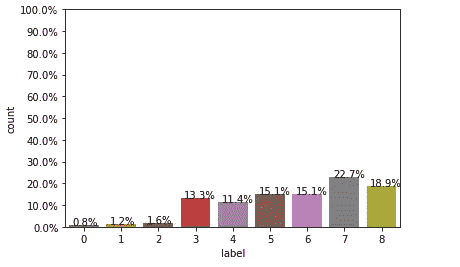
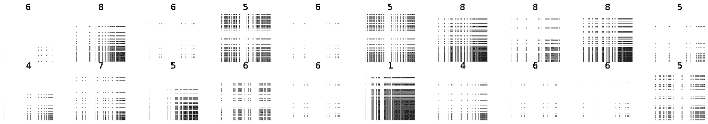
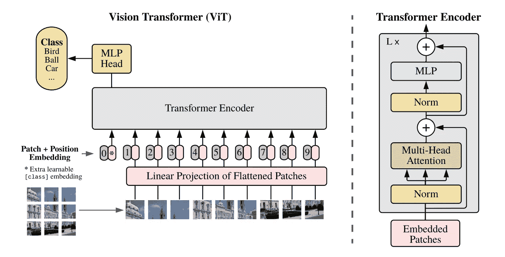
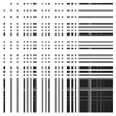
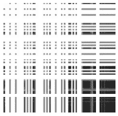
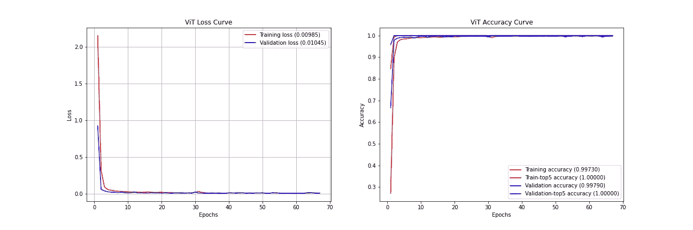
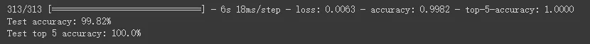

# 为恶意软件分类从头开始训练视觉转换器

> 原文：<https://medium.com/codex/training-vision-transformers-from-scratch-for-malware-classification-ccdae11d7236?source=collection_archive---------5----------------------->


> 一张图片值 16x16 个字，一个恶意软件值多少？也许一个恶意软件值 66x66 的图像。

# # 1.背景

**任务&数据集描述**

最近，在[2021 iFLYTEK a . I . Developer Challenge](https://challenge.xfyun.cn/topic/info?type=malware-classification)中启动了恶意软件分类追踪。竞赛提供已知的恶意软件数据，并要求参赛者预测每个恶意软件样本数据所属的类别(家族)。这是一个包含 9 个恶意软件类别的多类别问题，由 0 到 8 标识。

比赛数据由训练集和测试集组成，总数据量超过 10w，包含 70 个字段，其中 id 是每个样本的唯一标识符，标签是样本所属的恶意软件类别。为了保证比赛的公平性，选取了 5 万个样本作为训练集，8000 个样本作为测试集，并对部分领域进行了脱敏处理。特别是特征字段主要是 asm 文件信息，比如“line_count_asm”表示 asm 文件的行数，“size_asm”表示 asm 文件的大小，其余关于 asm 的特征字段都以“asm_commands”为前缀，理解为 asm 中的一个命令。与 2015 年[微软恶意软件分类挑战](https://www.kaggle.com/c/malware-classification/overview)不同，这个数据集只有操作码词频和文件大小信息，即我只能使用静态特征进行分析和建模。评估指标是准确性参考来自 [sklearn.metrics](https://scikit-learn.org/stable/modules/generated/sklearn.metrics.accuracy_score.html) 。

这里只是简单的展示类的分布。



训练数据集中类的分布

很明显 0，1，2 类的样本比其他的少很多。

**动机**

如今，神经网络方法已经达到了可能超过以前机器学习方法的极限的水平，大多数基于图像的恶意软件分类技术[1]都是用卷积神经网络(CNN)实现的。它巧妙地将恶意软件分类问题转移到图像分类问题。然而，[Vision Transformer(ViT)](https://arxiv.org/abs/2010.11929)【2】将 Transformer 架构的应用从自然语言处理扩展到计算机视觉，已经在许多计算机视觉基准测试中逐渐获得了最先进的结果，并且已经成为现有 CNN 架构的替代方案。

受同一家族的恶意软件样本之间的视觉相似性和 ViT 在视觉任务上的成功的激励，我们提出了 MalwareViT 用于将视觉变形器应用于恶意软件分类，这是一种基于从 Asm 作为图像提取的操作码频率获得的共生矩阵的文件不可知深度学习方法，以有效地将恶意软件分组到家族中。

在下文中，我将通过应用 ViT 来介绍基于操作码频率作为图像的恶意软件分类方法。

# # 2.恶意软件图像生成

在 ViT 中，一幅图像相当于 16x16 的文字，同样，恶意软件在 MalwareViT 中相当于 66x66 的图像。

加工步骤如下。在计算了恶意二进制文件反编译得到的 66 个操作码的词频后，我们将它们按总频率的升序排序，归一化到 0 到 255 的区间，将其视为像素值，并将其水平和垂直各排列成一列，形成二维数组。由于一些[研究](https://vx-underground.org/archive/other/VxHeavenPdfs/Opcodes%20as%20Predictor%20for%20Malware.pdf) [3]表明词频越小，越有利于区分恶意软件，所以我进行了一个“逆频”运算，即 255/(freq+1)，使操作码频率越小，灰度值越大。另外，矩阵中的列和行的交集的值被取为它们之间的最大值，以获得共生矩阵。最后，我们将这些矩阵保存为大小为 66x66 的图像。

特征处理是最重要的步骤之一。基于卷积或注意力机制的属性构建特征对深度学习模型具有重要影响。这里使用局部操作码补丁和全局位置分布信息来构造图像特征，生成的图像如下。



恶意软件图像和标签

# # 3.ViT 概述



ViT 型号概述

上图(来自[论文](https://arxiv.org/abs/2010.11929)【3】)展示了视觉变压器是如何工作的。

在论文中，他们提出了一种不关注像素而是关注图像小区域的方法。通过使用线性投影矩阵来展平输入图像中的每个颜色块，并且向其添加位置嵌入。这是必要的，因为转换器处理所有的输入而不考虑顺序，所以拥有这个位置信息有助于模型正确地评估注意力的权重。附加的类标签作为分类任务中要预测的类的占位符连接到输入(图像中的位置 0)。我们可以把它作为全球信息的补充。

该代码基于 Keras 网站上使用 ViT 的示例[图像分类。](https://keras.io/examples/vision/image_classification_with_vision_transformer/)

[](https://keras.io/examples/vision/image_classification_with_vision_transformer/) [## Keras 文档:使用视觉转换器进行图像分类

### Keras 文档

:使用 Vision Transformer Keras documentation Keras . io 进行图像分类](https://keras.io/examples/vision/image_classification_with_vision_transformer/) 

# # 3.实现 MalwareViT

**进口包**

```
*# environment: Colab Tensorflow 2.5.0*
*# !pip install -U tensorflow-addons*
import tensorflow as tf
print(tf.__version__)
import os
import sys
import numpy as np
import pandas as pd
import matplotlib.pyplot as plt
from tensorflow import keras
from tensorflow.keras import layers
import tensorflow_addons as tfa

from tensorflow.keras.preprocessing.image import ImageDataGenerator
from sklearn.metrics import accuracy_score
from sklearn.model_selection import train_test_split

import random
SEED=42
os.environ['PYTHONHASHSEED']=str(SEED)
os.environ["CUDA_VISIBLE_DEVICES"] = "0"
random.seed(SEED)
np.random.seed(SEED)
tf.random.set_seed(SEED)
```

**准备数据**

使用 ImageDataGenerator 从包含图像类别的文件夹中导入数据

```
path = './dataset/'
train_path = path+'/train'
img_width, img_height = 66,66
img_size = (img_width, img_height)
def img_data_gen(imgs_path,img_size,batch_size,rescale,shuffle=False):
    return ImageDataGenerator(rescale=rescale).flow_from_directory(imgs_path,target_size=img_size,batch_size=batch_size,class_mode='categorical',shuffle=shuffle)

train_gen = img_data_gen(imgs_path=train_path,img_size=img_size,batch_size=50000,rescale=1\. / 255,shuffle=True)

imgs, labels = next(train_gen)
print(f"imgs.shape:{imgs.shape},labels.shape:{labels.shape}")
```

将用于模型训练和验证的数据除以 0.25 的测试规模

```
from sklearn.model_selection import train_test_split
X_train, X_val, y_train, y_val = train_test_split(imgs,labels, test_size=0.25,stratify=labels, random_state=SEED)
print(f"X_train.shape:{X_train.shape},X_val.shape:{X_val.shape}")
print(f"y_train.shape:{y_train.shape},y_val.shape:{y_val.shape}")
```

**配置超参数**

```
num_classes = labels.shape[1]
input_shape = imgs.shape[1:]

learning_rate = 0.0005
weight_decay = 0.0001
batch_size = 256
num_epochs = 150
patience = 30 # After patience epoch stop if not improve
image_size = 66  # We'll resize input images to this size
patch_size = 11  # Size of the patches to be extract from the input images
num_patches = (image_size // patch_size) ** 2
# Here input_shape=(66,66),patch shape=(11,11) -> 36 patches
projection_dim = 36
num_heads = 6
transformer_units = [
    projection_dim * 2,
    projection_dim,
]  # Size of the transformer layers
transformer_layers = 8
mlp_head_units = [2048, 1024]  # Size of the dense layers of the final classifier
```

**ViT 建模**

```
def mlp(x, hidden_units, dropout_rate):
    for units in hidden_units:
        x = layers.Dense(units, activation=tf.nn.gelu)(x)
        x = layers.Dropout(dropout_rate)(x)
    return x

class Patches(layers.Layer):
    def __init__(self, patch_size):
        super(Patches, self).__init__()
        self.patch_size = patch_size

    def call(self, images):
        batch_size = tf.shape(images)[0]
        patches = tf.image.extract_patches(
            images=images,
            sizes=[1, self.patch_size, self.patch_size, 1],
            strides=[1, self.patch_size, self.patch_size, 1],
            rates=[1, 1, 1, 1],
            padding="VALID",
        )
        patch_dims = patches.shape[-1]
        patches = tf.reshape(patches, [batch_size, -1, patch_dims])
        return patches
    # refer: https://stackoverflow.com/questions/58678836/notimplementederror-layers-with-arguments-in-init-must-override-get-conf
    def get_config(self):
        config = super().get_config().copy()
        config.update({
            'patch_size': self.patch_size,
        })
        return config

class PatchEncoder(layers.Layer):
    def __init__(self, num_patches, projection_dim):
        super(PatchEncoder, self).__init__()
        self.num_patches = num_patches
        self.projection = layers.Dense(units=projection_dim)
        self.position_embedding = layers.Embedding(
            input_dim=num_patches, output_dim=projection_dim
        )

    def call(self, patch):
        positions = tf.range(start=0, limit=self.num_patches, delta=1)
        encoded = self.projection(patch) + self.position_embedding(positions)
        return encoded
    def get_config(self):
        config = super().get_config().copy()
        config.update({
            'num_patches': self.num_patches,
            'projection': self.projection,
            'position_embedding': self.position_embedding,
        })
        return config

def create_vit_classifier():
    inputs = layers.Input(shape=input_shape)
    # Augment data.
    # augmented = data_augmentation(inputs)
    # Create patches.
    patches = Patches(patch_size)(inputs)
    # Encode patches.
    encoded_patches = PatchEncoder(num_patches, projection_dim)(patches)

    # Create multiple layers of the Transformer block.
    for _ in range(transformer_layers):
        # Layer normalization 1.
        x1 = layers.LayerNormalization(epsilon=1e-6)(encoded_patches)
        # Create a multi-head attention layer.
        attention_output = layers.MultiHeadAttention(
            num_heads=num_heads, key_dim=projection_dim, dropout=0.1
        )(x1, x1)
        # Skip connection 1.
        x2 = layers.Add()([attention_output, encoded_patches])
        # Layer normalization 2.
        x3 = layers.LayerNormalization(epsilon=1e-6)(x2)
        # MLP.
        x3 = mlp(x3, hidden_units=transformer_units, dropout_rate=0.1)
        # Skip connection 2.
        encoded_patches = layers.Add()([x3, x2])

    # Create a [batch_size, projection_dim] tensor.
    representation = layers.LayerNormalization(epsilon=1e-6)(encoded_patches)
    representation = layers.Flatten()(representation)
    representation = layers.Dropout(0.5)(representation)
    # Add MLP.
    features = mlp(representation, hidden_units=mlp_head_units, dropout_rate=0.5)
    logits = layers.Dense(num_classes)(features)
    model = keras.Model(inputs=inputs, outputs=logits)
    return model
```

**可视化补丁**

```
Image size: 66 X 66
Patch size: 11 X 11
Patches per image: 36
Elements per patch: 363
```



尺寸为 66x66 的原始图像



36 块大小为 11x11 的补丁

**训练、评估和预测**

```
def run_experiment(model):
    optimizer = tfa.optimizers.AdamW(learning_rate=learning_rate, weight_decay=weight_decay)
    model.compile(
        optimizer=optimizer,
        loss=keras.losses.CategoricalCrossentropy(from_logits=True),
        metrics=[
            keras.metrics.CategoricalAccuracy(name="accuracy"),
            keras.metrics.TopKCategoricalAccuracy(5, name="top-5-accuracy"),
        ],
    )
    model_name = "keras_trained_MalwareViT.h5"
    log_dir = os.path.join(os.getcwd(), 'logs')
    filepath='ViT.{epoch:02d}-{val_loss:.4f}.h5'
    ck_path = os.path.join(log_dir, filepath)
    if not os.path.isdir(log_dir):
      os.makedirs(log_dir)
    mc = keras.callbacks.ModelCheckpoint(ck_path, monitor='val_loss',save_best_only=True,save_weights_only=True)
    es = keras.callbacks.EarlyStopping(monitor='val_loss', patience=patience, verbose=0) # when patience epoch val_loss not improve, stop train
    # tb = keras.callbacks.TensorBoard(log_dir=log_dir, histogram_freq=0)
    callbacks = [es, mc]

    history = model.fit(
        x=X_train,
        y=y_train,
        batch_size=batch_size,
        epochs=num_epochs,
        validation_data=(X_val, y_val),
        # validation_split=0.1,
        # shuffle=True,
        callbacks=callbacks,
    )
    # To see history keys for visualization
    print(history.history.keys())

    # save model and weight
    # model_path = os.path.join(log_dir, model_name)
    # model.save(model_path)

    return history

vit_classifier = create_vit_classifier()

# show and save model structure
# vit_classifier.summary()
# keras.utils.plot_model(vit_classifier, show_shapes=True)

# train
history = run_experiment(vit_classifier)
```



损耗和精度曲线

评估

```
# load best model
vit_classifier.load_weights("/content/logs/best_ViT.h5")

_, accuracy, top_5_accuracy = vit_classifier.evaluate(X_val, y_val)
print(f"Test accuracy: {round(accuracy * 100, 2)}%")
print(f"Test top 5 accuracy: {round(top_5_accuracy * 100, 2)}%")
```



预测

```
sub_path = "./dataset/test"
sub_gen = img_data_gen(imgs_path=sub_path,img_size=img_size,batch_size=1,rescale=1\. / 255)
sub_pred = vit_classifier.predict(sub_gen)
sub_pred_class = np.argmax(sub_pred, axis = 1)
```

使服从

```
df_sub = pd.read_csv("./dataset/sample_submit.csv")
df_sub['label'] = sub_pred_class
df_sub.to_csv("submit_MalwareViT.csv",index=False)
```

# # 5.改进建议

由于这里的 ViT 实现不使用预训练，如果你想获得更高的精度，可以尝试训练更多轮次，使用更深的层，改变输入图像大小，改变面片大小，增加投影维度，还可以考虑改变学习速率，切换到优化器，使用权重衰减等训练策略。

因为图像相对简单，太复杂的模型往往会过度拟合。当然，这个数据集和 15 年的微软恶意软件分类数据集很可能是同源的，人们也可以考虑从大型的微软恶意软件分类数据集进行训练，以获得预训练的模型，然后在这个数据集上进行微调可能效果很好。

在[论文](https://www.sciencedirect.com/science/article/pii/S1389128619304736)【4】中已经表明，在 ImageNet 上使用几个经典 CNN 架构的预训练模型进行微调也可以产生出色的结果，其中使用彩色图像，并且使用图像处理方法的图像数据增强来提高模型的稳健性，这与灰度图像相比更好。(在论文实验中，在基于灰度的模型的比较中，ResNet50 作为预训练模型工作得最好。我随后尝试了基于几个经典 CNN 架构的预训练方案，它真的很好，MobileNetV2 训练得更快更好，但都很容易过度适应)

从文献[4]中，我们还得到了一些启示，我们可以通过引入基于代码级混淆技术的对抗训练来提高模型的健壮性，如死代码插入、代码转置、寄存器重分配、指令替换等。在这种情况下，可以通过随机增加总体操作码词频、随机增加 jmp 和调用的数量等来操纵表格数据集。可以通过增加灰度值、改变亮度、整体缩放等来操纵图像数据。

除了表格类的数据可以使用树模型，图像数据使用神经网络模型，然后进行模型融合，还可以把这个分类问题做为序列分类，简单的把一列词频特征组合成一列，和 NLP 方向的思路一样，会根据词频逆向得到 asm 文档，然后嵌入，作为文本分类任务。

[](https://github.com/rickyxume/MalwareViT) [## GitHub - rickyxume/MalwareViT:从零开始为恶意软件分类训练视觉转换器

### 一张图片值 16x16 个字，一个恶意软件值多少？…

github.com](https://github.com/rickyxume/MalwareViT) 

这里是我的 github 资源库，只是抛砖引玉，欢迎点击⭐.如果您有任何问题，请随时与我沟通。

# 参考

[1] Nataraj L，Karthikeyan S，Jacob G，等.恶意软件图像:可视化和自动分类.美国计算机学会，2011 年。[https://dl.acm.org/doi/10.1145/2016904.2016908](https://dl.acm.org/doi/10.1145/2016904.2016908)

[2] Dosovitskiy A，Beyer L，科列斯尼科夫 A，等.一幅图像相当于 16x16 个字:大规模图像识别的变形金刚[J].2020.https://arxiv.org/abs/2010.11929

[3] Bilar D .操作码作为恶意软件的预测器[J].国际电子安全和数字取证杂志，2007，1(2):156–168。[https://VX-underground . org/archive/other/VxHeavenPdfs/Opcodes % 20 as % 20 predictor % 20 for % 20 malware . pdf](https://vx-underground.org/archive/other/VxHeavenPdfs/Opcodes%20as%20Predictor%20for%20Malware.pdf)

[4]瓦桑 D，阿拉扎布 M，瓦桑 S，等. IMCFN:基于图像的恶意软件分类用微调卷积神经网络体系结构[J].计算机网络，2020，171:107138。[https://www . science direct . com/science/article/pii/s 1389128619304736](https://www.sciencedirect.com/science/article/pii/S1389128619304736)