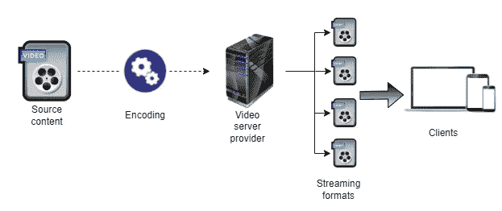
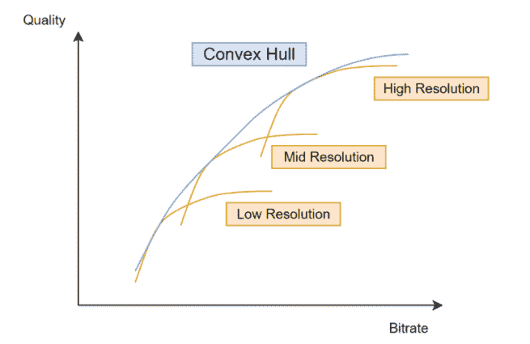
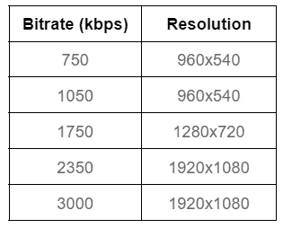

# 使用 FFMPEG 进行转码

> 原文：<https://medium.com/codex/transcoding-with-ffmpeg-a7b6ce53b3fe?source=collection_archive---------7----------------------->

# 介绍

HTTP 自适应流(HAS)广泛用于服务提供商端，以确保并最大化 QoE。让我们假设一个典型的流媒体场景，其中给定的用户想要播放一个视频(使用本地分辨率 **S** )。我们有两个约束需要考虑，客户端可以支持的分辨率**S’**和带宽容量(**R**<**R***max*)。

目标是以满足客户显示分辨率和带宽的最佳分辨率/比特率组合发送视频。这种技术在下图中通过用几个参数(CBR、CRF 或 CQP)对源素材进行编码来说明，这些参数分别是恒定比特率、恒定速率因子和恒定量化参数的简写。编码结果存储在服务器上，客户端请求最符合其要求的版本。



自适应比特率流系统

# 代码转换部分

让我们仔细看看我们用各种参数对源进行编码的地方。目的是创建一个比特率/分辨率对的数据库，客户端可以利用该数据库来保持在其限制范围内。考虑每秒 50 帧(即 1920×1080)的 FHD 视频源中的单个场景。为了制作替代版本，我们需要更改各种设置，例如将序列从 1080p 缩减到 720p 或 540p，并使用[21–51]范围内的 QPs 进行编码(为了简化)。

接下来，我将利用 FFMPEG(一个开源框架)python 命令来演示代码转换过程的各个部分。
要缩减序列，使用下面的 FFMPEG 命令:

```
ff = FFmpeg(inputs={‘VideoSource1080p50.yuv’: " -f rawvideo -pix_fmt 'yuv420p' -s:v '1920x1080' -r 50"},outputs = {‘VideoSource720p50.yuv’: "-vf scale=1280x720:flags=lanczos -pix_fmt ‘yuv420p’"})ff.run()
```

我们现在使用我们的 QP 范围对生成后的缩减版本(720p，540p)进行编码。(请注意，此阶段包括本机解决方案。)

```
ff = FFmpeg(inputs={‘VideoSource720p50.yuv’:”” },outputs={‘VideoSource720p50_30.yuv’: “ -c:v libx264 -x264-params qp=30”})ff.run()
```

上面的程序采用 720p 缩减版本，并使用 X264 编解码器进行编码，QP 参数设置为 30。在 QP 范围内，我们执行该命令(其他分辨率的过程相同)。我们可以在这个阶段获得比特率值。之后，我们可以返回到其原始分辨率，并使用与之前相同的命令计算基准电压源的 PSNR 度量，但使用正确的输入/输出和目标分辨率:

```
ff = FFmpeg(inputs={‘VideoSource540p50_40.yuv’: “ -f rawvideo -pix_fmt ‘yuv420p’ -s:v ‘960x540’ -r 50”},outputs = {‘VideoSource540p50_40_to_1080p.yuv’: “-vf scale=1920x1080:flags=lanczos -pix_fmt ‘yuv420p’”})ff.run()
```

为了计算 PSNR，我们引入以下命令:

```
ffmpeg -y -i “VideoSource540p50_40_to_1080p.yuv” -i “VideoSource1080p50.yuv” -lavfi psnr=”stats_file=PSNR_File” -f null -
```

# 凸包



视频源的凸包

在使用我们的三种分辨率(1080p、720p 和 540p)计算所有编码版本的比特率和 PSNR 值之后，我们可以使用速率/质量对来创建每个分辨率的 RQ 曲线。凸包是定义所有曲线边界的曲线。



比特率/分辨率对

我们可以使用凸包构建上表，凸包将每个速率值与相关分辨率相关联。这个表对于解决前面提到的两个限制问题至关重要。因此，为了请求正确的版本，客户端选择最能利用其带宽同时保持最高质量的对。

# 结论

在这个简短的讲座中，我们展示了如何在客户端屏幕上显示所请求的源文件的最佳版本，方法是选择适合客户端限制的合适的源文件对。概括地说，我们使用 FFMPEG 指令将原始文件缩小到所需的分辨率，用一系列 qp 对每个文件进行编码，然后将所有编码版本放大到原始分辨率，以计算源文件(称为参考)的 PSNR。最后，我们通过绘制每个分辨率的 RQ 曲线并提取凸包来产生配对。

# 参考

【1】[](https://ffmpeg.org/)*【2】*[https://netflixtechblog . com/per-title-encode-optimization-7e 99442 b 62 a 2](https://netflixtechblog.com/per-title-encode-optimization-7e99442b62a2)**