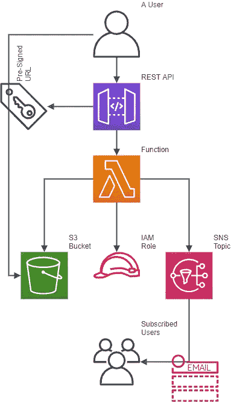

# 使用 REST API 将文件传输到 S3

> 原文：<https://medium.com/codex/transfer-files-to-s3-using-rest-api-3bb1823f04d9?source=collection_archive---------4----------------------->

## [法典](http://medium.com/codex)

## 使用 PowerShell 调用 API 并得到后端的通知。

# 我的使用案例

我有时会被问到:“你更喜欢用哪种方法将文件传输到 S3？”我的回答是:“适合你的那个”。*作品*的定义因情况而异。最简单的方法是将 bucket 公开。如果不希望这样，则创建一个对 S3 存储桶具有编程访问权限的用户，或者创建一个拥有足够权限承担允许访问 S3 存储桶的角色的用户。问题是我可能会有很多用户身份。我可以使用 Cognito [ [1](https://docs.aws.amazon.com/cognito/latest/developerguide/cognito-identity.html) ]来实现身份联合，以便更好地管理它。不用说，有不同的方法来请求临时安全凭证，每种方法都使用[ [2](https://docs.aws.amazon.com/IAM/latest/UserGuide/id_credentials_temp_request.html#stsapi_comparison) ]。

如果您真的不想使用任何用户凭证或身份，或者如果 bucket 中的对象需要一些处理，会发生什么情况呢？API Gateway-Lambda-S3 无服务器模式可以提供帮助。

# 我的解决方案

我的模式基于集成了 Lambda 函数的 REST API。该函数可以执行任意数量的任务，比如发布预先签名的 URL，将对象上传或下载到指定的 S3 存储桶，向 SNS 主题发送通知，以及处理上传的对象(本文中没有介绍)。这是一种相对安全的传输文件的方法，因为预签名的 URL 可以设置为在必要时快速过期。SNS 主题可以将所请求的操作通知给系统的涉众。使用 S3 事件通知作为其他 Lambda 函数的触发器，可以进一步扩展这个云堆栈。

通过应用程序或脚本实现自动化来充当用户和云之间的代理，这种云堆栈的可用性得到了提高。我更喜欢使用 PowerShell 来做这件事，因为在脚本中引入文档很容易。

我不打算深入 PowerShell 编程或集成 API Gateway — Lambda 响应的细节。后者我一步一步演示，代码包括[ [3](/swlh/integrating-api-gateway-lambda-responses-476a4c0399c1) ]。相反，我将把重点放在部署和使用方面。

# 部署和使用

为了部署解决方案，您可以克隆我的存储库[ [4](https://github.com/DanielEIlie/short-examples) ]。您需要的代码可以通过“readme.md”中的链接找到，该链接位于与本文标题相同的标题下。无需深入细节，您需要:

*   准备承载代码的 S3 桶
*   创建 CloudFormation 堆栈:该堆栈最重要的输出是 REST API Prod 端点 Url 和 Lambda Arn，它们用于
*   允许 API 调用 Lambda:通过执行相关的 CLI 命令
*   准备 PowerShell 脚本:通过编写正确的 URI 变量

所有这些步骤都详细记录在位于*CFN-s3premiedurl*文件夹中的“readme.md”中。

在调用脚本之前，我建议阅读文档。使用 PowerShell 控制台，键入*帮助。/Transfer-Files.ps1 -Example* 。我推荐 PowerShell Core，但是任何最新的版本都可以。该脚本支持重命名对象，只需为目标指定一个不同于源的名称。在上载操作中省略了 S3 键的情况下，基于 UTC 日期时间的自动前缀被添加到对象中。如果您已经用通知主题确认了订阅，那么每次调用该脚本时，您的收件箱中都会收到一封电子邮件。

我希望您觉得这篇文章很有用，并且在剖析各种组件的过程中获得了一些乐趣。在我的例子中，最耗时的部分是确保 PowerShell 脚本被正确记录。如果您在使用脚本时没有任何问题，这意味着我已经正确地完成了。

请随时将您的意见发送给我…

# 进一步阅读

[1] [亚马逊认知身份池(联合身份)](https://docs.aws.amazon.com/cognito/latest/developerguide/cognito-identity.html)

[2] [比较 AWS STS API 操作](https://docs.aws.amazon.com/IAM/latest/UserGuide/id_credentials_temp_request.html#stsapi_comparison)

[3] [集成 API 网关— Lambda 响应](/swlh/integrating-api-gateway-lambda-responses-476a4c0399c1)

[4] [简短范例库](https://github.com/DanielEIlie/short-examples)

[5] [PowerShell 存储库](https://github.com/PowerShell/PowerShell)