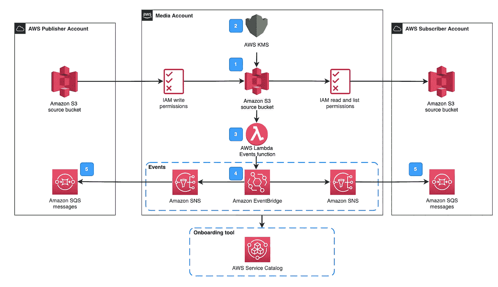

# 将媒体资产转移到您的客户，并将合作伙伴转移到 AWS 云

> 原文：<https://medium.com/codex/transferring-media-assets-to-your-customer-and-partners-946d3bb1deac?source=collection_archive---------14----------------------->

媒体资产图

整个世界包含了大量的信息、媒体、图片和不同种类的信息。在下面的文章中，我创建了一个向您的客户和合作伙伴转移媒体资产的图表。

我使用了 AWS 云和服务，如**亚马逊 S3** 、 **IAM** 、 **KMS** 、 **Lambda** 、**事件桥**、 **SNS** 和 **SQS** ，我将在下面进行描述。