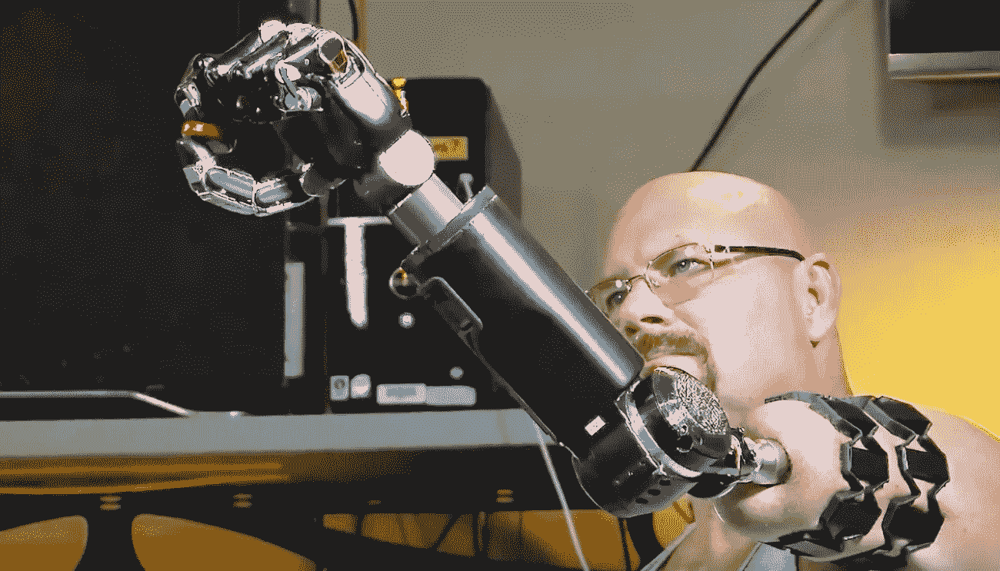
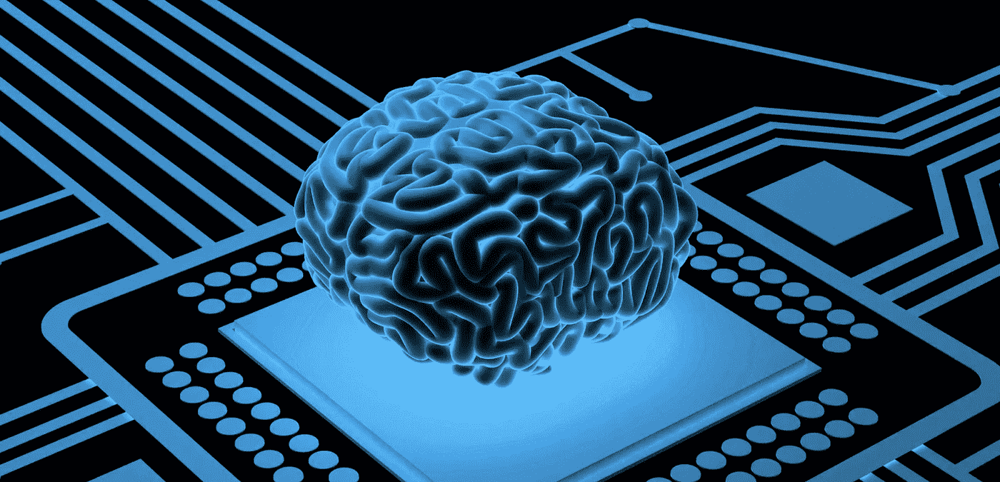

# 超人类主义

> 原文：<https://medium.com/codex/transhumanism-287f11ab69ea?source=collection_archive---------6----------------------->

事实上，我已经在最近的一篇文章“人类的创造”中涉及了超人类主义的一部分，这篇文章只关注基因改造人类的话题。这不是超人类主义唯一关心的事情，那是什么呢？超人类主义是一种专注于通过各种方式提升和发展人类、人类体验和人类身体的思想。它主要关注未来的科学和理论技术，虽然超人类主义有许多随意和低强度的想法，但这个条目将涵盖可能发生的最激烈的变化。基因工程将通过纯粹的生物学手段做到这一点，这可能是改变人类的最极端的例子之一。另一种方法是通过使用包含在植入物中的集成人工智能。这些植入物将连接到一个人的大脑，这些人工智能将能够陪伴那个人，并以各种方式增强它们。这个人可以被允许更快地对事物做出反应，更好地识别事物，更好地记忆和记录事物，并通过他们的大脑访问互联网。这样的人可能也能够用他们的思维给其他有电话或类似人工智能植入物的人发送信息。另一种更极端的方法是用基因工程部件或机械部件替换身体的部分或器官。今天这些已经在研究中，它们主要是为那些需要这些部分的人服务的，比如那些需要器官或肢体替换的人。也许有一天，机器人部件会在某种程度上变得流行，人们可能会自愿牺牲自己的肢体来换取更强大的机器人部件。机器人部件还包括除四肢之外的其他东西，如眼睛和耳朵，可以让你看到别人看不到的东西，听到音乐等东西，而不需要耳机或任何东西。

[人类用思维操纵机械臂——未来](https://www.futurity.org/robotic-arm-prosthetic-1089802-2/)

我还想谈一个话题，那就是永生的话题。更确切地说，生物永生并不意味着你不会死。这意味着你不会死于自然原因，如衰老，但你仍然是一个凡人和脆弱的身体。结合基因改造和人造身体部分(生物的和机械的),某人将能够比平常活得更长，并不断购买和替换他们身体中磨损的部分。在这一点上，你唯一需要担心的自然死亡是疾病，如果你已经对它们没有抵抗力，你的大脑不可避免地会衰竭。但是，我们甚至可以走得更远，而不仅仅是长寿的电子人，因为我们有可能在未来将我们的思想转移到机器人身上。许多人提出了将我们的意识上传到计算机的可能性，虽然我真的不知道这在未来是否可能，但它不像我提到的其他选择那样有很多理论意义。如果我们变成了计算机，我仍然相信计算机必须以某种方式与我们的物理思维进行交互，哪怕只是大脑。

将大脑与计算机联系起来:科学还是科幻？首席健康官

如果以某种方式实现永生或更长的寿命，我们的社会和生活将彻底改变，这可能是人类最大的里程碑之一。永生，就像我报道的许多其他事情一样，仍然有一些不好的方面需要记住。有了永生，坏人可能会活得更久，世界将在几年内变得人口过剩，社会和文化将停滞不前，富人永远不会死，在世界上创造不可想象的不平等。还有一种观点认为，有些人根本不想长生不老，在自然死亡和不死之间做出选择不是你希望有人必须经历的事情。这些观点中的大部分给了人类更多的理由去扩展到太空，并本质上殖民更多的土地来让更多的人类居住。

感谢阅读！—卡梅伦·波波夫斯基