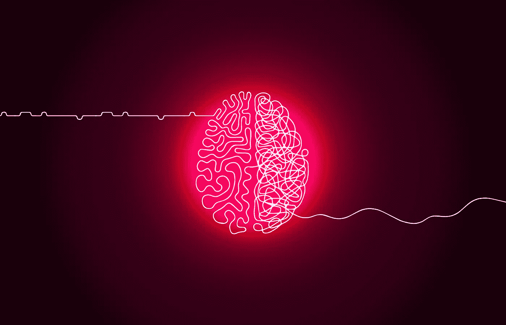
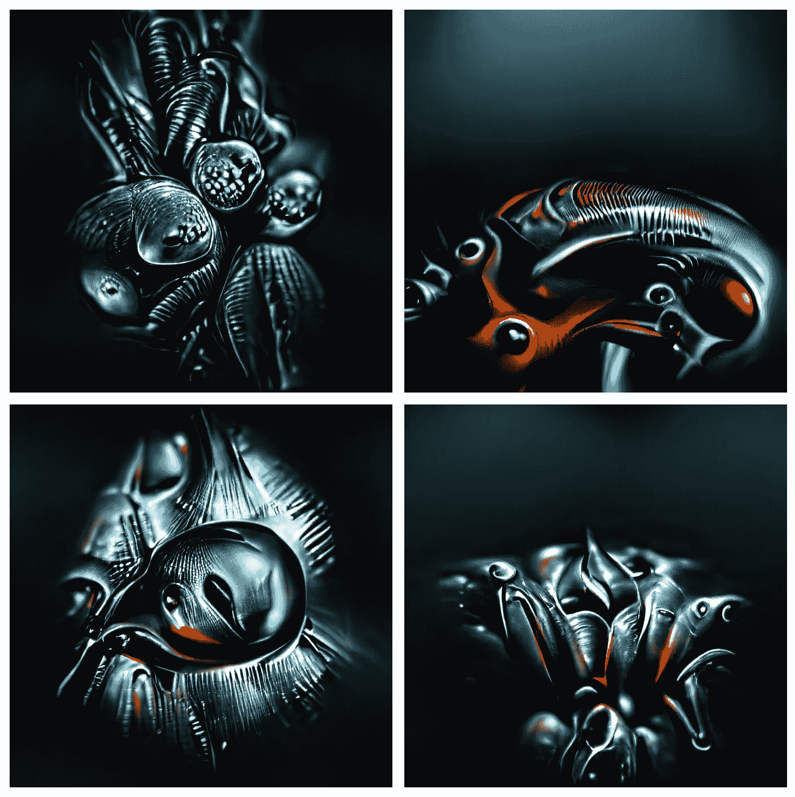
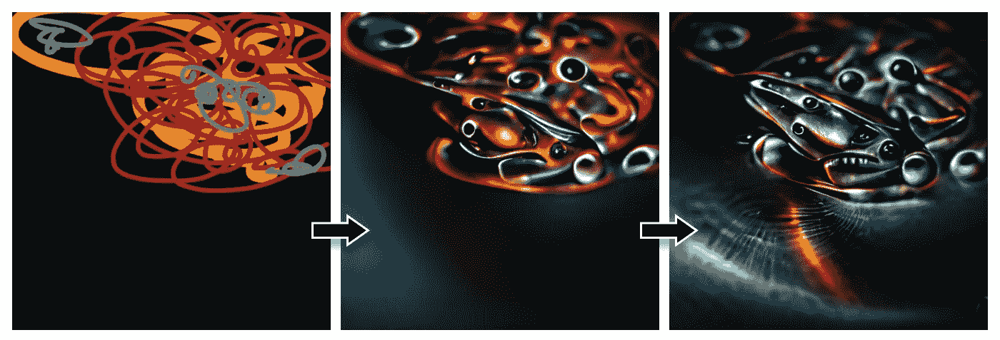

# 通过人工智能将想象转化为艺术

> 原文：<https://medium.com/codex/translating-imagination-into-art-via-ai-6a7f7d3ef843?source=collection_archive---------18----------------------->

## **旅程**

我花了很多时间创作。大部分是数码艺术，但我也有其他的创作途径:绘画、丝网印刷、蓝活字印刷等。*创造*让我的心灵安静下来。创作的过程始于一个念头:我想做什么？我从一个平衡的地方进行创作，不让思想和行动产生分歧，也不让创造性的清晰性破裂。而是到达一个中心。我的中心。正是在这种状态下，我能够让我的思想变得敏锐，并明白下一步在哪里。如何把思想转化为世界上的东西？这个高度直觉的过程，我长期以来一直认为是完全属于人类代理人的创造性领域。也就是说，直到不久前，我看到一篇关于一台被训练成能画出像伦勃朗一样的*的机器的文章。这个想法让我大吃一惊。是什么让这成为可能？这怎么可能呢？*

***下一个伦勃朗*** 是数据科学家、人工智能专家和 3D 打印专业人士(ing、微软、TU Delft、Marihuis)之间的合作项目，旨在开发一种能够基于伦勃朗作品的数据创建 3D 打印的伦勃朗式绘画的软件。它始于输入图像，用神经网络提高它们的分辨率，详细描述一幅画的各层(画布、地面和笔触)，并对伦勃朗的主题特征进行典型化。结果是机器学习的突破性壮举，但同样重要的是这个项目带来的理论难题，质疑艺术、技术和科学之间的区别，以及质疑计算机生成的艺术在意图、情感以及最重要的创造力方面的限制。

我问自己:我能不能开发一台机器，把我的想法转化成视觉图像？在那个时候，这只是一个沉思，但我喜欢思考。我不仅乐在其中，而且无法释怀。我没有一天不在网上漫游，试图找到我的问题的答案。在这些创新的早期，一段时间以前，没有太多的信息，但我设法找到了一些代码库。我不懂代码，但我知道如何学习。于是我开始涉足人工智能和生成艺术的世界。

我开始在反复试验的过程中摸索。我花了很长时间排除无数错误，这些错误用不祥的红色标记:“这是丢失的。”“那不行。”看着它们不断堆积，我有时会感到沮丧(至少可以这么说)，但多亏了我的外部思维，谷歌，我慢慢地能够拼凑出一个程序，根据我的想法，或者更准确地说，根据我在程序中输入的单词来制作图像。以一种非常真实的方式，我*创造了*一台*创造*艺术的机器。

我现在有了另一个可以自由支配的创作工具，这个想法令人兴奋。对于那些声称它削弱了创作过程和艺术作品的人，我想提醒他们，在最初的日子里，摄影和数字艺术也是如此。策展、创造性思维和制作过程在通往艺术作品的道路上走到了一起，一方面掩盖了过程，另一方面揭示了创作的工具。

我的机器的第一次迭代是我认为不成功的实验。但是过了一段时间，还是发生了。一个让我吃惊的结果。我意识到我在那里。我睡不着。我整晚不停地向程序输入越来越多的信息，一次又一次，我迫不及待地想看看另一端会出现什么。就这样 [**候补种**](https://opensea.io/collection/alternate-kind) 诞生了，我和 AI 创作的第一个集合。256 幅精心策划的图像。我和机器的结合产生了最好的东西。当然，还有无数不太成功的结果，它们现在已经填满了我 Mac 电脑的回收站。每件作品都是完全独特的，有一个独特的名字，虽然它是一个更大的收藏的一部分，但它也是一件独特、独立的艺术品。

**来自“另类”系列的 4 件艺术品**

我从这个过程中学到的东西和艺术品本身一样有价值。用我的机器创作艺术的一个步骤是让它学习“我的风格”。换句话说，我通过某种文字(有时是图像)的输入，将它推向我想要或期望的输出——这个过程也让我在这个过程中发现了一些关于我自己的事情。现在，看着这些收藏，一些让我夜不能寐的问题现在被抛到了九霄云外(当然，其他问题也随之而来)。人和机器之间的共生关系必然会创造出新的东西，但比这更有趣的是过去被保留下来并被邀请到现在的程度。很多年前，我曾经为电子音乐设计专辑封面。通过与 AI 的互动，我现在可以看到过去的我和今天的我之间的明确联系，如果我没有踏上这段旅程，我可能无法看到或了解这种联系。就像伦勃朗的画作一样，虽然创作工具可能已经从画笔变成了电脑鼠标，变成了纯代码或人工智能，但与这些工具互动的创造性思维仍然保持不变；杰出的，独特的，有足够的占有欲的倾向，坚持通过空间和时间，甚至可能在死后。

## **为什么选择 NFTs？**

在 Alternate Kind 之前，我参与了一个 PFP 项目，这是一个代表世界各国的套娃系列。这个过程很有趣，最终产品也不错。该项目由一个团队运行，每个团队都有不同的角色:营销、内容写作、不和谐与社交媒体管理、网站开发等。我的角色是创作这一系列的艺术品。我很喜欢它，尽管它感觉更像是一个为商业目的而创作的平面设计师的角色，而不是一个为艺术而艺术或为他自己而艺术的艺术家。尽管如此，在这个过程中，我爱上了区块链，NFTs，以及介于两者之间的一切。一切都是透明的、快速的——简而言之，这是一个全新的世界。只需连接你的钱包，开始购买，销售，创造，任何东西。老实说，我想过这个系列是否值得转换成不同的形式——也许是画廊展览？丝印系列？潜力是无限的，我有一百万个想法可以带它去哪里。但区块链的 NFTs 最终洗牌，为我提供了我正在寻找的出路。

## **上下文中的替代种类**

在 NFT 的海洋中，有非常丰富多样的艺术品。它们中的许多是有趣的，三维的，有光泽和微光，有些人甚至会称之为精心打扮的。另类想破坏的正是这种 NFT 文化。我的作品不符合这些标准。这个系列在我看来是 NFT 艺术的主导景观中脱颖而出

另类被创造出来，用一颗开放的心投射到世界上，利用新的创造性工具使之发生。这是为了进入一个既自由又受限制的梦想世界。一个不同的世界。另一个世界。

**从我创建的源图像涂鸦到最终版本的不同步骤**

## **技术细节**

为了让我的观众明白并简化这个对我来说非常复杂的过程，这里有一些帮助我创作这些作品的有用链接和细节。

**使用:**程序运行在 [Google Collab](https://colab.research.google.com) 、&Github 中

**图像尺寸** : 2000x2000px

**来源**:有些作品是从一张空白的画布开始，或者说“什么都没有”。其他人从我在其他地方创建的分形或涂鸦的源图像开始，并输入到程序中，这样它就会有某种参考框架——位置、大小和原点。

**关键词**:【不全面列表】金属/水银/闪亮/铜/反射/气泡/液体/精子/卵细胞

**风格关键词**:深色/黑色背景/戏剧性/液体

【https://opensea.io/collection/alternate-kind】销售平台:

**我的推特:** [@nomgy_](https://twitter.com/nomgy_)