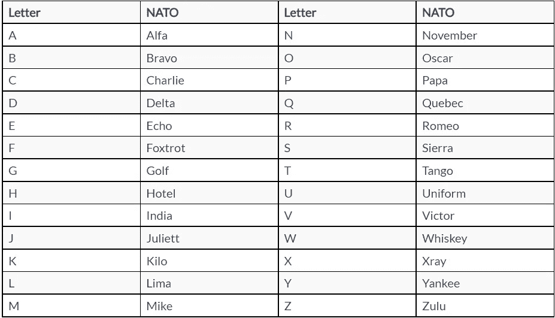
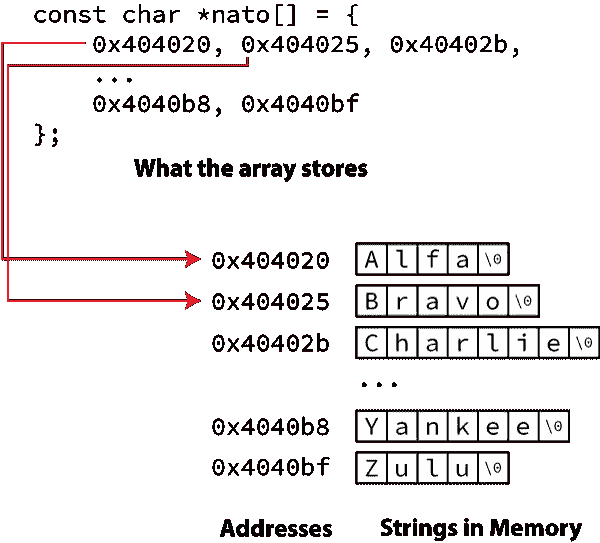

# 将北约字母表翻译成纯文本

> 原文：<https://medium.com/codex/translating-the-nato-alphabet-to-plain-text-1f821e830b19?source=collection_archive---------5----------------------->

## 引用

## *出自* [*微型 C 项目*](https://www.manning.com/books/tiny-c-projects?utm_source=medium&utm_medium=referral&utm_campaign=book_gookin_tiny_9_29_21) *出自丹·古金*

*在本文中，我们将讨论北约音标，以及如何编写一个简单的程序将它翻译成纯文本。*

在[manning.com](https://www.manning.com/books/tiny-c-projects?utm_source=medium&utm_medium=referral&utm_campaign=book_gookin_tiny_9_29_21)结账时将 **fccgookin** 输入折扣代码框，即可享受 35%的折扣。

如果你从来没有在电话里拼写过你的名字，那你应该感到幸运。或者你的名字叫玛丽·史密斯，但是你住在一条街上或一个城市里，你必须不断地大声拼写。如果是这样，你可以求助于你自己的拼写字母，比如“Nancy”中的 N 或者“knife”中的 K 作为一名程序员，你可以通过阅读本章来减轻这种挫折感，在这一章中，你

*   理解北约的音标，以及他们为什么要这么麻烦。
*   将单词翻译成拼写字母表。
*   阅读文件将单词翻译成音标。
*   倒过来把北约字母表翻译成单词。
*   阅读文件翻译北约字母表。
*   了解日本的纳豆是一种美味的发酵豆酱。

最后一点在本章中没有涉及。我只是喜欢吃纳豆，现在我可以把它记为业务费用。

总之。

这场混乱的辉煌结局是，不仅学习了一些新的编程技巧，还自豪地大声拼写单词，说“十一月”而不是“南希”。

## **北约字母表**

除了是任何一个叫纳撒尼尔的人的昵称，NATO 还代表北大西洋公约组织。这是一群国家，他们是共同防御条约的成员。例如，如果另一个国家(我不知道，比如俄罗斯，没有任何特殊原因)攻击像波兰这样的北约国家(同样，没有任何原因)，所有其他北约国家都应该联合起来保卫波兰。谢天谢地，这种情况从未发生过。

第二次世界大战后，北约成立了。我可以继续说下去，但关键是北约需要成员国之间有一些共同点。你知道，当汉斯缺少弹药时，皮埃尔可以给他子弹，子弹可以装进枪里。诸如此类的东西。

北约国家之间的一个共同点是大声说出事情的方式。这样，汉斯就不需要说，“子弹！那是香肠中最好。你就是那个尤伯。我是指皮短裤。"诸如此类。相反，汉斯说:“太棒了，制服，利马，利马，回声，探戈。”这样，皮埃尔就能在所有的枪炮声中听懂汉斯的话。

表 1 列出了北约的音标，用相应的单词描述了每个字母。选择的词语是独特的，不容易被误解。其中两个单词(Alfa 和 Juliett)是故意拼错的，以避免书面形式中的混淆。



表 1。北约音标。

NATO 不是唯一的语音字母，但可能是最常用的。重点是一致性。作为程序员，你不需要记住这些单词中的任何一个，尽管作为一个书呆子你可能会。尽管如此，这个程序可以输出北约代码——或者把它翻译成文字，这取决于你如何编写你的 C 代码。奥斯卡·基洛。

## **北约翻译计划**

您编写的任何 NATO 翻译程序都必须有一个字符串数组，如下所示:

```
char *nato[] = {
     "Alfa", "Bravo", "Charlie", "Delta", "Echo", "Foxtrot",
     "Golf", "Hotel", "India", "Juliett", "Kilo", "Lima",
     "Mike", "November", "Oscar", "Papa", "Quebec", "Romeo",
     "Sierra", "Tango", "Uniform", "Victor", "Whiskey",
     "Xray", "Yankee", "Zulu"
 };
```

数组的符号`*nato[]`意味着一个指针数组，这就是编译器在内存中构建这种结构的方式。数组的数据类型是 *char** ，所以指针引用存储在内存中的字符数组——字符串。分类不变，*const*；您不想弄乱以这种方式声明的任何字符串——这在这段代码中没有问题。`*nato[]`数组填充了这些地址，即字符串的存储位置，如图 1 所示。



图一。指针数组如何引用内存中的字符串。

例如，在图中，字符串 *Alfa* (以空字符`\0`结束)存储在地址 0x404020。这个内存位置存储在`nato[]`数组中，而不是字符串本身。是的，字符串出现在数组的声明中，但是它在运行时存储在内存的其他地方。同样的结构适用于数组中的所有元素:每个元素对应一个字符串的存储位置，从 Alfa 到 Zulu。

`nato[]`数组的美妙之处在于内容是连续的，匹配从`'A'`到`'Z'`的 ASCII 值。这种巧合使得提取与 NATO 单词相对应的字符非常容易。

## **编写北约翻译器**

清单 1 显示了一个简单的 NATO 翻译器。它提示输入，使用 *fgets()* 函数从标准输入中收集一个单词。一个*同时*循环一个字母一个字母地搅动这个单词。在此过程中，任何字母字符都会被 *isalpha()* 函数检测到。如果找到，该字母将被用作对`nato[]`数组的引用。结果是北约拼音字母术语输出。

**清单 1 nato01.c**

```
#include <stdio.h>
 #include <ctype.h>

 int main()
 {
     const char *nato[] = {
         "Alfa", "Bravo", "Charlie", "Delta", "Echo", "Foxtrot",
         "Golf", "Hotel", "India", "Juliett", "Kilo", "Lima",
         "Mike", "November", "Oscar", "Papa", "Quebec", "Romeo",
         "Sierra", "Tango", "Uniform", "Victor", "Whiskey",
         "Xray", "Yankee", "Zulu"
     };
     char phrase[64];
     char ch;
     int i;

     printf("Enter a word or phrase: ");
     fgets(phrase,64,stdin);    #A

     i = 0;
     while(phrase[i])    #B
     {
         ch = toupper(phrase[i]);    #C
         if(isalpha(ch))    #D
             printf("%s ",nato[ch-'A']);    #E
         i++;
         if( i==64 )    #F
             break;
     }
     putchar('\n');

     return(0);
 }
```

**#A 存储进位置** `phrase` **63 个字符(加上空字符)来自** `stdin` **，标准输入**

**#B 循环，直到在字符串中找到空字符**

**#C 将** `ch` **转换为大写**

**#D 真当字** `ch` **是字母**

**#E** `ch-‘A’` **将字母转换为 0 到 25 的值，匹配相应的数组元素。这个表达式有效，因为 *char* 变量被认为是整数。**

**#F 一个长字符串不能有空字符，所以当达到缓冲区大小时抛出**

构建和运行时，程序会提示输入。无论键入什么文本，都会被翻译并以音标输出。例如，“你好”变成了:

奥斯卡威士忌三角洲扬基酒店

键入较长的短语，如“你好，世界！”产量:

利马回声酒店利马奥斯卡威士忌奥斯卡罗密欧利马三角洲

因为代码中忽略了非字母字符，所以不会生成它们的输出。

用这种代码翻译成另一种音标很容易。你所要做的就是用你自己的拼音字母替换`nato[]`数组。例如，以下是可用于执法拼音字母的数组:

```
const char *fuzz[] = {
     "Adam", "Boy", "Charles", "David", "Edward", "Frank",
     "George", "Henry", "Ida", "John", "King", "Lincoln",
     "Mary", "Nora", "Ocean", "Paul", "Queen", "Robert",
     "Sam", "Tom", "Union", "Victor", "William",
     "X-ray", "Young", "Zebra"
 };
```

## **读取和转换文件**

我不确定是否有必要将文件中的所有文本翻译成北约音标。这是一个你可以承担的 C 项目，主要是为了练习，但实际上来说，这没有什么意义。我的意思是，听三个小时完全用北约字母表制作的《安东尼与克利奥帕特拉》( Anthony and Cleopatra )( T42)会很乏味，不过如果你是戏剧/IT 双学位，不妨一试。

清单 2 展示了吞噬一个文件并将每个字符翻译成对应的 NATO 拼音字母的代码。文件名在命令提示符下提供。如果没有，程序会抛出一条适当的错误消息。否则，类似于`nato01.c`中的代码，代码一次一个字符地搅动文件，吐出匹配的 NATO 单词。

**清单 2。nato02.c**

```
#include <stdio.h>
 #include <stdlib.h>
 #include <ctype.h>

 int main(int argc, char *argv[])
 {
     const char *nato[] = {
         "Alfa", "Bravo", "Charlie", "Delta", "Echo", "Foxtrot",
         "Golf", "Hotel", "India", "Juliett", "Kilo", "Lima",
         "Mike", "November", "Oscar", "Papa", "Quebec", "Romeo",
         "Sierra", "Tango", "Uniform", "Victor", "Whiskey",
         "Xray", "Yankee", "Zulu"
     };
     FILE *n;
     int ch;

     if( argc<2 )    #A
     {
         fprintf(stderr,"Please supply a text file argument\n");
         exit(1);
     }

     n = fopen(argv[1],"r");    #B
     if( n==NULL )
     {
         fprintf(stderr,"Unable to open '%s'\n",argv[1]);
         exit(1);
     }

     while( (ch=fgetc(n))!=EOF )     #C
     {
         if(isalpha(ch))     #D
             printf("%s ",nato[toupper(ch)-'A']);     #E
     }
     putchar('\n');

     fclose(n);

     return(0);
 }
```

**#A 如果出现的参数少于两个，则缺少文件名选项**

**#B 打开在命令提示符下提供的文件名，引用为 argv[1]**

从文件中一次读取一个字符，存储在变量 ch 中。EOF 标志着文件的结束

**#D 只处理文本字符**

**#E 使用字符的大写版本，减去‘A’的值来索引 nato[]数组**

当处理文件中的文本时，记得使用整数变量。标志文件结束的`EOF`标志是一个 *int* 值，而不是一个 *char* 值。代码中的 *while* 语句小心翼翼地从文件中提取一个字符，并评估该字符以确定操作何时结束。

要运行该程序，请在程序名后键入文件名参数。首选文本文件。输出显示为单行文本，反映了文件中每个 dang doodle 字符的拼音字母单词。

为了在 Macintosh 上获得更多乐趣，可以通过 *say* 命令来传输程序的输出:

```
nato02 anthony_and_cleopatra.txt | say
```

这样，给定文件的语音字母内容就可以由 Mac 从头到尾大声读出。坐下来享受吧。

## **从北约到英语**

音标翻译应该在你的头脑中进行。有人拼写他们的家乡:印度塞拉，塞拉，阿尔法，魁北克，统一，阿尔法，酒店。听者知道如何写下单词，并正确拼写。这个单词是 *Issaquah，*这是我曾经生活过的一个城市。我不得不经常拼写这个名字。这个操作的美妙之处在于，由于首字母，即使一个不知道北约字母表的人也能理解正在拼写的内容。

然而，更困难的是编写代码来扫描语音字母单词并将它们翻译成正确的单个字符。这个过程包括解析输入并逐字检查，看其中一个词是否与词典中的某个词匹配。

## **将北约输入转换为字符输出**

要确定一个拼音字母术语是否出现在一个文本块中，您必须解析该文本。字符串被分成单词块。只有你把单词拉出来之后，才能和音标术语进行对比。

为了完成繁重的工作，使用 *strtok()* 函数来解析文本流中的单词。我假设函数名翻译成“字符串标记器”和“字符串到千克”，这没有意义。

*strtok()* 函数根据一个或多个分隔符将字符串解析成块。在`string.h`头文件中定义的 *man* 页面格式为:

```
char *strtok(char *str, const char *delim);
```

第一个参数`str`是要扫描的字符串。第二个参数`delim`是一个包含单个字符的字符串，这些字符可以分隔或分隔要解析的字符块。返回的值是一个引用找到的字符块的 *char* 指针。例如:

```
match = strtok(string," ");
```

该语句扫描缓冲区`string`中保存的字符，当遇到空格字符时停止。是的，第二个参数是一个完整的字符串，即使只需要一个字符。 *char* 指针`match`保存找到的单词(或文本块)的地址，以一个空字符结束，否则就是空格或另一个分隔符。一无所获时返回`NULL`常量。

为了继续扫描相同的字符串，第一个参数被替换为`NULL`常量:

```
match = strtok(NULL," ");
```

清单 3 中显示的代码演示了如何让 *strtok()* 函数工作。

**清单 3。word_parse01.c**

```
#include <stdio.h>
 #include <string.h>

 int main()
 {
     char sometext[64];
     char *match;

     printf("Type some text: ");
     fgets(sometext,64,stdin);

     match = strtok(sometext," ");    #A
     while(match)    #B
     {
         printf("%s\n",match);
         match = strtok(NULL," ");    #C
     }

     return(0);
 }
```

**#A 初始调用 *strtok()* ，用字符串进行搜索。**

**#B 循环只要返回值不是** `NULL` **。**

**#C 在对 *strtok()* ，** `NULL` **的第二次调用中，用于保持搜索同一个字符串。**

在这段代码中，用户被提示输入一个字符串。 *strtok()* 函数从字符串中提取单词，使用一个空格作为分隔符。下面是一个运行示例:

```
Type some text: **This is some text**
 This
 is
 some
 text
```

当字符串中出现空格以外的分隔符时，它们将包含在字符块匹配中:

```
Type some text: **Hello, World!**
 Hello,
 World!
```

为了避免捕获标点字符，您可以设置以下分隔符字符串:

```
match = strtok(sometext," ,.!?:;\"'");
```

这里，第二个参数列出了常见的标点符号。结果是分隔的单词被截断，如:

```
Type some text: **Hello, World!**
 Hello
 World
```

您可能会在程序输出中发现一些尾随空行。这些额外的换行符很适合匹配文本，因为空行无论如何都不会匹配任何内容。

要创建一个拼音字母输入翻译器，您需要修改此代码来执行与 NATO 拼音字母术语数组的字符串比较。 *strcmp()* 函数处理这个任务，但是必须考虑两件事情。

首先， *strcmp()* 是区分大小写的。一些 C 库有一个 *strcasecmp()* 函数，它执行不区分大小写的比较，尽管这个函数不是 C 标准的一部分。(例如，MinGW 编译器就没有这个功能。)

第二，字符串长度可能不同。例如，如果您选择不计算 *strtok()* 函数中的标点字符(`" ,.!?:;\"'"`)，或者当出现意外的标点字符时，比较将失败。

考虑到这两种情况，我认为最好设计一个独特的字符串比较函数，专门用来检查已解析的单词是否与音标匹配。清单 4 显示了这个函数*istem()*。

**清单 4。*istem()*函数**

```
char isterm(char *term)
 {
     const char *nato[] = {
         "Alfa", "Bravo", "Charlie", "Delta", "Echo", "Foxtrot",
         "Golf", "Hotel", "India", "Juliett", "Kilo", "Lima",
         "Mike", "November", "Oscar", "Papa", "Quebec", "Romeo",
         "Sierra", "Tango", "Uniform", "Victor", "Whiskey",
         "Xray", "Yankee", "Zulu"
     };
     int x;
     const char *n ;
     char *t;

     for( x=0; x<26; x++)
     {
         n = nato[x];    #A
         t = term;    #B
         while( *n!='\0' )    #C
         {
             if( (*n|0x20)!=(*t|0x20) )    #D
                 break;    #E
             n++;    #F
             t++;    #F
         }
         if( *n=='\0' )    #G
             return( *nato[x] );    #H
     }
     return('\0');
 }
```

**#A 设置指针 n 指向当前北约字**

**#B 指针 t 引用已通过的术语**

**#C 循环直到北约任期结束**

**#D 逻辑上把每个字母转换成大写，比较。关于这个和其他 ASCII 技巧的更多信息，请参考第 5 章。**

**#E 不匹配，循环中断，比较** `nato[]` **中的下一项**

**#F 通过每个字母递增**

**#G 当指针 n 为空字符时，项已匹配**

**#H 返回北约术语的第一个字母**

*istem()*函数接受一个单词作为它的参数。如果单词与 NATO 音标匹配，则返回值是单个字符；否则，返回空字符。

要创建新的 NATO 翻译程序，请将*istem()*函数添加到源代码文件中。您必须包含`stdio.h`和`string.h`头文件。然后添加下面的 *main()* 函数来构建一个新的程序，`nato03.c`:

**清单 5。nato03.c，main()函数**

```
int main()
 {
     char phrase[64];
     char *match;
     char ch;

     printf("NATO word or phrase: ");
     fgets(phrase,64,stdin);

     match = strtok(phrase," ");
     while(match)
     {
         if( (ch=isterm(match))!='\0' )
             putchar(ch);
         match = strtok(NULL," ");
     }
     putchar('\n');

     return(0);
 }
```

该代码扫描输入行，查找任何匹配的拼音字母术语。函数*istem()*处理这个任务。匹配的字符被返回并输出。下面是一个运行示例:

```
NATO word or phrase: india tango whiskey oscar romeo kilo sierra
 ITWORKS
```

没有匹配字符的输入句子输出一个空行。混合字符的输出如下:

```
NATO word or phrase: Also starring Zulu as Kono
 Z
```

如果您想添加代码来翻译特殊字符，如标点符号，您可以自己完成。请记住，北约音标缺少带标点符号的术语。不过，如果你正在创建自己的文本翻译程序，可能需要检查特殊字符。

本文到此为止。如果你想了解这本书的更多信息，请点击[这里](https://www.manning.com/books/tiny-c-projects?utm_source=medium&utm_medium=referral&utm_campaign=book_gookin_tiny_9_29_21)查看。