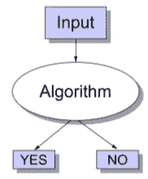
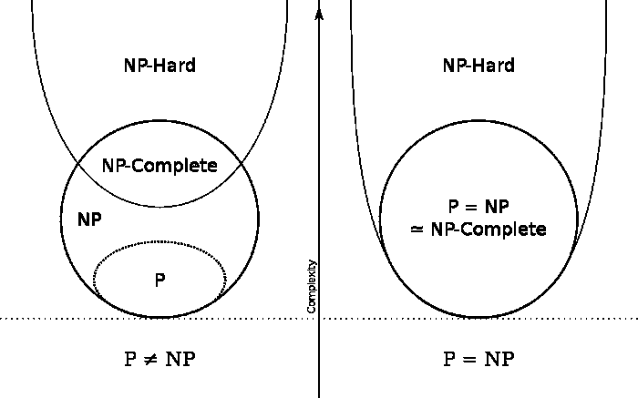
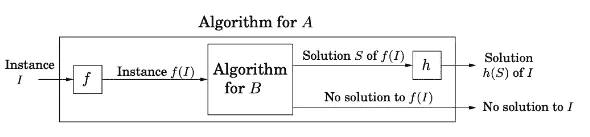

# 翻译成英语:P，NP，NP-完全，NP-困难和减少

> 原文：<https://medium.com/codex/translating-to-english-p-np-np-complete-np-hard-and-reductions-d307657d81b0?source=collection_archive---------8----------------------->

在计算机科学中，决策问题通常根据其困难程度和解决方式分为不同的类别。这些类别包括 P、NP、NP 完全和 NP 难。理解这些类别和用于对它们进行分类的工具，例如归约，对于开发算法和解决计算难题是很重要的。让我们开始吧！

# 判定问题

在讨论什么是 P，NP 等等之前。问题的类别，我们必须了解什么是**决策问题**。

一个决策问题。输入= (I，S)，算法= C，输出=是/否

决策问题是一个**问题**，对于这个问题，任何提出的**解**都可以被**快速检查**是否正确。

## 变量定义

“一个问题”=一个问题，我，比如排序，搜索我们开发算法解决的问题。

“建议的解决方案”=建议的解决方案 S 被提供给**检查算法**C，以及问题 I。

“检查算法”=如果建议的解决方案 S 是问题 I 的解决方案，检查算法输出 T/F 或是/否。

**一起:** C 输出 true 当且仅当 S 是实例 I 的解。

**运行时间“快”:**C 在实例(I，S)上的运行时间是多项式。

每一个圈都是一组属于自己类别的问题。这个图像还包括一个悬而未决的问题，是否所有“困难”的问题都可以在合理的时间内解决，或者只是有一些问题永远不能“容易地”解决。

# p，NP，NP-硬和 NP-全

## **P("多项式")问题**

是可以通过算法在多项式时间内解决的问题。换句话说，这个问题可以用 n^O(1 的运行时间(n 的常数)来解决。这些对计算机来说都是“容易”的问题。

*P 题示例:*

1.  *最长递增子序列*
2.  *二分匹配*
3.  *乘法运算*
4.  *等。*

## **NP("非确定性")问题**

在多项式时间内**不可解的问题**是指数问题吗？但是**可以在多项式时间内验证**！这些是更难的问题

*NP 问题的例子:*

1.  *旅行推销员问题*
2.  *最小生成树*
3.  *匹配*
4.  *等。*

## **NP-完全问题**

这是一个难题。NP 完全问题必须满足两个条件:

1.  一个问题 X 是在 NP 和
2.  NP 中的每一个问题都可以在多项式时间内化简为 X。

> 那到底是什么意思？！

这就是说 NP 完全问题是最难解决的

1.  *这个问题不可能在合理的多项式时间内解决。但是当给定一个建议的解决方案时，它可以在多项式时间内被验证。*
2.  *这个问题可以简化或者用来模拟另一个 NP 问题*

NP 完全问题有类似的可解性。条件 2 对于分类 NP 与 NP 完全是至关重要的。

## NP 难问题

问题 X 是 NP 难的，如果存在一个 NP 完全问题 Y，使得 Y 在多项式时间内可约化为 X。换句话说，如果有一个 NP-完全问题可以在多项式时间内化简，那么这个问题就被认为是 NP-难的。

关键区别= NP 难问题不一定是决策问题。然而，一个 NP 完全问题仅仅是决策问题。

示例:

停顿问题

# 减少

为了将决策问题 A 转化为决策问题 B(A B ),该技术使用多项式时间算法，f:

*   它将 A 的实例 I 转换为 b 的实例 f(I)。

与另一个多项式时间算法一起，h:

*   将 f(I)的任何解 S 映射回 I 的解 h(S)。

如果 f(I)无解，那么我也无解。

显示上面定义的关系的图表。我们在这里回答的问题是“如果问题 A 至少和问题 b 一样难。”

请说英语。

所以整个想法是，假设你有问题 A 和 B，它们都是 NP 完全的。

如果你有一个算法能比解决问题 A 更有效地解决问题 B，尽管它们是不同的问题(表面上)。

你可以**将**问题 A 化简为 B and B 的算法可以作为子例程来求解算法 A！

# 为什么以及何时使用归约？！

归约是计算机科学和数学中使用的一种技术，通过将问题转化为已经解决的类似问题来解决问题。这在许多情况下非常有用，例如:

1.  你有一个想解决的问题，但是你知道一个类似的问题已经被解决了。通过使用归约，你可以把新问题转换成旧的、已解决的问题的实例，然后用旧问题的解决方案来解决新问题。
2.  你想证明一个问题很难解决。如果你能证明问题可以归结为一个已知的难题，那么你就可以用这个归结来证明原来的问题也是很难解决的。
3.  你想证明一个问题在某个复杂类里。如果你能证明这个问题可以归结为一个已知在那个复杂度类中的问题，那么你就可以用这个归结来证明原来的问题也在那个复杂度类中。

总之，归约是一种强大的技术，可以用来解决问题或通过将问题转化为相似的、已经解决的问题来证明问题的复杂性。

# 结论

综上所述，P 问题是那些可以在多项式时间内求解的问题，NP 问题是那些在多项式时间内不可解但可以在多项式时间内验证的问题，NP-完全问题是最难求解的，可以用来模拟其他 NP 问题，NP-Hard 问题类似于 NP-完全问题但不一定是决策问题。归约是一种通过将问题转化为已经解决的类似问题来解决问题的方法。

请反馈。如有需要，请指正！

# 谢谢你，祝你学习愉快！

在 [Unsplash](https://unsplash.com/photos/5t9T6hQ2Cn0) 上由[索菲娅 M](https://unsplash.com/@sevethavi) ü [勒](https://unsplash.com/@sevethavi)拍摄的照片。