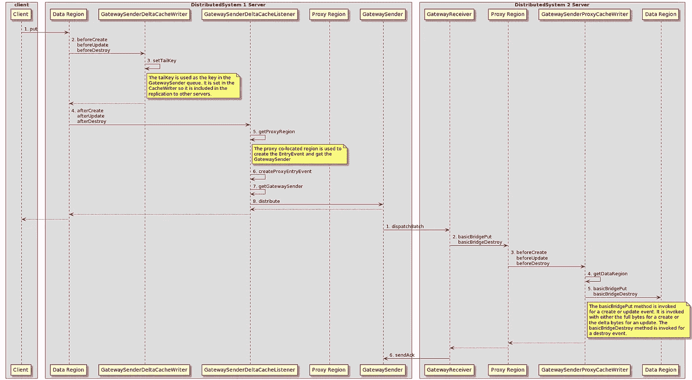

# 在不同的 Apache Geode 分布式系统之间传输增量

> 原文：<https://medium.com/codex/transmitting-deltas-between-different-apache-geode-distributed-systems-e46a3eae931?source=collection_archive---------13----------------------->

## [法典](http://medium.com/codex)

# 介绍

Apache Geode 提供了一个 [Delta](https://github.com/apache/geode/blob/develop/geode-core/src/main/java/org/apache/geode/Delta.java) 接口，当对一个对象进行更改时，该接口有助于序列化两个 JVM 之间的对象更改，而不是整个对象。对于大型对象，这提供了一种优化，它受以下各项支持:

*   客户端到服务器
*   同一分布式系统中的服务器对服务器
*   服务器到客户端

不支持将增量从一个[分布式系统](https://github.com/apache/geode/blob/develop/geode-core/src/main/java/org/apache/geode/distributed/DistributedSystem.java)中的服务器发送到另一个(例如两个 WAN 站点)中的服务器。目前，在分布式系统之间发送的每个事件都包含整个对象。通常，对象以字节数组的形式存储在区域中。对于增量来说，情况并非如此。相反，增量被表示为完全反序列化的对象。当接收到对增量的改变时，它被应用于内存中的对象。再加上不支持在分布式系统之间发送增量，这意味着每次在发送分布式系统中更新时，整个对象都被序列化，而在接收分布式系统中被反序列化。由于增量主要用于可以变得非常大的对象(如会话)，这可能是低效的。

本文描述了一种在分布式系统之间发送增量字节而不是发送整个对象字节的方法。

# 体系结构

对于此实现，每个事件在发送分布式系统中的客户端和接收分布式系统中的服务器之间的路径如下:

*   客户端对数据区域执行 put 操作
*   根据操作是创建还是更新，对象的完整字节或增量字节从客户端发送到服务器
*   服务器中数据区的 [CacheWriter](https://github.com/apache/geode/blob/develop/geode-core/src/main/java/org/apache/geode/cache/CacheWriter.java) 设置 [GatewaySender](https://github.com/apache/geode/blob/develop/geode-core/src/main/java/org/apache/geode/cache/wan/GatewaySender.java) 队列键
*   服务器中数据区域上的 [CacheListener](https://github.com/apache/geode/blob/develop/geode-core/src/main/java/org/apache/geode/cache/CacheListener.java) 在包含适当字节(增量或完整)的代理区域上创建一个 [EntryEvent](https://github.com/apache/geode/blob/develop/geode-core/src/main/java/org/apache/geode/cache/EntryEvent.java) ，并将该事件分发给连接到代理区域的 GatewaySender
*   连接到代理区域的 GatewaySender 将事件发送到接收分布式系统中的服务器
*   接收分布式系统上的服务器中的[网关接收器](https://github.com/apache/geode/blob/develop/geode-core/src/main/java/org/apache/geode/cache/wan/GatewayReceiver.java)接收该事件
*   代理区域中的 CacheWriter 将适当的字节(增量或完整)放入数据区域

注意:这些步骤中的 GatewaySender 和 GatewayReceiver 实际上包含几个不同的对象。

为简单起见，下图显示了此实现的体系结构，每个分布式系统中有一台服务器:

# 区域配置

上述体系结构的区域配置在 xml 中如下所示:

## 数据区域

## 代理区域

# 警告

这种实现有一些注意事项:

*   接收分布式系统必须拥有完整的对象才能应用增量字节，因此两个分布式系统必须从相同的状态开始(要么都为空，要么一个是另一个的副本)。
*   接收分布式系统代理区域存储每个键的最新字节。
*   无法为代理区域启用驱逐。如果它被启用并且条目被收回，则从发送分布式系统接收的销毁事件将被忽略。

# 履行

本文中描述的所有源代码以及示例用法都可以在[这里](https://github.com/boglesby/send-delta-between-wan-sites)找到。

该实现由以下三个 [CacheCallback](https://github.com/apache/geode/blob/develop/geode-core/src/main/java/org/apache/geode/cache/CacheCallback.java) 类组成:

*   附加到数据区的**GatewaySenderDeltaCacheWriter**
*   附加到数据区的**GatewaySenderDeltaCacheListener**
*   附加到代理区域的**gatewaysenderproxycache writer**

## GatewaySenderDeltaCacheWriter

**gatewaysenderdeltachewriter**处理方法:

*   初始化事件中的尾键
*   将尾键设置为事件的回调参数

尾键是 GatewaySender 队列中的键。在正常的 GatewaySender 启用区域中，尾键由主 BucketRegion 的 [handleWANEvent](https://github.com/apache/geode/blob/23c373e2e47d9ab9951fc2b2e19a94e29d756a15/geode-core/src/main/java/org/apache/geode/internal/cache/BucketRegion.java#L578) 方法初始化。然后，它被复制到冗余服务器。由于本例中的数据区域未启用 GatewaySender，因此不会发生这种情况。一旦尾键在事件中初始化，它就被设置到回调参数中。这样做是因为尾密钥仅在启用 GatewaySender 的区域中的服务器之间复制。在未启用 GatewaySender 的区域中，它会被忽略。

**gatewaysenderdeltachewriter**setTailKey 方法调用 BucketRegion 的 handleWANEvent 方法来设置尾键。

## GatewaySenderDeltaCacheListener

**GatewaySenderDeltaCacheListener**流程方法:

*   获取协同定位的代理区域
*   使用代理区域和输入 EntryEvent 创建 EntryEvent
*   检索代理区域的网关发送方
*   将入口事件分发到每个网关发送方

GatewaySenderDeltaCacheListenercreateProxyEntryEvent 方法在代理区域上创建 EntryEvent。

EntryEvent 包含:

*   [操作](https://github.com/apache/geode/blob/develop/geode-core/src/main/java/org/apache/geode/cache/Operation.java)(创建、更新、销毁)
*   代理区域
*   钥匙
*   创建(完整对象)或更新(增量)时的值字节
*   一个布尔回调参数，表示字节是增量还是满的
*   由**GatewaySenderDeltaCacheWriter**生成的尾密钥
*   发起[分发成员](https://github.com/apache/geode/blob/develop/geode-core/src/main/java/org/apache/geode/distributed/DistributedMember.java)
*   始发[事件 ID](https://github.com/apache/geode/blob/develop/geode-core/src/main/java/org/apache/geode/internal/cache/EventID.java)
*   发起方[ClientProxyMembershipID](https://github.com/apache/geode/blob/develop/geode-core/src/main/java/org/apache/geode/internal/cache/tier/sockets/ClientProxyMembershipID.java)
*   始发[版本标签](https://github.com/apache/geode/blob/develop/geode-core/src/main/java/org/apache/geode/internal/cache/versions/VersionTag.java)

**GatewaySenderDeltaCacheListener**deliverToGatewaySenderQueues 方法检索代理区域的 GatewaySenders 并将事件分发给每个代理区域。

## GatewaySenderProxyCacheWriter

**gatewaysenderproxycache writer**的处理方法:

*   获取协同定位的数据区域
*   根据 EntryEvent 的操作和布尔回调参数调用 local region[basicBridgePut](https://github.com/apache/geode/blob/23c373e2e47d9ab9951fc2b2e19a94e29d756a15/geode-core/src/main/java/org/apache/geode/internal/cache/LocalRegion.java#L5181)或 [basicBridgeDestroy](https://github.com/apache/geode/blob/23c373e2e47d9ab9951fc2b2e19a94e29d756a15/geode-core/src/main/java/org/apache/geode/internal/cache/LocalRegion.java#L5435) 方法。使用输入 EntryEvent 中的完整字节或增量字节调用 basicBridgePut 方法。

# 将来的

[gatewaysendereventempl](https://github.com/apache/geode/blob/develop/geode-core/src/main/java/org/apache/geode/internal/cache/wan/GatewaySenderEventImpl.java)表示在两个分布式系统之间发送的事件。需要修改它，以便能够在发送分布式系统中存储增量字节，并且应该修改 [GatewayReceiverCommand](https://github.com/apache/geode/blob/develop/geode-core/src/main/java/org/apache/geode/internal/cache/tier/sockets/command/GatewayReceiverCommand.java) ，以便能够在接收分布式系统中应用这些增量字节。

此外，发送分布式系统当前不知道接收分布式系统中对象的状态。这必须改变，以便在接收分布式系统没有完整对象的情况下，发送分布式系统知道何时必须发送完整字节而不是增量字节。

一种可能的方法是修改[AbstractGatewaySenderEventProcessor](https://github.com/apache/geode/blob/develop/geode-core/src/main/java/org/apache/geode/internal/cache/wan/AbstractGatewaySenderEventProcessor.java)。AbstractGatewaySenderEventProcessor 创建 GatewaySenderEventImpls，构建这些 mpls 的批处理，并使它们被发送到接收分布式系统。可以修改它来跟踪接收分布式系统中的哪些对象需要完整的对象字节而不是增量字节。这可以通过跟踪与接收分布式系统建立连接的时间以及最后一次为每个条目发送完整对象字节的时间来完成。如果进入时间在连接时间之前，则整个字节将被重新发送；否则将发送增量字节。从发送分布式系统的角度来看，如果无法与接收分布式系统中的任何服务器建立连接，那么该系统就会关闭。当它重新启动时(当发送分布式系统可以连接到它时)，它可能是一个全新的分布式系统。发送的分布式系统对此一无所知，因此必须发送完整的字节。

另一个潜在的方法是修改 [GatewayAck](https://github.com/apache/geode/blob/0abd7667b324da3a88fa341675b68f08118c83cb/geode-wan/src/main/java/org/apache/geode/internal/cache/wan/GatewaySenderEventRemoteDispatcher.java#L581) 和[gatewaysendereventremotedatcher](https://github.com/apache/geode/blob/develop/geode-wan/src/main/java/org/apache/geode/internal/cache/wan/GatewaySenderEventRemoteDispatcher.java)。GatewayAck 是接收分布式系统为每批 GatewaySenderEventImpls 返回的确认。gateway sendereventremotedatcher 处理网关确认。GatewayAck 当前包含在接收分布式系统上处理批处理时发生的异常的集合以及其他字段。可以修改集合，使其包含远程分布式系统中不存在的每个条目的 InvalidDeltaException。对于每一个，可以修改发送分布式系统中的 gatewaysendereventmorthedispatcher，以创建一个具有完整字节的 GatewaySenderEventImpl 并对其进行排队。