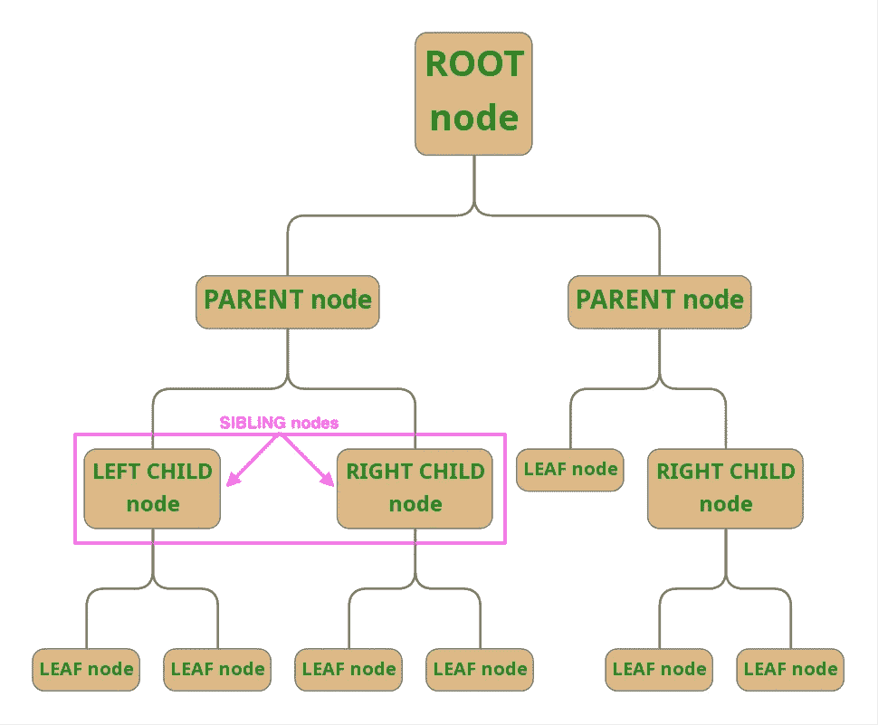

# 遍历数据森林

> 原文：<https://medium.com/codex/traversing-a-forest-of-data-92ed41572e10?source=collection_archive---------2----------------------->

## [法典](http://medium.com/codex)


[迈克尔·本茨](https://unsplash.com/@michaelbenz?utm_source=medium&utm_medium=referral)在 [Unsplash](https://unsplash.com?utm_source=medium&utm_medium=referral) 上拍照

# Javascript 中关于二分搜索法树的所有内容

# 结构的整体性

编程和数据存储是相辅相成的。关于哪种数据结构被认为是最好的，有许多不同的学派。在这种情况下,“最佳”通常与结构的时间复杂度有关，或者解释程序在存储器中处理或定位单个数据块需要多长时间。由于计算机只能在规定的时间内运行有限的动作，所以效率是编写代码时的“游戏名称”。效率可以以多种形式出现，但是就数据结构而言，当考虑对其中的数据进行操作的时间复杂性时，有三个主要关注点。这些包括数据的遍历、数据片段的删除和新数据片段的插入，所有这些都发生在结构中。

# 二叉查找树

一种广泛使用的数据结构类型是二叉查找树，从现在起将被称为 BST。从它们的名字可以很快推断出 BST 是树状结构，这意味着它们是非线性的。换句话说，树状结构有相互分支的节点或实例。BST 中节点之间的关联称为父/子关系。此外，当父节点有两个子节点时，子节点的结合可以被称为兄弟关系。这两个孩子通常被称为左孩子和右孩子。正如大多数人类家庭的情况一样，孩子们受到的待遇也大相径庭。这将在下面的章节中进一步探讨。


图片 src:[https://en.wikipedia.org/wiki/Binary_search_tree](https://en.wikipedia.org/wiki/Binary_search_tree)

## 关键原则

BST 有几个关键原则，它们既定义了应该使用 BST 的情况，又将 BST 与其他数据存储技术区分开来。排名不分先后:

1.  每个数据段必须与所有其他数据段不同，这意味着它只能存在一次。
2.  每个节点可以有 0、1 或 2 个子节点。
3.  除了 BST 中的最后几个节点(也称为叶节点)，每个节点都有两个子节点。
4.  第一个节点或根节点是比较值和决定下一步采取什么措施时使用的第一个值。
5.  左侧子节点的值将始终小于其父节点的值，而右侧子节点的值将始终大于其父节点的值。



显示 BST 节点的父/子/兄弟关系的图表

***在 BST 中搜索、添加或删除时，使用二分搜索法。这意味着解释器将把一个值与根节点进行比较；如果它比根的值大，焦点将转移到右边的子节点，如果它比根的值小，则关注左边的子节点。这一直持续到解释器的目标完成，或者到达叶节点。本质上，这意味着每次比较后必须处理的数据量减半，这有利于数据结构的时间复杂度。***

## 主要方法

BST 或任何数据存储方法都是可以利用的工具。为了让它们在实际应用中真正有用，它们必须完成三个主要操作:遍历、插入和删除存储在其中的数据。BSTs 通常有一个动作方法(***【depthFirstLog(callback)***)，该方法接受回调函数并通过它传递每条数据。它们通常还有一个 contains 方法(***【contains(value)】***)和一个 insert 方法(***【insert(value)】***)，每个方法都接受一个值作为唯一的参数。删除方法有时包括在内。在实现 BST 时，还会使用节点构造函数来创建新的 BST 实例。它与创建最终产品 BST 的方法配合使用。BST 创建函数的实现如下所示:

```
const BinarySearchTree = (value) => {var BST = Object.create(BinarySearchTree.prototype);BST.value = value;
  BST.right = null;
  BST.left = null;return BST;};
```

正如您所看到的，右边和左边的节点都用 null 值初始化。Null 将总是被传递到叶节点，因此当访问 BST 中的值时，null 将是基本情况，这意味着递归将在到达值为 null 的节点时停止。

接下来，可以将方法添加到构造函数的原型中:

```
// Insert //
BinarySearchTree.prototype.insert = (value) => {
};// Contains //
BinarySearchTree.prototype.contains = (value) => {
};// Depth First Log //
BinarySearchTree.prototype.depthFirstLog = (callback) => {
};
```

## 插入

insert 方法将接受一个值，该值将被添加到现有的 BST 中。首先，它将检查树是否为空。如果是，它将创建一个新的树，将传入的值放在根节点中。但是，如果树不为空，该方法会将传递给它的值与根的值进行比较。如果它大于根的值，它将会看向根的右子节点。如果它小于根的值，它将向根的左子节点看。这将继续下去，直到右边或左边的孩子不再存在，此时新值将被添加到树中。

时间复杂度—线性(O(n))；平均情况:O(log n)

## 包含

contains 方法将以与 insert 方法相同的方式遍历 BST。它将与 root 进行比较，并相应地向左或向右移动。这两种方法的主要区别在于，insert 操作 BST 并且不返回任何内容，而 contains 只是查看 BST 并返回一个布尔值，这取决于它是否能够在 BST 中找到传入的值。

时间复杂度—线性(O(n))；平均情况:O(log n)

## 深度第一测井

depthFirstLog 方法的行为必须不同于 contains 和 insert。这是由其性质决定的；因为必须对 BST 中的所有值采取行动，所以解释器不能简单地执行二分搜索法。相反，它必须沿着每个分支向下，将值传递给回调函数，然后沿着分支向上移动，再沿着它的兄弟节点向下移动。这将一直持续到树的最末端。为了向下移动，然后返回一个分支，递归应该用于该方法的实现。

时间复杂度—线性(O(n))；平均情况:O(log n)

二分搜索法树是非常有用的数据存储结构形式。当访问存储在其中的数据时，它们可以保持合理的时间复杂度。如果处理大量的数据，必须相对快速地调用和/或遍历这些数据，它们尤其适用。大多数程序员都会从掌握二分搜索法树艺术中受益匪浅。

```
***References:***[1]: Pawar, Prakash. “How Binary Search Trees Work in JavaScript - JavaScript in Plain English.” *Medium*, Javascript in Plain English, 7 Feb. 2019, js.plainenglish.io/binary-search-tree-in-javascript-ca5aa7ba05de.***Further Reading:***- Hall, Joshua. “Binary Search Trees Through JavaScript.” *DigitalOcean*, 23 Jan. 2021, www.digitalocean.com/community/tutorials/js-binary-search-trees.- Han, Tim. “JavaScript: What Is a Binary Search Tree? - JavaScript in Plain English.” *Medium*, Javascript in Plain English, 11 Apr. 2019, js.plainenglish.io/javascript-what-is-a-binary-search-tree-a602155abae4.- Jay. “Detailed Binary Search Tree Guide in JavaScript.” *The Coding Delight*, 27 Mar. 2019, [www.thecodingdelight.com/binary-search-tree-implementation-javascript.](http://www.thecodingdelight.com/binary-search-tree-implementation-javascript.)- Mejia, Adrian. “Tree Data Structures in JavaScript for Beginners.” *Adrian Mejia Blog*, 23 May 2019, adrianmejia.com/data-structures-for-beginners-trees-binary-search-tree-tutorial.- Mitrakos, Michael. “Implement a Binary Search Tree in JavaScript - InitJS.” *Medium*, 23 Feb. 2020, initjs.org/implement-a-binary-search-tree-in-javascript-952a44ee7c26.- Pawar, Prakash. “How Binary Search Trees Work in JavaScript - JavaScript in Plain English.” *Medium*, Javascript in Plain English, 7 Feb. 2019, js.plainenglish.io/binary-search-tree-in-javascript-ca5aa7ba05de.- Zakas, Nicholas. “Computer Science in JavaScript: Binary Search Tree, Part 1.” *Human Who Codes*, 9 June 2009, humanwhocodes.com/blog/2009/06/09/computer-science-in-javascript-binary-search-tree-part-1.
```