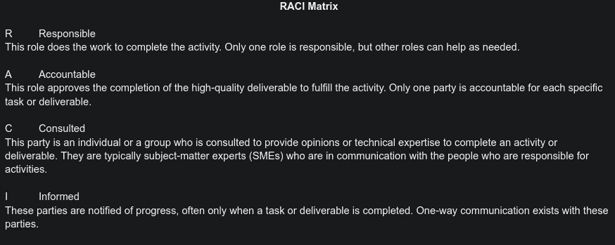
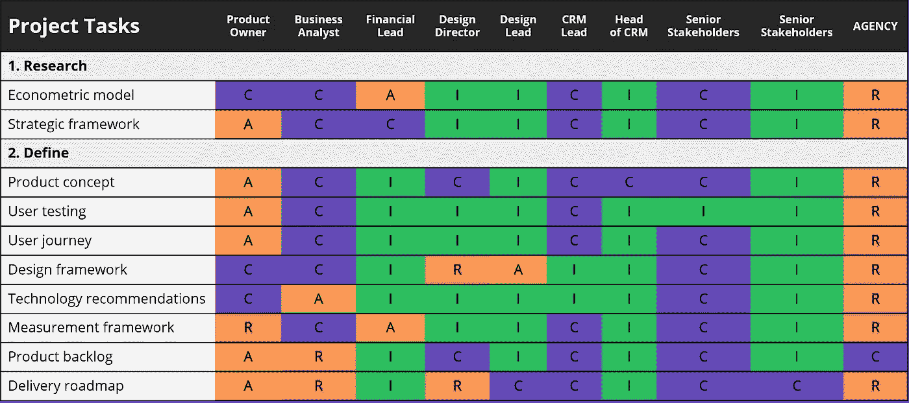
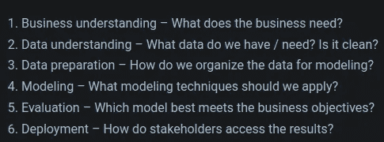
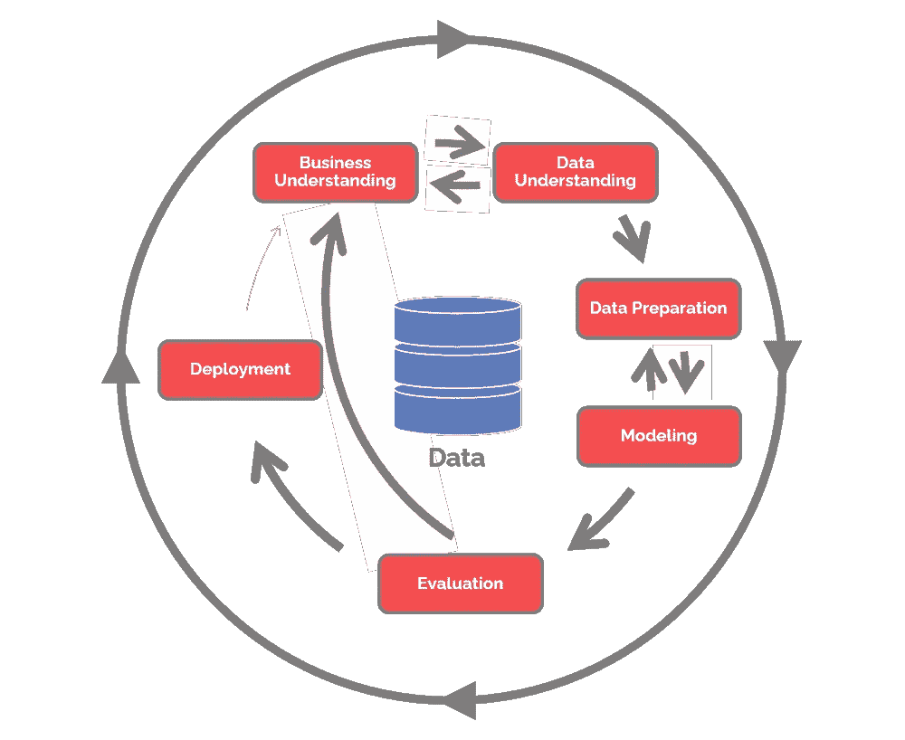

# 从我的持续集成和项目管理的麻烦中学习

> 原文：<https://medium.com/codex/troubles-with-continuous-integration-e8c49ebcb097?source=collection_archive---------18----------------------->

“狄俄尼索斯创造机会，阿波罗得到结果。”—我、我自己和我(亚历克)

你可能会问，为什么要读这篇文章？嗯，我认为任何从事软件工作的人都必须与一个不仅仅由“我自己和我”组成的团队一起工作。所以从这篇日记/指导性文章中，你会从我的错误和痛苦中吸取教训。

我们是一个四人团队，旨在创建一个自动音乐流派识别系统(又名经理)。我们决定采用敏捷并使用 Azure DevOps 服务来促进这一点。这伴随着 Azure boards 和所有其他小发明，比如 Azure Repos、Azure pipelines 等等。

## Azure 很快失宠了…

Azure DevOps 对初学者来说一点都不友好，更不用说一个全是初学者的团队了。这在学术界也不普遍，所以你最终不得不说服人们学习一些与项目不一定相关的新东西。我希望它有不同的层次来区分多少功能是可见的，或者需要多少功能来使 Azure boards 顺利工作，就像《傻瓜的敏捷》。它也不容易从 Github 访问，因为现在你可以同步它！我们一次都没用过！最后，真正奇怪的是，很难通过互联网访问你的项目。我必须将我的项目页面加入书签，这样我才不会在地牢里拿着蜡烛去找我的项目。明白我的意思吗？

## 不和谐与曲折的救援

不和谐很快填补了空白，并一直保持我们的船紧，在我们的时间线轨道上。然而，这仅仅是因为我们还签署了一份半官方的合同，内容是我们将如何相互沟通以及我们的角色是什么。我们分享了所有的联系方式，并建立了非常谨慎和清晰的沟通渠道。每个频道都被指定用于共享数据或教程等。我们甚至创建了一个系统，来指导我们如何处理由小到大的危机。这是你在着手一个项目时必须牢记的。危机是不可避免的，这是一个保证。考虑一个新的视角，人类的黑暗邪恶，如权力、贪婪、性和报复，在任何 1 到 1，000 人的组织中对他们的表现和结果起着更大的作用。贪婪、性和复仇可能不会如此迅速和明显地显现，所以我们将着眼于权力。

## 和谐的力量之舞

我们倾向于作为一个团队来处理项目决策(由于民主的灌输)，然而在内心深处我们很快就能注意到谁最能动摇团队决策。决策者可以通过各种方式掌权:通过关系网、功绩或优势。在团队形成时，可能存在先前的联系，他/她可能在该领域表现出卓越的知识和娴熟的技能，或者他/她能够在一开始就更容易地对他人施加影响。这些都是值得关注的事情，这样你才能更好地导航或领导！

尽管如此，还有其他的角色一次又一次地出现在团队中。有些人是批评家、外交家、旁观者、追随者、挑战者等等。这些角色中的一些更容易被填补，而另一些则不容易，但在某种程度上总是被过度填补。

当关系友好且没有不可避免的冲突/紧张时，清楚地定义您在新团队中可能的角色并建立制衡是至关重要的。

我承认，在与人交往时，我在推行一种更愤世嫉俗的方法。然而，这就是一些人所说的作为团队成员的意义。你必须努力和谐和鼓舞人心，但你必须知道什么和如何处理“下面”你的目标是以这样一种方式定位自己，你可以操纵团队找到它的和谐中心。一旦找到这种平静，你的团队就会开始取得非凡的成绩，同时富有成效地团结起来。

这里有一些工具极大地帮助了我们的团队！

所以这里使用 [**RACI 矩阵**](https://docs.google.com/document/d/1tavoBI9iBmHBGZUjr-AoegMcYz49k53W89G_4WfWEBM/edit?usp=sharing) 来指定角色就是一个模板。我把 RACI 矩阵链接到了谷歌文档。

RACI 矩阵定义

RACI 矩阵示例

紧急研究你的项目的生命周期将如何演变(在我们的案例中，我们的 ML 项目遵循 [CRISP-DM](https://www.datascience-pm.com/crisp-dm-2/) )这将极大地帮助你猜测你的时间线和冲刺。

CRISP-DM 阶段定义

CRISP-DM 生命周期可视化表示

# 结论

我知道这不像我的其他非常技术性和干燥的文章，但这些软技能，我相信太经常被忽视。团队的健康决定了你的项目是成功还是失败，这取决于团队成员的技术能力。我希望你从这件事中吸取了一些东西。此外，我认为这篇文章应该在下面发起一个公开论坛，讨论如何让团队工作这一不断发展的问题！

你是如何组建团队的？

> 缓慢而坚定地编码，保持懒惰——懒惰