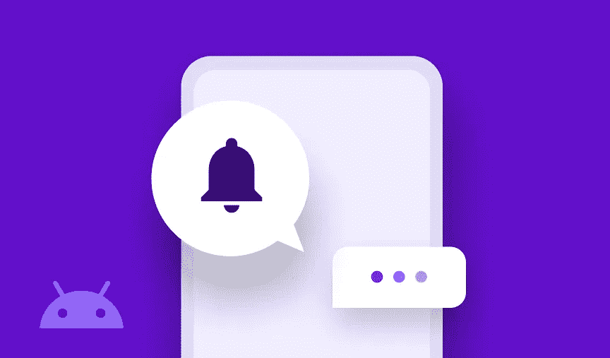

# Sendbird 中 Android 聊天推送通知的故障排除

> 原文：<https://medium.com/codex/troubleshooting-android-chat-push-notifications-in-sendbird-ca60021205ce?source=collection_archive---------29----------------------->

仙鸟 2022

## 推送通知的基本检查、最佳实践、测试和故障排除指南

解决方案工程师| [Sendbird](https://www.sendbird.com/)

*我们建议您查看* [*示例应用*](https://github.com/sendbird/sendbird-uikit-android) *获取您可能需要的代码。如需更多指导，请访问我们的* [*文档*](https://sendbird.com/docs/chat/v3/android/guides/push-notifications#1-push-notifications) *。不要忘记查看应用内聊天的* [*演示*](https://sendbird.com/demos/in-app-chat) *，并访问我们的* [*网站*](https://sendbird.com/features/chat-messaging) *了解更多关于 Sendbird Chat 可以提供的服务。*

> *为了第一个了解新教程、开发者相关聊天/电话发布以及其他重要更新，* [*注册*](https://get.sendbird.com/dev-newsletter-subscription.html) *获取我们的开发者简讯。*

# 介绍

推送通知是重要的提示，可以传递重要的信息，同时作为一种温和的提醒，提醒用户关注应用程序中的内容。然而，解决推送通知问题并不总是容易的。为了简化推送通知的调试和故障排除任务，我们创建了一个新的 [**测试工具**](https://sendbird.com/developer/tutorials/mobile-push-notifications-tester) 。本指南是对我们的测试工具的补充。在本指南中，我们将帮助您了解推送通知如何与 Sendbird 配合使用，并且我们还将提供故障排除方面的其他指导。请注意，本指南仅审查 Android SDK 的推送通知，是对 Android [**文档**](https://sendbird.com/docs/chat/v3/android/guides/push-notifications) 的补充。

在讨论设备令牌的最佳实践之前，我们将从一些初步检查开始。然后我们将讨论一些常见场景的故障排除。我们还将讨论一些基本的测试来诊断特定的原因，并找到解决问题的方法。

都准备好了吗？我们开始吧。👨‍💻

# 基本检查

请与您的开发团队核实以下内容:

1.  您已经在 Sendbird 仪表盘上为 Firebase 云消息(FCM)或华为移动服务(HMS)启用了推送通知。请参考我们的 [**教程**](https://sendbird.com/developer/tutorials/implement-android-push-notifications) 了解如何实现 Android 应用的推送通知。
2.  你的应用已为你的用户注册了推送令牌。**大多数应用开发者面临的首要问题是用户的推送令牌没有正确注册或不再有效。**要在 Sendbird 仪表板上查看用户的推送令牌，请转到“仪表板”>“用户”部分，选择您的用户，然后在“聊天”部分查找“推送令牌”。
3.  您正在 [**群组频道**](https://sendbird.com/docs/chat/v3/platform-api/guides/group-channel#1-group-channel) 中测试推送通知(开放频道不支持推送通知)。
4.  当应用程序进入后台时，您的应用程序不会断开()用户并注销设备令牌。当用户注销设备并且不再需要接收通知时，主要建议使用 disconnect()并取消注册令牌。
5.  您的设备在后台运行或关闭应用程序，以通过 Sendbird 接收来自 FCM 的远程通知。在这种情况下，请注意应用仪表板上的推送通知设置:
    **a)** 使用**“只要一台设备离线就发送”**设置，Sendbird 服务器会尝试向任何设备发送通知。尽管如此，只有后台设备可以接收远程通知，因为 Chat SDK 会检测用户何时断开连接和离线。
    **b)** 通过**“所有设备离线时发送”**设置，连接用户运行应用程序的每台设备必须在后台运行或关闭。
6.  您正在使用最新版本的 Sendbird Android SDK 进行测试。

如果您确认了上述所有情况，并且问题仍然存在，请联系您的 Sendbird [**仪表板**](https://dashboard.sendbird.com/) 上的 Sendbird 支持人员(仪表板>您的组织名称(在右上角)>联系我们)。在您对问题的描述中，请分享**应用 id、Android Chat SDK 版本号、该用户的用户 id 和设备令牌、channel_url 以及上次推送通知** **测试**的时间戳，以便我们进一步调查。问题的截图、gif 或视频也有助于调查。

# 设备令牌的最佳实践

Sendbird 遵循此 [**FCM 指南**](https://firebase.google.com/docs/cloud-messaging/android/client#retrieve-the-current-registration-token) :“因为令牌在初始启动后可能会被轮换，所以强烈建议您检索最新更新的注册令牌。”我们建议每次用户连接到 Sendbird 时，向 Sendbird 注册用户的推送令牌。

下面的列表指定了何时可以在设备上更新令牌:

1.  应用程序删除实例 ID。
2.  该应用程序会在新设备上恢复。
3.  用户卸载/重新安装应用程序。
4.  用户清除应用程序数据。

# 按案例排除故障

1.  **用户不离线:**当你的用户不在线且应用不在任何设备的前台时，测试推送通知是最容易的。在 Sendbird 仪表板的“用户”部分检查该用户的脱机状态。
2.  **设备令牌发布:**确保用户注册了设备令牌。要在 Sendbird 仪表板上检查用户的推送令牌，请转到您的应用程序下的用户部分。选择您的用户，并在聊天部分寻找推送令牌。如果用户有多个设备令牌(这里通过平台 API 看到的 [**)，请尝试通过调用平台 API**](https://sendbird.com/docs/chat/v3/platform-api/user/managing-device-tokens/list-registration-or-device-tokens#1-list-registration-or-device-tokens)**[**注销用户当前所有的设备令牌**](https://sendbird.com/docs/chat/v3/platform-api/guides/user#2-remove-a-registration-or-device-token) 。 [**通过调用平台 API 或者重新运行 app 来添加新的令牌**](https://sendbird.com/docs/chat/v3/platform-api/guides/user#2-add-a-registration-or-device-token) 。这将通过 SDK 注册用户的设备令牌。检查 Sendbird 仪表板以获取用户的最新令牌。**
3.  **特定用户无法接收推送通知:**检查测试用户没有禁用推送通知。我们的平台 API 让你很容易: **a)** 通过平台 API 查看 [**用户的推送偏好**](https://sendbird.com/docs/chat/v3/platform-api/guides/user#2-view-push-preferences) 。
    **b)** 当您通过我们的平台 API 获取用户组频道列表时，检查您的测试频道的[**is _ push _ enabled**](https://sendbird.com/docs/chat/v3/platform-api/guides/user#2-list-my-group-channels-3-response)channel 属性。如果 is_push_enabled 为“假”，则 [**更新特定频道**](https://sendbird.com/docs/chat/v3/platform-api/guides/user#2-update-push-preferences) 的用户推送偏好，以查看应该接收推送通知的测试频道是群组频道，并且没有为此用户禁用推送通知。
4.  **用户有时会收到推送:**检查本地或远程通知支持。如果您的应用程序在前台时在本地显式生成通知，则这些本地通知不会作为 Sendbird 发送的推送通知由 FCM/HMS 触发。您的应用程序可能正在侦听应用程序中的 message received 事件处理程序，并触发一个看起来像推送通知的本地通知。
    **a)** FCM:检查来自 Sendbird 的 [**FCM 通知负载**](https://sendbird.com/docs/chat/v3/android/guides/push-notifications#2-push-notifications-for-fcm-3-step-5-handle-an-fcm-message-payload) 是否由您自己的 MyFirebaseMessagingService.java 类中的 onMessageReceived(remote message remote message)方法处理。该类之外的 onMessageReceived 方法是一个事件处理程序，当用户联机时收到消息时将触发该事件处理程序，并且可能仅触发本地通知。
5.  **用户可以在一台设备上接收通知，但不能在另一台设备上接收(多设备支持):**一台设备可以接收用户的推送通知，而另一台设备则不能。确保您在 Sendbird 仪表盘>设置>通知中选择了“只要一台设备离线就发送”设置。**需要额外的代码**来支持来自 [**Firebase 云消息(FCM)**](https://sendbird.com/docs/chat/v3/android/guides/push-notifications-multi-device-support#2-push-notifications-for-fcm) 和来自 [**华为移动服务(HMS)**](https://sendbird.com/docs/chat/v3/android/guides/push-notifications-multi-device-support#2-push-notifications-for-hms) 的多个设备上的推送通知。

# 测试

调试时，在 MyFirebaseMessagingService 类的 onMessageReceived 方法中添加调试日志消息会有所帮助。这将帮助您识别设备上是否收到了远程通知，但未成功显示。

## 测试以确定您的 Sendbird 应用程序是否可以接收来自 Sendbird 服务器的通知

1.  下载 Sendbird 的 [**安卓样本 app**](https://github.com/sendbird/SendBird-Android) ，将应用 id 改为你的 Sendbird app ID。
2.  将包名称更改为与上传到 Sendbird 仪表板的证书相匹配的应用包名称。

> 注意:如果您使用的是过时的 Google Cloud Messaging (GCM)项目，我们建议将该项目迁移到 Firebase Cloud Message (FCM)项目，以发送推送通知或从 GCM 项目获取设备令牌并将该令牌注册到 Sendbird。更多信息和步骤可以在 [**这里找到**](/1mgofficial/migrating-from-gcm-to-fcm-with-different-sender-ids-for-the-same-application-4fc36d97568e) 。

3.以用户身份登录(用户 A)。

4.退出应用程序。确保应用程序不在后台，并且用户 A 处于离线状态。

5.在另一台设备上，从另一个用户(用户 B)向用户(用户 A)发送消息。第一个用户(用户 A)收到通知了吗？如果是，那么 Sendbird 服务器可以向您的应用程序发送推送通知。在应用程序中，检查应用程序是否为用户注册了设备令牌，以及应用程序是否在自己的 MyFirebaseMessagingService.java 类中实现了 onmessage received(remote message remote message)方法。

# 生产应用程序用户的开发测试

可以针对生产应用用户测试开发中的推送通知。

1.  从生产应用程序用户“Bob”开始，确保“Bob”离线。
2.  在当前生产应用下，设备令牌 A 与“Bob”的生产证书相关联。
3.  接下来，将您的 FCM 或 HMS 开发证书上传到 Sendbird 仪表板。
4.  在您自己的测试设备上运行 Android Studio 中的应用程序，使用开发证书进行测试。以用户“Bob”的身份连接，并确保您的应用程序为开发凭证注册了一个新的设备令牌 B。
5.  Sendbird 尝试向设备令牌 B 发送生产凭证和开发凭证的推送通知。只有开发凭证成功，现在设备令牌 B 与开发凭证相关联。
6.  用户“Bob”将仍然具有与生产凭证相关联的设备令牌 A，除非该令牌被取消注册或者为 Bob 的设备注册了新令牌。

# 其他注释

*   语言翻译:当您的应用程序启用了消息翻译时，可以通过平台 API 指定用户的 preferred_languages 或通过 SDK 添加这些语言，将推送通知翻译成其他语言。

# 结论

推送通知的故障排除可能很复杂；这就是为什么，除了我们的 [**测试工具**](https://sendbird.com/developer/tutorials/mobile-push-notifications-tester) ，你可能会发现这一页的指导是有用的。在本指南、测试工具和 [**FCM**](https://sendbird.com/docs/chat/v3/android/guides/push-notifications#2-push-notifications-for-fcm) 和 [**HMS**](https://sendbird.com/docs/chat/v3/android/guides/push-notifications#2-push-notifications-for-hms) 的文档之间，您将很快构建和测试推送通知！

如需更多指导，请随时联系我们**。**

**快乐推送通知测试！💻**