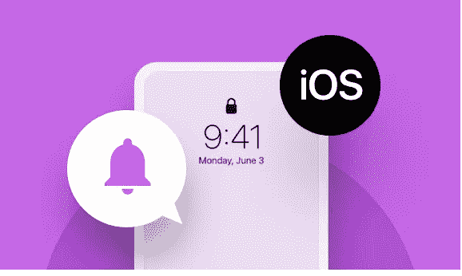
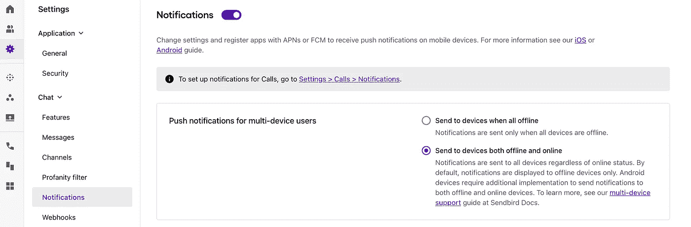
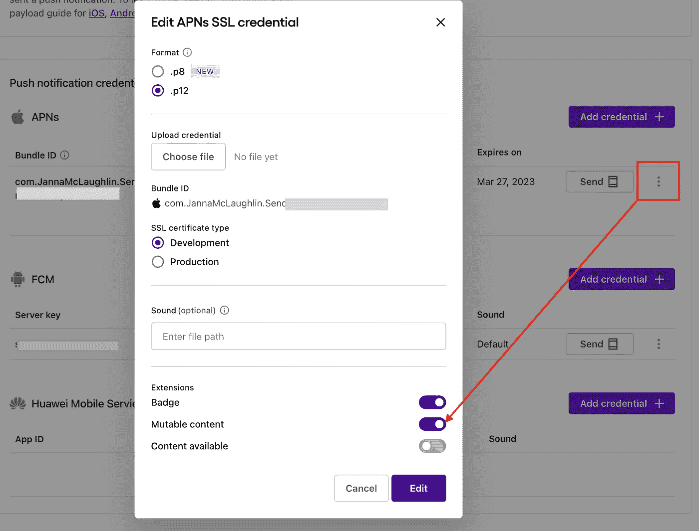

# iOS 聊天推送通知故障排除

> 原文：<https://medium.com/codex/troubleshooting-ios-chat-push-notifications-f8c4e4a1d610?source=collection_archive---------17----------------------->



仙鸟 2022

## 初步检查、最佳实践、测试和修复常见推送通知问题的指南

由迦娜·麦克劳克林
解决方案工程师| [Sendbird](https://www.sendbird.com/)

*我们建议您查看* [*样本 app*](https://github.com/sendbird/sendbird-uikit-ios) *获取您可能需要的代码。如果您需要更多指导，请访问我们的* [*文档*](https://sendbird.com/docs/chat/v3/ios/guides/push-notifications) *。不要忘记查看应用内聊天的* [*演示*](https://sendbird.com/demos/in-app-chat) *，并访问我们的* [*网站*](https://sendbird.com/features/chat-messaging) *了解更多关于 Sendbird Chat 可以提供的服务。*

> *为了第一个了解新教程、开发者相关聊天/电话发布以及其他重要更新，* [*注册*](https://get.sendbird.com/dev-newsletter-subscription.html) *获取我们的开发者简讯。*

# 介绍

推送通知对于向用户发送重要消息并鼓励他们返回你的移动应用程序至关重要。本指南将解释推送通知如何与 Sendbird Chat 配合使用，以及出现问题时如何进行故障排除。作为其中的一部分，我们将介绍一些基本的测试来诊断问题并提出解决方案。本指南适用于 iOS SDK，不包括 iOS 对 JavaScript SDK 的支持。

为了简化推送通知测试和调试，请查看我们的推送通知测试工具 [**教程。**](https://sendbird.com/developer/tutorials/mobile-push-notifications-tester)

让我们从一些初步检查开始。✅

# 初步检查

请核实:

1.  您已经在 Sendbird dashboard 上为 APNs (Apple 推送通知服务)启用了推送通知。确保:

*   您的. p12 证书尚未过期。
*   您的. p12 证书已正确映射到您的开发应用程序或生产应用程序。上传证书时，您必须指定“开发”或“生产”作为证书类型。
*   生产证书应该是“Apple 推送通知服务 SSL(沙盒&生产)”证书。
*   开发证书可以是“苹果推送通知服务 SSL(沙盒)”或“苹果推送通知服务 SSL(沙盒和产品)”证书。
*   **请注意**:你需要一个‘生产’证书来测试 TestFlight 应用上的推送通知(这些可能包括发布到 TestFlight 的开发应用)。

2.你的应用已为你的用户注册了推送令牌。
**大多数应用开发者面临的首要问题是用户的推送令牌没有正确注册或不再有效。**要在 Sendbird 仪表板上查看用户的推送令牌，请转到“仪表板”>“用户”部分，选择您的用户，然后在“聊天”部分查找“推送令牌”。

3.您是在物理设备上测试，而不是在 Xcode 模拟器上测试。

4.您正在群组频道中测试推送通知(开放频道不支持推送通知)。

5.当应用程序进入后台时，您的应用程序不会`disconnect()`用户并注销设备令牌。使用`disconnect()`并取消注册令牌主要是推荐在用户从设备注销并且不再需要接收通知时使用。

6.您的设备在后台运行或关闭该应用程序，以便通过 Sendbird 接收来自 APNs 的远程通知。在这种情况下，请注意应用仪表板上的推送通知设置:

*   通过**“只要一台设备离线就发送”**设置，后台的任何设备都可以接收远程通知。
*   通过**“所有设备离线时发送”**设置，连接用户的每台运行应用程序的设备必须在后台运行或关闭。

7.您正在使用最新版本的 Sendbird iOS SDK 进行测试。

*   具体到 iOS 13 支持，构建应用需要 Sendbird iOS SDK v3.0.150 或更高版本。原因是与 iOS 13 同时发布的 Xcode 11 改变了应用程序和库获取设备推送令牌的常见方式。iOS 13 用户将无法在低于 v3.0.150 的 SDK 版本上从您的应用程序订阅通知。

如果您/您的开发团队确认了上述所有情况，并且任何问题仍然存在，请立即联系您的 Sendbird 应用仪表板上的 Sendbird 支持人员(仪表板>您的组织名称(在右上角) >联系我们)。在您对问题的描述中，请分享**应用 ID** 、 **iOS Chat SDK 版本号、该用户的用户 ID 和设备令牌**、 **channel_url** 以及上次执行推送通知测试的**时间戳**，以便我们进一步调查。问题的截图、gif 或视频也有助于调查。

# 设备令牌的最佳实践

Sendbird 遵循苹果的 [**指南**](https://developer.apple.com/documentation/usernotifications/registering_your_app_with_apns) 来“注册你的应用，并在每次你的应用启动时接收你的设备令牌”。因此，我们建议在用户每次连接到 Sendbird 时，向 Sendbird 注册用户的设备令牌。

下面的列表指定了 APN 何时可以在设备上更新令牌:

1.  该应用程序会在新设备上恢复
2.  用户卸载/重新安装应用程序
3.  用户清除应用程序数据。

现在我们来谈谈如何解决常见问题。

# 按案例排除故障

1.  **用户未离线**
    当你的用户离线且应用不在任何设备的前台时，测试推送通知是最容易的。在 Sendbird 仪表板的“用户”部分检查该用户的脱机状态。
2.  **设备令牌发放**
    确保用户注册了设备令牌。要在 Sendbird 仪表板上检查用户的推送令牌，请转到您的应用程序下的用户部分。选择您的用户，并在聊天部分寻找推送令牌。如果用户有多个设备令牌( [**，如平台 API 此处**](https://sendbird.com/docs/chat/v3/platform-api/guides/user#2-list-registration-or-device-tokens) 所示)，请尝试通过调用平台 API[**注销用户当前的所有设备令牌**](https://sendbird.com/docs/chat/v3/platform-api/guides/user#2-remove-a-registration-or-device-token) 。 [**通过调用平台 API 或再次运行 app 添加新令牌**](https://sendbird.com/docs/chat/v3/platform-api/guides/user#2-add-a-registration-or-device-token) 。这将通过 SDK 注册用户的设备令牌。检查 Sendbird 仪表板以获取用户的最新令牌。
3.  **特定用户无法接收推送通知**
    检查测试用户没有禁用推送通知。我们的平台 API 让您可以轻松:

*   通过平台 API 查看 [**用户的推送偏好**](https://sendbird.com/docs/chat/v3/platform-api/guides/user#2-view-push-preferences) 。
*   当您通过我们的平台 API 获取用户组频道列表时，请检查您的测试频道的 [**is_push_enabled**](https://sendbird.com/docs/chat/v3/platform-api/guides/user#2-list-my-group-channels-3-response) 频道属性。如果 is_push_enabled 为“假”， [**更新特定频道的用户推送偏好**](https://sendbird.com/docs/chat/v3/platform-api/guides/user#2-update-push-preferences) 以查看应该接收推送通知的测试频道是群组频道，并且没有为此用户禁用推送通知。

4.**用户有时会收到本地或远程通知支持的推送**
检查。如果您的应用程序在前台时明确地在本地生成通知，则这些本地通知不会作为 Sendbird 发送的推送通知由 APNs 触发。您的应用程序可能正在侦听应用程序中的 message received 事件委托，并触发看起来像推送通知的本地通知。检查来自 Sendbird 的 [**通知负载**](https://sendbird.com/docs/chat/v3/ios/guides/push-notifications#2-how-to-register-push-notification-credentials-3-step-5-handle-a-notification-payload) 是否由应用程序:didreceiveremotenoption:fetchCompletionHandler:method 处理。通道:didReceiveMessage:是一个事件处理程序，将为用户联机时收到的消息触发该事件处理程序，并且可能仅触发本地通知。

5.**用户可以在一台设备上接收通知，但不能在另一台设备上接收(多设备支持)**
一台设备可以接收用户的推送通知，而另一台设备则不能。确保您在 Sendbird 仪表盘>设置>通知上选择了“发送至离线和在线设备”设置。



**6。无法将 APNs 推送证书上传到 Sendbird**
如果您在将. p12 证书上传到 Sendbird 时遇到问题，您可能会收到一条错误消息，例如:

*   从 Sendbird 仪表板

```
"CREATE Push Configuration" failed.
```

*   从平台 API

```
{"message": "\"CREATE Push Configuration\" failed.", "code": 500901, "error": true}
```

这可能是由于上传了无效证书造成的。请确保您上传的 [**有效证书**](https://developer.apple.com/support/certificates/) 支持推送通知。请检查您上传的是“苹果推送通知服务 SSL”证书，而不是“苹果分发”证书。若要检查证书，请在“钥匙串访问”中打开它。有效证书的名称中应包含“Apple 推送服务”。您也可以在“钥匙串访问”中右键单击证书，然后选择“显示简介”来查看有关证书的更多信息。如果证书的通用名称中没有“Apple 推送服务”，或者扩展中没有“Apple 推送服务客户端”，则它可能不是有效的推送证书。

7.**您的应用需要特殊的证书选项**
您的应用在显示通知之前，可能会通过推送通知或修改后的推送通知有效负载进行静默后台更新。

a.**内容可用**:为您的客户端应用程序确定是否在用户设备上执行静默后台更新。有关更多信息，请参见苹果开发者文档的 [**将后台更新推送到您的应用**](https://developer.apple.com/documentation/usernotifications/setting_up_a_remote_notification_server/pushing_updates_to_your_app_silently) 。(默认值:false)。 **Sendbird 建议不要将您的推送通知的内容可用设置为“真”,因为它们可能会被 APN 抑制，并中断您的应用程序中收到的推送通知消息的发送。**

b.**可变内容**:在推送通知显示在用户设备上之前，为您的客户端应用确定是否修改推送通知的有效负载。有关更多信息，请参见苹果开发者文档的 [**修改新发送通知中的内容**](https://developer.apple.com/documentation/usernotifications/modifying_content_in_newly_delivered_notifications) 。(默认值:false)

c.检查您的推送通知证书是否选择了“内容可用”或“可变内容”选项。要在你的 Sendbird 应用上启用这些设置，请前往仪表板>设置>通知> APNs >选择你的 iOS 证书旁边的三个点>“编辑”。



或者，通过 [**平台 AP**](https://sendbird.com/docs/chat/v3/platform-api/guides/application#2-add-an-apns-push-configuration-3-request-body) I .更新这些选项。(注意:更新端点所需的‘provider _ ID’与 push_configuration ID 相同。您可以 [**查看所有 push _ configurations 的列表**](https://sendbird.com/docs/chat/v3/platform-api/guides/application#2-list-push-configurations) ，并按“APN”过滤“push_type”

# 测试

测试以确定您的 Sendbird 应用程序是否可以接收来自 Sendbird 服务器的通知。

1.  下载 Sendbird 的 [**iOS 示例 app**](https://github.com/sendbird/SendBird-iOS) ，将应用 ID 改为你的 Sendbird app ID。
2.  将捆绑包 ID 更改为与您上传到 Sendbird 仪表板的证书相匹配的应用程序捆绑包 ID。
3.  以用户身份登录(用户 A)。
4.  退出应用程序。确保应用程序不在后台，并且用户 A 处于离线状态。
5.  在另一台设备上，从另一个用户(用户 B)向用户(用户 A)发送消息。或者用 [**推送通知测试工具**](https://sendbird.com/developer/tutorials/mobile-push-notifications-tester) 测试发送到用户 A 的设备。第一个用户(用户 A)收到通知了吗？如果是，那么 Sendbird 服务器可以向您的应用程序发送推送通知。在您的应用程序中，检查您的应用程序正在为您的用户注册一个设备令牌，并且您的应用程序实现了`application:didReceiveRemoteNotification:fetchCompletionHandler:`方法。

# 生产应用程序用户的开发测试

可以针对生产应用用户测试开发中的推送通知。

1.  从生产应用程序用户“Bob”开始，确保“Bob”离线。
2.  在当前生产应用下，设备令牌 A 与“Bob”的生产证书相关联。
3.  将开发证书上传到 Sendbird 仪表板。
4.  在您自己的测试设备上运行 Xcode 中的应用程序，使用开发证书进行测试。以用户“Bob”的身份连接，并确保您的应用程序为开发证书注册了一个新的设备令牌 B。
5.  Sendbird 尝试向设备令牌 B 发送推送通知，以获取生产和开发证书。只有开发证书成功，现在设备令牌 B 与开发证书相关联。
6.  用户“Bob”将仍然具有与生产证书相关联的设备令牌 A，除非该令牌被注销或者为 Bob 的设备注册了新的令牌。

# 其他注释

1.  语言翻译:当通过平台 API 指定用户的`preferred_languages`或通过 SDK 添加这些语言，为您的应用启用消息翻译时，推送通知可以被翻译成其他语言。

# 测试工具

**推送器**
[**【https://github.com/noodlewerk/NWPusher】**](https://github.com/noodlewerk/NWPusher) 在 Sendbird 之外用你的 APNs 推送通知证书测试一下，看看是否能和用户注册的设备令牌一起使用。请注意，如果推送通知证书是 Apple Development iOS 推送服务证书而不是 Apple 推送服务证书，您的用户的设备令牌在开发中可能会有所不同。

**Sendbird 推送通知测试器**

推送通知测试器允许您向应用程序中任何注册用户的设备发送测试推送通知。您可以在完全支持苹果推送通知服务(APNs)、Firebase 云消息(FCM)或华为移动服务(HMS)的 iPhone、Android 或华为设备上向用户发送测试推送通知。有关该工具的完整回顾，请查看我们的 [**指南**](https://sendbird.com/developer/tutorials/mobile-push-notifications-tester) 。

# 结论

我们已经讨论了初步的推送通知检查、设备令牌的最佳实践，以及如何在各种情况下对推送通知进行故障排除。推送通知调试可能会很复杂，但是在本指南和我们新的 [**测试工具**](https://sendbird.com/developer/tutorials/mobile-push-notifications-tester) 之间，你将自力更生。一如既往，如果您有任何问题，请随时通过我们的 [**Sendbird 社区**](http://community.sendbird.com/) 或通过您的支持计划联系我们。

下次见，快乐推通知楼！👩‍💻