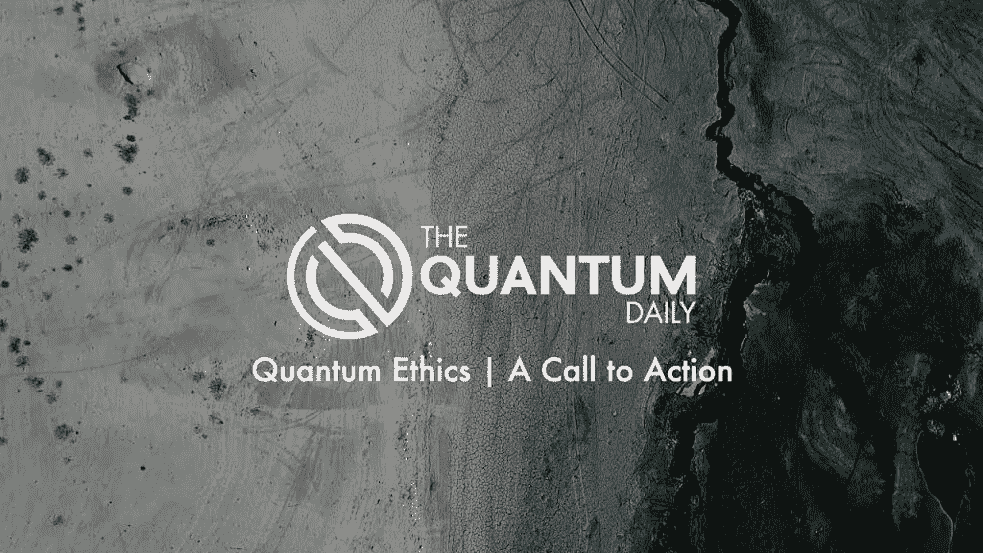
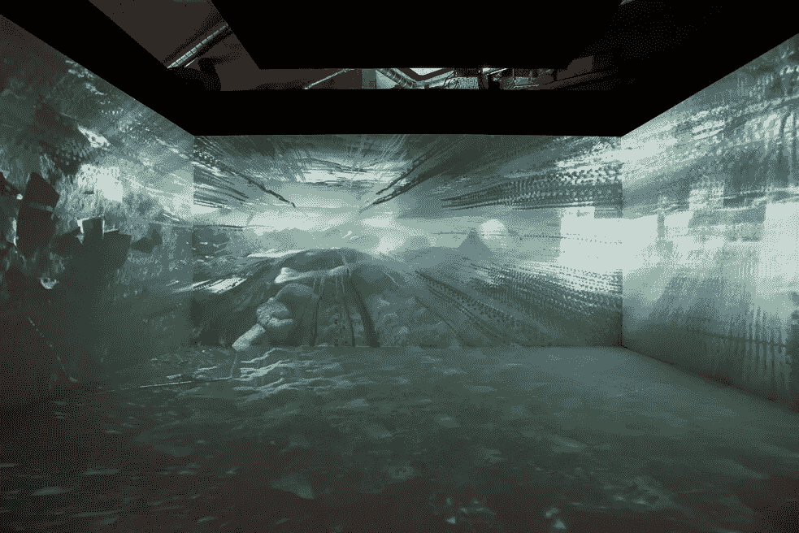

# 麻烦量子

> 原文：<https://medium.com/codex/troubling-quantum-73264d7e2847?source=collection_archive---------23----------------------->

## “第三次量子革命”:量子的自由基势可以回收吗？

Ent- 2022，光艺术空间委托。arebyte Gallery 委托的 Ent-: QX 的演变。照片:马克斯·科尔森

在过去的几周里，我深入研究了快速发展的量子技术领域，探索了通常被称为“第三次量子革命”的历史、应用和地缘政治[1]。艺术家和量子物理学家 Libby Heaney 以及该领域的许多其他专家在这方面帮助了我。量子计算机和相关技术的重大进步，如量子互联网、传感器和高精度设备，预计将带来新一轮的工业应用:从打破传统的加密和增强战争到新的生态材料和医学进步的指数增长。

*作者露西·索利特*

这些进步可能是巨大的，但它们也有可能带来好处和坏处。随着利润和权力的逻辑以及科学实证主义主导量子努力，人们越来越担心所谓的革命更有可能复制和加剧现状——不平等和不可持续的价值观——而不是有意义地破坏它。然而，支撑量子技术的物理学提出了一个关于世界的完全不同的故事——破坏了现代西方范式的二元论，强调了我们的共存和不确定性的生成能力。如果量子革命是用这些术语来描述的会怎么样？

# 主流叙述

三一遗址方尖碑国家历史地标——纪念 1945 年 7 月 16 日世界上第一个核装置在新墨西哥州三一爆炸的地点。三一试验场被描述为“无人居住的土地”，但有 19，000 名美洲土著人生活在这片土著土地附近。照片:萨马特·贾恩/ Flickr

一场开发量子技术的竞赛正在进行，这比以往任何时候都更加重要，是什么议程和假设推动了这场竞赛。处于推动核心的量子计算机技术距离完全可扩展和容错可能只有 5 到 10 年的时间。一旦启动并运行，计算能力将远远超过今天看到的技术变革的力量和速度[2]。量子计算机有望实现:量子密码术既能打破传统加密，又能实现新形式的隐私；优化，实现更高效的系统设计和增强的机器学习；分子模拟，导致新材料的进化，包括生态电池、医药、DNA 操作和生物化学。这些应用可以带来巨大的好处，特别是在应对气候变化方面，但也有巨大的危害，例如，化学战和强化监视资本主义。

目前，地缘政治和经济叙事主导了这场竞赛——它们的基础是现代范式和提取经济逻辑。随着进步步伐的加快，量子研究已经成为美国、中国、欧洲、日本、英国、加拿大和印度科学、技术和国防政策的重点。数十亿美元，以及国家安全[3]危在旦夕。保密和竞争正在增长，中国和美国为量子留出的预算让其他地方相形见绌。这场竞赛发生在巨大的全球动荡之中——从疫情和气候紧急事件，到日益加剧的不平等和地缘政治两极分化。

这些因素影响哪些技术应用被优先考虑，并可能以复杂的方式强化积极和消极的结果。当紧迫的全球问题、竞争和量子的技术复杂性结合在一起时，会产生一场完美风暴，在这场风暴中很容易忽视批判性思考。但是迫切的问题需要提出，例如:谁拥有技术和由此产生的知识？谁能接触到它？它将如何应用，用于什么目标？

没有制衡，量子知识、专业技术和设备越来越局限于资源丰富的精英阶层。为了参与这场竞赛，各国必须能够获得主要投资或资金，并吸引有限的量子专家劳动力。大型科技公司、资金雄厚的私人初创企业或学术网络正在开发量子技术。商业知识产权要求、研究私有化和日益增长的国家保护主义[4]阻碍了开放合作，阻碍了广泛获取。

此外，有一种危险是，全球北方——在量子技术上的投资不成比例地加权——获得了对全球南方的巨大优势，有可能使非洲和南美洲边缘化。当接触仅限于少数人时，那些最终可能受发展影响最大的人的存在、声音和机构就被排除在外。各种形式的殖民暴力——已经与量子物理学的历史紧密纠缠在一起——可能会加剧。

# 伦理辩论

令人欣慰的是，越来越多的顶尖科学家和学者呼吁制定道德准则和原则，并进行公开辩论。量子物理学的感知“怪异”可能是一个障碍——概念和方法很复杂，结果与经典西方科学世界观的假设相反[6]。但是无论是个人还是集体，人们都在接受挑战。

一群领先的量子计算科学家和工程师敦促解决伦理准则。量子日报，量子伦理:行动呼吁，2021 年。照片:量子内幕

达成一个伦理框架很难简单。但是，正如旨在发展量子技术“元伦理”的国际项目 ProjectQ 的创始人詹姆斯·德·德伦指出的那样，与差异、不和谐以及异议合作是其成功的关键。技术带来的后果、恐惧和意义因人的地理和/或宇宙观而异。同样，单一的一套规范、规则或条例不会适合所有学科、部门和应用，相反，必须考虑各种不同的用户和背景。追求多元主义协议，而不是预设对全球共享价值观的理解是至关重要的。

许多问题仍然存在，例如如何商定和实施伦理原则或准则，是否需要国家监管，以及这将如何解释量子技术可能应用的广泛用途和领域。也许最具挑战性的问题是如何颠覆量子技术的直接商业和地缘政治驱动力，并追求对社会长期有意义的东西。

# 量子想象

Ent-: QX 的演变，Libby Heaney 目前在伦敦 Arebyte gallery 的展览。为了这次展览，Libby 创造了一种身临其境的体验，带领观众通过三层包含量子混合生命形式和脉动液体世界的量子实验。Ent-: QX，2022，Libby Heaney，来自 arebyte 画廊的装置摄影。Ent- 2022，光艺术空间委托。arebyte Gallery 委托的 Ent-: QX 的演变。照片:马克斯·科尔森

哲学家和量子物理学家卡伦·巴拉德探索的一种方法是在量子物理学本身中寻找激进的政治想象力。量子物理学的洞见既可以有意义地“困扰”[7]利润和权力(及其所基于的现代范式)的主导叙事，也可以激发技术发展的替代想象。这种方法在量子物理学中孕育了解构的动力，并与雅克·德里达的现代性批判相一致。其中最重要的一个方面是颠覆了现代范式的二元论基础。

**纠结与责任**

解构主义打开了思考世界的其他方式，包括重新想象现代伦理的可能性。例如，纠缠[8]和叠加[9]暗示了共同构成的主体立场，挑战了二元制和自我与他人分离的观念。而量子现象，如测量问题[10]，解构了可知性的概念，表明知识是偶然的，不稳定的，总是共同创造的。Barad 的“内部行动”概念[11]强调了我们在现象中的共同责任，以及纠缠等概念如何破坏分类和控制的逻辑，或挑战两极分化的政治观点。

内部行动强调，纠缠不仅仅是两个身份先于相遇的实体的结合；取而代之的是“内部行动承认不同的实体、机构、事件并不先于它们，而是通过它们的内部行动出现”。[12]它意味着参与、不确定性和问责制，并对固定的界限和边界以及线性时间提出质疑，以及对道德和正义的理解不是预先确定的，而是一直在变化和发展的。如果量子技术的发展是由对我们共同纠缠的更深层次的物质和社会理解所决定的，那会怎样？

同样，巴拉德对衍射和叠加相关概念的解释成为一种方法，使量子物理学自身与暴力历史和殖民主义在现在和未来的纠缠变得可见并解决其物质存在(“时间”)。它开启了对现状的其他解读，并试图解决不公正现象，而不是强化或扩大不公正现象。这种对时间的材料解读补充了作家 Kyoki Hayashi 在她的书《三位一体到三位一体》中探索的内容，以及视觉艺术家的实践，例如黑量子未来主义。

**不确定和惊奇**

惊奇可以成为超越现状和想象其他可能性的强大工具。经典科学强调可观察性和可测量性，这意味着无形的知识，比如奇迹，被忽视了。然而量子物理学充满了奇迹；即使试图描述它所讲述的内容，也需要近乎诗意的表达。

量子物理学是我们对“万物如何运作”的最完整的科学描述，同时又是不确定的[13]——事实上，不确定性似乎是它的完整性及其奇妙和神秘的必要条件。不确定性(认识论的和本体论的)是纠缠和叠加的核心，它强调了自然界错综复杂的敏感性，以及这些性质如何沿着无限多的路径同时提供存在的条件。自然永远不会被完全压制或表现出来，相反，它是动态的，对触摸敏感——它似乎在“闪耀！”正如物理学家克里斯·富克斯所说。

在许多方面，科学似乎让我们参考艺术语言和/或一些宗教和前现代信仰体系的故事，这些体系有能力让我们感受和直觉，或用其他术语交流，量子物理学告诉我们的核心。多年来，视觉艺术家、作家、音乐家等等，都受到了启发，去激活和探索量子理论的含义，以及测试它的不可再现性的界限。

豪尔赫·路易斯·博尔赫斯在他 1941 年的短篇小说《小径分岔的花园》中的多世界探索理论。当纠缠粒子在量子虚空中处于叠加态时，多世界理论就被隐含了，此时此刻作为 Barad 所谓的虚空“充满了对时空不确定性的所有可能向往”[14]。在她的实验性作品中，Libby Heaney 利用空无作为一种媒介，创造出瞬间存在于其中的作品(作为红外光的粒子),并通过将图像输入量子计算机来测试创造纠缠感的可能性。

如果我们从发展技术的竞赛中退一步，转而关注这个奇迹，会有什么可能呢？充分感受到的惊奇会转化为尊敬。重新连接到一种奇妙的感觉会激发其他想象力来发展量子技术吗？

# 有意义的技术

量子技术具有双刃潜力，既能带来巨大的好处，也能带来巨大的危害。仅仅减轻量子技术的潜在负面后果，就能让主导叙事框架的发展保持完整。但是重新联系量子物理学的见解表明需要走得更远。

纠缠、叠加和不确定性等现象解构和破坏了现状，破坏了其二元基础，并提出了根本不同的方式来思考责任、时间和意义。与下一次技术创新相比，这无疑是想象第三次量子革命的方式。

感谢 Antony Dunne、James Der Derain、Anna Pearson、Michal Stechly 和 Libby Heaney，他们帮助指导了为本文提供信息的研究。

[1]第三次革命是指量子计算机和相关技术发展的重大进步，包括量子互联网、新传感器和高精度设备。第一次量子革命是核能革命，而第二次革命带来了激光、全球定位系统以及手机和笔记本电脑中使用的晶体管的重大进步。
【2】IBM 的 Eagle 量子芯片计算机(2021 年 11 月公布)的计算能力超过经典超级计算机百万倍。
[3]例如，量子计算机破解密码学的能力或利用量子导航、隐身、生物材料和智能的重大军事优势的潜力。
[4]保护主义的例子包括:关于共享某些量子创新的安全限制；中国量子投资与发展的不透明性；以及欧盟最近将英国、以色列和瑞士排除在欧盟量子技术地平线欧洲计划之外。
[5]核物理是与量子场论一起发展起来的，也是在量子场论内部发展起来的，从事这两方面研究的是同一批科学家。
[6]经典科学基于主客体划分的基本假设，强调对自然的经验测量和观察，以得出描述或预测自然现象的“普遍规律”。它暗示了一个机械宇宙。
[7]“麻烦”一词的使用是受唐娜·哈拉威的启发。唐娜·哈拉威(Donna Haraway)特别将气候变化和环境破坏视为我们困难时期的一部分，她建议我们“与困难相伴”。哈拉维说，我们的任务是制造麻烦，激起对灾难性事件的有力回应，以及平息混乱和重建平静的地方。唐娜·哈拉威，2016，与麻烦同在:在 Chthulucene 中建立亲属关系。
[8]量子纠缠，量子物理学的核心原理告诉我们，两个或更多的量子物体可以共同分享属性，因此无论相距多远，都不可能独立于其他物体来描述每个物体。
【9】叠加是量子系统在被测量之前同时处于多个状态的能力。例如，一个原子可能同时上下旋转。
【10】测量问题有很多解释，我用它来泛指当我们试图测量一个粒子时，它脱离叠加的现象。
[11]三分钟理论，2014，提供了对 inta-action 的简单概述:[https://www.youtube.com/watch?v=v0SnstJoEec](https://www.youtube.com/watch?v=v0SnstJoEec)
【12】这种同时发生的“分化和纠缠”意味着““现有机构仅在关系意义上是不同的，而不是绝对意义上的，也就是说，机构仅在相互纠缠的关系上是不同的；它们不是作为单个元素存在的。Karin Sellberg & Peta Hinton，2016，量子可能性:Karen Barad 的工作
[13]这与玻尔的互补原理有关，根据该原理，对原子维度上现象的完整知识需要对波和粒子属性的描述，但不可能同时观察到波和粒子两个方面。
【14】Karen Barad，2017 年在欧洲研究生院发表演讲:[https://www.youtube.com/watch?v=RZHurGcoRmQ](https://www.youtube.com/watch?v=RZHurGcoRmQ)
量子真空是高维的(一台只有少量量子位的量子计算机可以展现 15 维空间)，包含了一个粒子从一个位置到另一个位置的所有可能路径。

## 作者

露西·索利特是一名策展人、作家、哲学家/战略家和艺术家导师。她专注于艺术和技术的交叉以及新艺术经济的可能性。

版权所有:CC BY-SA

*原载于*[*https://www . Goethe . de*](https://www.goethe.de/prj/lqs/en/art/luc.html)*。*