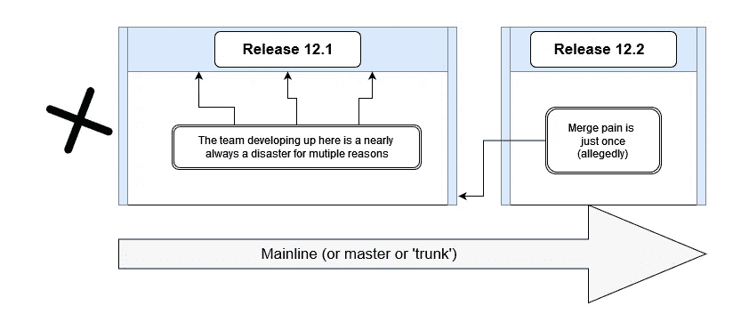
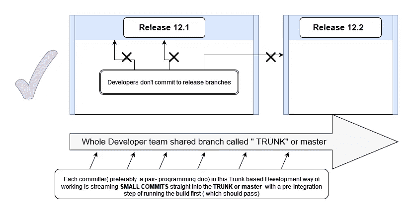
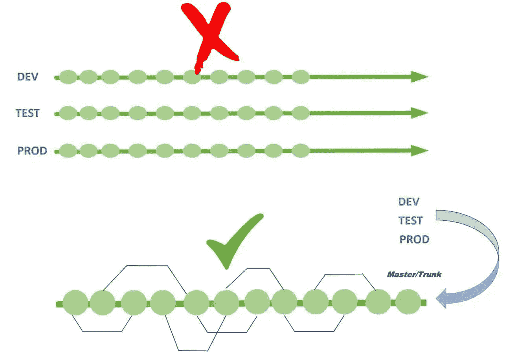

# 基于主干的开发:实现渐进交付

> 原文：<https://medium.com/codex/trunk-based-development-achieving-progressive-delivery-cd8f361014fc?source=collection_archive---------12----------------------->

## 对基于主干的开发的渐进交付方法进行更深入的技术观察

作者图片

在组织中使用软件开发的早期，程序员通过开发新版本来跟踪软件中的所有变化。然而，这个过程被证明是对时间和金钱的低效使用，这使得开发对组织来说是昂贵的。

多年来，出现了几种开发风格，使开发人员能够以有效的方式发现 bug 和错误，并与他们的开发伙伴并行编码和进行更改，从而大大加快了发布速度。

然而，今天大多数开发人员利用两种开发模型中的一种——git flow 和基于主干的开发。在本技术指南中，我们将仔细研究基于主干开发的渐进交付方法，它的好处，以及它如何与 Gitflow 相抗衡。

# 什么是基于主干的开发？

基于主干的开发是一种版本控制管理实践，其中开发人员将小的、频繁的更新合并到一个核心“主干”或主要分支中。因为它简化了合并和集成阶段，所以它有助于实现 CI/CD，并提高软件交付和组织绩效。

在许多方面，它是一种极端的源代码控制技术，其中一个组织的所有开发人员直接在他们的源代码控制(git)中合作开发和维护软件的主要分支，也称为“主干”，使得创建和合并额外的分支变得不必要。

基于主干的开发并不是软件开发中新的分支模型。“树干”一词指的是生长中的树的概念，其中最粗、跨度最长的是树干，而不是从树干辐射出来的树枝，树枝的长度更有限。

主线/主/干线之外的共享分支在任何发布节奏下都是不好的:

来源: [TrunkBasedDevelopment](https://trunkbaseddevelopment.com/)

在上图中，有多个分支来提交变更，这些变更是由多个开发人员完成的，当合并到主分支时，所有这些提交都变得一团糟。

# 面向小型团队的基于主干的开发

来源: [TrunkBasedDevelopment](https://trunkbaseddevelopment.com/)

基于主干的开发是持续集成和持续交付的关键使能因素。

当团队中的个人在一天中多次向主干提交他们的变更时，满足持续集成的核心需求变得很容易，即所有团队成员至少每 24 小时提交一次主干。

这确保了代码库总是按需发布，并有助于实现连续交付。在上面的内容中，我们可以看到基于主干的开发是如何为持续集成管道工作的。

来源: [TrunkBasedDevelopment](https://trunkbaseddevelopment.com/)

# Gitflow 和基于主干的开发的区别

Gitflow 是一个 git 分支模型，它使用特性分支，即长寿命分支和多分支。它有独立的开发、特性、发布等主要分支。在分支之间合并提交有不同的策略。因为有更多的分支需要处理和管理，所以会有更多的复杂性，需要开发人员和程序员团队进行额外的规划。

基于主干的开发要简单得多，因为它将主要分支作为修复和发布的来源。在基于主干的开发中，假设主分支总是稳定的，没有问题，并准备好部署。

# 基于主干的开发的先决条件

采用基于主干的开发不仅仅是决定放弃分支并提交给主干。你需要有合适的先决条件来使它工作。这些先决条件包括:

*   一个由经验丰富且自信的开发人员组成的团队，他们信任彼此的工作
*   一个支持特性抽象的松散耦合的代码库
*   功能标志的强大解决方案(例如，黑暗启动或标志)
*   围绕特征标记的过程
*   一个持续的构建和测试基础设施，能够跟上高提交率。
*   围绕审查和发布的简化流程不会阻碍提交的速度。
*   文化变革、综合自动化单元和集成测试
*   蓝绿部署的故障安全机制。

# 基于主干的开发的好处

以下是 D3V 在为我们的合作伙伴规划灾难恢复策略时采用的最佳实践列表，对于希望开发自己的策略的企业应该非常有帮助:

1.  **简单性**:基于主干的开发是一种非常简单的技术。如果没有分支，从技术的角度来看，开发人员所要做的就是提交和推送他们的代码，总是到同一个分支。
2.  **合并问题变得不太可能:**在工作分支时，我们需要同步我们的分支，以防发生变化。在基于主干的开发中，由于源代码控制工具中的层次较少，因此使用不同步代码的可能性大大降低。这意味着更少的合并问题。
3.  更快的集成:在基于主干的开发中，我们不需要做拉请求，集成会更快。先到先得。在我们推进到主干之前，我们没有中间分支，这增加了流程的复杂性，也减慢了交付速度。
4.  测试人员觉得它很有效率:许多测试人员发现在处理分支时，它相当令人困惑。他们想要测试一些东西，但是他们不确定应该从哪个分支获取代码，也不确定应该从哪个分支获取依赖项。在基于主干的开发中，主干总是绿色的，测试人员可以放心地相信他们测试的是最新的。
5.  **更高的代码质量:**如果有什么东西坏了，我们需要马上修复它，因为构建会变红。管道将会停止。测试人员将无法测试，DevOps 团队将无法部署。基于主干的开发提供了最高质量的代码，因为我们必须首先在本地运行测试，并确保在我们推送代码之前一切正常。
6.  **开发人员的共享所有权:**一旦团队对主干的当前状态感到满意，就可以选择创建标签。重要的是基于主干迫使整个团队对正在发生的事情有更好的认识。
7.  更好的自动化测试:为了成功地进行基于主干的开发，我们需要真正好的自动化测试，尤其是验收测试。这种技术迫使我们对业务分析师的需求做好充分准备，并让他们不断地参与到发现、制作和更新需求的过程中。基于主干的开发所需要的这种高度的跨学科合作对于共享知识和解决问题(如果有的话)来说是非常好的。
8.  **允许持续的代码集成:**在基于主干的开发模型中，有一个存储库，稳定的提交流流入主分支。为这个提交流添加一个自动化测试套件和代码覆盖监控可以实现持续集成。当新代码被合并到主干中时，会运行自动化集成和代码覆盖测试来验证代码质量。
9.  **结对:**许多实践基于主干开发的团队也根据经验进行结对编程。这样做的原因是因为有了结对编程，我们有了更直接的持续的代码审查，这对于基于主干的开发来说是必不可少的。

因此，正如你所看到的，基于主干的开发很简单，但是非常强大。但由于多种原因，并不是每个公司和团队都有能力做到这一点。

# 正在总结…

基于主干的开发目前是高绩效团队的标准，因为它通过使用简化的 Git 分支策略来设置和维护软件发布节奏。此外，基于主干的开发给予团队更多的灵活性和对他们如何向最终用户交付软件的控制。

*最初发表于*[*【https://www.d3vtech.com】*](https://www.d3vtech.com/insights/trunk-based-development-achieving-progressive-delivery)*。*