# TryHackMe:基本测试

> 原文：<https://medium.com/codex/tryhackme-basic-pentesting-8798f8fc096e?source=collection_archive---------9----------------------->

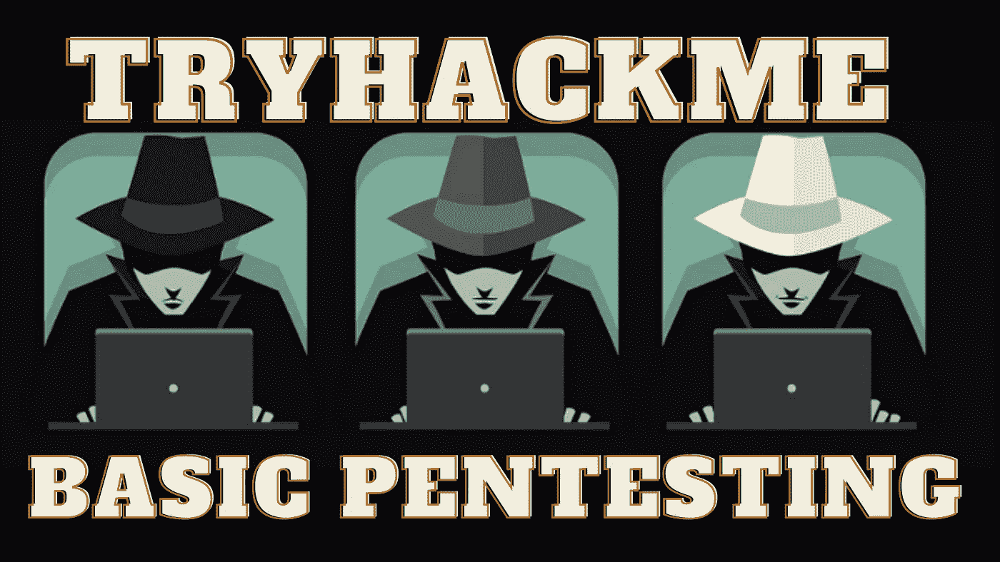

基本测试是一个简单的测试工具。在这个房间里，我们将对 SMB 进行简单的列举，然后对不同的服务或密钥进行一系列暴力攻击。

像往常一样，在 TryHackMe 中，我们必须连接到 VPN 或使用攻击箱。我会选择 VPN。我们按下启动机器按钮，一分钟后，他们给我们显示 IP 地址。现在，我们继续使用 Nmap 进行初始识别:

```
nmap -p- -sV -Pn $IP
```

带连字符的-p 参数表示扫描所有端口,-sV 参数表示对使用的版本进行指纹识别，而-Pn 参数表示扫描机器，即使它不响应 ping。

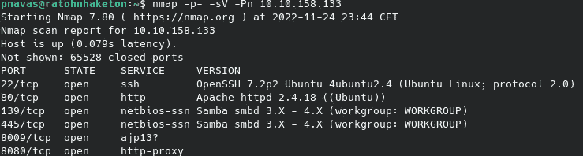

我们可以看到该机器如何在非标准端口上公开几个服务，如 SMB 和 web 服务。我们应该使用这些协议测试枚举方法，并检查已知漏洞的版本。

**SMB 枚举**

关于 SMB 服务，我们只能看到默认共享，对它们没有任何访问权限。

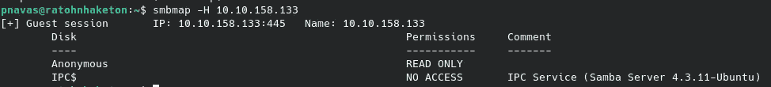

但是使用 enum4linux 工具，我们通过使用 SID 循环的空会话发现了两个非标准用户。

```
enum4linux -a $IP
```

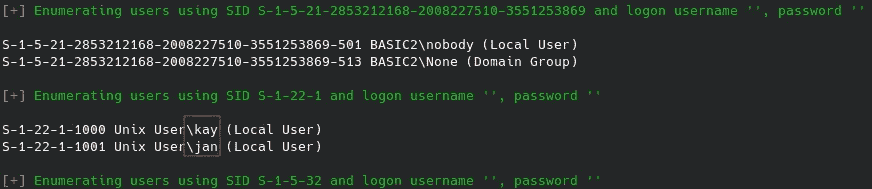

**蛛网枚举**

我们可以在端口 80 上看到维护中消息:

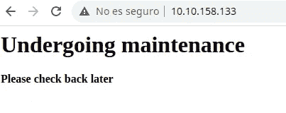

我们还可以看到一个 Tomcat 暴露在端口 8080 上:

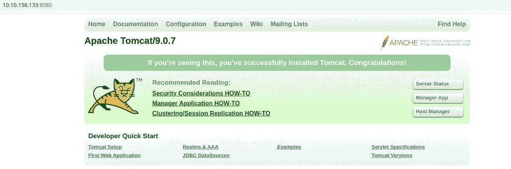

对模糊文件进行测试时，我们发现了一个可能包含敏感信息的未列出的端点。

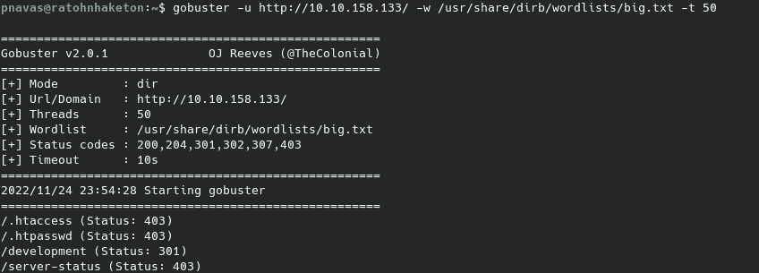

我们通过目录列表在目录中找到了几个文件。

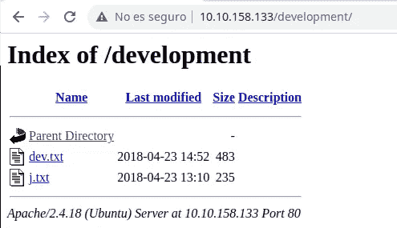

在文件中，我们可以找到以 J 身份签名的用户的系统密码较弱的引用。

**宋承宪暴力**

根据我们掌握的信息，下一步似乎是通过 SSH 对用户 Jan 进行暴力攻击。

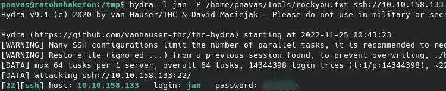

卑鄙的暴行

**权限提升**

通过使用用户 Jan 进行访问，我们可以读取 RSA 密钥，以便使用用户 Kay 通过 SSH 进行访问。

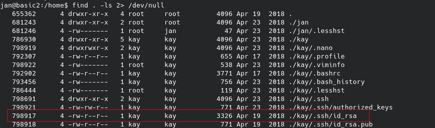

这个密钥被加密了，所以我们可以尝试通过对相应的散列进行暴力破解来获得 id_rsa 的密钥。

```
python3 ssh2john.py id_rsa > hash
```

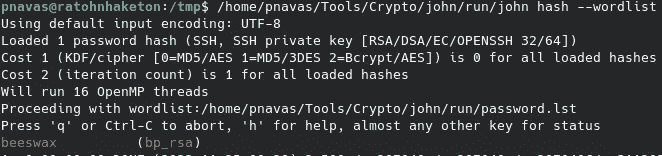

又是暴力

一旦我们有了密码，我们就可以使用 SSH 服务的 RSA 密钥以用户 Kay 的身份登录。

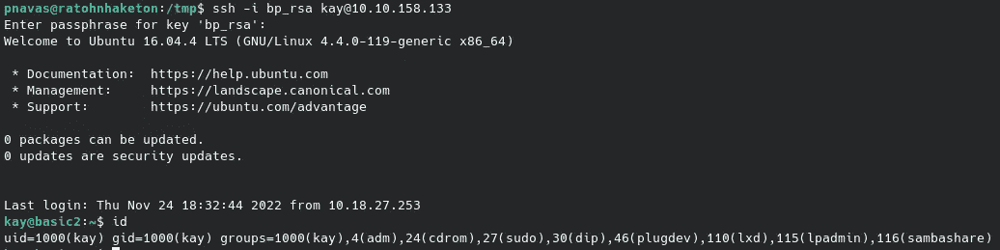

我们现在已经完成了房间！

我希望你喜欢我的文章，并发现我的内容有用。下一篇文章再见。