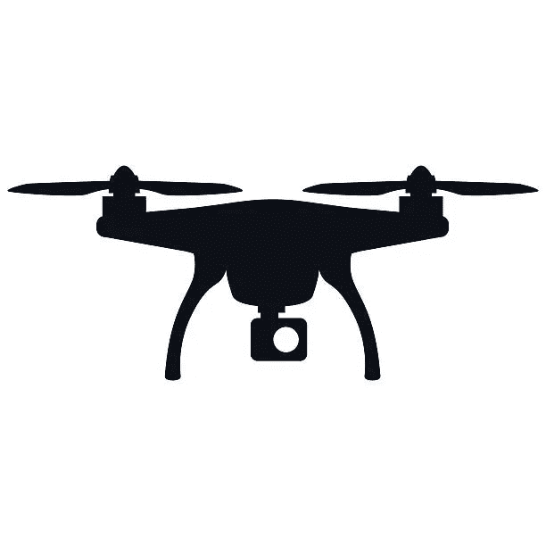
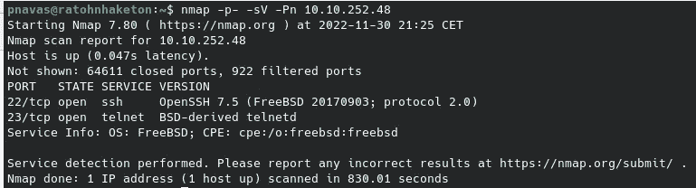
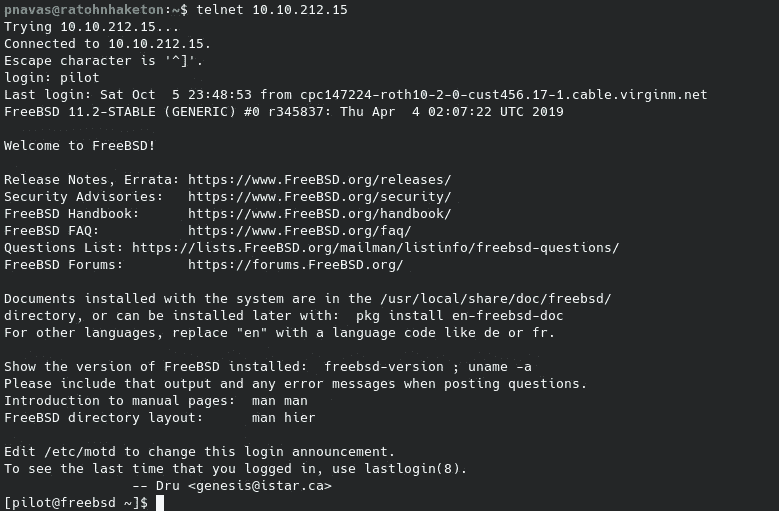
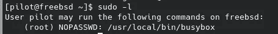
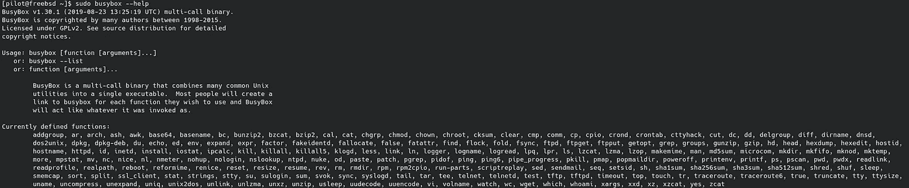
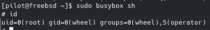

# 贝波普

> 原文：<https://medium.com/codex/tryhackme-bebop-c186ffff586f?source=collection_archive---------9----------------------->



Bebop 是 TryHackMe 的一个简单的机器，可以模拟无人机。在其中，我们将利用一个没有密码的 telnet 服务和作为超级用户的 busybox 的执行。

像往常一样，在 TryHackMe 中，我们必须连接到 VPN 或使用攻击箱。我会选择 VPN。我们按下启动机器按钮，一分钟后，他们给我们显示 IP 地址。现在，我们继续使用 Nmap 进行初始识别:

```
nmap -p- -sV -Pn $IP
```

带连字符的-p 参数表示扫描所有端口,-sV 参数表示对使用的版本进行指纹识别，而-Pn 参数表示扫描机器，即使它不响应 ping。



我们可以看到机器上打开的服务很少，只有 SSH 和 telnet。用房间给我们的用户名连接到 telnet，我们可以得到一个低权限外壳。



现在，是时候提升特权了。我们发现我们的用户可以使用 root 权限执行 busybox。



允许 busybox 作为 sudo 是一种已知的提升权限的方法，因为我们可以作为 sudo 执行许多其他二进制文件。



其中最危险的是 sh，它允许我们生成一个 shell 作为 root。



我希望你喜欢我的文章，并发现我的内容有用。下一篇文章再见。