# TryHackMe: LazyAdmin

> 原文：<https://medium.com/codex/tryhackme-lazyadmin-5ac45fcb3cd4?source=collection_archive---------4----------------------->

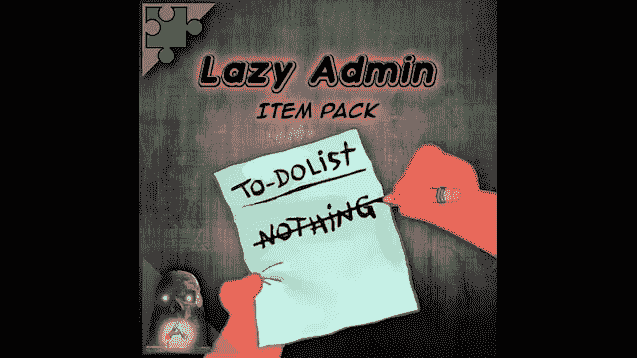

LazyAdmin 是 TryHackMe 平台的一个 easy machine，在它里面，我们会利用一个任意上传文件和泄露凭证的漏洞来获取系统中的一个外壳。稍后，我们将利用执行脚本的可能性，该脚本可由我们的用户作为系统的任何用户来修改，以提升权限。

像往常一样，在 TryHackMe 中，我们必须连接到 VPN 或使用攻击箱。我会选择 VPN。我们按下启动机器按钮，一分钟后，他们给我们显示 IP 地址。现在，我们继续使用 Nmap 进行初始识别:

```
nmap -p- -sV -Pn $IP
```

带连字符的-p 参数表示扫描所有端口,-sV 参数表示对使用的版本进行指纹识别，而-Pn 参数表示扫描机器，即使它不响应 ping。

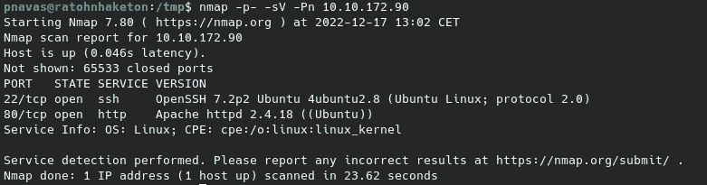

我们可以看到机器上几乎没有打开的服务，只有 SSH 和一个 web 服务器。让我们深入研究一下 web 服务器。

**网络服务器枚举**

模糊化目录后，我们发现了几个有趣的条目:

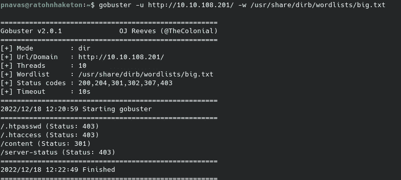

我们发现了一个基本 CMS SweetRice 的安装。

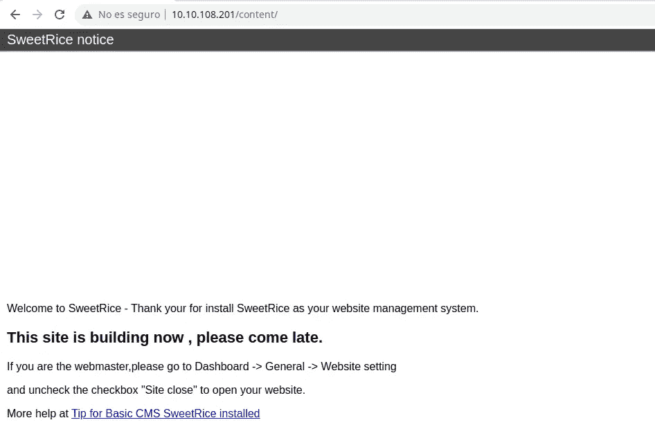

快速的 Google 搜索显示了一些 CVE 和 1.5.1 以前版本的漏洞

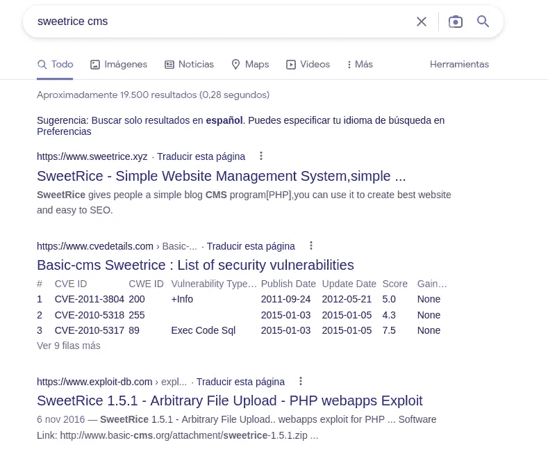

在内容文件夹中，我们发现了几个有趣的端点，其中之一是 as 目录中的登录面板和 inc 目录中的目录列表。

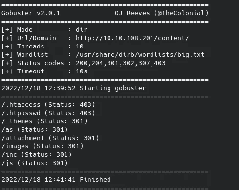

在 inc 目录内，我们找到了 latest.txt 文件中使用的 CMS 版本(恰好是 1.5.1，存在已验证的任意文件上传漏洞)。我们还找到了一个文件夹，里面有 mysql 备份。让我们来看看这个凭据备份。

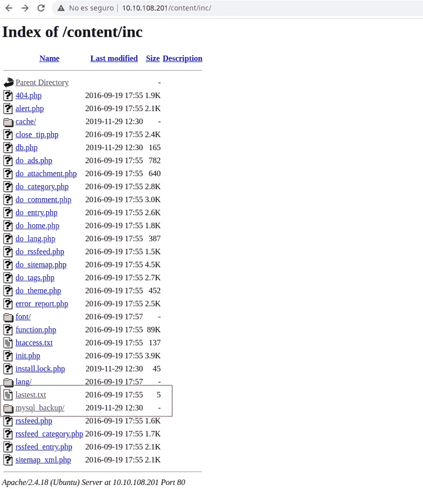

事实上，我们找到了具有管理员权限的管理员用户的凭证，只是我们必须破解密钥的散列才能进行访问。

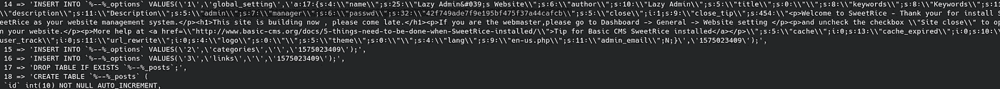

一旦我们破解了散列，我们就可以用刚刚获得的凭证访问 CMS。

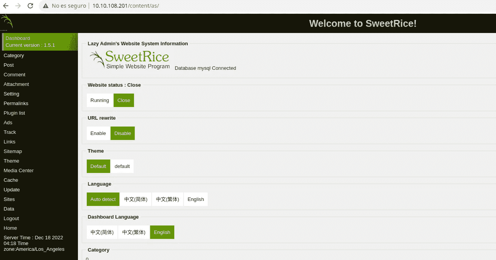

是时候看看我们是否能重现漏洞的任意文件上传了。阅读 exploitdb 的漏洞，我们看到易受攻击的形式位于/as/？type =媒体中心

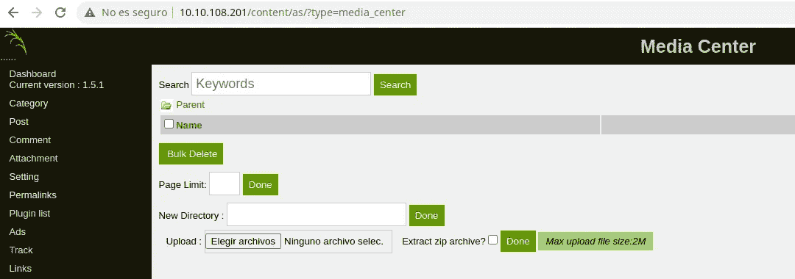

测试，我们看到有一些过滤的形式，如果我们上传。php 文件，它们不被存储。我们可以通过使用. php5 之类的其他扩展来绕过过滤。一旦我们知道如何绕过它，我们就可以上传一个反向 shell，并在系统上获得一个 shell。

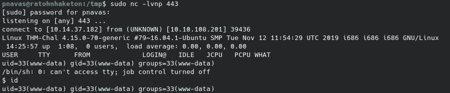

**权限升级**

通过基本枚举，我们可以在 itguy 主文件夹中找到一些有趣的文件

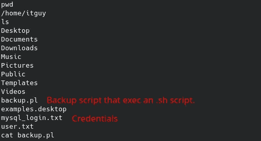

MySQL 凭证虽然有效，但似乎将我们引入了一个死胡同。另一方面，我们可以看到之前看到的备份脚本可以被我们作为 root 执行。

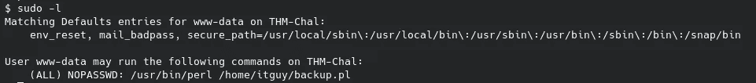

让我们仔细看看这个脚本是做什么的。

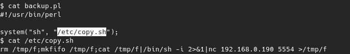

似乎/etc/copy.sh 脚本已经被修改为启动反向 shell。让我们看看是否可以修改它来获得我们的 shell 作为 root。

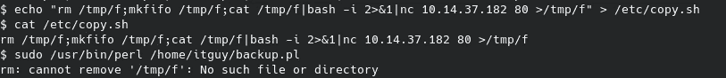

最后，我们将 shell 作为 root:

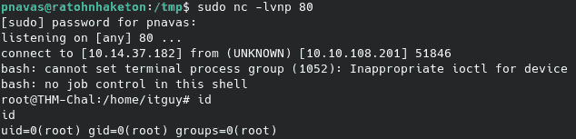

**PWNed！**

我希望你喜欢我的文章，并发现我的内容有用。下一篇文章再见。