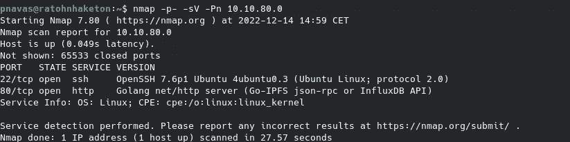
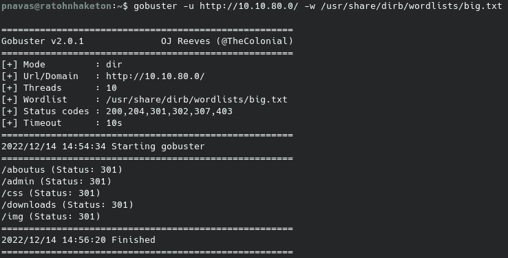
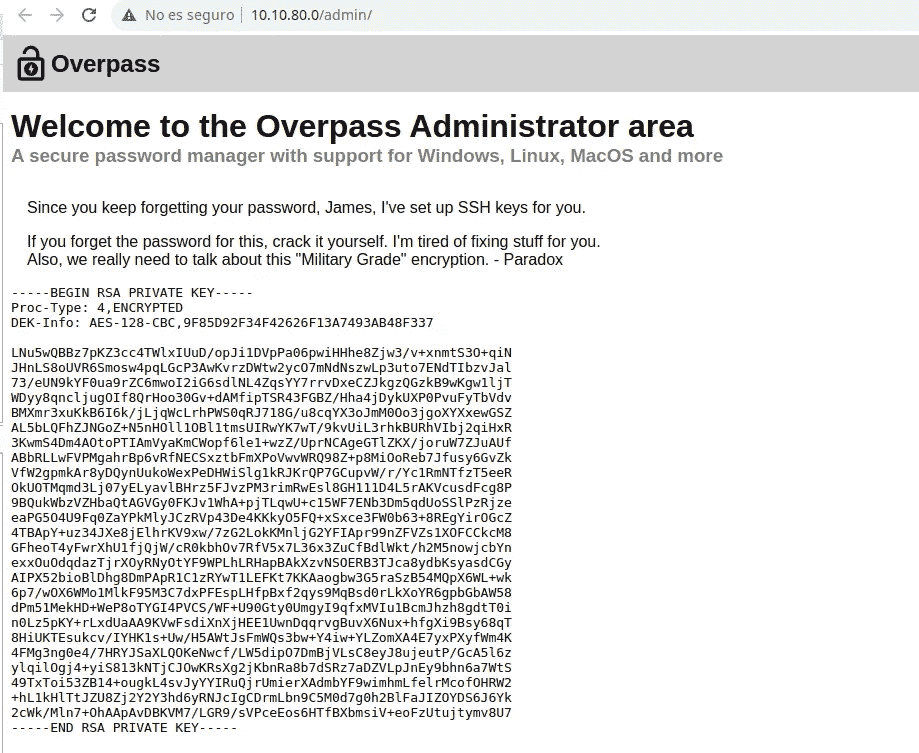
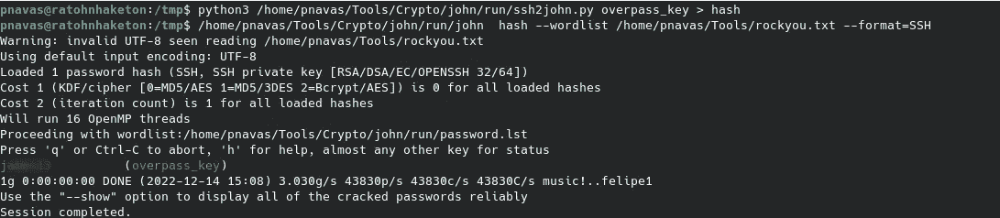
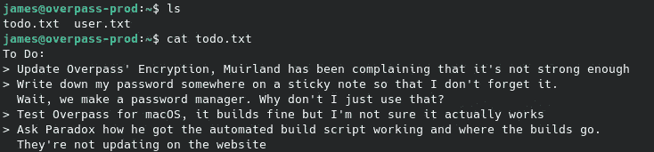
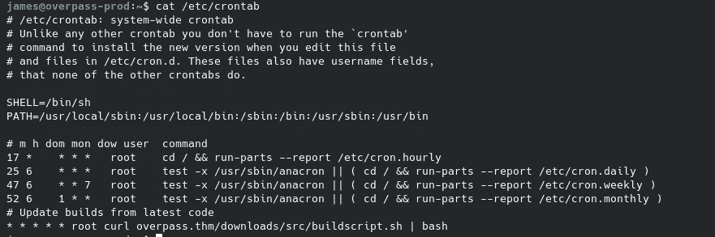
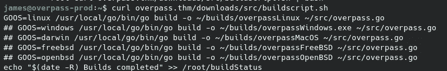
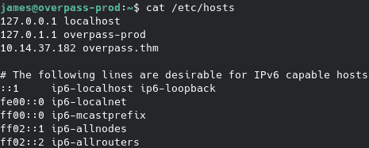
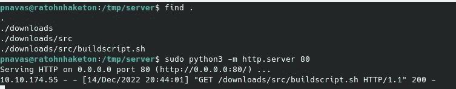
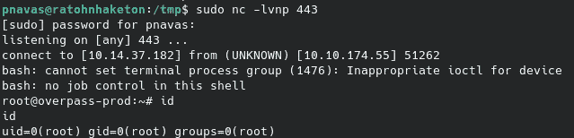

# Tryhackme:天桥

> 原文：<https://medium.com/codex/tryhackme-overpass-c7bc995e196f?source=collection_archive---------13----------------------->


transition 是一个简单的 TryHackMe 机器，我们将在其中利用一个失败的身份验证错误来访问应用程序中的 ssh 密钥。稍后，我们将通过模拟在计划作业中运行的脚本来提升权限。

像往常一样，在 TryHackMe 中，我们必须连接到 VPN 或使用攻击箱。我会选择 VPN。我们按下启动机器按钮，一分钟后，他们给我们显示 IP 地址。现在，我们继续使用 Nmap 进行初始识别:

```
nmap -p- -sV -Pn $IP
```

带连字符的-p 参数表示扫描所有端口,-sV 参数表示对使用的版本进行指纹识别，而-Pn 参数表示扫描机器，即使它不响应 ping。



我们可以看到，该机器只暴露了一个 web 服务器和一个 SSH 服务器。让我们深入研究 web 服务器。

首先，通过模糊化，我们可以找到一些有趣的端点。



在管理端点上，我们可以看到一个名为 login.js 的 javascript 文件，它在 suscesfull auth:

```
async function login() {
    const usernameBox = document.querySelector("#username");
    const passwordBox = document.querySelector("#password");
    const loginStatus = document.querySelector("#loginStatus");
    loginStatus.textContent = ""
    const creds = { username: usernameBox.value, password: passwordBox.value }
    const response = await postData("/api/login", creds)
    const statusOrCookie = await response.text()
    if (statusOrCookie === "Incorrect credentials") {
        loginStatus.textContent = "Incorrect Credentials"
        passwordBox.value=""
    } else {
        Cookies.set("SessionToken",statusOrCookie)
        window.location = "/admin"
    }
}
```

我们可以从浏览器控制台生成 cookie 并绕过身份验证。

```
Cookies.set("SessionToken", 1)
```

现在我们可以在页面上看到 james 的加密 SSH 密钥:



现在我们可以破解这个 ssh 密钥的密钥，以便能够在 SSH 服务中以 James 的身份登录。



现在，我们可以访问系统并查看待办事项列表，其中一项待办事项是关于自动化脚本的。能关注一下就好了。



参考 crontab，我们看到它下载并执行一个文件。



如果我们查看它的内容，我们会发现它调用 date 时没有指定完整的路径。



因为我们可以操纵/etc/hosts，所以我们可以让域指向我们的机器，并利用它来为我们想要的任何脚本服务。



一旦被操纵，我们就可以创建一个带有反向外壳的脚本并为其服务。



过了一会儿，一旦执行了 cronjob，我们将得到一个 shell 作为 root



**PWNed！**

我希望你喜欢我的文章，并发现我的内容有用。下一篇文章再见。