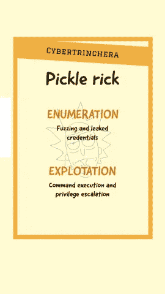
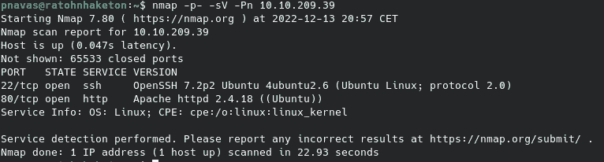
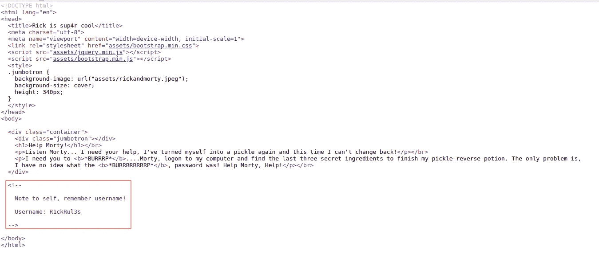
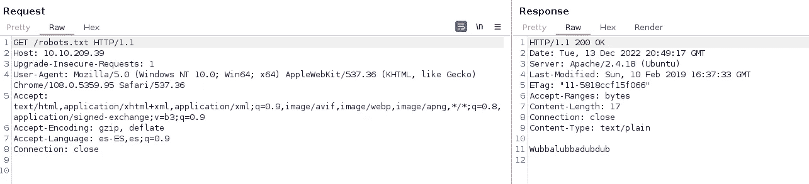
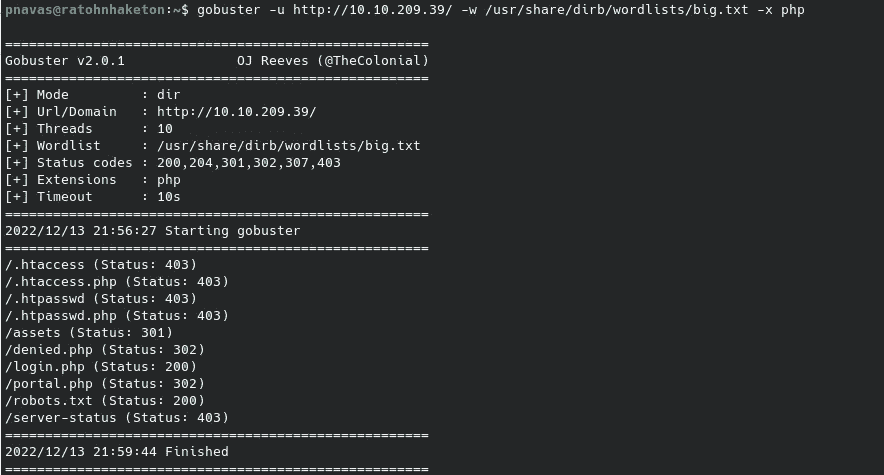
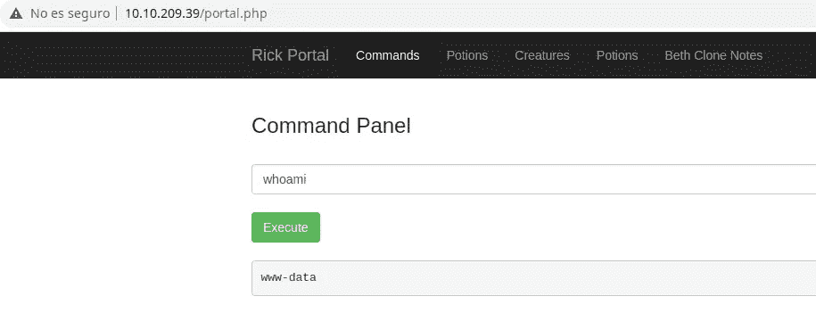
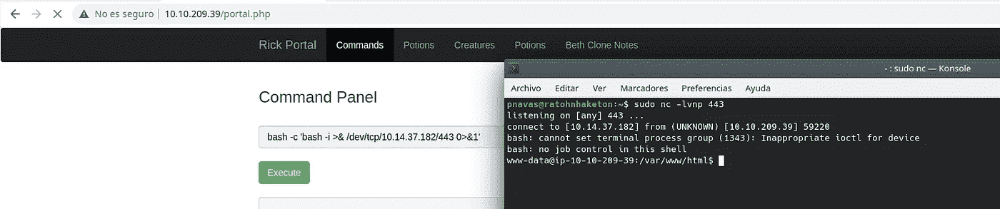
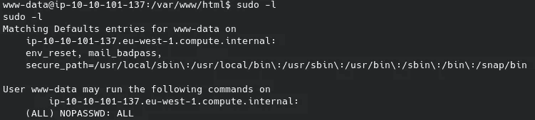
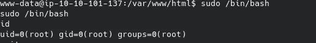

# 泡菜里克

> 原文：<https://medium.com/codex/tryhackme-pickle-rick-69e8acd795fa?source=collection_archive---------17----------------------->



Pickle Rick 是一个 TryHackMe easy 机器，其中我们必须枚举一个 web 服务，并使用一些泄漏的凭据来访问它。最后，我们将利用命令执行来获得机器上的外壳。

像往常一样，在 TryHackMe 中，我们必须连接到 VPN 或使用攻击箱。我会选择 VPN。我们按下启动机器按钮，一分钟后，他们给我们显示 IP 地址。现在，我们继续使用 Nmap 进行初始识别:

```
nmap -p- -sV -Pn $IP
```

带连字符的-p 参数表示扫描所有端口,-sV 参数表示对使用的版本进行指纹识别，而-Pn 参数表示扫描机器，即使它不响应 ping。



我们可以看到机器上几乎没有打开的服务，只有 SSH 和一个 web 服务器。让我们深入研究一下 web 服务器。

**网络服务器枚举**

在网站的主页上，我们可以看到一条泄露用户名的评论。



此外，我们可以看到一个奇怪的机器人。txt。也许这可能是一个密码，但这是一个小猜测…



通过模糊化目录和文件，我们发现了许多端点。



我们可以从登录门户上的 robots.txt 文件中测试用户和猜测的密码。



一旦登录到应用程序中，我们就可以访问一个允许我们执行命令的面板，但有一个黑名单，尽管我们可以使用 base64 或使用 less 命令来绕过它。如果我们看到代码，我们可以看到黑名单是硬编码的。

```
<?php
session_start();

if($_SESSION["login"] == false) {
   header("Location: /login.php"); die();
}

?>
<!DOCTYPE html>
<html lang="en">
<head>
  <title>Rick is sup4r cool</title>
  <meta charset="utf-8">
  <meta name="viewport" content="width=device-width, initial-scale=1">
  <link rel="stylesheet" href="assets/bootstrap.min.css">
  <script src="assets/jquery.min.js"></script>
  <script src="assets/bootstrap.min.js"></script>
</head>
<body>
  <nav class="navbar navbar-inverse">
    <div class="container">
      <div class="navbar-header">
        <a class="navbar-brand" href="#">Rick Portal</a>
      </div>
      <ul class="nav navbar-nav">
        <li class="active"><a href="#">Commands</a></li>
        <li><a href="/denied.php">Potions</a></li>
        <li><a href="/denied.php">Creatures</a></li>
        <li><a href="/denied.php">Potions</a></li>
        <li><a href="/denied.php">Beth Clone Notes</a></li>
      </ul>
    </div>
  </nav>

  <div class="container">
    <form name="input" action="" method="post">
      <h3>Command Panel</h3></br>
      <input type="text" class="form-control" name="command" placeholder="Commands"/></br>
      <input type="submit" value="Execute" class="btn btn-success" name="sub"/>
    </form>
    <?php
      function contains($str, array $arr)
      {
          foreach($arr as $a) {
              if (stripos($str,$a) !== false) return true;
          }
          return false;
      }
      // Cant use cat
      $cmds = array("cat", "head", "more", "tail", "nano", "vim", "vi");
      if(isset($_POST["command"])) {
        if(contains($_POST["command"], $cmds)) {
          echo "</br><p><u>Command disabled</u> to make it hard for future <b>PICKLEEEE RICCCKKKK</b>.</p>";
        } else {
          $output = shell_exec($_POST["command"]);
          echo "</br><pre>$output</pre>";
        }
      }

    ?>
  </div>
</body>
</html>
```

据我们所知，黑名单只是阻止读取 fihceros，所以我们可以得到一个反向外壳没有太大的麻烦。



枚举，我们可以发现，我们可以执行任何命令作为根无需使用密码，然后提升特权是微不足道的。



最后，我们可以简单地以 root 用户身份执行 bash，并获得一个具有特权的 shell。



该读取所有标志了！

我希望你喜欢我的文章，并发现我的内容有用。下一篇文章再见。