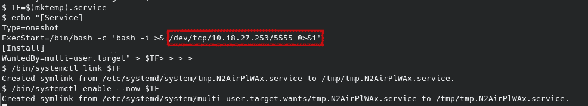

# TryHackMe: Vulnversity

> 原文：<https://medium.com/codex/tryhackme-vulnersity-f09258fd7f61?source=collection_archive---------13----------------------->


大学是一台容易尝试的机器。它是我加入这个平台时解决的第一批机器之一。除了挑战之外，它还提出了一系列问题作为解决问题的指南，重点是 Nmap 侦测、web 攻击和权限提升。

像往常一样，在 TryHackMe 中，我们必须连接到 VPN 或使用攻击箱。我会选择 VPN。我们按下启动机器按钮，一分钟后，他们给我们显示 IP 地址。现在，我们继续使用 Nmap 进行初始识别:

```
nmap -p- -sV -Pn $IP
```

带连字符的-p 参数表示扫描所有端口,-sV 参数表示对使用的版本进行指纹识别，而-Pn 参数表示扫描机器，即使它不响应 ping。


我们可以看到机器如何打开几个有趣的服务，比如 FTP、SMB 和非标准端口上的 web 服务。我们应该使用这些协议测试枚举方法，并检查已知漏洞的版本。

**FTP 枚举**

FTP 服务不提供匿名登录，与该版本相关的唯一漏洞是拒绝服务(【https://www.exploit-db.com/exploits/49719】T2)。

**中小企业枚举**

关于 SMB 服务，我们只能看到默认共享，对它们没有任何访问权限。


**网页枚举**

首先，我们打开网页并以正常方式浏览，以填充我们的代理。我使用 BurpSuite 来完成这个任务，但是也可以用 OWASP Zap 或其他工具来完成。

我们看到大部分功能还没有实现，所以我们继续检查是否可以通过模糊化来检测任何其他正在工作的功能。

```
wfuzz -w /usr/share/dirb/wordlists/big.txt --hc 404 http://IP:3333/FUZZ
```

我们将使用这个 wfuzz 命令。其中参数-w 表示单词列表，参数-HC 表示我们想要忽略的响应代码，在本例中为 404。


在这种情况下，我们发现的唯一有价值的东西是目录/internal/我们可以测试是否允许我们将恶意文件作为 web shell 或类似的东西上传到服务器。

我们的首要任务应该是找出服务器允许的扩展名。我将使用 BurpSuite 的入侵者，虽然它可以简单地通过在上传中尝试不同的扩展来完成。


我们添加了一个常用扩展的单词表，然后发起攻击。


在这种情况下，似乎唯一启用的扩展是 phtml 扩展。我们可以通过访问上传文件夹来仔细检查这一点:


在这种情况下，唯一启用的扩展是 phtml。现在，我们可以通过修改扩展将任何 PHP web shell 作为 c99 或类似的文件上传到服务器。为了方便起见，我将上传 PentestMonkey 反向 shell 来连接到我的机器，而不是使用 web shell。

[](https://github.com/pentestmonkey/php-reverse-shell) [## GitHub-pentest monkey/PHP-reverse-shell

### 此时您不能执行该操作。您已使用另一个标签页或窗口登录。您已在另一个选项卡中注销，或者…

github.com](https://github.com/pentestmonkey/php-reverse-shell) 

要使用这个 web shell，我们需要修改与连接的 IP 和端口对应的两行代码。在我的例子中，我使用端口 443 作为监听器和我的 TryHackMe 机器的 IP。我们可以使用以下命令打开监听器:

```
nc -lvnp 443
```

现在我们只需要上传我们的 web shell 并访问文件来接收连接。


作为 www-data 的 Shell

正如我们所看到的，我们已经获得 RCE 作为 www-data 用户。是时候看看我们是否可以转向另一个用户并提升系统中的权限了。

首先，我们将测试通常的嫌疑人的能力，SUID，作为另一个用户的可执行命令等。我们将从使用以下命令检查 SUID 活动的二进制文件开始:

```
find / -perm /4000 2> /dev/null
```

在结果中，我们将看到/bin/systemctl，这是一个已知的 gtfobin，它允许我们通过执行以下命令序列来提升权限:

```
TF=$(mktemp).service
echo '[Service]
Type=oneshot
ExecStart=/bin/sh -c "id > /tmp/output"
[Install]
WantedBy=multi-user.target' > $TF
/bin/systemctl link $TF
/bin/systemctl enable --now $TF
```

我们将在我们的机器中打开一个本地 netcat 监听器，并启动先前有效负载的修改版本，以获得一个反向 shell，而不是在目标上运行无害的 whois。



PoC 的武器化版本

现在，我们将在我们的侦听器中收到连接，我们将看到我们最终以 root 用户的身份获得了一个 shell，完全危及了机器的安全。


**GG！**

我希望你喜欢我的文章，并发现我的内容有用。下一篇文章再见。