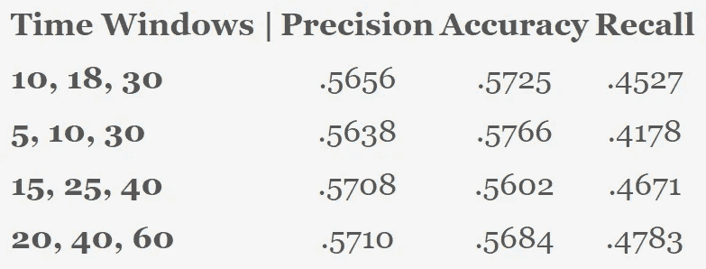

# 尝试用 ML 预测 NHL 比赛结果以及为什么很难

> 原文：<https://medium.com/codex/trying-to-predict-nhl-game-outcomes-with-ml-and-why-its-difficult-aaac4d2a690b?source=collection_archive---------6----------------------->

塞斯·赫夫曼在 [Unsplash](https://unsplash.com/s/photos/nhl?utm_source=unsplash&utm_medium=referral&utm_content=creditCopyText) 上拍摄的照片

在这里，我收集了从 2005-2006 赛季开始到 2021-2022 赛季结束的 17 个 NHL 赛季的数据。我使用网络搜集技术直接从 nhl.com[获取数据(尽管有很多更好的网站可以获取游戏数据)。我清理数据，从每个团队的个人表现中提取特征。我计算了几个不同时间段的多个统计数据的滚动平均值/汇总，并将其与对手每场比赛的相同统计数据进行比较。](https://www.nhl.com/stats/teams?aggregate=0&reportType=game&seasonFrom=20052006&seasonTo=20202021&dateFromSeason&gameType=2&filter=gamesPlayed,gte,1&sort=a_gameDate&page=0&pageSize=100)

作为我的结果的基线，在我的数据所来自的时间段内，主队赢了 16843 场比赛中的 8249 场。因此，如果有人预测主队在数据集中赢得每场比赛，他们的准确率将为 48.98%。我的最佳模型达到了 57.39%的准确率。

# 以前的发现

在文献中，来自[soccerlogic.com](https://soccerlogic.com/)的 Gianni Pischedda 使用 ClusteR(一种为体育分析开发的软件)实现了 61.54%的准确率。这些结果可以在这里阅读[。](https://www.researchgate.net/publication/284457066_Predicting_NHL_Match_Outcomes_with_ML_Models)

在一个类似的项目中，GitHub 用户 [kn-kn](https://github.com/kn-kn) 能够使用决策树和随机森林以及不同类型的数据属性组合来预测 NHL 游戏结果，准确率在 53%-58%之间。

在我的分析中，我使用了三种不同的常见 ML 模型:逻辑回归、随机森林分类和线性 SVM。迄今为止，使用逻辑回归获得了最好的结果，准确率为 57.3%。

# 清理数据和创建要素

在将数据读入 Python 并进行初步的数据清理后，下面是我要处理的数据帧:

图片来自 cbarger.com

在数据帧中，每行代表一个游戏；然而，正如您通过观察所看到的，对于每一个游戏，都有两个独立的观察值——每一个游戏一个。识别谁是主队，谁是客场队的唯一方法是使用“标识符”列。如果标识符是“vs”，则“team”列中的球队是客场球队。如果“@”，则“球队”栏中的球队是客队。为了以我想要的方式获得数据，我决定将数据帧按小组分开，这需要我制作 33 个单独的数据帧来计算统计数据。虽然效率不高，但主要是复制粘贴我已经写了很多次的代码。回想起来，我可能写了一个函数来避免复制粘贴，但是我当时不知道我做了多少。

对于每个团队的数据框架，我根据他们在过去比赛中的表现计算了各种滚动统计数据。这些统计数据将是我训练机器学习算法的基础，因为根据游戏本身的统计数据预测每场游戏的结果是可笑的。在这种情况下，我的准确率将达到 100%(ha)。撇开幽默不谈，我计算了以下统计数据的滚动统计:

*   点
*   目标
*   失球数
*   权力游戏%
*   罚杀%
*   射门得分
*   对...开枪
*   面对面获胜%
*   保存%

我计算了三个不同时间段内所有这些统计数据的平均值:短期、中期和长期。对于机器学习模型，我决定试着确定每个时间窗口的长度。以下是我在模特身上使用的不同组合:

图片来自 cbarger.com

在为每个团队完成这些之后，每个数据帧被连接成一个更大的数据帧。

但在这一点上，你可能会说类似“科尔顿，这样做之后，每个游戏仍然有两列代表它。你为什么要这样折磨我们？!"

是的，这是一个很好的观点。

为了解决这个问题，我将数据帧再次分割为主队和客场数据帧。这两个是根据对手的日期连接在一起的。最后，我们有一个数据框架

**a)** 有我们想要的数据

和

**b)** 有一行代表每个游戏

在将最大似然算法应用于数据之前，我想让这个项目尝试预测主队是否是每场比赛的赢家。要做到这一点，我需要统计数据来比较主队和客场队的滚动统计数据。在对数值进行标准化并找出主队和客队统计数据之间的差异后，我开始着手研究算法。

# 应用不同的 ML 算法

在应用不同的算法之前，我首先留出 30%的数据作为测试数据。另外 70%是用于训练我们模型的数据。

我能够随机选择游戏作为测试数据，因为我的模型只是基于时间序列数据，而这些数据已经在我们的数据框架的每个实例中得到了考虑。

# 逻辑回归

当在两件事情之间做出决定时，逻辑回归是一个很好的开始算法。在这种情况下，我们将预测主队是赢(1)还是输(0)。

数据是根据训练数据训练的，基于测试数据的测试结果如下。

下面显示了混淆矩阵示例，以及根据上面讨论的不同窗口时间长度计算的统计数据的准确度、精确度和召回率。

图片来自 cbarger.com

图片来自 cbarger.com

从混淆矩阵来看，逻辑回归算法在预测主场失利的结果(约 60%的眼球准确率)方面比主场获胜(约 53%的准确率)更有效。从精度统计数据来看，时间窗口(15，25，40)最适合用于我们数据集中的滚动统计数据。但是，时间窗口(10、18、30)在性能统计方面具有最佳的整体性能。

与更复杂的 ML 模型不同，逻辑回归模型的伟大之处在于它简单且易于训练。让我们看看其他几个例子。

# 随机森林分类器

下面显示的是在训练集上训练的随机森林回归的结果。最大树深度被设置为 5，估计器的数量被设置为 200。为了使用随机森林获得更好的结果，我可能会考虑在将来使用网格搜索来寻找最佳参数。但是现在，我不太担心。在我看来，未来的改进将更多地取决于数据的质量。

图片来自 cbarger.com

图片来自 cbarger.com

随机森林分类器的混淆矩阵与逻辑回归生成的混淆矩阵具有不同的外观。同样，我们的模型在预测房屋损失时表现相当好。然而，我们预测主队胜利的准确率只有 50%多一点。这延续了模型预测主场赢球比主场输球表现差的趋势。

与之前的模型一样，当使用基于(15，25，40)时间窗口的滚动统计时，我们的模型具有最高的精度。

# 线性 SVM

我决定测试的最后一个算法是线性 SVM 分类器。下面显示的是测试集的结果。

图片来自 cbarger.com

图片来自 cbarger.com

有趣的是，我们得到了与逻辑回归相同的混淆矩阵图。该模型在真实主场失利时表现良好，而在真实主场获胜时表现不佳。使用(20，40，60)窗口时间帧获得了最高的精度，勉强击败了其他两种算法,( 15，25，40)滚动统计时间帧。

# 结论

我在 2005 年至 2022 年期间玩的近 17，000 场 NHL 游戏上测试了一些基本的 ML 算法。我使用逻辑回归模型达到了 57.39%的峰值准确率，滚动统计时间范围为 15 场、25 场和 40 场，以比较两个对立球队之间的统计数据。

当试图预测真实的主场失利而不是主场球队的真实胜利时，这些模型往往表现得更好。必须对数据和特征工程进行进一步的探索，以弄清楚为什么会出现这种情况。

总的来说，我发现预测 NHL 团队之间的结果相当困难。曲棍球是一项传统的低得分运动，一个团队的表现不能仅仅依靠他们的竞争对手和以前比赛的统计数据来预测。这个模型没有考虑到诸如伤病、球员个人历史、停赛、球队排名和许多其他事情。简而言之，预测 NHL 比赛是很难的。

我在这里使用的所有东西都可以在 GitHub 库[这里](https://github.com/cbarger233/NHL-Scores-Predictions)获得。

*原载于 2022 年 6 月 6 日*[*【https://cbarger.com】*](https://cbarger.com/projects/nhl-predictions/)*。*