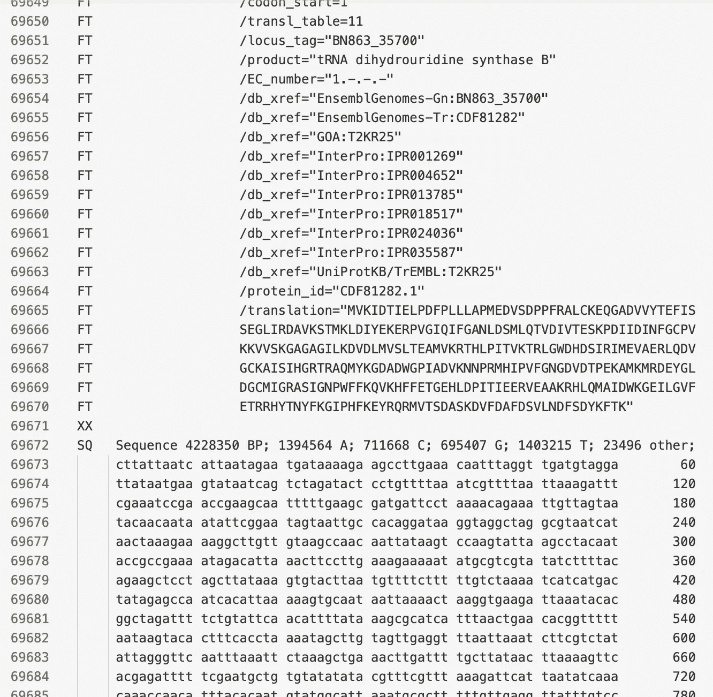
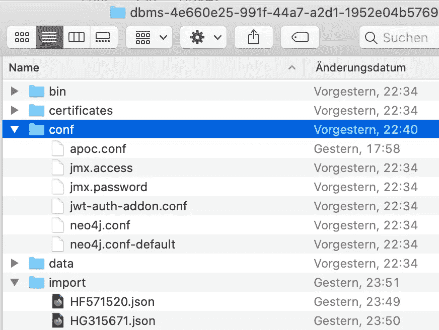
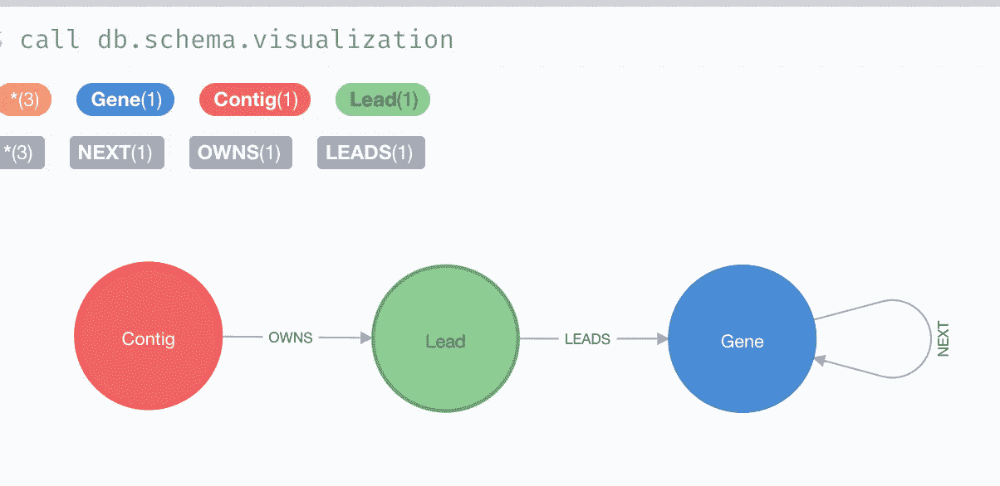
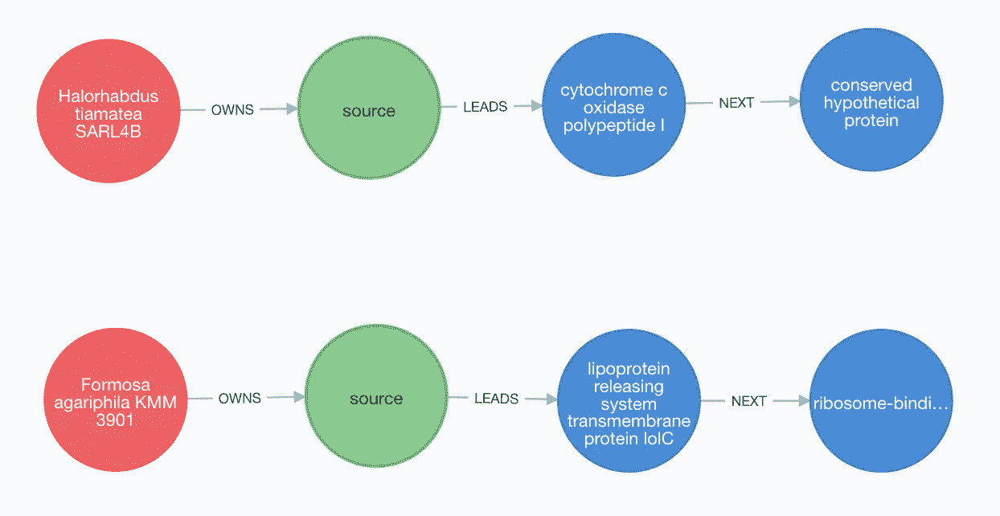
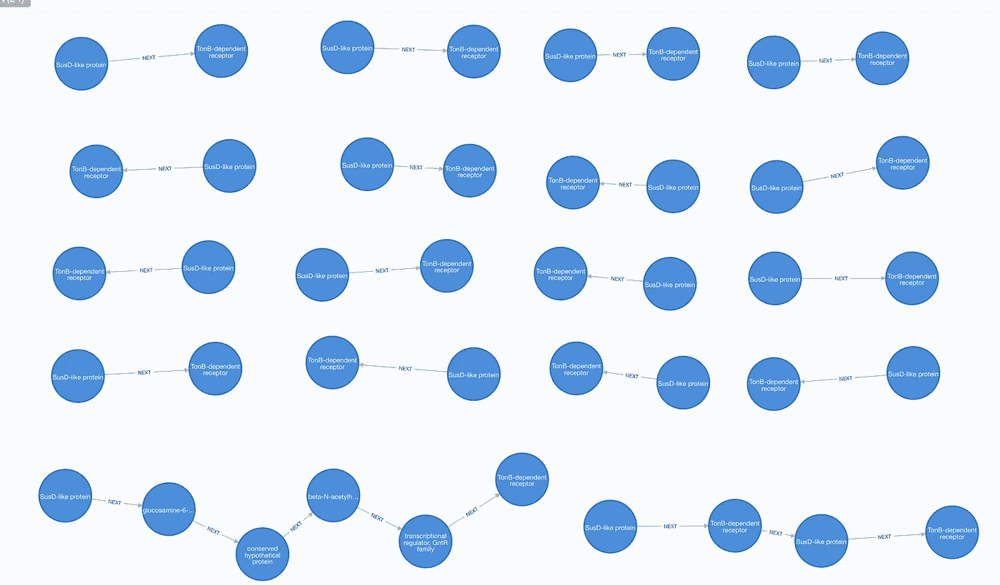
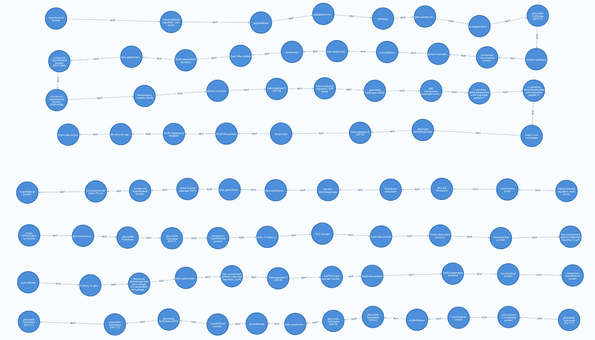
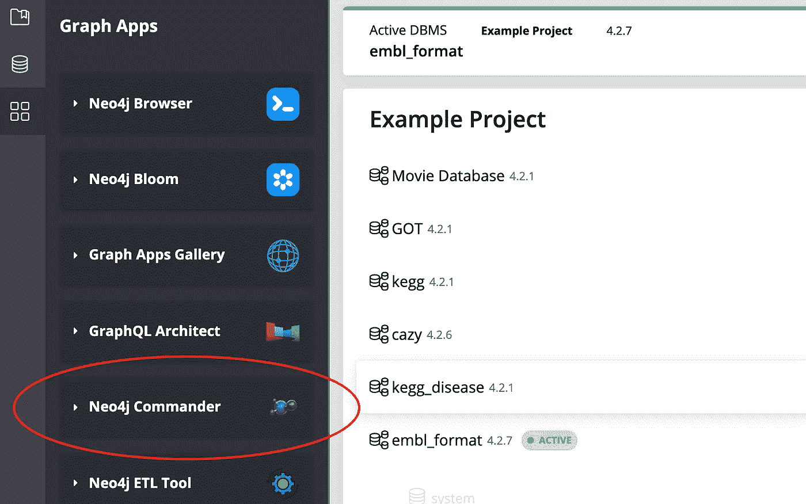
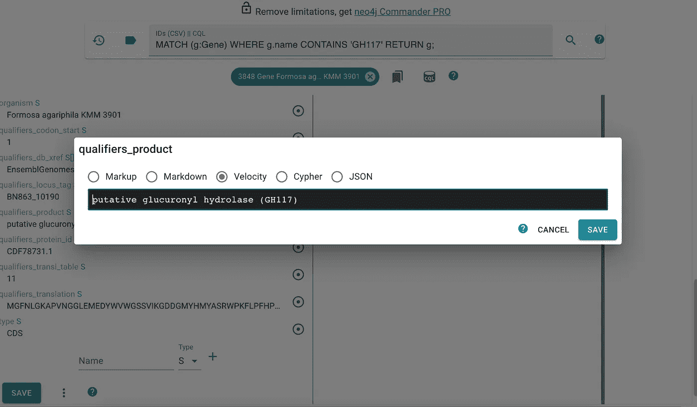
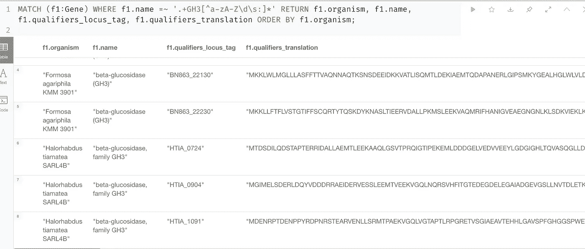

# 将 Neo4j 变成基因组浏览器

> 原文：<https://medium.com/codex/turn-neo4j-into-a-genome-browser-e94c7311dfab?source=collection_archive---------2----------------------->

## 基因簇发现、注释管理和序列管理集于一身

如果说 21 世纪是生物学的时代( [1](https://www.oecd.org/sti/emerging-tech/A%20Glover.pdf) )，那么基因组测序就是先兆。基因组测序基本上是将 DNA 分子转化为计算机中的文本。DNA 序列存储在简单的 ASCII 文本文件中，如 Fasta 和 Fastq。生物学家然后对它们运行程序来发现蛋白质(开放阅读框架预测)。这些预测的蛋白质的功能可以通过它们在数据库中的近亲来猜测(蛋白质注释，请阅读我的文章[这里](/geekculture/analyzing-genomes-in-a-graph-database-27a45faa0ae8)和[这里](https://towardsdatascience.com/graph-database-graphql-and-machine-learning-for-carbohydrate-active-enzymes-dba8500b45cf)了解更多信息)。生物学家把所有这些作品保存成 GBK 或 EMBL 这样的文件:



图一。EMBL 文件的示例。图片作者。

GBK 或 EMBL 的文件仍然只是文本文件。他们的数据一览无余，这是我能想到的唯一优势。生物学家可以将文件导入工具，如经典的 Artemis 用于基因可视化。但是 Artemis 只是一个 GUI 程序，而不是查询引擎。因此它不允许生物学家执行查询，例如:

1.  显示基因组中的 GH13 蛋白序列；
2.  显示每个 GH16 基因周围的五个邻近基因；
3.  显示所有 TonB 依赖性受体和 SusD 样蛋白基因对，只要它们之间的距离小于 10，000 个碱基对。

在大数据时代，将文本文件放入数据仓库进行存储、版本控制和分析是一种常见的做法。生物学家求助于 GenDB 等系统来完成这项任务。GenDB 是 2003 年的一款单片软件，它依靠复杂的关系表网络来管理基因组、基因和注释。GenDB 强调了关系数据库在基因组分析中的缺点。首先，GBK 和 EMBL 文件是半结构化数据，它们的数据字段在不同的提交者之间会有所不同。这使得严格的模式设计变得困难。设计者需要经常改变模式以适应新的字段。或者他们决定创建新表并保持旧表不变。结果，基因属性分散在许多不同的地方，以至于即使一个简单的查询也需要几个“连接”。其次，关系数据库将基因的线性关系分解成表项。这使得很难制定基因簇查找查询。最后但并非最不重要的一点是，它对于大型项目的可扩展性很差，并且它不是云就绪的。

生物信息学家当然可以自己动手制作一些 Biopython Jupyter 笔记本来逐一回答这些问题。但这将每个查询变成了一个编程项目，并将许多生物学家拒之门外。此外，这不是一个长期的数据仓库解决方案。

如果我们能有一个这样的数据库，那不是很好吗:

1.  允许导入和导出 EMBL 或 GBK 文件；
2.  反映了基因之间的线性关系；
3.  以 NoSQL 方式存储基因属性，而不是表；
4.  可视化查询结果；
5.  为手动数据编辑提供 GUI
6.  有一个简单但强大的查询语言；
7.  具有可扩展性和云就绪性。

虽然 NoSQL 数据库可以检查这个列表中的几个项目，但它们没有内置的机制来表示基因之间的线性关系。此外，NoSQL 将查询结果作为文档返回，没有任何图形表示。这对许多生物学家来说是一个障碍，因为他们需要目测检查结果。

图形数据库 Neo4j 符合这个要求。我以前文章的读者([这里](/geekculture/analyzing-genomes-in-a-graph-database-27a45faa0ae8)，这里[这里](https://towardsdatascience.com/neo4j-for-diseases-959dffb5b479)和[这里](https://towardsdatascience.com/graph-database-graphql-and-machine-learning-for-carbohydrate-active-enzymes-dba8500b45cf?source=your_stories_page-------------------------------------))可能已经知道 Neo4j 可以为生物信息学中的许多分析项目提供动力。在这篇文章中，我将向您展示它也可以作为基因组浏览器和仓库。EMBL 文件可以导入和导出。图形是表达基因组中基因排列的一种自然而直观的方式。基因属性作为键值对存储在每个节点中。graph app**Neo4j Commander**是一个很棒的用于手动基因注释的 GUI 编辑器。Neo4j 使用简单而强大的 Cypher 语言。有了它，我们可以用非常简单的语句来表达复杂的查询。它的企业版包含 **Fabric** ，可以对图形数据进行分片以实现可伸缩性。对于云原生用户，Neo4j 提供了数据库即服务(DaaS)选项 **Aura** ，一些用户可以通过云中的虚拟机轻松托管自己的数据库。

这个项目的代码存放在我的 Github 库中。

[](https://github.com/dgg32/neo4j_genome_browser) [## dgg 32/neo4j _ 基因组 _ 浏览器

### 这个存储库包含我的文章“将 Neo4j 变成基因组浏览器”的代码和数据。Neo4j 桌面 python…

github.com](https://github.com/dgg32/neo4j_genome_browser) 

# 1.数据准备和导入

我只用两个基因组来做这个演示:Werner *等人*的[Halorhabdus tiamateaSARL4B](https://www.ebi.ac.uk/ena/browser/view/HF571520.1)的完整染色体。曼恩*等人*的 [*台湾沉香* KMM 3901](https://www.ebi.ac.uk/ena/browser/view/HG315671) 的全基因组..这两个 EMBL 文件都通过我的脚本转换成 JSON 格式。您可以在我的存储库中找到原始文件和 JSON 文件。

在 [Neo4j 桌面](https://neo4j.com/download/)创建一个项目并启用 APOC 插件。使用`Open folder -> Import`菜单打开`import`文件夹。将 JSON 文件放入文件夹。然后向上一级到`conf`文件夹，创建一个名为`apoc.conf`的文本文件，并将这两行粘贴到其中:

```
apoc.import.file.enabled=trueapoc.export.file.enabled=true
```

因此，您的项目文件夹应该具有这样的文件结构:



图二。此项目的文件结构。图片作者。

现在运行以下命令导入数据:

数据库具有以下简单的数据结构(模式):



图 3。此项目的架构

`Contig`节点包含所有 EMBL 元数据，包括分类法、出版物和排序信息。`Lead`节点是 EMBL 文件中的第一个特征，即`source`特征。`Gene`节点代表基因，包含关于其功能、基因组坐标和翻译的蛋白质序列的键值对。下面是两个具体的例子:



图 4。两个基因组的前四个节点。图片作者。

# 2.基因组统计学

一旦数据在 Neo4j 内部，计算一些复杂的基因组统计数据就相当容易了。例如，以下查询计算了 *Halorhabdus tiamatea* 染色体中 GH 的数量:

查询返回“42 ”,它与 Werner *等人*报告的数字一致..

据报道，富含 at 和 GC 的微生物基因组中氨基酸的使用是不同的。我们可以像这样研究两个基因组之间的原始氨基酸计数:

该查询使用`REDUCE`函数来聚合两个基因组的结果。他们清楚地表明，亮氨酸(L)和异亮氨酸(I)这两种支链氨基酸在*福尔摩沙*中比在*盐杆菌*中更常见。这两个基因组确实有一些共同点:两种含硫氨基酸:蛋氨酸(M)和半胱氨酸(C)都出现在列表的底部。

# 3.寻找基因簇

在基因组学中，对单个基因的分析当然很重要。但有时对基因簇的分析更能揭示问题。基因簇是功能相关基因共同定位的基因组区域。操纵子是经典的基因簇。操纵子内的基因一起被转录和调节。另一个例子是多糖利用位点(PUL)。它是碳水化合物活性酶(CAZymes)基因和膜转运基因的集合体。它们的基因产物可以解聚和动员碳水化合物分子，因此它们在我们生态系统中多糖的生物再循环中起着关键作用。

发现基因簇才是 Neo4j 真正出彩的地方。例如，以下查询搜索以`SusD-like protein`和`TonB-dependent receptor`结尾的基因簇，只要片段短于 *Formosa agariphila* 中的 10，000 个碱基对。



图 5。琼胶蕈中的 TonB 依赖受体。图片作者。

该查询很快检索到 18 个这样的聚类。TonB 依赖受体和 SusD 样蛋白一起形成转运蛋白，允许聚糖和其他分子流入。它们是脉冲部件。基因组中这种簇的数量暗示了细菌的多糖降解能力。

从绿藻*中分离出尖端管藻*，细菌 *F* 。*木耳*不仅能降解绿藻中的多糖，还能降解褐藻中的多糖。GH16 CAZymes 负责其许多琼胶分解活性。和 GH16 基因通常与其他 CAZymes 或 TonB 依赖的受体一起形成 PULs。下面的查询将返回所有以 GH16 为中心的基因簇，在 *F* 中每边有五个邻居。 *agariphila* :



图 6。台湾沉香中的五个 GH16 中心基因簇。图片作者。

该命令返回五个脉冲。其中三个正好有 11 个基因。第四个有十二个，因为两个 GH16 CAZymes 是直接相邻的。最后，揭示了一个具有 35 个基因的超级脉冲。这种超级 PUL 包含四种 GH16 CAZymes:两种β-卟啉酶和两种β-琼脂酶。此外，GH2、GH28、GH29 和 GH117 都在附近出现两次。因为海藻多糖有时会被硫酸化， *F* 。 *agariphila* 在降解前必须用硫酸酯酶去除硫酸基团。集群中有四种硫酸酯酶。最后，TonB 依赖性受体、SusD 样蛋白和 ABC 转运蛋白也分散在该片段中。

总之，这些簇包含许多碳水化合物降解基因，这些基因是 *F* 琼胶分解生活方式的特征。*琼脂糖凝胶*。这个问题也向我们展示了简单的“海藻多糖降解”活动背后的酶协同工作的规模。对这些簇的进一步研究可以加深我们对该过程的理解，甚至导致工业应用。

# 4.数据编辑

Neo4j 不仅显示信息，还允许编辑。这对生物学家尤其重要，因为他们经常需要手动纠正基因组注释。应用程序 Galary 中的应用程序 Neo4j Commander 是实现这一目的的便捷工具。



图 7。Neo4j Commander 应用程序为 Neo4j 添加了编辑功能。

您可以按照 Neo4j 桌面中的说明安装该应用程序。安装并打开后，我们可以在 GUI 中添加、删除和编辑基因属性。



图 8。Neo4j Commander 中的基因注释编辑。

如图 8 所示。，我们可以首先使用查询来定位基因条目。然后，我们可以单击属性字段并开始编辑。当我们单击“保存”时，更改将被写回数据库。

# 5.出口

最后，我们的 Neo4j 基因组仓库也可以将序列导出到 Fasta 或 EMBL 文件中。它甚至支持跨基因组输出。例如，如果我们想要两个 *H. tiamatea* 和 *F* 的所有 GH3 序列。 *agariphila* 对于比较基因组分析，以下命令一次性返回它们:



图 7。GH3 序列通过简单的查询检索。图片作者。

上面的查询通过正则表达式捕获产品名称中的“GH3”关键字。我们可以通过将查询封装在`apoc.export.json.query`函数中，将结果导出到 Json 文件中:

Json 文件也位于`import`文件夹中。然后可以从我的存储库中通过 Python 脚本将其转换成 Fasta 文件。

我们也可以在人工处理后将整个基因组导出到 EMBL 文件中:

这个命令写一个 Json 文件。然后，我的 Python 脚本 json_2_embl.py 可以将其转换成 embl 文件。

# 结论

本文展示了 Neo4j 如何同时成为强大的基因组浏览器和数据仓库。目前，在线数据库，如国家生物技术信息中心(NCBI)或欧洲生物信息学研究所(EBI)仍然存有基因组文本文件。他们的网站允许一些简单的全文搜索。但是像本文中提出的复杂查询在那里还不可能实现。如果这两个研究所可以使用 Neo4j 作为他们的后端仓库，用户可以执行更复杂的查询，并在服务器端进行比较分析。事实上，他们甚至可以用相同的设计在 Neo4j 中存储元基因组。我相信这一转变将加速基因组学和宏基因组学的新发现。

但是，我的 Neo4j 设计并不完美。我试图将几兆字节的 DNA 序列存储到`Contig`节点中。令我惊讶的是，臃肿的`Contig`节点严重降低了数据库性能。因此，我决定在图表中省略 DNA 序列的输入。这就是为什么`json_2_embl.py`剧本需要原始的 EMBL 文件的原因。我希望 Neo4j 的未来版本可以解决性能问题。

你们的基因组研究也用 Neo4j 吗？如果有，请和我分享一下你的经历。

[](https://dgg32.medium.com/membership) [## 加入媒介与我的介绍链接-黄思兴

### 作为一个媒体会员，你的会员费的一部分会给你阅读的作家，你可以完全接触到每一个故事…

dgg32.medium.com](https://dgg32.medium.com/membership)