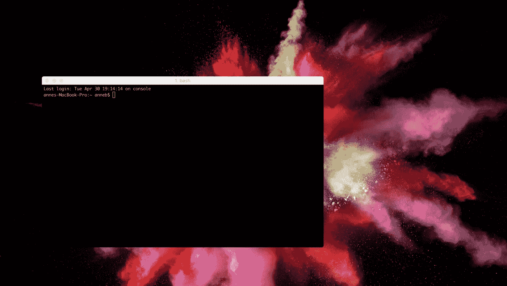
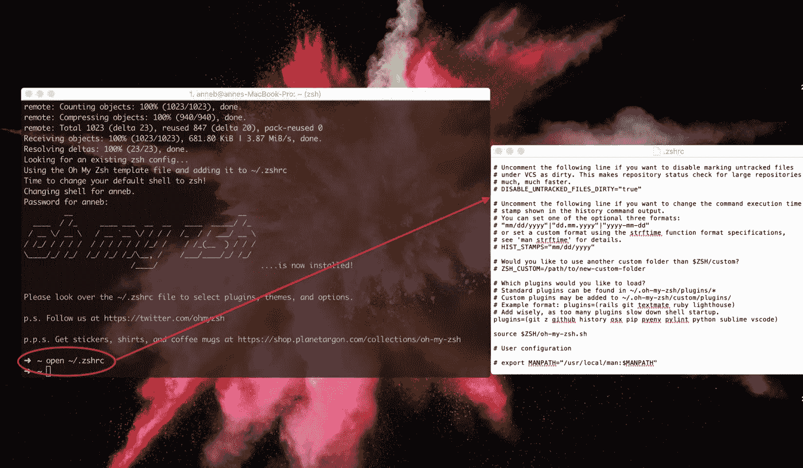

# 把你无聊的终端变成一个性感的终端

> 原文：<https://medium.com/codex/turn-your-boring-terminal-into-a-sexy-one-5d184972cc3b?source=collection_archive---------2----------------------->


由 [Unsplash](https://unsplash.com?utm_source=medium&utm_medium=referral) 上的[火星扇区-6](https://unsplash.com/@heylagostechie?utm_source=medium&utm_medium=referral) 拍摄的照片

无需时间或精力，您可以轻松地将终端从令人沮丧的黑色或白色模块转变为美观、快速、有趣、易于使用且功能强大的开发平台。

当您开始您的编码之旅时，您将很快意识到您将花费大量时间来查看终端。无论是启动一个新项目，还是配置您的项目环境，或者在本地或服务器上运行一些基本的 Linux 命令。无论您是哪种类型的开发人员，花几分钟时间放松一下，让您的终端成为一个更友好的地方都是一个好主意。

# 终端与 iTerm

不一定要用终端！有一个改进的终端叫做 [iTerm](https://www.iterm2.com/downloads.html) ，它更加可定制化，并且有很多很酷的功能。你可以快速搜索一下。您可以拆分窗格。你有各种各样的选项，这些选项可能是你在常规的终端窗口中从未考虑过的。

安装 iTerm 后，您将在第一次启动时看到这个屏幕。



MAC 上的默认 shell 曾经是 Bash，但是在 MacOS Catalina 之后，它变成了 Zsh。如果您的 Mac 上没有安装 Zsh shell，那么您可以在这里[获得它](http://zsh.org/)或者您可以 brew:

> brew 安装 zsh

# [哦我的 Zsh](https://github.com/robbyrussell/oh-my-zsh)

你需要得到 [Oh-My-Zsh](https://github.com/robbyrussell/oh-my-zsh) ！这是一个用于管理您的 Zsh 配置的开源框架，它有数以千计令人敬畏的助手和函数、插件和主题。您可以通过运行以下命令下载它

```
sh -c "$(curl -fsSL https://raw.githubusercontent.com/robbyrussell/oh-my-zsh/master/tools/install.sh)"
```

你可以在这里找到官方插件的完整列表。只要你想，他们随时可以出发。您只需将它们添加到您的~/中即可启用它们。zshrc 文件。

添加插件非常容易，但是如果你是终端新手，这些说明可能没有意义。当您想要进行这样的更改时，您需要编辑您的~/。zshrc 文件。这听起来很复杂，但实际上并不复杂！要打开该文件，请运行

```
open ~/.zshrc
```



当你浏览这个文件时，你会看到一些东西，如果你想改变它们，你可以取消注释。您还会看到可以添加您自己的修改的空间。

想要添加或删除插件？向下滚动到这一部分:

```
# Which plugins would you like to load?
# Standard plugins can be found in ~/.oh-my-zsh/plugins/*
# Custom plugins may be added to ~/.oh-my-zsh/custom/plugins/
# Example format: plugins=(rails git textmate ruby lighthouse)
# Add wisely, as too many plugins slow down shell startup.
plugins=(git)
```

> 现在添加任何你想使用的插件。例如，您可能希望将最后一行改为

```
plugins=(git z github history macos pip pyenv pylint python sublime vscode)
```

# 语法突出显示

您希望突出显示 Zsh 语法。它会告诉你，如果你的命令有效，甚至在你运行它之前。很方便。

要启用语法突出显示，请运行

```
cd ~/.oh-my-zsh && git clone [git://github.com/zsh-users/zsh-syntax-highlighting.git](https://github.com/zsh-users/zsh-syntax-highlighting.git)echo "source ${(q-)PWD}/zsh-syntax-highlighting/zsh-syntax-highlighting.zsh" >> ${ZDOTDIR:-$HOME}/.zshrc
```

然后通过运行以下命令启用它

```
source ~/.oh-my-zsh/zsh-syntax-highlighting/zsh-syntax-highlighting.zsh
```

重新启动您的终端以使您的更改生效。

# 最精彩的部分来了

虽然有很多主题可以用来修改终端窗口的外观，但您可能希望从简单的开始。

打开 iTerm，将 iTerm 菜单下拉至“首选项”会弹出一个有很多选择的窗口。您可以选择您喜欢的颜色，或者使用“颜色”标签中“颜色预设”下拉菜单中的一个选项。你可能想选择一个黑色的主题或者做一些其他简单的颜色选择。在“文本”标签下，很容易改变字体和字体大小

您也可以随时导入不同的主题。我使用 [**材质设计**](https://github.com/MartinSeeler/iterm2-material-design) 作为配色方案，但是你有很多选择。看看[这个 GitHub 库](https://github.com/robbyrussell/oh-my-zsh/wiki/Themes)的例子。

联系我:[https://twitter.com/serdarilarslan](https://twitter.com/serdarilarslan)

我们来连线:[https://www.linkedin.com/in/serdarilarslan/](https://www.linkedin.com/in/serdarilarslan/)