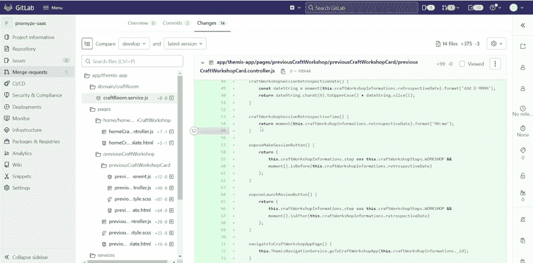
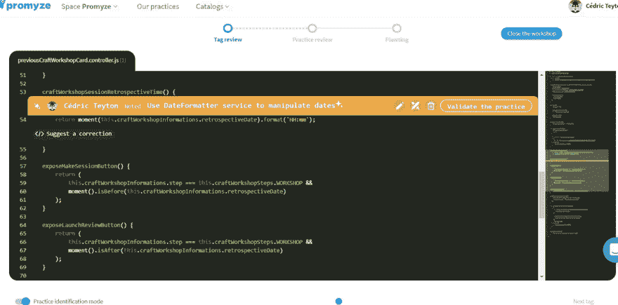
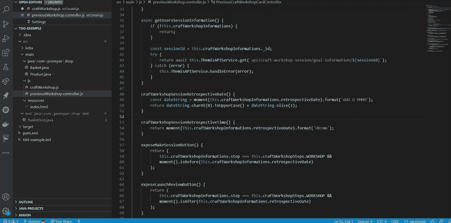

# 把你在 GitLab 上的代码评审评论变成给开发者的自动建议

> 原文：<https://medium.com/codex/turn-your-code-review-comments-on-gitlab-into-linter-rules-f0fcdfeae181?source=collection_archive---------19----------------------->

资料来源:pexels.com

当实践代码评审的开发人员在他们的评论中重复相同的概念和最佳实践时，他们有时会感到疲倦和沮丧。

代码评审也是关于**教育开发人员**，所以这种观察是很自然的，也是过程的一部分。

尽管如此，在优化技术团队内部的整体代码审查和知识共享过程方面，还有一个缺口需要填补。在本帖中，我们建议采用以下方法:

*   如果你写了一个关于项目最佳实践的代码评审评论，把它变成你团队的**共享知识**
*   如果你的团队同意你的建议，试着用一个正则表达式让它**可识别**

让我们看看如何使用 [Promyze](https://promyze.com/) 来达到这个目的。

# 1.从代码评审注释中创建最佳实践

Promyze 带有网络浏览器插件，可从扩展市场获得。一旦你在 Promyze 上设置了你的账户，获取你的 API 密匙并粘贴到插件设置中。

该插件将丰富您在 GitLab、GitHub、Azure DevOps 和 Bitbucket 上的拉取/合并请求页面的体验。

在下面的这个例子中，我们在 GitLab 上制定了一个关于在角度控制器中直接使用**力矩**框架的注释。假设在这个项目的上下文中，我们应该使用为此目的设计的模块 **DateFormatter** 。

如你所见，在评论区的右下方有一个按钮“识别 Promyze 实践”。点击它，在 Promyze 中创建一个最佳实践。

# 2.自动检测的集体验证和配置

Promyze 带有*工艺研讨会*的概念，这是致力于持续改进我们的最佳编码实践的技术回顾。这个想法是审查团队中所有开发人员的每个贡献(就像我们在第一步中所做的那样)。这个过程将持续 30 分钟到 1 小时，并且会定期进行(例如，每次冲刺一次)。

感谢下面的屏幕，我将向我的团队解释为什么我认为这段代码可以改进，如果它调用 DateFormatter 服务。我想让它成为我们知识库的最佳实践。假设在几分钟的谈话后，我们同意并决定**验证实践**。之后，我们可以编写一个正则表达式来检测这个**实践何时没有应用**。

在这里，如果我们检测到“moment”(在以“. controller.js”结尾的文件中)，这可能是一种不好的味道。

很简单，对吧？

# 3.获取 VS 代码中的建议

配置完成后，团队中的每个开发人员都会在他们最喜欢的 IDE 中收到通知。Promyze 与 VS 代码、Visual Studio、JetBrains 套件和 Eclipse 兼容。

使用 moment 框架可以看到源代码上显示的橙色火箭。

# 有什么好处？

*   在下一次代码评审中节省时间
*   确保团队中的每个人都理解实践
*   编码时获得早期反馈，以确保遵循最佳实践

想试试吗？从 [Promyze](https://promyze.com/) 开始！