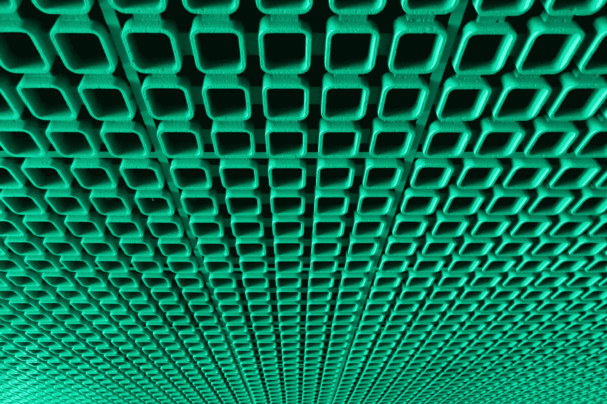

# 教程:Kubernetes 复制集、daemonsets 和作业

> 原文：<https://medium.com/codex/tutorial-kubernetes-replicasets-daemonsets-and-jobs-3ebfa251ac73?source=collection_archive---------2----------------------->

## [法典](http://medium.com/codex)

由[帕特里克·舍普弗林](https://unsplash.com/@patrickschoepflin?utm_source=unsplash&utm_medium=referral&utm_content=creditCopyText)在 [Unsplash](https://unsplash.com/s/photos/repeat?utm_source=unsplash&utm_medium=referral&utm_content=creditCopyText) 上拍摄的照片

在之前关于 Kubernetes (k8s)的帖子中，我在这里讨论了一些基本概念[，也在这里](https://mshazninazeer.medium.com/kubernetes-demystified-736756645001)看了第一步[。在这篇文章中，让我们更深入地看看复制集。然后我还会谈到 k8s 世界中的 daemonsets (ds)和 jobs 是什么。](https://mshazninazeer.medium.com/first-steps-in-kubernetes-96ec150b95ae)

# 什么是复制集？