# 推特机器人，比你想象的要微妙得多

> 原文：<https://medium.com/codex/twitter-bots-a-lot-more-nuanced-than-you-think-cab23f925940?source=collection_archive---------11----------------------->

## 利用本福特定律识别 Twitter 上的恶意账户

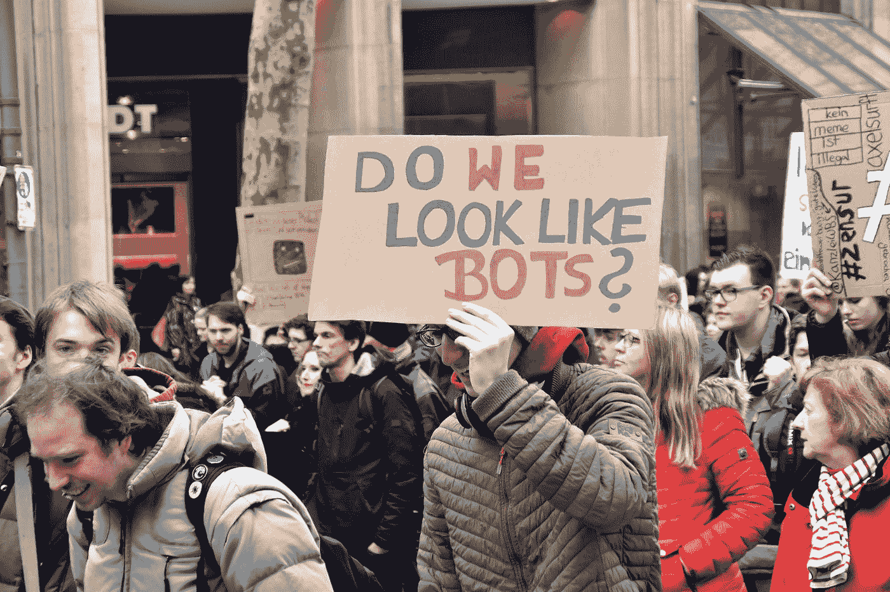

在 [Unsplash](https://unsplash.com?utm_source=medium&utm_medium=referral) 上由 [Waldemar Brandt](https://unsplash.com/@waldemarbrandt67w?utm_source=medium&utm_medium=referral) 拍照

社交媒体已经改变了人们相互交流的方式，无论是好的还是坏的。有了社交媒体，与住在地球另一端的老朋友联系非常容易。这也使更多的人能够听到他们的声音，而不仅仅是政治家和名人。然而，它也有一些缺点。有些人认为他们在社交媒体上的互动在现实生活中无关紧要，这是网络欺凌泛滥的原因之一。此外，bot 帐户一直在被创建。这些 bot 帐户可能是恶意的，并可能以各种方式造成伤害，如传播假新闻和错误信息。

我不是唯一一个认为机器人账户可能是恶意的人。在宣布他将收购 Twitter 后， [Elon Musk 对这笔收购有所怀疑](https://www.bbc.com/news/technology-62571733)，因为 Twitter 上有大量的机器人账户。尽管除了机器人问题之外，他可能还有其他原因退出收购(机器人研究人员[不支持](https://www.bbc.com/news/technology-62571733#:~:text=However%2C%20Botometer%20creator%20and%20maintainer%2C%20Kaicheng%20Yang%2C%20said%20the%20figure%20%22doesn%27t%20mean%20anything%22.)马斯克的观点)，但 Twitter 机器人的实际存在仍然是无可争议的。


克劳迪奥·施瓦茨在 [Unsplash](https://unsplash.com?utm_source=medium&utm_medium=referral) 上拍摄的照片

基于这一论述，我试图开发一个程序来确定一个 Twitter 帐户是否是一个机器人。这个项目的灵感来自于我看了一部名为 [Connected](https://www.netflix.com/se-en/title/81031737) 的网飞纪录片。在关于数字的那一集里，科学记者拉蒂夫·纳赛尔谈到了一个叫做本福特定律的普遍定律。如果某件事是自然发生的，通常它会遵循本福特定律。这包括税单、选举、降雨率、城市人口等。因此，如果有不符合该法律的行为，例如欺诈性纳税申报单、操纵选举和社交媒体机器人账户，就有可能检测到欺诈或异常行为。本福特定律主要通过分析数字的第一位数字来工作(例如 100 以 1 开头；82309 从 8)开始，然后可视化分布。虽然人们可能认为第一个数字是均匀分布的，但根据本福特定律，情况并非如此。该定律指出，第一个数字是对数正态分布；以一开头的数字出现的几率为 30.1%，以二开头的数字出现的几率为 17.6%，以此类推，就像下面这张[罗布·贡萨尔维斯](https://towardsdatascience.com/benfords-law-a-simple-explanation-341e17abbe75)发布的图表一样。

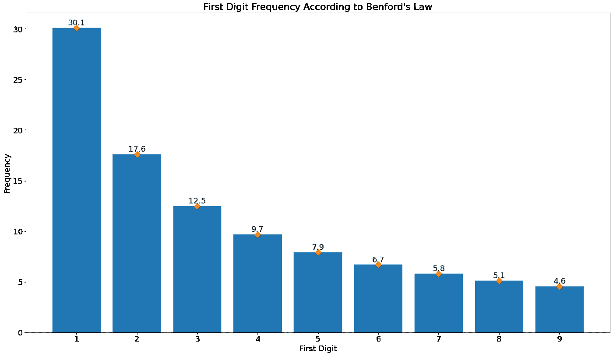

*第一位数字频率根据本福特定律(来源:*[](https://towardsdatascience.com/benfords-law-a-simple-explanation-341e17abbe75)**)**

*在“连线”一集中，拉蒂夫会见了马里兰大学的珍·戈尔贝克教授，她谈到了在 Twitter 上使用本福德定律，并发现了不遵守该定律的账户。然后，她声称这些帐户是具有潜在恶意的机器人帐户。通过使用一个帐户的追随者列表，然后获取追随者的第一个数字，Golbeck 能够使用本福德定律分析数据。她发现了几十个可疑的账户，她怀疑这些账户是俄罗斯的机器人，以备将来使用。*

**

*珍·戈尔贝克教授和拉蒂夫·纳赛尔(来源:[网飞 via IndieWire](https://www.indiewire.com/2020/08/connected-netflix-host-latif-nasser-radiolab-1234578155/)*

*看完纪录片后，我开始深入研究一些与本福德定律相关的论文，包括戈尔贝克教授关于她的实验的论文。她写道，她对大量 Twitter 账户进行了卡方检验，然后忽略了统计显著性水平，只关注 p 值。p 值越高，数据集越遵循本福特定律，这意味着帐户行为自然，值越低，帐户可疑的几率越高。她通过浏览一个账户的追随者列表，然后获取追随者的第一个数字，进行了本福德定律分析。*

*有了更好的理解后，我继续确保我拥有所需的工具。在本例中，我使用 Python 编写代码，由于数据来自 Twitter，所以我需要使用 Twitter API。因为 Python 有一个使用 Twitter API 的库，比如 Tweepy，我之前在有过[的经验，我认为这是一个获取数据进行探索性数据分析的良好开端。我知道 Twitter 把关注者的数量放在他们所谓的*公共指标*上。然而，Tweepy 让我失望的是，尽管有参数可以这样做，但却无法获取 Twitter 的 *public_metrics* 。](/codex/whose-tweet-was-it-originally-f746d4058e6f)*

*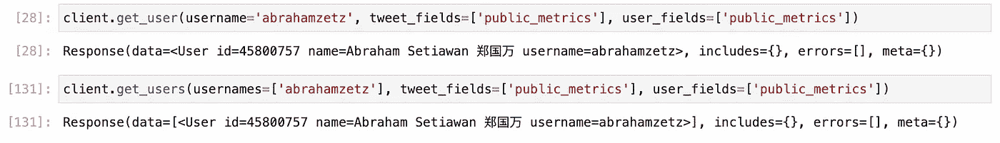*

*Tweepy 不显示 *public_metrics(图片由作者提供)**

*幸运的是，我找到了一个替代库，它允许我获取 *public_metrics* ，一个名为 [Twarc](https://twarc-project.readthedocs.io/en/latest/) 的库。虽然它的语法与 Tweepy 不同，但它可以做我在这个项目中需要的所有事情，而且我没有花太多时间就适应了 Twarc。*

```
*from twarc.client2 import Twarc2bearer_token='<can be retrieved from Twitter developer portal>'
t = Twarc2(bearer_token=bearer_token)*
```

*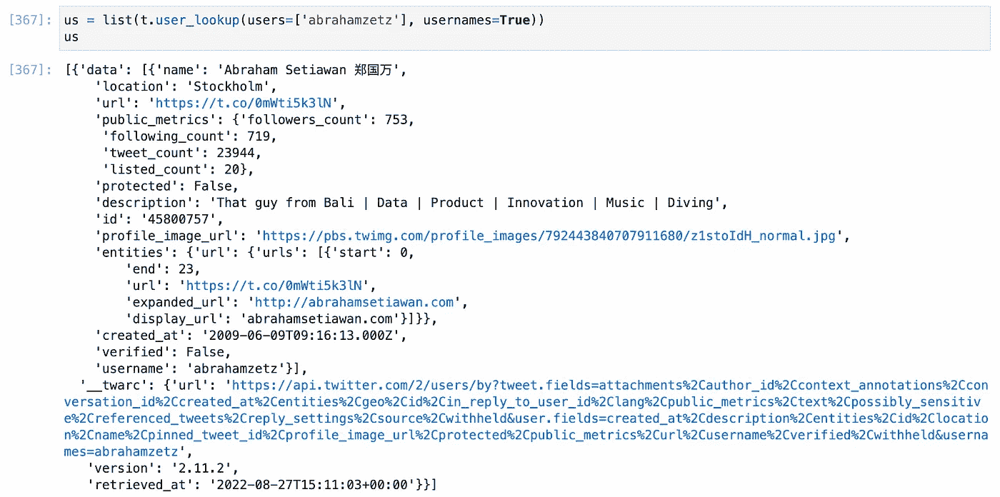*

*Twarc 很容易获取用户信息，包括 public_metrics(作者图片)*

*最后，我找到了一个本福特定律的 Python 库，它让我不用从头开始写一个，它的名字很简单: [benfordslaw](https://pypi.org/project/benfordslaw/#:~:text=benfordslaw%20is%20Python%20package%20to,is%20likely%20to%20be%20small.) 。*

*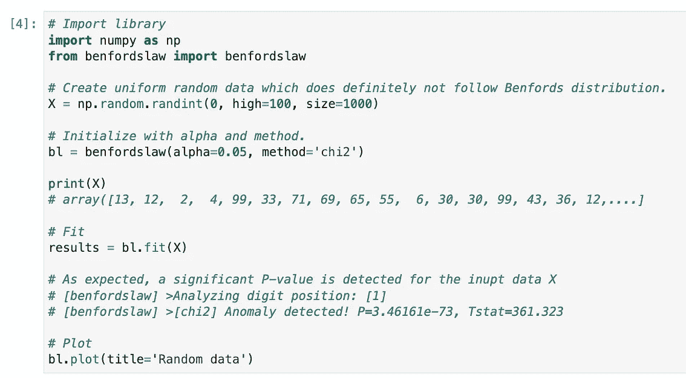**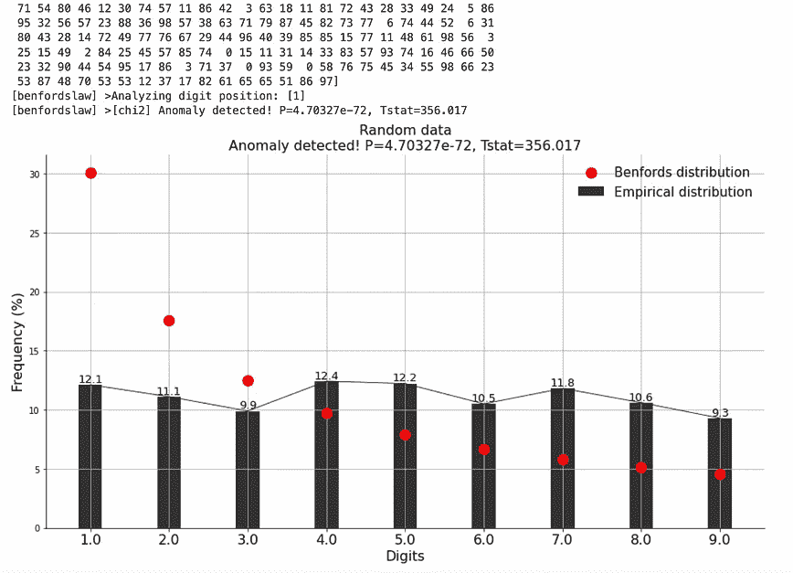*

*benfordslaw Python 库，展示了随机数据(均匀分布)如何不遵循 Benford 定律(对数正态分布)(图片由作者提供)*

*通过 Twarc 和 benfordslaw 库，我决定从 Twitter 获取一些测试数据，并将其与 Benford 定律进行映射。*

```
*fol2 = list(t.followers(get_userid('abrahamspartner')))
df_partner = pd.json_normalize(fol2[0]['data'])*
```

*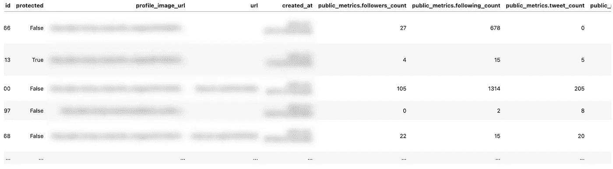*

*从我的合作伙伴的 Twitter 帐户获取数据(图片由作者提供)*

*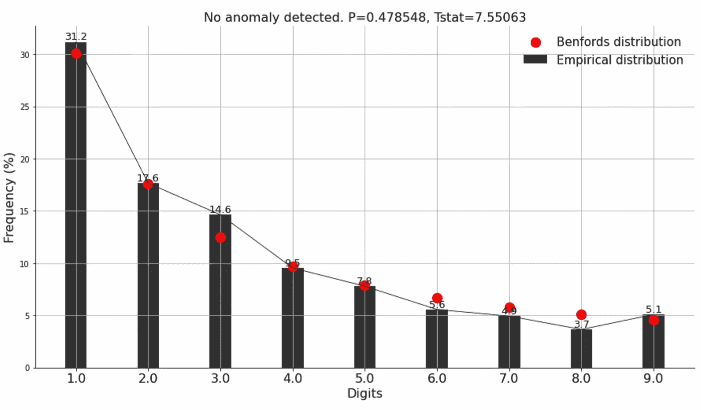*

*我搭档的推特账户反映了本福特定律(图片由作者提供)*

*然后我对我自己的个人资料和我在 Twitter 上找到的一个机器人个人资料做了同样的事情。这是它们的样子。*

*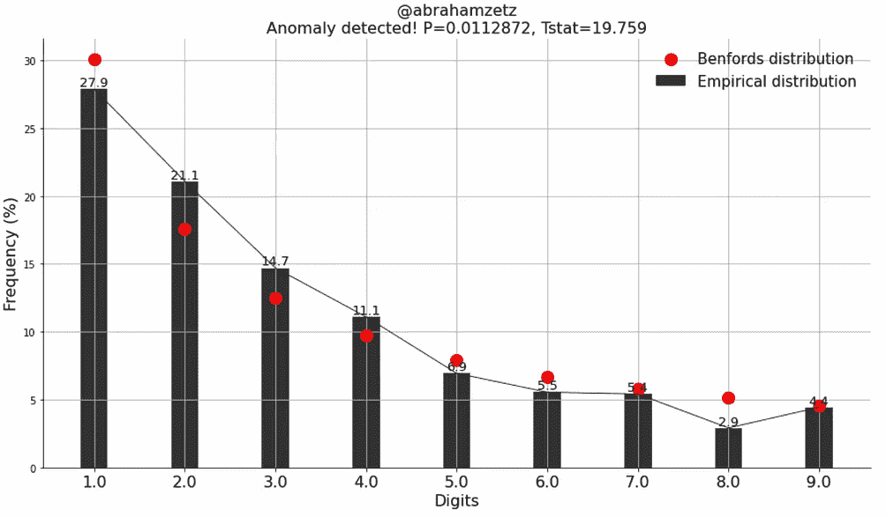**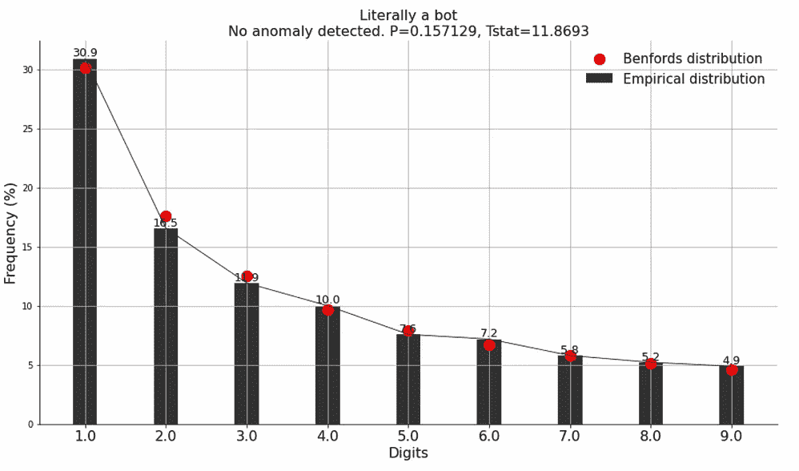*

*我的个人资料和机器人个人资料的分发(图片由作者提供)*

*我很惊讶地看到我的帐户如何反映本福德定律少于一个实际的机器人帐户。有那么一瞬间，我想“*我是机器人，但机器人不是机器人？我比机器人更机器人吗？！*“此外，benfordslaw 库自动添加*检测到异常！*文本如果 p 值低于预定的 alpha，这就更加离奇了。但后来我回到了戈尔贝克教授的方法，即阿尔法值(*是否具有统计显著性*)并不重要，只有 p 值才重要。尽管如此，这并不能解释为什么机器人的 p 值比我的高。*

*经过进一步思考和分析，我意识到我使用 Twitter 的方式是不标准的。我在 Instagram 上发图片的时候大多是在 Twitter 上发东西。这可能会影响人们如何与我的 Twitter 个人资料互动，以及谁会关注我的个人资料。*

**

*我如何在 Twitter 上发布(图片由作者提供)*

*另一方面，我选择的机器人账户对成为机器人非常开放，它所做的是分享来自特定博物馆的相关艺术品。这具有娱乐价值，这也解释了为什么人们会关注这个机器人账户。*

*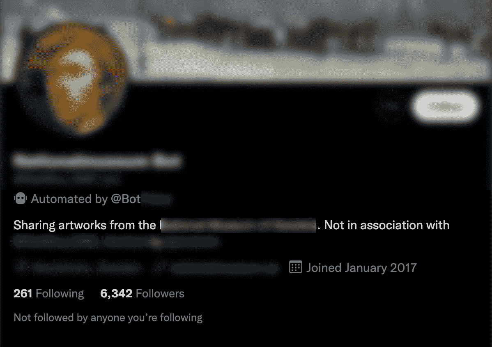*

*娱乐机器人账号(截图来自推特)*

*这给在 Twitter 上识别机器人的任务带来了更多的细微差别，因为娱乐机器人被本福德定律认为是自然的。然而，我们可以将目标定位于可疑账户，而不是所有的机器人。为了做到这一点，我们需要从 Twitter 上获取更多的数据。我决定继续获取我的帐户和我的所有追随者，加上娱乐机器人帐户及其所有追随者。我写了这个函数来自动化这个过程。*

*然后调用包含 Twitter 追随者信息的数据帧的函数。*

```
*p_val = []
percentage_emp = []for username in tqdm(df_bot_loop['id'].values):
    pv, perc = get_twitter_benford_loop(username)
    p_val.append(pv)
    percentage_emp.append(perc)

df_bot_benford = df_bot_loop.copy()
df_bot_benford['p_value'] = p_val
df_bot_benford['percentage_emp'] = percentage_emp*
```

*然而，事实证明，Twitter API 在执行大量请求时是有限制的。在几次请求之后，它会强制睡眠 15 分钟左右，而且它这样做了很多次。这与项目的分配配额无关，而是 Twitter API 强加的限制。这导致运行时间从预期的几个小时大幅增加到一周以上。*

*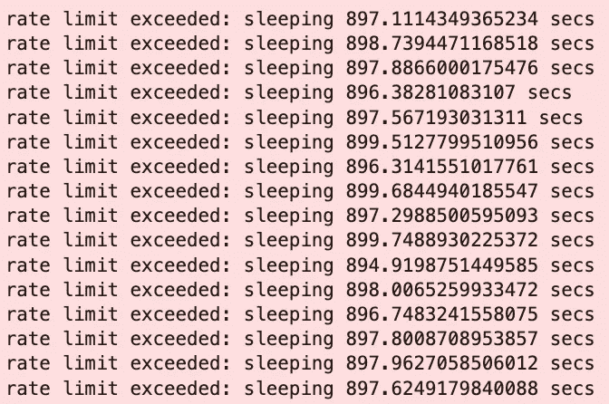*

*通过 Twitter API 强制睡眠(图片由作者提供)*

*耐心等待之后，终于有了 4000 多个账号的数据。我检查了 p 值最低的用户( *5.7742e-16)* 并查看了他们的个人资料。乍一看，这个账户似乎是合法的。*

*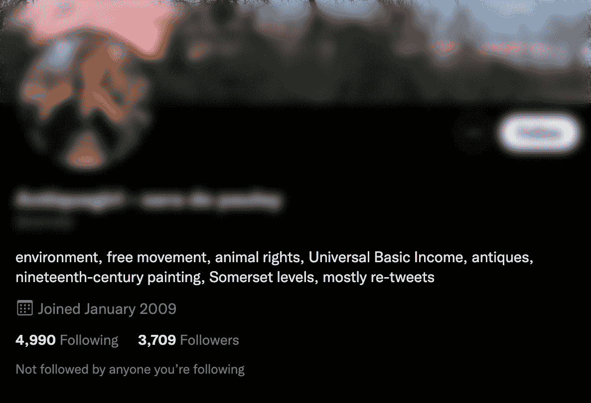*

*p 值最低的 Twitter 账户(截图来自 Twitter)*

*尽管它的 p 值很小，但分布还是有点像本福特定律。*

*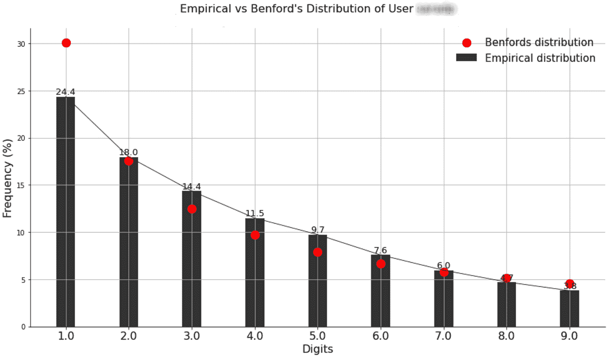*

*p 值最低的 Twitter 账户分布(图片由作者提供)*

*得到这个结果后更多的疑问涌上心头，“*一个看似合法的账户怎么会有这么低的 p 值？这是死胡同吗？到底有多低才算可疑？*“这些问题引发了我进一步的研究，看看能否从戈尔贝克教授的实验中获得一些见解。*

*然后我看到了光。我在 GitHub 上找到了[戈尔贝克教授的数据集](https://github.com/jgolbeck/BenfordData/)。我下载了数据集，从本福特定律分析开始。这并没有花很长时间，因为我不需要从 Twitter 获取数据。*

```
*p_val = []
percentage_emp = []for user_id in tqdm(df_golbeck['UserID']):
    bl = benfordslaw(verbose=1)
    try:
        _df = pd.read_csv(f'jgolbeck/anonymizedTwitter/{user_id}', delimiter='\t')
        X = _df['Follower_Count'].values
        bl.fit(X)
        p_val.append(bl.results['P'])
        percentage_emp.append(bl.results['percentage_emp'])    
    except FileNotFoundError:
        p_val.append(0)
        percentage_emp.append(0)df_golbeck['p_value'] = p_val
df_golbeck['percentage_emp'] = percentage_emp*
```

*然后，我对数据帧进行了排序，以显示数据集中前 5 个最小的 p 值。*

*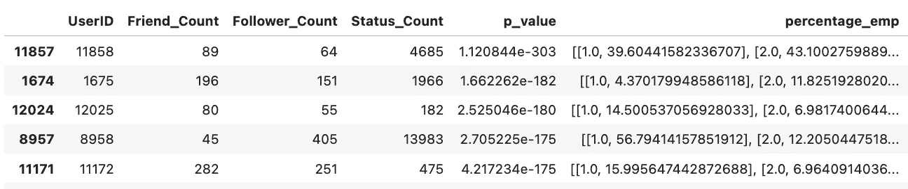*

*本福特定律对戈尔贝克教授数据集的分析结果(图片由作者提供)*

*这让我很惊讶。原来我最低的 p 值 *5.7742e-16 (* 逗号后面 16 个零 *)* 跟这些比起来根本不算什么。看最低的那个，是 *e-303* ！逗号后面有 303 个零！也就是说 ***10 ⁸⁷* 比我最低的一次**低一倍。下面是最低的三个分布可视化后的样子。它们一点也不像本福特定律。*

*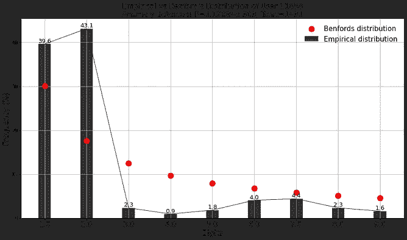**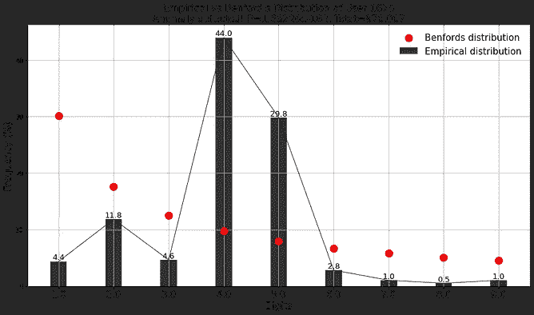**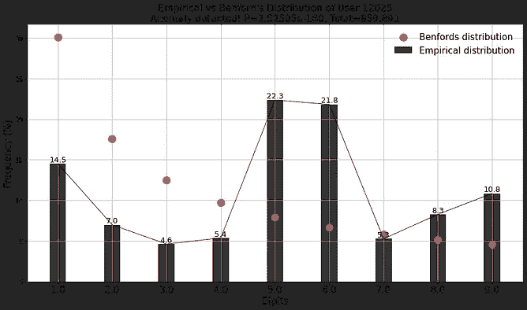*

*Golbeck 教授的数据集中最低的三个的分布(图片由作者提供)*

*此外，在她的论文中，Golbeck 教授提供了一些关于其中一些帐户的可疑活动的截图。由于数据集是匿名的，因此不可能精确定位哪些推文属于哪个账户，但据解释，这些推文属于一些 p 值最低的账户。*

*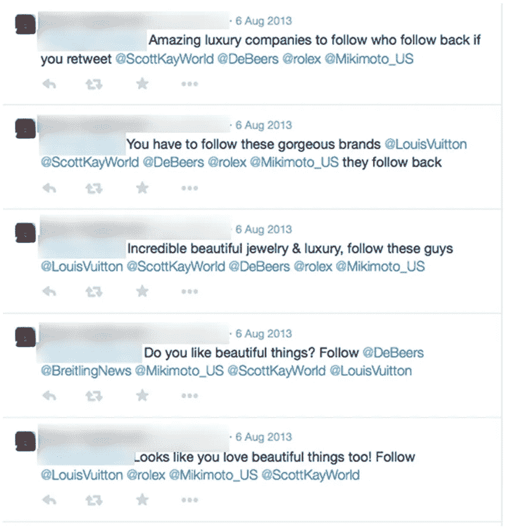**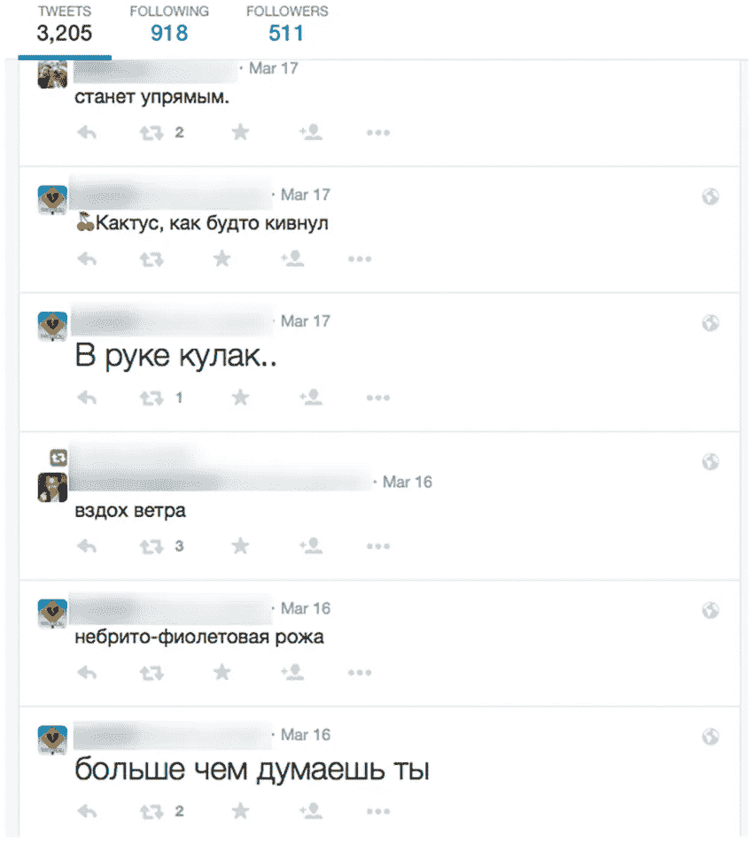*

*潜在恶意账户的可疑活动(Golbeck 教授关于 [ResearchGate](https://www.researchgate.net/publication/275218514_Benford's_Law_Applies_To_Online_Social_Networks) 的论文截图)*

*与在 Twitter 上转发相关艺术作品或其他娱乐活动相比，这些帖子似乎非常随机和垃圾。事后看来，我看到了娱乐机器人和潜在恶意机器人之间的巨大差异。根据本福德定律*(具有高 p 值)*被视为自然现象的娱乐机器人是有意义的，因为它们是 Twitter 社区不可或缺的一部分，人们在那里互动并享受它们；与潜在的恶意帐户相反。*

*我带着一个目标开始了这个项目:检测 Twitter 上的机器人。然而，我遇到了挑战和见解，改变了我的观点。Twitter 机器人比我想象的要微妙得多。*

*虽然这种分析已经非常复杂，但我认为做进一步的分析会发现更多的细微差别，并可能以更高的可信度检测更多的恶意帐户。一个例子是对推文、关注者和追随者的定性分析。*

*我希望你喜欢阅读这篇文章，并从中学到一些东西。祝你愉快！*