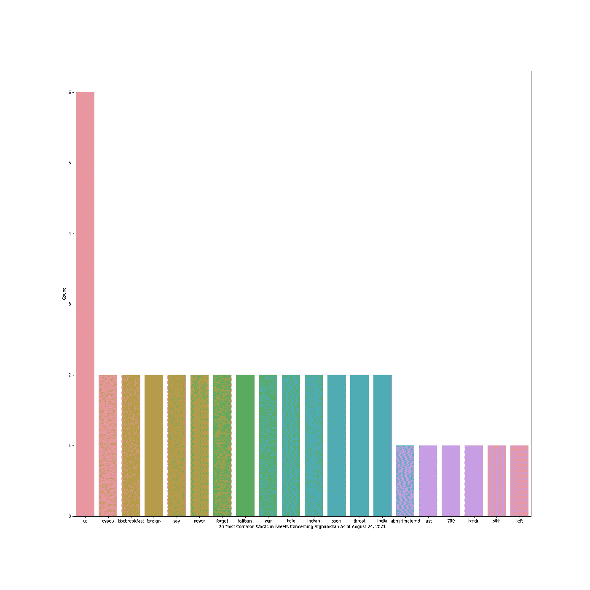

# 塔利班接管阿富汗的推特情绪分析

> 原文：<https://medium.com/codex/twitter-sentiment-analysis-on-taliban-takeover-of-afghanistan-62788e398734?source=collection_archive---------9----------------------->


安德烈·克利姆克在 [Unsplash](https://unsplash.com?utm_source=medium&utm_medium=referral) 上拍摄的照片

今年 4 月，拜登总统下令美国军队在 9 月 11 日前全部撤出。到 8 月 15 日，塔利班已经接管了首都喀布尔。从拜登宣布他打算撤出美军的那一刻起，这就是一个政治上有争议的问题。随着塔利班迅速控制了这个国家，围绕它的争议越来越大。

出于对公众对拜登决定及其后果的看法的兴趣，我决定对与此问题相关的 twitter 数据进行快速自然语言处理(NLP)分析。我想看看所使用的语言有多情绪化，所以我选择 Vader 对一组推文进行情绪分析。我还想看看最常见单词的频率分布，看看是否有任何明显的单词或模式出现。

首先，我在我的 Twitter 开发者帐户上创建了一个新的应用程序，并打开了一个新的 Jupyter 笔记本。我将密钥和令牌保密，并创建了一个 Tweepy 对象。Tweepy 是一个开源的 python 包，使用户能够访问 Twitter API。这让我能够收集推文进行分析。更多关于 Tweepy 的信息可以在[的文档中找到。](https://docs.tweepy.org/en/latest/)

```
import credentials
import pandas as pd
import osapi_key = credentials.api_key
api_secret_key = credentials.api_secret_key
bearer_token = credentials.bearer_token
access_token = credentials.access_token
access_token_secret = credentials.access_token_secretimport tweepyauth = tweepy.OAuthHandler(api_key, api_secret_key)
auth.set_access_token(access_token, access_token_secret)api = tweepy.API(auth)
```

一旦我的 Tweepy 对象建立起来，我就用它来访问 Tweepy。不幸的是 Tweepy 不让我无限制地访问它们——我相信限制是 3200 个。我使用 tweepy.search()函数查询包含单词“Afghanistan”的 tweets，将数据转换为 JSON 对象，并将其规范化为 dataframe。之后，我缩小了想要保留的列数。

```
tweepy_object = api.search(q='afghanistan', lang='en')
json_tweets = [tweet._json for tweet in tweepy_object]
data = pd.json_normalize(json_tweets)columns = ['text', 'retweet_count', 'favorite_count', 'favorited', 'retweeted', 'place', 'geo', 'coordinates' ]
df = data[columns].copy()
```

在进行情感分析之前，我想看一眼我的一些数据。以下是我储存的五条转发量最大的推文。

```
top_tweets = df.sort_values(by='retweet_count', ascending=False)['text'].to_list()
top_tweets[:5]['RT @abhijitmajumder: With evacuation of the last 700 Hindus/Sikhs left in #Afghanistan in a 38-million population, an entire civilisation w…',
 'RT @TheOnion: ‘Let’s Take It To Our Afghanistan Experts,’ Says Anchor Throwing To Panel Of Dick Cheneys [https://t.co/auVG3df5fV](https://t.co/auVG3df5fV) [https://t.c…',](https://t.c%E2%80%A6',/)
 'RT @AbhishBanerj: An Indian liberal trapped in Afghanistan appealed to PM Modi for help\n\nIndian govt rescued him.\n\nAs soon as he arrived in…',
 'RT @BreitbartNews: Free Afghanistan Activist to Joe Biden: "I Regret My Vote for You" [https://t.co/4mnUsD8Shs',](https://t.co/4mnUsD8Shs',)
 'RT @Lowkey0nline: This is essential viewing. Unaccountable CIA backed militias, accompanied by US military in Afghanistan carrying out murd…']
```

推文有点乱，所以我用正则表达式(regex)去除了一些混乱。作为一名学生，在过去的两年里，我成功地避免了 regex 语句，但是今天，我的运气赶上了我。我需要删除非字母数字字符，使文本更易读，更容易进行情感分析。如果你像我一样需要复习正则表达式，我发现这个[链接](https://appdividend.com/2020/06/10/python-regex-replace-how-to-replace-string-in-python/)对我的目的很有用。

```
import regex as re
tweets = df['text'].to_list()
tweets = [re.sub("[^a-zA-Z0-9]", " ", tweet) for tweet in tweets]df['text'] = tweets
```

如果我再看一遍同样的推文，我会发现它们可读性稍微好一点。

```
['RT @abhijitmajumder: With evacuation of the last 700 Hindus/Sikhs left in #Afghanistan in a 38-million population, an entire civilisation w…',
 'RT @TheOnion: ‘Let’s Take It To Our Afghanistan Experts,’ Says Anchor Throwing To Panel Of Dick Cheneys [https://t.co/auVG3df5fV](https://t.co/auVG3df5fV) [https://t.c…',](https://t.c%E2%80%A6',/)
 'RT @AbhishBanerj: An Indian liberal trapped in Afghanistan appealed to PM Modi for help\n\nIndian govt rescued him.\n\nAs soon as he arrived in…',
 'RT @BreitbartNews: Free Afghanistan Activist to Joe Biden: "I Regret My Vote for You" [https://t.co/4mnUsD8Shs',](https://t.co/4mnUsD8Shs',)
 'RT @Lowkey0nline: This is essential viewing. Unaccountable CIA backed militias, accompanied by US military in Afghanistan carrying out murd…']
```

我选择使用 Vader 进行情感分析，很大程度上是因为它是为处理社交媒体数据而设计的。如果你是维达新手，我认为这篇文章是一个很好的介绍。polarity_score()函数返回传递给它的文本情感的负值、中性值、正值和复合值。为了便于访问，我获得了每条 tweet 的复合值，并将其作为一个新列保存在我的 dataframe 中。

```
from vaderSentiment.vaderSentiment import SentimentIntensityAnalyzer
analyzer = SentimentIntensityAnalyzer()
df['sentiment'] = [analyzer.polarity_scores(tweet)['compound'] for tweet in df['text']]
```

只是为了好玩，让我们看看我们的数据中一些最负面的推文。

```
neg_tweets = df.sort_values(by='sentiment')['text'].to_list()
neg_tweets[:5]['RT  GeorgeMonbiot  The media s lust for blood helped march us into the  disastrous wars in Afghanistan and Iraq  It wants us to forget that ',
 'RT  MailOnline  US drone pilot leaks footage of his kills in Afghanistan questioning expansion of the program https   t co jX68BNwjgj',
 'RT  TheOnion   Let s Take It To Our Afghanistan Experts   Says Anchor Throwing To Panel Of Dick Cheneys https   t co auVG3df5fV https   t c ',
 'RT  billroggio  This is a big part of the problem  ISKP was never the major threat in Afghanistan  First threat has always been the Taliban ',
 'The latest US Civil War Daily   https   t co nVLpuHLEbA Thanks to  LinnsStampNews  BurnTheTombs  galoistheory1  afghanistan  civilwar']
```

呀。嗜血、飞行员泄露杀戮镜头——很容易理解为什么这些被给予较低的情感分数。

为了从整体上感受推文的情绪，我查看了平均分数、最低分数和最高分数。

```
import numpy as npmean_sent = np.mean(df['sentiment'])
mean_sent-0.10875000000000001print('min: ', df['sentiment'].min())
print('max: ', df['sentiment'].max())min:  -0.8555
max:  0.4995
```

如你所见，平均分略有下降。老实说，我感到惊讶的是，考虑到主题——像“战争”、“恐怖主义”等词，它并没有降低。应该会降低分数。维达给文本的分数从-1 到 1，我们的最低值肯定接近下限。

这就是我对情感分析的全部想法，但我还想看看频率分布。我觉得看看是否有单词在数据中反复出现会很有趣。为此，我将我收集的 tweets 转换成一个列表，并开始预处理。我没有做太多，我只是删除了无用的单词(没有什么意义的单词，比如‘a’，‘the’等)，并通过一个叫做词干化的过程将单词还原到它们的词根。

```
import nltk
nltk.download('stopwords')
from nltk.corpus import stopwordsstop = stopwords.words('english')
stop.append('https')
stop.append('rt')
stop.append('co')
words = ' '.join(df['text']).lower().split()
words = [word for word in words if word not in stop and word != 'afghanistan']from nltk.stem import PorterStemmerstemmer = PorterStemmer()
words = [stemmer.stem(word) for word in words]
```

之后，我使用 NLTK 的 FreqDist()找到了最常见的单词，并绘制了结果。

```
freqd = nltk.FreqDist(words)
most_common = freqd.most_common(20)import matplotlib.pyplot as plt
import seaborn as sns
most_common = pd.Series(dict(most_common))
fig, ax = plt.subplots(figsize=(20, 20))
most_common.plot = sns.barplot(x=most_common.index, y=most_common.values, ax=ax)
ax.set(xlabel='20 Most Common Words in Tweets Concerning Afghanistan As of August 24, 2021', ylabel='Count')
plt.savefig('Afghanistan Tweets Freq Dist.png')
plt.show()
```



令我惊讶的是，我没有发现更多相同的单词重复出现。在“我们”之后，下一个最常见的单词最多只出现两次。列出的单词大概是你所期望的:“疏散”、“塔利班”、“战争”等等。有趣的是,“从不”和“忘记”都榜上有名。我没有检查 n-grams，这是一种寻找一起出现的单词的方法，但看起来它们很可能在推特上以“永不忘记”的形式出现，这是指 9/11 事件。这种分析的扩展可以检查 n 元语法，以寻找与主题相关的常见单词对。

总而言之，这是一个非常粗略的分析。我只收集了某个时刻的几千条推文。阿富汗局势一直在迅速发展；这个数据没有反映出这一点。我使用的数据是来自一个社交媒体网络用户的有限时间段的小样本。这一调查结果并不意味着对正在发生的事情有更广泛的公众意见。

话虽如此，看看这些数据还是很有趣的。这些推文并不像我预期的那样负面，尽管情绪得分倾向于负值。我还期望从单词的频率分布中获得更多一点的洞察力。相反，似乎没有任何强有力的新兴主题。除了“我们”，没有任何有意义的词重复出现，尽管更频繁出现的词与主题相关。

我非常喜欢做这个快速的小项目，希望你也是！如果你读到这里，感谢你花时间阅读到最后。