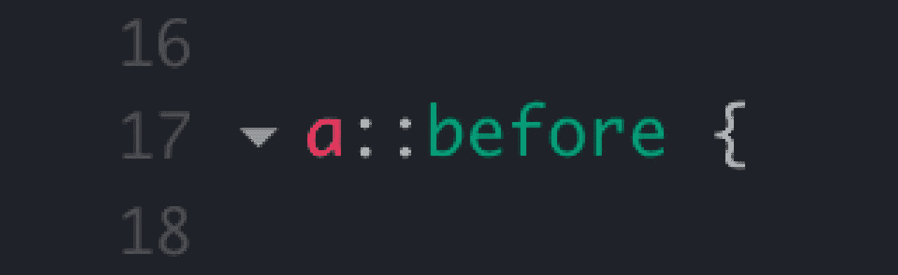

# 用 Javascript 设计伪元素的两种不同方式

> 原文：<https://medium.com/codex/two-different-ways-to-style-pseudo-elements-with-javascript-3d9260d9c61b?source=collection_archive---------1----------------------->



因为现在，瞄准一个伪元素是不可能的…

上次在一个项目中，我想在 javascript 中通过悬停一个元素来定位页面的所有**:**之前的元素，而不仅仅是它之前的元素。然后我试着写了这样的东西:

```
const links = document.querySelectorAll( "a" );const changeBefore = () => {

  for ( let i = 0; i < links.length; i++ ) {

    const before = links[ i ].querySelector( "::before" );
    console.log( before );
    before.style.color = "#f00";

  }}, initBefore = () => {

  for ( let i = 0; i < links.length; i++ ) {

    const before = links[ i ].querySelector( "::before" );    
    before.style.color = "#000";

  }}for ( let i = 0; i < links.length; i++ ) { const link = links[ i ];
  link.addEventListener("mouseover", function() { changeBefore() });
  link.addEventListener("mouseout", function() { initBefore() });}
```

> 【https://jsfiddle.net/Fromager/0t6mqgr7/ 号

好了，现在的问题是，什么都没发生！当我检查控制台时，它对我说“**之前是空的**”。

# 但是，为什么呢？？？

我暂时不确定答案，但我觉得只是因为 DOM 只针对 html 节点，伪元素不是节点，是“伪”的。当您检查您的页面时，您会发现它们没有像<pseudo-element>这样的标记约定，而是像那样::伪元素。这是因为它们是在浏览器的 CSSOM 中定义的，并不存在于 DOM 中，这就是为什么不可能在 javascript 中定位它。我向你推荐由 James Starkie 在 dev.to 上写的这篇很棒的文章，这篇文章更详细地解释了浏览器如何呈现网页。</pseudo-element>

# 好吧，但是，现在呢？

如果我们不能用 javascript 直接访问伪元素，我们仍然可以使用后门来设计它们。

## 1.使用自定义属性

是的，这是目前修改伪元素的常用方法。我拿最后一个例子来说明。首先，我在 CSS 中指定了一个自定义属性，使其具有默认值:

```
:root {
  --color: #000;
}::before {
  background: var(--color);
}
```

然后我将旧脚本替换为:

```
const links = document.querySelectorAll( "a" );for ( let i = 0; i < links.length; i++ ) { const link = links[ i ]; link.addEventListener( "mouseover", function() {
    document.documentElement.style.setProperty('--color', "#00f")
  });
  link.addEventListener( "mouseout", function() {
    document.documentElement.style.setProperty('--color', "#000")
  });}
```

[https://jsfiddle.net/Fromager/vg8r34jh/](https://jsfiddle.net/Fromager/vg8r34jh/)

您只需要这一行来设置全局根中的自定义值:

```
document.documentElement.style.setProperty('--your-prop', "YOUR COLOR")
```

## 2.使用数据属性管理内容

正如您可能已经知道的，伪元素::before 和::after 有一个[内容属性](https://developer.mozilla.org/fr/docs/Web/CSS/content)，允许您插入像图像或文本这样的对象。但是并不是每个人都知道，您可以使用标签数据属性来管理内容。然后，如果我有一个有序列表，我想设置纯文本和不同语言的列表编号，我可以使用它！

首先，我用数据属性和一个切换语言的按钮创建了一个有序列表:

```
<ol>
  <li data-style-type="One">Garlic</li>
  <li data-style-type="Two">Tomato</li>
  <li data-style-type="Three">Ginger</li>
</ol><button>Toggle language</button>
```

我简单地对

*   进行了样式化，删除了 style-type，用内容中的数据属性替换为 before:

```
li {
  list-style: none;
}li::before {
  content: attr(data-style-type) ": ";
}
```

在这里，我将它定义为**attr(data-style-type)":"**，因为我希望在列出的元素之前有一个冒号。如果你想在字符串中连接属性，只需使用简单的间距。但是如果你只想要属性，你可以。

之后我写了一个切换语言脚本:

```
const list = document.querySelectorAll( "li" );
const arrEn = [ "One", "Two", "Three" ];
const arrFr = [ "Un", "Deux", "Trois" ];let arr = arrEn;const setStyleType = (arr, i) => {
  list[ i ].dataset.styleType = arr[ i ];
}document.querySelector( "button" ).addEventListener( "click",
  function() {
    arr = arr === arrEn ? arrFr : arrEn;
    for( i = 0; i < list.length; i ++ ) {
      setStyleType(arr, i);
    }
  }
);
```

[https://jsfiddle.net/Fromager/1cbkzaey/](https://jsfiddle.net/Fromager/1cbkzaey/)

这里最重要的是 DOM 改变了元素的数据集。我认为在某些情况下这是有用的。

# 结论

就像我接下来几周将要写的其他文章一样，这些例子是我在面对一个问题时所做的探索的微小成果。有很多其他的方法来管理::伪元素风格，有时是更好的方法，但是看这些是很重要的。

也许我会写第二部分，研究另一种方法，或者用全 CSS 做同样的事情，这可能会很有趣。