# 评估模型的两种重采样方法:交叉验证和自举

> 原文：<https://medium.com/codex/two-resampling-approaches-to-assess-a-model-cross-validation-and-bootstrap-794916d37212?source=collection_archive---------2----------------------->

## 它们是如何工作的以及 R 中的例子

凯利·西克玛在 [Unsplash](https://unsplash.com?utm_source=medium&utm_medium=referral) 上的照片

为了评估模型的性能，您可以收集更多的观察值，并根据新数据测试您的模型。但是根据项目的不同，获得新的观察结果可能是昂贵的或者是不可能的。在这种情况下，您可以对已有的数据集使用重采样。两种最常用的重采样方法是交叉验证和自举。

# **交叉验证**

通过交叉验证，您可以通过估计测试误差来执行 ***模型评估*** ，或者通过基于每个模型的测试误差选择灵活性级别来执行 ***模型选择*** 。CV 的基本思想是

> 1.将数据集分成训练集和验证集
> 
> 2.使用训练集来拟合模型
> 
> 3.使用验证集评估模型的性能

基于这一思想，验证集方法、留一法 CV 和 k 倍 CV 在细节上有所不同。

## **验证设置方法**

为了从一个数据集中得到一个训练集和验证集，它随机地将一个数据集分成两部分——通常 50:50 用于训练和验证，但是这个比例是可以调整的。对于评估指标，您可以对定量变量使用均方误差(MSE ),或者对定性变量使用大量错误分类的观察值。

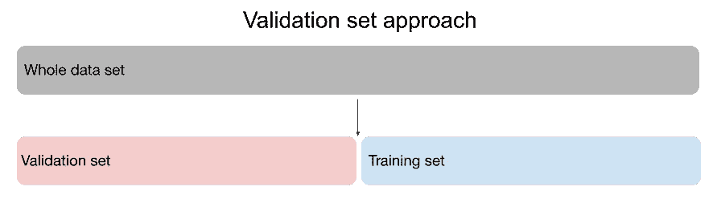

验证集方法的工作原理

如您所见，实现验证集方法是小菜一碟。然而，这是有代价的。因为训练和验证集中的内容是随机确定的，所以测试错误可能会因每个集中包含哪些观察值而有很大差异。因此，测试误差的验证估计变化很大。

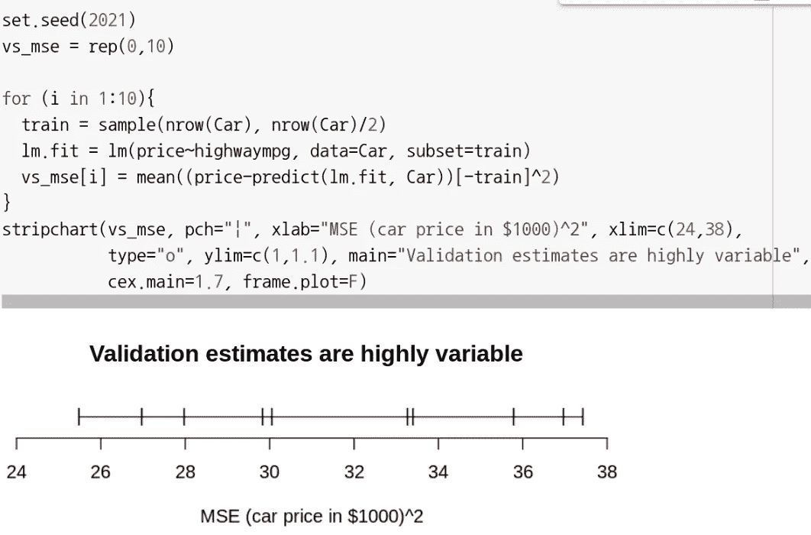

显示高度变化的验证估计值的一维图。该数据集由 Manish Kumar 收集，该模型根据汽车在高速公路上的 mpg 预测汽车价格(1000 美元)。

验证集方法的另一个限制来自其训练集的大小。当给定的数据集很小时，统计方法往往表现不佳。由于验证集方法只使用全部观察值的一半，它可能会高估测试错误率。留一法简历就是解决这些问题的。

## **留一交叉验证(LOOCV)**

与验证集方法不同，LOOCV 使用单个观察值作为验证集，并将所有剩余的- *即 n-1 -* 作为训练集。然后，通过选择不同的值作为验证集，重复 n 次拟合和评估。所以在迭代结束时，它有 n 个测试错误。这些的平均值成为 LOOCV 估计值。

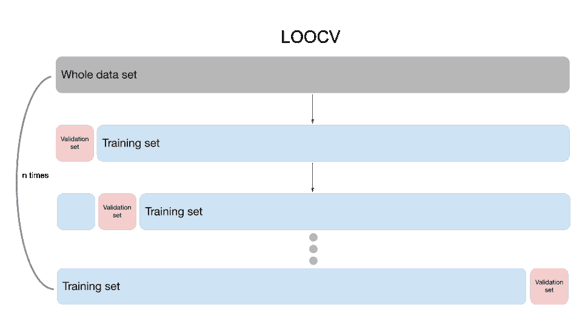

LOOCV 是如何工作的

与验证集方法相比，LOOCV 使用几乎所有的观察值来拟合模型，并重复拟合。因此，不太可能高估测试错误率。

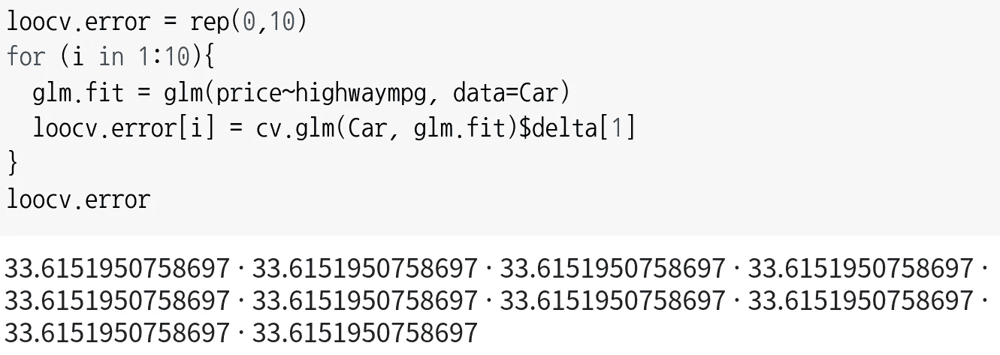

10 次重复 loocv，表明 loocv 估计值是无偏的

然而，因为它执行 n 次拟合过程，所以实现起来可能很昂贵。所以 k 倍 CV 给出了一个验证集的变化来改进。

## **K 倍交叉验证**

使用 k 倍 CV，首先选择 k 的值。然后，将一个数据集分成 k 个集合。类似于 LOOCV，第一组成为验证组，其余的成为训练组。在拟合和评估模型之后，您移动到第二组并重复该过程。与 LOOCV 不同，k 倍 CV 重复 k 次，k 个测试误差估计值的平均值成为 k 倍 CV 估计值。所以在某种程度上，当 k=n 时，LOOCV 是 k 倍 CV 的一个特例

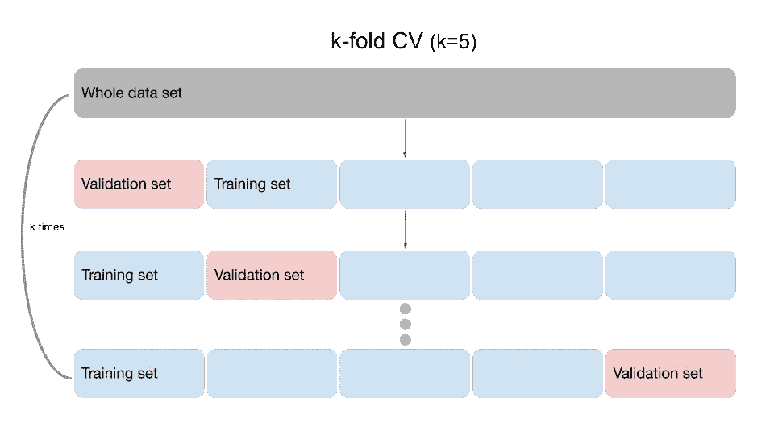

k-fold CV 如何工作

与 LOOCV 相比，k-fold CV 的一个明显优势是，k-fold CV 在计算上更好，因为它执行的迭代次数更少。另一个优势在于偏差-方差的权衡。因为 LOOCV 的训练集包括几乎整个数据集，LOOCV 给出了一个无偏的估计。也就是说，LOOCV 估计很可能等于给定数据集的真实测试误差。与 LOOCV 相比，k-fold CV 对训练集使用更少的观察值。因此，与 LOOCV 相比，k 倍具有较少的相关训练集和较高的有偏估计。

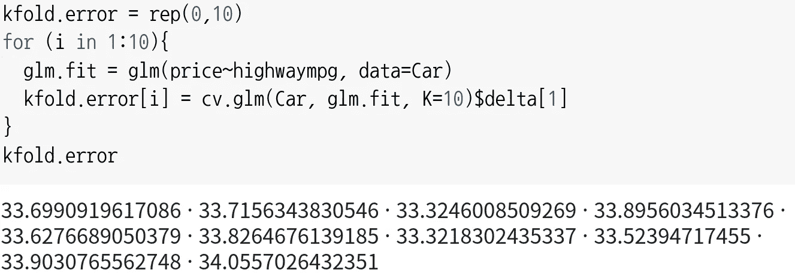

10 重复 k 倍 cv，表明 k 倍估计值比 100 倍 cv 估计值偏多一点

然而，当我们评估一个模型时，偏见并不是唯一的考虑因素。我们还应该通过评估方差来考虑一个模型如何在一个全新的数据集上执行。由于 LOOCV 的所有训练集与整个数据集几乎相同，因此它们彼此高度重叠。这导致产生高度相关的输出。并且因为 LOOCV 估计是基于这些输出计算的，所以 LOOCV 估计往往具有高方差。

与 LOOCV 的训练集相比，k-fold CV 的训练集重叠较少。因此，输出的相关性较低，k 倍 CV 估计值的方差低于 LOOCV 估计值。根据经验，k=5 和 k=10 既不会出现极高的偏差，也不会出现方差。

## **交叉验证模式选择**

上面的所有代码示例都使用交叉验证方法来评估模型。然而，正如我在开始时提到的，您也可以使用交叉验证来选择模型的灵活性级别。您只需要存储交叉验证估计值，以便以后进行比较。

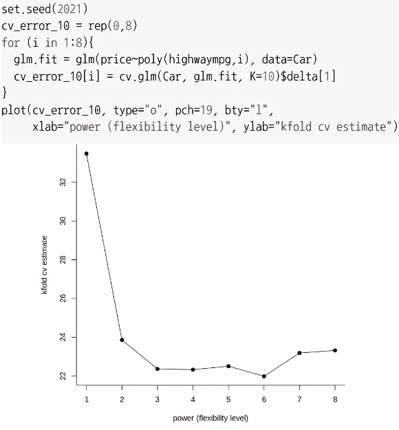

显示交叉验证如何用于模型选择的图表

在选择灵活性级别时，您需要记住一件事。由于较低的 cv 估计值意味着模型在预测方面更好，您可能认为选择具有最低 cv 估计值的模型就是答案。然而，盲目选择具有最小 cv 估计值的模型可能会导致过度拟合问题。

从上图可以看出，最小值出现在 6 次方。然而，3 次方相当低。那么你应该选择哪一个呢？

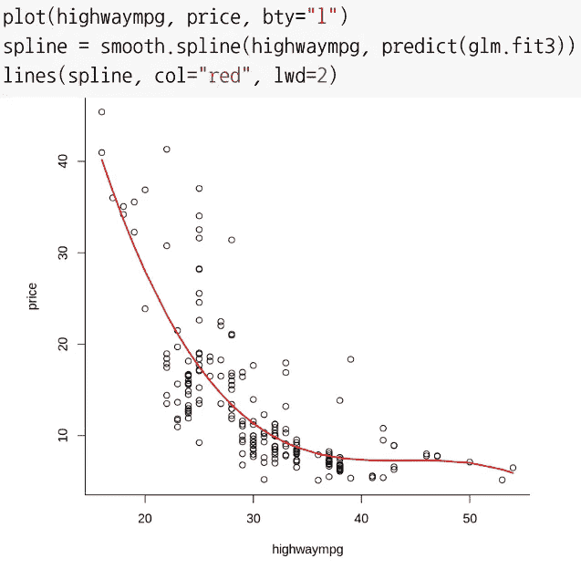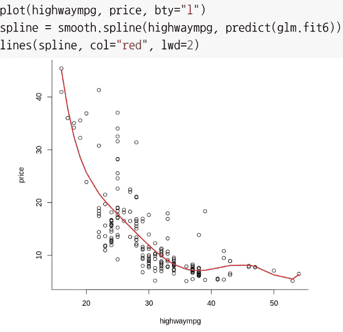

显示具有最低 cv 估计值的模型如何导致过度拟合的图。(左)带有多边形(3)的模型/(右)带有多边形(6)的模型

两条线中间没有巨大的区别。然而，在右图的右下端，您可以看到红线与点的趋势完全相似。这表明具有 6 次方的模型与数据集过度拟合。因此，对于这个数据集，它会给出一个准确的结果，但是对于一个全新的数据集，它的性能会很差。考虑到这一点，在选择交叉验证的灵活性级别时，您应该意识到过度拟合问题。

# **自举**

Bootstrap 是一种通过替换从数据集中模拟获取新样本的方法，这样观测值就不会用完。使用这些新的 bootstrap 样本，bootstrap 通过计算估计值、标准误差和置信区间来评估您选择的样本统计数据 的 ***准确性。***

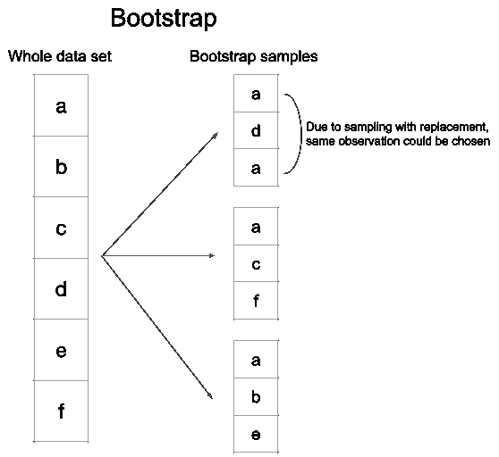

引导程序如何工作

## **利弊**

由于方法简单，bootstrap 具有广泛的适用性。因此，如果您能提供一个返回样本统计值的函数，您可以选择任何想要的样本统计值。例如，假设您对上面使用的数据集中汽车价格的第一个和第三个四分位数感到好奇。您只需要创建一个函数来返回这些统计数据，在 boot()中从 boot 库中为它们提供一个数据集，并指定您将获取多少引导程序样本。

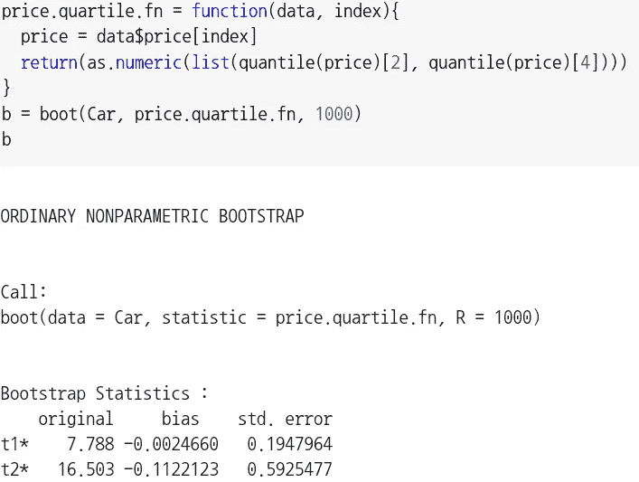

在 R 中执行 bootstrap 以获得四分位数的标准误差

正如您所看到的，boot()提供了您在“原始”列下选择的样本统计的估计值，并在“标准”列下提供了每个统计的标准误差。错误”栏。因此，通过这些输出，您可以评估样本统计的准确性。如果您需要一个置信区间，您只需要将 boot()作为 boot.ci()中的一个参数进行传递。

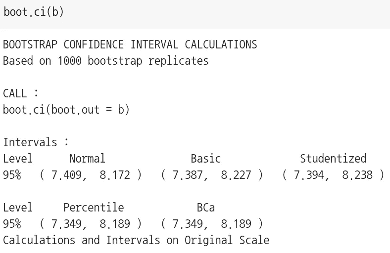

得到 R 中的 bootstrap 置信区间

在 5 种 bootstrap 中，BCa - *偏差修正和加速* -置信区间一般是首选。然而，当提供少量引导样本时，BCa 可能变得不稳定。关于这些 bootstrap 置信区间的更详细的解释可以在杰里米·奥尔布赖特的*帖子中找到。*

*另一个优势来自它的非参数方法。因为非参数 bootstrap 不假设模型分布，所以它可以给出比不正确假设的方法更准确的标准误差估计。尽管 bootstrap 似乎是许多情况下的解决方案，但它有其局限性。*

*因为非参数 bootstrap 是从单个数据集中进行重采样，所以它只能获得数据集中的值。因此，如果给定一个小的数据集——10 个或更少的观察值——或者一个数据集不具有代表性，就会产生问题。*

# *综上*

*当你阅读时，交叉验证和引导告诉你不同的事情。交叉验证为评估模型在新数据上的表现提供了交叉验证估计值。此外，您可以使用交叉验证评估来评估哪个模型优于其他模型。另一方面，bootstrap 告诉我们一个样本统计与真实总体统计相比有多精确。您还可以将系数设置为样本统计数据，以使用 bootstrap 评估模型的准确性。因此，在交叉验证和 bootstrap 之间选择使用哪种方法取决于您的研究目的。*

# *参考*

*[1]迈克尔·切尔尼克。"自举的利与弊。"*交叉验证*，2017 年 5 月 20 日，stats . stack exchange . com/questions/280725/pros-and-cons-of-bootstrapping。*

*[2]鲍勃·德兰斯菲尔德。"参数或非参数自举？"*参数或非参数 Bootstrap* ，influency points . com/Training/nonparameter-or-parameter _ Bootstrap . htm*

*[3]弗罗斯特，吉姆。"用一个例子介绍统计中的自举."*吉姆统计*，2020 年 6 月 12 日，statisticsbyjim.com/hypothesis-testing/bootstrapping/.*

*[4]霍尔迪。" r/Statistics——Bootstrap vs . Cross-Validation:哪一个使用得更频繁，为什么？" *Reddit* ，2015，[www . Reddit . com/r/statistics/comments/2 wao3u/bootstrap _ vs _ cross validation _ which _ is _ used _ more/。](http://www.reddit.com/r/statistics/comments/2wao3u/bootstrap_vs_crossvalidation_which_is_used_more/.)*

*[5]詹姆斯，加雷斯。*统计学习简介:在 r 中的应用*。斯普林格，2021。*