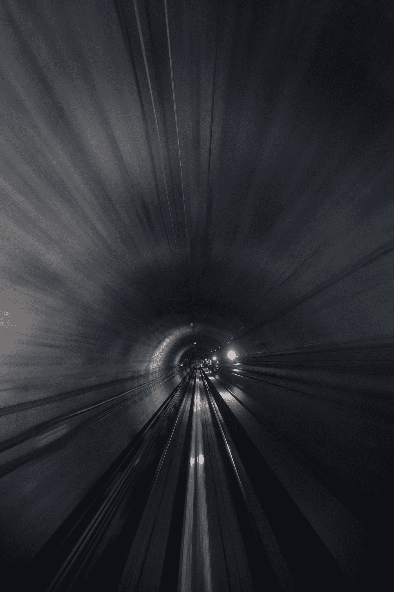

# 酝酿两年:解决 React 中的即时渲染问题

> 原文：<https://medium.com/codex/two-years-in-the-making-solving-the-instant-rendering-problem-in-react-2fb2d656a53b?source=collection_archive---------16----------------------->

两年前的今天(我注意到，这已经成为我故事中反复出现的主题)，我正在完成 Martastic，这是我在熨斗学校的软件工程沉浸式项目中的最后一个项目。我们将在一天内向世界展示我们的项目，实际上两天后就毕业了！到处都在做最后的准备。

在过去的两个半星期里，我一直在不停地做这个项目。从助教和我的同学那里得到了很多帮助。一切都解决了…除了一件事。当用户对一张图片或一个站点发表评论时，除非用户刷新，否则评论不会显示。没有任何迹象表明你的评论确实被发表了。当然，没有人希望刷新以确保它通过，大多数人会认为因为它没有出现，所以它根本没有通过。这是一个非常不理想的结果，但因为它实际上是创造了评论，我决定以后再讨论这个问题。在演示会上，实际上没有人问这个特性；每个人都对列车时刻表更感兴趣，它是如何实时显示的，是否直接来自 MARTA 的 API，以及它可以被过滤的所有不同方式。因为这是项目的核心，也是登录页面，所以没有人有机会看到这个巨大的评论 bug，除非我特意向他们展示。

我责怪 Redux。新的注释将显示在 Redux DevTools 和复杂(比它应该的更复杂)的组件图中，但它实际上并没有呈现！我责怪 Redux 太多了，以至于我在下一个个人项目中没有使用它，而是使用了 React Context。

我责怪 Rails 序列化程序。我指责他们在 JSON 数据中显示的深层嵌套。我责怪他们太多，以至于我在我的下一个项目中使用了 GraphQL 这并不是更好的选择，因为它使我的应用程序看起来更加优雅和专业。但是我仍然在责备那些不应该被责备的事情。

我走错了路！Jaanus jagomgi 在 [Unsplash](https://unsplash.com?utm_source=medium&utm_medium=referral) 上拍摄的照片

在接下来的几个月里，我不断改进 Martastic，添加了一些新功能，比如与其他用户交朋友的能力，在实现该功能时，我发现了完全相同的问题。点击“添加好友”按钮会立即改变，因为这是由国家控制的；但是，要在您的个人资料页面上显示您所有的朋友，您必须刷新页面才能显示您刚刚添加的朋友。

最终，我不得不真正使评论功能达到标准，因为我现在正在认真寻找开发人员的工作，每个功能都将受到严格审查。在假期里，我除了编码和做所有我推迟的改进之外，什么也没做。即使是现在，2019 年 12 月 24 日和 25 日仍然是我在 GitHub 上提交最多的日子。然而，因为我仍然非常缺乏经验，我实现的修复只是一个巨大问题的创可贴。

我现在的自己甚至不能。

忽略剩余的这些极其混乱和不必要的复杂代码，让 station 对象显示为一个单独的页面，让我们看看第 8 行。

`state.comments.comments`是包含新注释的数组。为什么它在一个数组里？由于没有经验，我在`commentReducer`中设置了初始状态来接收所有的评论，而不仅仅是最新的。我写了一个获取所有评论的动作和另一个创建新评论的动作，并将它们都发送到`comments`。

`station.comments`是属于某个电台的现有评论。我的快速，极其粗暴的解决方法？Concat！！它立即工作，用户不必刷新！我为自己感到骄傲，尽管它表现不好，但至少看起来很好…直到用户试图在之后发表另一条评论，它似乎会覆盖上一条评论。或者，如果他们去了另一个站的页面，看到他们最近的评论与第二个站的评论连接在一起，尽管他们没有在那里发表评论…只要他们没有注意到这一点，我们就没事。所以我就这样放了一年半，直到今天。

我现在已经做了 2.5 年的定时编码，两年前完成了 bootcamp 的编码，到现在做了 1.5 年的专业开发者。我现在的技能和以前完全不同。我尝试在业余时间尽可能多地编写代码，但我厌倦了上树屋课程和学习算法。在 2020 年期间，我做了 CS50，虽然收获颇丰，但却占用了我大部分的自由编码时间，没有给 Martastic 留下太多时间。我决定一劳永逸地解决所有遗留问题。

首要任务是更新所有的包，然后将每个类组件重构为一个功能组件，并添加 React 钩子。这比我想象的要简单得多，只花了 3 天时间。之后，它将单个 pic 和单个工作站组件(需要上述代码来填充它们的组件)转换成模态，而不是单独的页面。因为我在这方面已经有了丰富的经验，这是一个非常简单的过程，花了两天时间，单一图片模式稍微有点困难，因为它需要更长的时间来加载。尽管它显然在那里，但调试它出现 null 的问题花了一天的时间。

现在，今天来了可怕的任务，最终正确地呈现评论。我已经修复了 Rails 序列化器，只显示相关信息，但是注释仍然嵌套在同一层。(顺便说一句，序列化器很棒，它们是一种很好的方式，可以只获取您需要的确切信息，并添加与 GraphQL 非常相似的方法/字段，但如果您有一个小项目，则不需要大量的设置！尽管有变化/更新……我还是更喜欢 GraphQL。)

在研究这个问题时，我注意到在顶级的赞在前端即时呈现没有问题。后端的一切都正常进行。我尝试了不同的方式来张贴/修补评论，但这产生了更多我以前没有的问题。最终我发现问题仅仅是在做了一个评论后，整个 pic/station 需要重新绘制以显示新的评论。因为我已经创建了新的动作，在创建模态时获取单个图片/工作站，这只是在注释完成后重新获取的问题。这是占用时间最多的，但最终我还是这样做了:

*   将`comment: null`添加到 commentReducer 中的 comments 状态，以便只保存最近的 comment 对象，并让`NEW_COMMENT`动作将其有效负载设置为`comment`(这是两年前使一切变得复杂的一个问题)。我已经有了获取单个注释的逻辑，所以只需要将它以不同的方式放入状态中。
*   通过每个模态组件中的`useSelector`钩子获取注释。将此注释添加到模式的`useEffect`依赖数组中；每当有新的注释时，这将触发整个模态组件的重新呈现。(Redux 也很棒；我花了一段时间去理解它，但是当我理解的时候，我爱上了它！使用钩子而不是`mapStateToProps/mapDispatchToProps` *真的*帮助我更好地理解/实现它。)

过去两年，尤其是过去一年半我作为一名开发人员的工作，让我准备好以不同的方式看待这个问题，并最终能够解决它。这不是一个即时的过程，仍然需要几个小时，但我终于弄明白了，我很高兴我在这里解释这个过程，并将使用它来解决关于即时渲染的剩余问题。如果你有同样的问题，我希望它能帮助你。