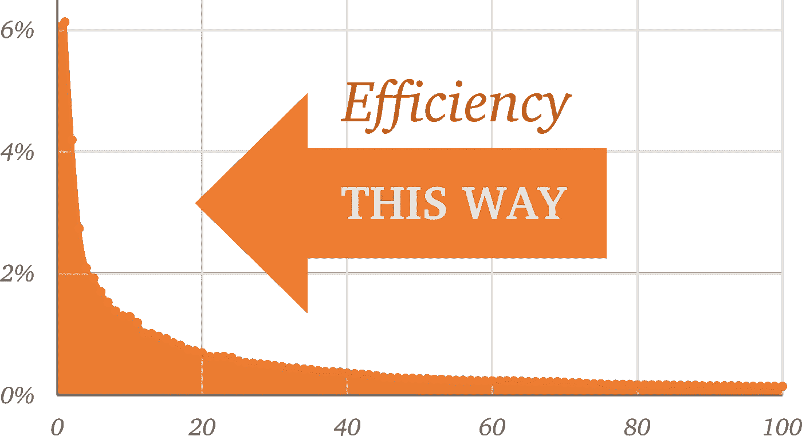

# 使用 ZipChord 打字更快更舒适

> 原文：<https://medium.com/codex/type-faster-and-more-comfortably-with-zipchord-fdee71b28392?source=collection_archive---------2----------------------->

## 多亏了 Zipf 定律，只需要少量的协调快捷方式就能提高我们一半的打字速度。

《指环王》中前 100 个最常用词的出现频率，论证了 Zipf 定律在起作用。最常用的单词占文本中所有单词的 6%。

受过训练的速记员每分钟打字超过 200 字。这是因为速记机器使用同时按键的和弦来一次输入整个单词。不出所料，掌握这项技能需要*年*。

因为语言遵循齐夫定律——第二个出现频率最高的单词是第一个的一半，第三个是第一个的三分之一，等等。事实证明，我们一半的书面文字是由大约 100 个单词组成的。当我在*《指环王》*上快速查看时，这个数字是 66 个单词。

> 《魔戒》总字数的 40%只由 32 个字组成。

你认为你的写作需要多少单词？如果你有一种方法可以非常有效地输入那些常用词，那会怎么样呢？

一个可以接受普通打字和几十个单词的简单和弦的键盘输入会对打字量产生巨大的不相称的影响。

虽然有和弦输入的软件工具，但我找不到任何工具或脚本可以很好地处理和弦超过两个键的混合输入。我知道和弦输入会带来更大的舒适和速度，即使只使用几个和弦，所以我创建了*zipchorn*并免费提供。

# 利益

*ZipChord* 允许你在打字的时候动态定义自己的和弦，并与常规打字混合使用。如上所述，即使是少量的和弦也可以代替大量的打字。此外， *ZipChord* 还有一些让打字更容易的技巧:

## 智能空间

当混合和弦和正常键入时， *ZipChord* 会根据需要插入(和移除)额外的空格:当你使用和弦输入一个单词时，它将以“智能空格”结束，因此你可以开始键入或和弦下一个单词。

同样，当您使用常规键入完成一个单词，并且使用和弦输入下一个单词时，和弦单词将以智能空格开始，因此您可以省去按空格键的麻烦。

## 标点符号和大写

当和弦出现在标点符号之前或之后时， *ZipChord* 会处理智能空格——将标点和空格移动到正确的位置——但它也会自动将和弦单词大写。

标点符号周围的空格和大小写通常仅在和弦单词周围增强(以在不输入和弦时保持正常的键盘行为)，但是可以为所有文本输入打开或关闭此功能。

这样， *ZipChord* 可以在你输入的时候为你添加空格和大写字母。

## 前缀和后缀

许多单词如“做”、“站”或“悲伤地”使用后缀。你可以很容易地为后缀定义和弦。无论是通过打字还是和弦输入，后缀都会附加到单词上。(如上，智能空间会自动消失。)

诸如“-ing，”“-ation”，甚至“-ly”等后缀都值得变成和弦。一按，你就把整个后缀*和*加成了一个智能空格。甚至为复数形式的“-s”和第三人称单数形式的动词定义一个和弦也是有意义的，尤其是使用和弦输入的单词。

注意: *ZipChord* 不遵守语法。如果您为*输入和弦*和 *ing* ，就会产生*taking*。但是你可以用一个单独的和弦来去掉最后一个字母。

## 编程；编排

自定义和弦对开发人员也很有用。您可以很容易地定义，短按 **W** 和 **H** 将产生`**while (** | **)**`(其中|表示光标在和弦后的位置，准备输入条件)。

# 那很好，但是…

## …常用词很短

的确，最常用的单词往往也相当短。在我分析的文本中，前 100 个单词的平均长度是 3.4 个字符。改进值得吗？

要键入英语中最常用的单词(*)，您需要按正确的顺序按下并释放*四个*键:T、H、E 和空格。用 *ZipChord* 打字，可以同时按下和放开两个键，可以很方便的放在 home 行。*

## *…你需要学习捷径*

*是的，很不幸。通过将和弦映射到组成单词的字母，或者通过使用一些对你个人有意义的逻辑结构，可以使这个过程变得更容易。*

*根据你打字的方式，这可能很难也可能很容易。我是一名德沃夏克打字员，德沃夏克的布局非常适合和弦。你是遵循现有的钥匙还是发明新的组合取决于你。像镜像一些键的右手和左手这样的技巧也有帮助。*

*由于 Zipf 定律，每个排名较低的单词带来的回报都是递减的。这减轻了学习许多和弦的压力。哪怕几个也能让你打字更顺手。并且您可以始终使用常规的键输入。*

## *…不是每个人都用英语打字*

*给出的英语统计数据实际上是所有语言的通用数据。在 ZipChord 中没有任何特定于语言的东西。随着*

## *…这需要思维转换*

*根据我的经验，这是最大的挑战。我越是全神贯注于某事，就越是经常忘记使用和弦。另一方面，即使我暂时不使用*任何*和弦，我的打字速度和舒适度也不会受到负面影响。*

## *…有时它会把输入误认为是和弦*

*如果 *ZipChord* 错误地将打字的一部分转换为和弦，那是因为两个或更多的键被按住的时间超过了和弦识别延迟。你可以做三件事:*

1.  *更改灵敏度设置。尝试一次改变 20 毫秒的数字，以找到正确的平衡。*
2.  *调整你的打字格式。我有一个坏习惯，就是在我已经按过的键上徘徊，让膝上的电脑保持平衡。*
3.  *如果某个特定的组合妨碍了你，你可以考虑改变和弦。*

## *…并非所有键盘都支持 N 键翻转*

*根据物理键盘和相关的特定按键，键盘可能无法将所有按键正确发送到电脑。*

*虽然这种限制会阻碍速记模拟，但如果目标是为几百个单词定义快捷方式，您的和弦可以很容易地限制为大多数两键和弦和一些三键和弦。绝大多数键盘都会正确处理这些和弦。*

*如果你的键盘支持 N 键翻转，你甚至可以模仿速记机，用*zipchon*在常规打字的同时使用它。*

## *…它只适用于 Windows*

*我还没有探索该工具如何适用于 MacOS，但是源代码是开放的，所以欢迎任何人为 MacOS 版本修改编程逻辑。*

# *如何使用 ZipChord*

*随着 ZipChord 的运行，你可以在任何地方使用普通的单个按键进行输入，也可以使用预定义的同时按下几个键的“和弦”来一次输入整个单词。无论您使用单个笔画还是和弦输入单词， *ZipChord* 都会根据需要使用智能空格和标点符号。*

*要定义新的和弦(或提醒自己已经定义的和弦)，选择要定义和弦的单词，按住 **Ctrl-C** 直到出现对话框。接下来，键入组成和弦的各个键(不要按 Shift 或任何功能键)，然后点按“好”。如果所选文本已经在字典中，*zipchorn*会提醒你它的和弦。*

*如果你想试试混合和弦键盘，你可以很容易地在 Windows 上安装和使用 *ZipChord* 。只需从 GitHub 下载最新的 [*ZipChord* 版本](https://github.com/psoukie/zipchord/releases)(zipchord.exe)。你也可以在那里找到[文档](https://github.com/psoukie/zipchord)。如果你尝试使用 *ZipChord* 或者为它创建一个有趣的字典，我很乐意收到你的来信:请留下评论或者在 Twitter 上联系我，电话: [@pavel_soukenik](https://twitter.com/pavel_soukenik) 。*