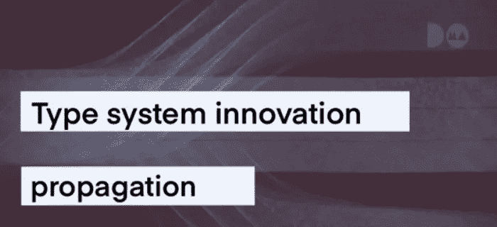

# 类型系统创新传播

> 原文：<https://medium.com/codex/type-system-innovation-propagation-9f7a247f00c1?source=collection_archive---------16----------------------->



# TL；速度三角形定位法(dead reckoning)

*   主流语言设计者希望整合已建立的编程语言理论方法。
*   参数多态在 Java 和 Go 中启用泛型的方式证明了这一点。
*   使用泛型有可能解决表达式问题。
*   C++已经很好地理解了这一点，并且已经做了一些工作来改进参数多态性，以允许符合人体工程学的更高级类型(本身接受类型变量的泛型类型)。
*   需要进一步的工作来进一步提高语言的表现力和人类工程学。
*   大多数具有类型系统的语言缺乏可伸缩的方法来处理异构数据。
*   结构感知特性和行多态性需要比 PureScript 更广泛的采用。
*   缺乏有效的结构感知特征算法极大地阻碍了其采用。

# 为什么不满足于简单的类型系统呢？

大多数语言设计者都同意类型系统在编程语言中应该有一流的待遇。几乎所有的编程语言都见证了它们的类型系统演化出新的特性。在这篇文章中，我们将研究一些这样的案例，并激发进一步发展类型系统 R&D 的需要，超越我们现在所能支配的范围。

为了做到这一点，我们将从两种主流编程语言(Java 和 Go)中的泛型计算的角度来看这两种语言的历史。在本文中，当我们谈论泛型计算时，我们指的是“以类型不可知的方式编程的方法”或“编写一个不仅仅在一种具体类型上工作，而是在某种类型上工作的程序”。

因此，通用计算甚至对最基本的编程都是有用的。数据结构(树、数组等)是学科的基础，本质上是通用的。接下来的挑战是以一种类型安全的方式对它们进行编码。一个激励性的例子是 Java 的“Hashtable ”,见于 1998 年 1 月 7 日的 1.0 版本。

# 锐利的通用计算

考虑来自 Java 1.0 的`get`函数:

```
public synchronized Object get(Object key) {
    HashtableEntry tab[] = table;
    int hash = key.hashCode();
    int index = (hash & 0x7FFFFFFF) % tab.length;
    for (HashtableEntry e = tab[index] ; e != null ; e = e.next) {
        if ((e.hash == hash) && e.key.equals(key)) {
    	return e.value;
        }
    }
    return null;
}
```

考虑到[十亿美元的错误](https://www.youtube.com/watch?v=ybrQvs4x0Ps)先不说，当我们谈论这个代码片段的类型安全时，我们看到，在它的第三行，我们调用了类`Object`的一个实例的方法`hashCode()`。这种“泛型”的方法要求工程师在封闭的类型层次结构中有一个单点，这个单点要求泛型应用程序的所有必要方法。这种方法让库实现者头疼。即使我们认为使用接口对于实现通用程序已经足够好了(想想，`get`会接受`IHashable`而不是`Object`)，问题仍然存在。

*   向上造型(也称为一般化，将子类型视为超类型)到接口或对象会导致比所需类型更宽的返回值，这将需要稍后向下造型(也称为专门化，将超类型视为子类型)，从而丢弃类型保证并为错误创造空间。
*   不太重要的是，没有解析工具的接口中重叠的抽象方法名使得通过向上转换的泛型编程的可伸缩性降低。

现代类型系统工程中的先驱语言被称为“ml”，它提出了 Haskell 和 Ocaml。70 年代中期，ML 引入了一种叫做“参数多态”的东西，其思想是让程序员拥有类型变量，就像程序员拥有值变量一样。现代 Java 的 Hashtable 使用参数多态，据说“在键和值类型上是多态的”:

```
public class Hashtable<K,V>
extends Dictionary<K,V>
implements Map<K,V>, Cloneable, Serializable
```

# 案例研究:为更好的多态性选择类型变量

# 通用 Java

正如我们所讨论的，用 Java 进行泛型编程的最初方法是使用 Object，它是任何 Java 类的公共超类。由 oder sky(Scala 的最终创造者)和 Wadler(Haskell 的共同设计者)开发的 Pizza 语言在 Java 一年后发布，它是 Java 的超集，更有原则，允许类型变量被“删除”并转换成对象类，自动进行向上转换和向下转换，从而保持了类型安全。它还允许消除编译产品的指数增长问题，就像在 C++中由于条件代码生成而出现的问题。稍后会详细介绍。

类型擦除被严重误解，Java 类型系统的一些缺点被错误地归因于它，但它也不是没有缺点。最值得注意的是，不能在 Java 中使用类型变量将值强制转换为该类型。即如果 T 是类型变量，`(T)x`不是有效表达式。类型擦除的另一个缺点是，即使一个通用数据结构或方法用一个基本类型来参数化，装箱(把它变成一个 Java 类)的开销也会通过擦除来实现。请注意，类型擦除的所有缺点都不会限制类型安全，只会限制表达性和性能。

Wadler 等人在 Pizza 发布后，对 Java 进行了最小可行的形式化，这有助于最终在 2004 年的 1.5 版本中包含泛型。

# 通用 Go

在发布工业语言和获得泛型之间，Go 臭名昭著的时间最长。重要的是，它为我所谓的`void *`多态性提供了空间。在大约 2021 年的 Go 中，它是`interface{}`多态性，在不详细说明它为什么工作的情况下，我们将向您展示利用它的真实代码:

```
func ToBoolE(i interface{}) (bool, error) {
	i = indirect(i)

	switch b := i.(type) {
	case bool:
		return b, nil
	case nil:
		return false, nil
	case int:
		if i.(int) != 0 {
			return true, nil
		}
		return false, nil
	case string:
		return strconv.ParseBool(i.(string))
	default:
		return false, fmt.Errorf("unable to cast %#v of type %T to bool", i, i)
	}
}
```

这显然是有问题的，因为在程序中使用`interface{}`类型会在运行时切换类型信息，将故障检测从静态分析领域转移到动态监控领域。此外，可接受类型的微小变化将导致重构地狱！当您扩展您的`interface{}`函数的域时，没有办法知道哪些其他函数也需要扩展它们的域。

类似于将泛型引入 Java，将泛型引入 Go 包括两个阶段:形式化和实现提议。根据 Go 中泛型背后的团队的经验(这很大程度上要归功于 Wadler 的参与)，在 Go 中，适当的形式化首先出现，然后才实现。

在 Go 的情况下，首先从形式化开始的另一个原因可能是，在 Go 中添加参数多态性比在 Java 中更难。事实上，Go 语言的一大特点就是它的结构接口超类型是开放的。

```
package s

type Nil struct{}

func (n *Nil)Show() string {
        return "{}"
}
```

在一个独立定义的包中有一个函数的结构确实可以实现在另一个包中定义的接口:

```
package main

import (
        "fmt"
        . "doma.dev/s"
)

type Shower interface {
        Show() string
}

func f(a Shower) string {
        return a.Show()
}

func main() {
        var x = Nil{}
        fmt.Println(f(&x))
}
```

更复杂的是，需要对这个特性进行仔细的规划，目标是使用代码生成(用一个有趣的词来说就是“单态化”，因为多态化的东西会产生一堆单态化的东西)，而不是类型擦除，以二进制大小为代价来实现更通用的泛型。

最后，[实现了一个提案](https://go.googlesource.com/proposal/+/refs/heads/master/design/43651-type-parameters.md)，它增加了带约束的泛型(程序员可以在他们的代码中创建和使用这些约束)。

# 去和表达问题测试

此外，目前实现的通用围棋*几乎*都通过了表达式问题测试。

表达式问题本质上是说，在不改变模块(集成模块除外)中现有源代码的情况下，在保持类型安全的同时，代码库可以通过以下方式进行扩展:

*   新类型，实现所有现有功能；
*   覆盖所有现有类型的新函数。

然后表达式问题测试被公式化如下:

*   使用计算器 DSL 的表达式构建算术表达式，然后对其求值(因此得名“表达式问题”)。
*   从一个表达式类型 case“constant”开始，它保存某个原始数值类型的值。
*   实现一个函数“evaluate ”,该函数采用一个表达式并返回原始数值类型的相应值。
*   实现“常量”的“求值”。
*   对表示将两个表达式相加的表达式“加号”进行编码。
*   扩展“评估”来处理它，而不改变其他模块。
*   在不改变其他模块的情况下，为两个表达式(“加号”和“常量”)实现“到字符串”功能。
*   在集成模块中，演示任何函数都可以在任何已定义的类型案例上调用。
*   擦除“加号”和“to string”的所有代码。
*   首先重新实现“到字符串”。
*   第二次重新实现“加号”，然后扩展“evaluate”和“to string”。

如果泛型约束缩小在实现的泛型 Go 中是可能的(在最初的研究中计划是可能的)，我们将能够编写以下代码来解决 Go 中的表达式问题:

```
// package A at time 0
type ExprConst[T any] struct {
	UnConst T
}

// Currently impossible because receiver arguments have to have exactly the
// same type signature, including specificity of the type parameters, as their
// struct declarations.
func (e ExprConst[int]) Eval() int {
	return e.UnConst
}
// end of package A at time 0

// package E at time 0
type Evaler interface {
	Eval() int
}
// end of package E at time 0

// package P at time 1
type ExprPlus[L, R any] struct {
	Left L
	Right R
}

// Currently impossible
func (e ExprPlus[Evaler, Evaler]) Eval() int {
	return e.Left.Eval() + e.Right.Eval()
}
// end of package P at time 1

// package E at time 2
type Evaler ...

type Shower interface {
	Show() string
}
// end of package E at time 2

// package A at time 2
type ExprConst...

func ...Eval() int...

func (e ExprConst[int]) Show() string {
	return strconv.Itoa(e.Const)
}
// end of package A at time 2

// package P at time 2
type ExprPlus...

func ...Eval() int...

func (e ExprPlus[Shower, Shower]) Show() string {
	return fmt.Sprintf("( %s + %s )", e.Left.Show(), e.Right.Show())
}
// end of package P

// package main at time 2
type Expr interface {
	Evaler
	Shower
}
func main() {
	var e Expr = ExprPlus[Expr]{
		ExprPlus[Expr]{
			ExprConst[Expr]{ 30 },
			ExprConst[Expr]{ 11 },
		},
		ExprConst[Expr]{ 1 }
	}
	fmt.Printf("%d = %s", e.Eval(), e.Show())
}
// end of package main
```

然后，当运行这个程序时，输出将是`42 = ( ( 30 + 11 ) + 1 )`。

引用 Robert Griesemer 的话，他是 FG 论文的撰稿人之一，也是 Generic Go 的主要实现者之一

> *即使我们可以进行类型检查，我们也不知道如何在有接口的情况下有效地实现它(接口也会有相应类型参数的方法)。*

也许有一天…

# R&D 在字体系统中有用的更多证据

还有许多其他的例子证明了在主流语言中采用编程语言理论的结果。仅举几个例子:

*   C++中更高级类型的重新发现(很少类型系统本身允许)，以及使它们符合人体工程学的漫长进化过程。
*   高级类型在 Scala 中的设计和包含。
*   允许在 C++和 Java 中使用符合人体工程学的高阶函数
*   主流语言中的函数类型处理，从 Golang 到 Rust。

还有一项创新即将突破进入主流语言。

# 结构感知类型系统和行多态性

[正如我们讨论过的](https://doma.dev/blog/why-type-systems-matter/)，根据定义，类型系统限制了语言的表现力。然而，就预算而言，它们是非常值得的。让我们从探索类型系统语言的一个经典表达缺点开始这篇文章:操作异构数据的问题。

假设我们需要在同一棵树中存储国家和城市的层次结构。一种非类型化的方法很简单:为国家、城市、街区创建不同的对象，然后为每个对象添加`children`字段，将必要的对象放在层次结构的较低级别:

```
let city1 = {"name": "Riga", "longestStreet": "Brivibas"};
let city2 = {"name": "Zagreb", "longestStreet": "Ilica"};
let country1 = {"name": "Latvia", "ownName": "Latvija", "capital": city1};
let country2 = {"name": "Croatia", "ownName": "Hrvatska", "capital": city2};
let city11 = {"name": "Zilupe", "longestStreet": "Brivibas"};
let city22 = {"name": "Split", "longestStreet": "Domovinskog Rata"};
let world =
  {"name": "Earth",
   "children":
     [{...country1, "children": [city1, city11]},
      {...country2, "children": [city2, city22]}]
  };
```

简单地说，同样的事情可以通过一个树类型来实现，用一个编码城市或国家的联合类型来参数化。

```
data World = World { name :: Text }
data Country = Country { name :: Text, capital :: City }
data City = City { name :: Text, longestStreet :: Text }
data Value = W (World, [Country]) | C (Country, [City]) | T City
```

然而，当我们想要扩展编码来捕捉街道时，就会出现一些问题。我们的工会类型将随着城市的类型定义而变化。在类型化语言中以多态的方式解决这个问题远非易事。有[现代研究](https://qspace.library.queensu.ca/bitstream/handle/1974/672/Huang_Freeman_Y_200708_PhD.pdf?sequence=1&isAllowed=y)表明，将“模式结构”引入结构感知类型系统是可行的。

与异构性问题相关的是行多态性，它解决了诸如能力跟踪和不同效果系统的问题。这是多态的另一种结构感知方法，据说可以处理有行(记录)的类型，允许定义除了某些行之外的多态函数。在我们的例子中，在我们的结构上的一个行多态函数，也许可以请求任何定义了`name :: Text`的类型，以及也许非零的其他行。然后它会接受我们异质结构中的任何东西，因为所有东西都有名字。如果你觉得这样走路像鸭子打字，嘎嘎叫像鸭子打字，那么是的，你是对的。这正是将 duck 类型化形式化并将其引入类型系统的一种方式。然而，一个共同的主题是，为了在工业中采用 PLT，需要设计实现该理论的系统。但是当你在系统中引入一个特性时，你就牺牲了引入其他特性的便利性(这就是为什么我们没有也永远不会有一个万能的语言)。在行多态的情况下，挑战是记录的有效表示(T4)。很高兴，PureScript 的默认实现附带 node.js 效率。我们希望行多态性能够从 PureScript 和工业实验室语言 Ermine 中的现有实现进入函数式编程语言，并最终被主流语言所采用。

# 值得注意的失误

很难在一篇小小的博客文章中提供多态性和相关主题的全面调查。这就是为什么我们必须选择我们的战斗。我们已经考虑过，但决定忽略或简单提及以下主题(带有关于它们的介绍性帖子的链接):

# 离别赠言

在大多数主流语言中，在不牺牲保证的情况下，现有的提高类型系统表达能力的工具在大多数情况下是足够的。如果您发现自己需要更多，有时将重构循环引入到您的特性实现过程中可能是明智的。在类型良好的系统中，重构是廉价的，与使用非类型化的方法相比，引入这样的循环对上市时间是有害的。也就是说，为了接受许多潜在的架构，如果类型系统更加丰富的话，这将是可能的，我们需要作为一个社区继续努力，并创建编译器，在持续的斗争中将新颖的研究想法或来自其他语言的想法统一到 ergonomc 系统中。此外，随着表现力的恢复，这项工作通常能够[加强编译时保证](https://serokell.io/blog/why-dependent-haskell)。在即将发布的博客中会有更多的介绍。

总之，我们认为探索主流语言采用参数多态性的反复成功做了足够好的工作来激励企业关注该领域的进展！

*最初发布于*[*https://DOMA . dev*](https://doma.dev/blog/innovation-propagation/)*。*