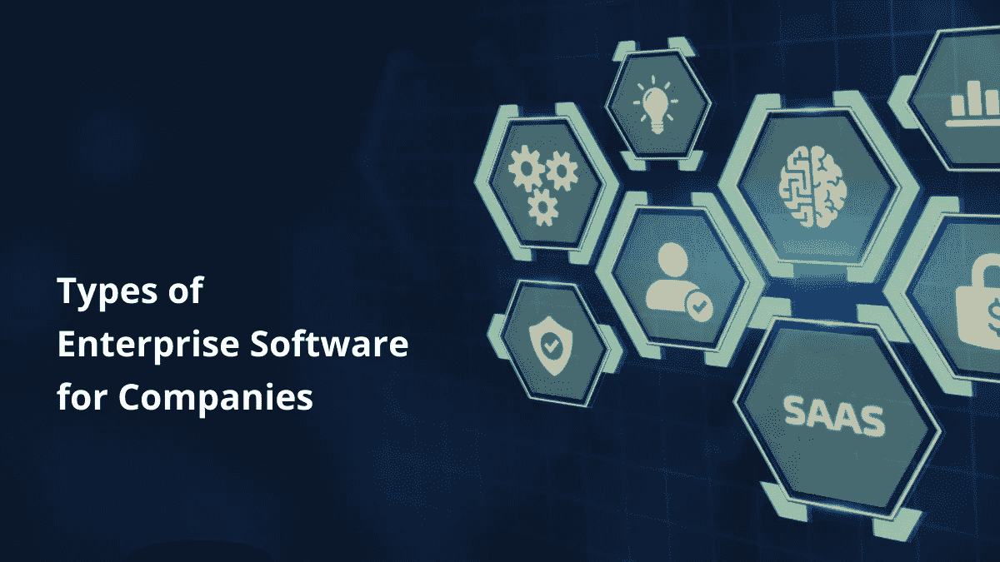

# 2022 年公司的企业软件类型

> 原文：<https://medium.com/codex/types-of-enterprise-software-for-companies-in-2022-923e9debd80e?source=collection_archive---------22----------------------->

预计 2022 年企业软件支出为 6720 亿美元。顶级公司和初创公司需要企业软件来简化他们的业务流程。因此，一家提供商业软件的[企业软件开发公司](https://www.botreetechnologies.com/software-development-company)备受大中型公司的追捧。

从财富 500 强公司到成立仅一个月的初创公司，企业软件对每个企业都是必不可少的。他们需要有助于简化工作流程的解决方案。[企业定制软件开发](https://www.business2community.com/tech-gadgets/top-custom-software-development-methodologies-for-enterprises-02448430)也消除了对第三方软件的依赖。

本文将重点介绍 2022 年不同类型的企业软件。为了便于理解，它还将讨论企业软件的不同属性。

# 什么是企业软件？

企业软件是公司用来简化内部和外部流程、信息、报告、分析和流程的程序。

这些解决方案使各种公司、行政机构、公共社会秩序和不同社区的任务自动化。根据组织的需求，企业软件的类型会不断变化。

在我们深入研究不同类型的企业软件之前，让我们了解一下它的属性。

> ***阅读更多:*** [***定制软件:是什么、类型、实例***](https://www.botreetechnologies.com/blog/customized-software-what-is-it-types-and-examples/)

# 是什么造就了企业软件？

任何企业软件的主要目标都是解决特定的业务问题。每个商业软件都有一些共同的属性。让我们看看企业软件是由什么组成的。

*   **企业拥有的**
*   当公司雇佣[软件开发公司](https://www.botreetechnologies.com/)开发[定制应用](https://www.botreetechnologies.com/custom-application-development)时，它就是企业所有的。大多数企业软件系统仅供内部使用，是公司的财产。
*   **可扩展性能**
*   企业软件旨在为大型组织提供完全的可伸缩性。即使有大量用户，它也应该提供高性能。
*   **高度定制**
*   虽然第三方企业软件不提供很多定制，但企业定制软件必须提供高度定制。企业应该能够随心所欲地对其进行个性化设置。
*   **数据安全**
*   每个企业软件都必须提供高级别的数据安全性。公司拥有大量机密数据，企业软件必须通过授权、认证等方式保护这些数据。
*   **集成解决方案**
*   一个[离岸定制软件开发公司](https://www.botreetechnologies.com/blog/how-to-partner-with-an-offshore-software-development-firm/)创建的任何企业软件必须集成多个部门。它应该在一个组织的不同组成部分之间提供高度的相互联系。

# 2022 年需要了解的企业软件类型

根据不同的目标，有不同类型的企业软件。每个软件都旨在实现一个简化结果的目的。

以下是公司在 2022 年应该使用的主要企业软件类型:

1.  **企业资源规划(ERP)软件**

*   [到 2025 年，全球 ERP 软件市场的规模将达到 1007 亿美元](https://www.statista.com/statistics/605888/worldwide-enterprise-resource-planning-market-forecast/)。它是最流行的企业软件之一。
*   ERP 软件的主要目的是在多个部门之间建立一个网络。该软件使数据的流动和交换变得容易。一旦数据被输入 ERP，任何部门都可以访问它。
*   Oracle NetSuite、SAP ERP、Microsoft Dynamics 365 是世界上最好的 ERP 软件的几个例子。

**2。客户关系管理软件**

*   到 2025 年，全球 CRM 软件市场的收入将达到 496 亿美元。CRM 的目标是简化跨多个部门的客户/顾客管理。
*   CRM 的主要用户是销售、库存和营销团队。CRM 包含潜在客户和现有客户的列表，以及他们所有的联系方式。它描述了客户与公司互动的不同接触点。
*   Hubspot、Salesforce、Zoho 是最流行的 CRM 软件的几个例子。

**3。内容管理系统(CMS)软件**

*   到 2025 年，全球内容管理系统[软件市场将达到 439 亿美元](https://www.statista.com/statistics/643850/worldwide-content-management-software-market-share/)。企业 CMS 或 e CMS 的主要目标是确保所有数据和信息被妥善存储，并且不同部门可以方便地访问它们。
*   CMS 包括采购订单、发票、合同、客户数据等等。它改善了公司内部的跨团队协作。CMS 消除了对纸质数据的需求，并将组织的信息流数字化。
*   Box、M-Files、Docuware 是最好的 ECM 软件的几个例子。

**4。商业智能软件**

*   到 2025 年，全球[商业智能和数据分析软件市场](https://www.statista.com/statistics/590054/worldwide-business-analytics-software-vendor-market/)将超过 180 亿美元。BI 软件的主要目标是从可信来源提取相关信息。之后，它会同步数据，并允许团队运行多个查询。
*   商业智能软件对于为决策生成可操作的见解至关重要。它允许用户通过不同的图表、模型、图形和其他可视化表示来处理数据，以简化数据理解。
*   Tableau、Sisense、MicroStrategy 是一些使用最广泛的商业智能和数据分析软件。

**5。项目管理软件**

*   77%的高绩效团队使用项目管理软件。几乎每个企业都使用项目管理软件来规划其运营。团队利用项目管理工具来简化他们一天、一周甚至一个月的活动。
*   工作流优化、数据分析、报告和产品生命周期优化是项目管理软件的一些常见应用。
*   Monday.com、JIRA、阿萨纳、特雷罗和里克是应用最广泛的项目管理软件的几个例子。

**6。供应链管理软件**

*   供应链管理[软件市场的收入预计到 2022 年底将达到 180.4 亿美元](https://www.statista.com/outlook/tmo/software/enterprise-software/supply-chain-management-software/worldwide)。配置管理软件的主要目标是简化商品和服务的流动。
*   供应链软件确保生产和交付之间有稳定的相互联系。它有助于系统地管理物流工作流程，包括库存管理、交付跟踪等等。
*   SAP SCM、Logility、E2Open 是企业最佳 SCM 软件的几个例子。

7 .**。人力资源管理软件**

*   [托管人力资源软件的估值](https://financesonline.com/hr-statistics/)为 138 亿美元。HRM 软件的目标是管理与公司人力资源管理相关的日常任务。
*   它包括管理工资、出勤、休假、绩效、报告、员工培训、评估等等。招聘工作流程自动化简化了雇佣新人才和留住现有人才的任务。提供定制软件开发服务的公司可以轻松创建 HRM 软件。
*   CoreHR、甲骨文 HCM 云、SuccessFactors 等都是顶尖的人力资源管理软件。

> ***阅读更多:***[***2022 年定制软件开发指南***](https://www.botreetechnologies.com/blog/what-to-know-about-custom-software-development/)

# 包扎

以上是企业为了更好地管理业务而需要的 7 大类企业软件。软件开发服务正在激增，企业软件是需求最大的软件之一。像 BoTree Technologies 这样的专家可以轻松地帮助企业创建 HRM、CMS、CRM、ERP 和所有其他类型的企业软件。

如果您正在寻找外包软件开发服务，我们是您合适的合作伙伴。

[**联系我们**](https://www.botreetechnologies.com/contact) **今天免费咨询。**

*原载于 2022 年 5 月 31 日 https://www.botreetechnologies.com**的* [*。*](https://www.botreetechnologies.com/blog/types-of-enterprise-software-for-companies/)