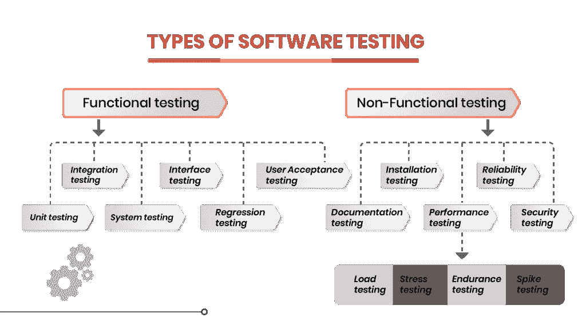

# 测试类型

> 原文：<https://medium.com/codex/types-of-testing-de4cdd98df77?source=collection_archive---------15----------------------->

大家好，在这个博客中，我想讨论和分享一下 IT 行业的测试。软件测试在软件产品的开发阶段起着重要的作用。这个阶段识别并指出开发原型中的逻辑错误或任何软件缺陷。这种说法的原因是，在开发阶段，没有足够的时间来深入研究基于 IT 的产品的基本逻辑原则。因此，QA(质量保证)工程师在通过执行一套测试工具使产品满足客户要求方面起着至关重要的作用。

然而，在遵循国际原则和声誉的大型科技公司中，软件产品有许多类型的测试。

通常遵循的测试类型有:

*   ***单元测试***
*   ***组件测试***
*   ***集成测试***
*   ***烟雾检测***
*   ***回归测试***
*   ***心智健全测试***
*   ***系统测试***
*   ***用户验收测试***

测试类型(来源:谷歌)

# **单元测试**

在单元测试中，作为组件开发的代码的每一部分都满足或实现了期望的需求。这也被认为是测试已经逻辑创建的最小代码段的测试。在对单个测试进行测试后，它们被最终确定为适合使用。

# **组件测试**

组件测试也称为模块测试，在单元测试之后进行。组件测试可以用一个单独的单元来执行，或者由开发团队集成为一个模块(通常)。换句话说，组件测试是单元测试的一个版本，它使用实时数据而不使用虚拟数据。这是测试周期中的一个重要阶段，因为在进入下一个测试阶段之前，每个组件都作为一个模块进行测试。

# 集成测试

在集成测试中，多个模块或组件被集成为一组并进行测试。这种级别的低级测试将能够暴露系统中可能存在的错误或任何逻辑错误。也被称为 **I & T** (集成与测试)。换句话说，它也被称为自下而上的测试，在这种测试中，各个独立的单元被组合起来，最后作为一个整体功能进行测试。

为了将集成测试作为第一步来执行，QA 团队需要准备一个测试计划，包括测试用例以及脚本。在执行了所有已定义的测试用例之后，他们必须跟踪并重新测试从测试结果中发现的缺陷。

# 烟雾测试

一般来说，测试可以被称为“信心测试”或“验证测试”，因为在这个测试中，测试团队验证构建的系统是稳定的，或者确保在构建中没有问题，并进入下一个测试阶段。这是回归测试的一个简单版本，它只快速关注主要功能。冒烟测试的主要优点是它运行迅速，可以发现系统中可能存在的任何重要和关键错误。烟雾测试可以分为手动和自动两种。

# 回归测试

在任何新模块或代码与最新版本集成后，进行回归测试以使现有功能正常运行。此外，这也确保了组件的新集成不会对现有系统产生任何副作用。为了进行回归测试，我们需要调试代码，以过滤掉任何现有的错误，然后在选择合适的测试案例和场景后，测试就完成了。

# 健全性测试

测试确保软件准备好以完美的工作功能进行构建。这也可以说是回归测试的一个子集。测试的主要目的是确认提议的变更是否在系统中完美运行。一般来说，在测试阶段通过冒烟测试后进行测试。

# 系统试验

在系统测试中，软件完全集成为单一产品，以检查所有端到端功能是否按计划运行。在系统测试中，要执行几个测试来验证单个软件产品是否可以作为单个产品交付给用户。在系统测试中主要有两种类型的测试，如**黑盒和白盒**测试在黑盒测试中，QA 团队主要关注主要功能，并寻找系统中可能出现的高级错误。而在白盒测试中，从上到下进行检查，以验证系统中是否存在任何逻辑错误或微小错误。

还有其他子测试，如**负载测试**，用于检查应用程序在高流量时间下的可伸缩性，以及**可用性测试**，这些测试可能会根据给定的场景进行。

# 用户接受度测试

进入生产或现场后，测试生命周期中的最后一项测试是用户验收测试(UAT ),在该测试中，真实的最终用户会尝试使用产品来体验真实的环境和产品流程。通常，这是产品测试生命周期的最后阶段。计划 UAT 的原因是为了验证产品的商业价值，并且用户可以理解构建的产品而没有任何挑战。由于这是测试生命周期的一个重要阶段，QA 团队有责任执行并记录下错误或缺少的功能，以交付给开发团队，从而成功地完成生命周期。

我希望这涵盖了测试生命周期中所有主要类型的测试。进一步的细节，你可以参考这个精彩的网站来了解 S [**软件测试**](https://www.guru99.com/software-testing.html) 。如果有任何测试阶段的附加内容，请随意发表评论。很乐意帮助和分享我的知识。一篇新文章中再见。

为所有人干杯！！！🥂🥂

