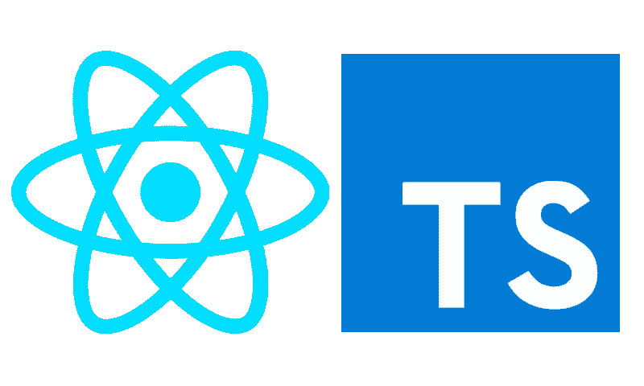
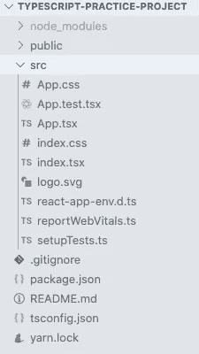
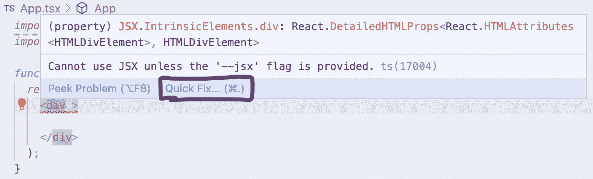

# TypeScript 和 Create-React-App

> 原文：<https://medium.com/codex/typescript-and-create-react-app-11bdebcbf763?source=collection_archive---------1----------------------->

## [法典](http://medium.com/codex)

## 快速入门

您想在 React 中使用 TypeScript，但不确定如何开始。你来对地方了！(这一次我们不会讨论 TS 语法——只是开始运行。)



比如花生酱和果冻

# 从头开始创建新应用

如果您正在构建一个新的应用程序并使用 create-react-app，那么 Create React App 文档非常有用:

> 您可以使用模板启动新的 TypeScript 应用程序。要使用我们提供的 TypeScript 模板，请将`--template typescript`追加到创建命令中。

```
npx create-react-app my-app --template typescript
```

它编译得很漂亮，不需要特殊设置或者下载包。所有原本是`.js`文件的文件现在都是`.ts`或`.tsx`。



一件美丽的东西！

如果您发现自己已经开始了一个项目，并且想要转换成 TypeScript，不要担心！这也有一个解决方案。

# 将现有应用程序转换为 TypeScript

在终端中，导航到您要安装 TypeScript 的应用程序目录:

```
npm install --save typescript @types/node @types/react @types/react-
dom @types/jest
```

然后重命名任何你想要的文件，使其以`.tsx`结尾。比如`App.tsx`，而不是`App.js`。

这就是你可能会遇到问题的地方。如果你打开你的`App.tsx`文件，你会看到几乎所有的东西都有红色下划线。不太好。

首先，如果你还没有这样做的话，你会想要在文件的顶部使用`import React from 'react'`。

如果您在 VSCode 中，并将鼠标悬停在任何带下划线的元素上，您将得到消息“除非提供了'— jsx '标志，否则无法使用 JSX”此时，您可以单击“快速修复”选项，也可以手动修复。如果您单击“快速修复”，您将得到一个选项，上面写着“在您的配置文件中启用'— jsx '标志。”一旦你点击它，它需要一两秒钟来加载，然后错误应该消失。



我不使用黑暗模式，请随意@我

如果你想手动操作，进入你的`tsconfig.json`文件，找到`"jsx"`的键，将值改为`"react"`而不是`react-jsx`。

如果您的`tsconfig.js`文件中仍然出现错误，您可能使用了不同版本的 TypeScript。键入`cmd + shift + p`打开 VSCode 中的快速设置，查找“TypeScript:选择 TypeScript 版本…”。点按它，然后选取“使用工作区版本”

希望现在你没有任何错误，你的代码正在编译，你已经准备好运行一个神奇的应用程序了！

我很乐意连接！在 [LinkedIn](https://www.linkedin.com/in/jzolotarev/) 、 [GitHub](https://github.com/jzolo22) 、 [Twitter](https://twitter.com/JZolo) 上找我。

## 有用的资源

[](https://create-react-app.dev/docs/getting-started/) [## 入门|创建 React 应用程序

### Create React App 是官方支持的创建单页 React 应用程序的方式。它提供了一个现代建筑…

创建-反应-应用程序.开发](https://create-react-app.dev/docs/getting-started/) [](https://create-react-app.dev/docs/adding-typescript/) [## 添加类型脚本|创建 React 应用程序

### 注意:该特性在 react-scripts@2.1.0 和更高版本中可用。

创建-反应-应用程序.开发](https://create-react-app.dev/docs/adding-typescript/)