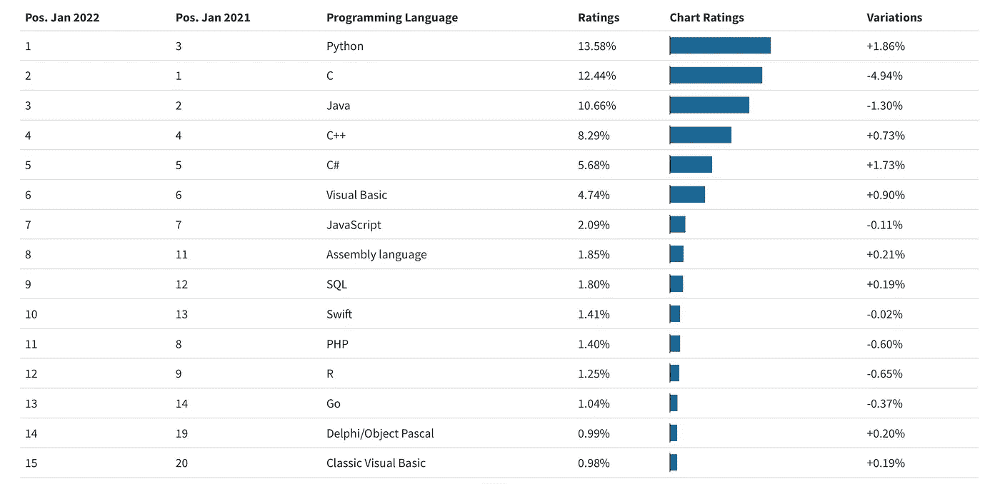

# 打字稿正在消亡

> 原文：<https://medium.com/codex/typescript-is-dying-486eab658a95?source=collection_archive---------5----------------------->

## 是时候说出真相了。

所有正在消亡的编程语言。来自[矢量图](https://vectorgrove.com/)的插图。

你好。我的名字是 Henrik，我有 346 年的 web 开发经验，我有太多的证书，每当我得到一个新的证书时，我都必须扔掉一个旧的，因为它们根本不适合我的抽屉。我自己不是程序员，但是现在谁说你需要成为程序员了？想要在科技行业取得成功，你真正需要的是让别人做你想让他们做的事情的能力。

总之。你知道所有这些编程语言吗？他们人太多了！Ada、Bash、C++、Dart、ECMAScript、Go、Haskell、Java、JavaScript、kot Lin……这几乎是一个完整的字母表，还有更多。

你会感到不知所措吗？你并不孤单。我的意思是，让我们面对现实吧——没有人喜欢会说一大堆语言的人，这只是吹牛。英语成为事实上的通用语是有原因的。

但是你不需要担心。谢天谢地，所有这些听起来像一个特别可怕的拼字单词的愚蠢语言不会永远存在。就看[基础](https://www.quora.com/Is-the-BASIC-programming-language-pretty-much-dead-in-the-software-development-industry)吧。零碎休息(像 VBA 和 VB。网)。

现在，我已经听说了很多关于这个奇特的新语法超集 [JavaScript](/coderats-llc/finally-the-end-of-javascript-aed1739961cc) 称为 [TypeScript](https://dev.to/bettercodingacademy/typescript-is-a-waste-of-time-change-my-mind-pi8) ，它增加了可选的[静态类型](https://en.wikipedia.org/wiki/Static_typing)。图灵完全语言的静态类型检查本质上是保守的。没有人确切地知道为什么它甚至关心当代政治，但也许这就是为什么它首先是图灵完全的？这可能是 TypeScript 正在消亡的原因之一，因为有许多自由派开发人员。还有，图灵到现在已经去世快 68 年了。

TypeScript 正在消亡的另一个原因是，它只是给已经存在的语言增加了一些额外的味道。有太多的语言可以编译成 JavaScript。有些人可能会想，为什么不简单地使用普通的 JS 呢？嗯，我想有些人只是喜欢巧克力或草莓。

还有，没人喜欢 JavaScript。出于各种原因，大多数人实际上都讨厌 JavaScript。甚至 Visual Basic [更受欢迎](https://capture.dropbox.com/oADY6fYI6yE5UWXu)！

连 Visual Basic 都比 JavaScript 流行！截图来自 statisticsanddata.org 的[。](https://statisticsanddata.org/data/the-most-popular-programming-languages-1965-2022-new-update/)

Java 是另一种比 JavaScript 更流行的语言。没错——如果人们可以在 JavaScript 和一杯咖啡之间选择，他们会选择咖啡。尽管你可以用从事 JavaScript 工作赚来的钱买成百上千杯咖啡。大家就是这么讨厌 JavaScript 的。

[Python](https://www.google.com/url?sa=t&rct=j&q=&esrc=s&source=web&cd=&cad=rja&uact=8&ved=2ahUKEwiMy62btp73AhXP-yoKHbUECOUQFnoECAsQAw&url=https%3A%2F%2Fpython.plainenglish.io%2Fis-python-dying-or-going-to-the-moon-7f2539e4ad19&usg=AOvVaw1gBHm_WGJmDRxCHp37Sfsf) 坐在最上面。我不知道你怎么想，但我觉得很奇怪的是一条血淋淋的蛇最受欢迎。是的，当然，它们是无毒的等等，但是——这是一条该死的蛇！

C，C++，C#都在前 5。听起来像是由三岁小孩命名的语言。

“多可爱的兔子啊！她叫什么名字？”

“她的名字叫 c。”

“哦，好吧。那狗呢？”

“他的名字叫 C Plus Plus。”

“啊哈。那只猫呢？”

"她的名字叫“C 和乐谱符号”,意思是音调高一个半音."

“你是说……锋利？”

“没错，升 C 调。因为她很有眼光。她能在黑暗中看见！”

[反正蟒蛇可能快死了](https://pawankishorsingh.medium.com/python-may-die-c855f75d168f)。 [C](https://www.quora.com/Is-C-destined-to-die) 、 [C++](https://www.quora.com/Is-C-dying-2) ，还有 [C#](https://dev.to/dotnetsafer/c-in-2022-will-it-die-5501) 也是。 [COBOL](https://www.quora.com/Is-Cobol-a-dead-language) 也会。事实上，它已经消亡了 43 年。据[一位 Quora 用户](https://www.quora.com/profile/Ira-Baxter)，Datamation 杂志开始问***COBOL 死了吗？*一九六九年**。他们每年都问同样的问题，直到 20 世纪 90 年代的某个时候，Datamation 杂志本身也消亡了。

> COBOL 仍然广泛使用，事实上它处理每天发生的数十亿信用卡交易中的大部分。几乎没死。我怀疑这位在 1969 年认为提出这个问题是个好主意的 40 岁的《数据化》杂志编辑，他自己很可能已经死了。

Datamation 杂志已经死亡，编辑可能已经死亡或正在死亡。所以很明显，COBOL 也会消亡。

每个人都希望 PHP 死掉，而且它会死掉。也许迟早会。或迟于或早于。谁知道呢。活着的人会看到，除非他们死了。

如果所有这些编程语言没有在我们之前消亡，它们最终也会消亡，因为太阳正在消亡。当太阳消亡时，我们的整个太阳系将会消亡，连同人类和所有的语言。除非我们能够找到一种方法去[殖民宇宙](https://futurism.com/will-humans-will-one-day-colonize-universe)。

但这不太可能，因为埃隆·马斯克从出生那天起就一直在死去，他是我们最后的希望。至少根据塔克·卡尔森的说法。

你们中的一些人可能会指责我点击诱饵，但这只是胡说八道。你知道为什么吗？因为 [clickbait 快死了](https://www.blinkeredmedia.com/death-clickbait-headlines-facebook-helping/)。其他人可能认为“嘿，这听起来像讽刺？”读到这里的时候。那也是废话。你知道为什么吗？

你猜对了。

[讽刺正在消亡](https://nationalinterest.org/blog/buzz/why-satire-dying-126226)。

当我不忙着死的时候，我谦卑地恳求人们支持我这个作家。如果你想这么做，考虑让[成为一名中级会员](/@H_Stahl/membership)。每月只需 5 美元——比大多数公司花在遗留代码上的钱都少！它让你可以无限制地阅读媒体上的故事。如果你[用我的链接](/@H_Stahl/membership)注册，我会赚一小笔佣金。👐

 [## 通过我的推荐链接加入 Medium-Henrik sthl

### 作为一个媒体会员，你的会员费的一部分会给你阅读的作家，你可以完全接触到每一个故事…

medium.com](/@H_Stahl/membership) 

阅读更多信息:

 [## 没有所谓的“设计系统设计师”

### 不要编造标题，要讲技巧和心态。

uxdesign.cc](https://uxdesign.cc/theres-no-such-thing-as-a-design-system-designer-e06d57b285b4)  [## 快速移动和打破东西是可悲的误解

### 也许甚至由脸书自己来决定。否则为什么抛弃这么好的口号？

medium.com](/codex/move-fast-and-break-things-is-sadly-misunderstood-f6684a55661a)