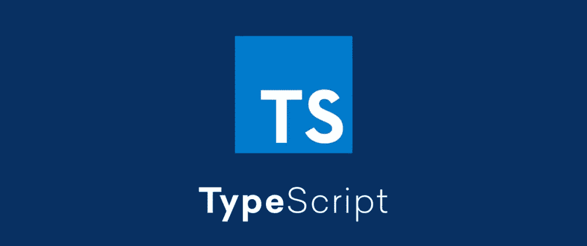

# 打字指南

> 原文：<https://medium.com/codex/typescript-type-guide-747377f39afb?source=collection_archive---------6----------------------->



用于编写大型应用程序的最有趣的语言之一是 **TypeScript** 语言。它很特别，因为它是一个 **JavaScript 超集**，但是添加了类型、接口和许多其他东西。这意味着它并不打算取代 JavaScript，它只是为了方便开发，使 JavaScript 应用程序更具可伸缩性和可维护性。

这种语言不需要任何关于 JavaScript 或任何其他类型语言(如 Java 或 C)的高级知识，因此，中级 JavaScript 开发人员已经可以享受它的优势，因为可以一点一点地学习它的特性并逐渐应用它们。

> 本指南试图解决与语言理论相关的概念，将某些部分如安装和配置放在一边。

# 💙打字

与许多人的想法相反， **TypeScript 不是一种强类型语言**，因为它没有必要键入所有的变量。简单变量类型可以在声明时由 TypeScript 自动推断，如数字或字符串。这个特性叫做**型推理**。

> 任何类型不能由 TypeScript 推断的变量都会自动类型化为 Any。

## 任何:

意味着任何东西，当变量的类型不确定时使用，主要情况是当我们不知道第三方库的实体类型时。应该尽可能避免使用它。

```
let anyType: any;
anyType = 5;
anyType = 'Hello World';
anyType = true;
```

## 字符串:

由单引号、双引号或反勾号包围的字符集。这些代表字母、单词或短语。

```
const myString: string = 'My String';
```

## 编号:

任何数字，无论是自然数、整数还是有理数。它们没有引号，因为在这种情况下它们会被视为字符串。

```
const myNumber: number = 8;
```

## 布尔型:

只能取两个值的变量类型: **true** 或 **false** 。

```
const myBoolean: boolean = true;
```

## 数组:

数组是一个无序的数据列表，它有几个相同类型的元素。

```
const myNumberArray: Array<number> = [1, 2, 5, 10];const myStringArray: Array<string> = ['Hello', 'World', '!'];
```

## 元组:

虽然 JavaScript 本身没有元组，但是 TypeScript 允许我们在数组中模拟它们。元组是有限元素的列表，通常很短，每个元素都有特定的类型。

```
const myTuple: [string, number] = ['Hello World', 16];
```

## 枚举:

这是一种将熟悉的名字添加到数字列表中的方法。默认情况下，值从零开始，自动递增。

```
enum MyNumbersList {Zero, One, Two};const myNumber: MyNumberList = MyNumbersList.One; // 1
```

我们还可以为每个元素设置一个特定的值。

```
enum AgeList {
  MyAge = 18,
  DadAge = 40,
  MomAge = 38
}const myAge: AgeList = AgeList.MyAge; // 18 
```

同样，我们可以做相反的过程。

```
enum ColorList {Red, Green, Blue};const myColor: string = ColorList[1]; // 'Green'
```

## 无效:

就像 any 的反义词，void 就是完全没有类型。通常用于键入不返回任何内容的函数。

```
function helloWorld(): void {
  console.log('Hello World!');
}
```

> 将 void 赋给变量是没有用的，因为在这些情况下我们只能将其设置为 null 或 undefined。
> 
> 如果我们想在一个变量中存储一个 void 函数的返回，我们将有值**未定义**

## 空且未定义:

就像 void、null 和 undefined 本身没有用一样，通常与**联合类型**一起使用(我们将在本文后面讨论)。Null 和 undefined 表示变量中没有值。

```
const u: undefined = undefined;
const n: null = null;
```

## 从不:

那种类型表示函数永远不会返回，当我们确信某事永远不会发生时。使用这种类型的一些情况:

```
// Function that always throw an error
function error(): never {
  throw new Error('Something went wrong!');
}// Function with an unreachable end
function loop() {
  while(true) {
    console.log('It will never end!');
  }
}
```

## 对象:

根据 TypeScript 文档，对象是具有属性的值。要定义一个对象类型，只需列出它的属性和类型。

```
// Define object properties types
const Person {
  name: string;
  age: number;
  description?: string;
};// Give each property a value
person = {
  name: 'Rafael',
  age: 18
};
```

# 👫工会类型

当我们需要一个变量有多种类型时，就会用到这个特性。

```
// Declares a function that receives name (string)
// and age (string or number)
function sayMyNameAndAge(name: string, age: string | number) {
  console.log(`My name is ${name} and I'm ${age} years old`)
}sayMyNameAndAge('Rafael', 19); // OK
sayMyNameAndAge('Rafael', '19'); // OK
sayMyNameAndAge('Rafael', true); // Error
```

# 🔍类型断言

有时，在某些情况下，您会比 TypeScript 本身更了解一个值。**类型断言**是告诉编译器“嘿，相信我，我知道我在做什么”的一种方式，防止编译时可能出现的错误(在运行时没什么区别)。

类型断言有两种可能的语法:

## 尖括号语法

```
const message: any = 'This is a string with any type!';
const messageLength: number = (<string>message).length;
```

## “As”语法

```
const message: any = 'This is a string with any type!';
const messageLength: number = (message as string).length;
```

# 🗺类型别名

基本上是为某个类型创建一个名字，它们类似于接口，但是可以命名原语、并集、元组等。

```
type myTuple = [string, number, boolean];const tuple: myTuple = ['Hello', 25, true];
```

我们也可以使用这个功能来定义变量的精确可能值。

```
type OS = 'Windows' | 'Mac OS' | 'Linux';const myOs = 'Windows'; //OK
const myPhoneOs = 'ios'; //Error
```

# 📃连接

接口本质上是一个对象的类型。该功能允许我们使用相同类型的对象，而无需代码重复。

看看两个具有相同属性但没有使用接口的对象的声明:

```
const point: {
  x: number;
  y: number;
};

point = { x: 5, y: 12 };

const point2: {
  x: number;
  y: number;
};

point2 = { x: 8, y: 20 };
```

现在看同一个例子，但是这次使用了接口:

```
interface IPoint {
  x: number;
  y: number;
};

const point: IPoint = { x: 5, y: 12 };
const point2: IPoint = { x: 8, y: 20 };
```

如果我们想给某个对象添加某个属性，我们也可以扩展一个接口。看:

```
interface IPoint {
  x: number;
  y: number;
};

interface IPoint3d extends IPoint{
  z: number;
};

const point: IPoint = { x: 5, y: 12 };
const point3d: IPoint3d = { x: 8, y: 20, z: 5 };
```

或者更好的是，我们可以将“z”定义为可选属性，从而创建一个唯一的接口:

```
interface IPoint {
  x: number;
  y: number;
  z?: number;
};

const point: IPoint = { x: 5, y: 12 };
const point3d: IPoint = { x: 8, y: 20, z: 5 };
```

> 根据 TypeScript 文档，尽管很相似，但这些接口在代码中带来了更多的资源。因此，从理想的角度来看，使用接口比使用类型别名功能更好，类型别名功能只是作为最后的手段使用。

# 📐交叉点类型

这个特性使得某个变量必须满足分配给它的所有类型的契约。看:

```
interface IUser {
  name: string;
  password: string;
};

interface IChar {
  nickname: string;
  level: number;
};

type UserInfo = IUser & IChar;

const userInfo: UserInfo = {
  name: 'Rafael',
  password: '123456',
  nickname: 'LopeKillz',
  level: 255
};
```

# ❓通用类型

泛型类型可以理解为必须包含或引用另一种类型的类型。最常见的是**数组**和**承诺**。

```
// Array
// Declares a number array
const numbersArray: Array<number> = [0 , 5, 10];

// Promise
// Declares a Promise that returns a string when resolved 
const stringPromise: Promise<string> = new Promise(resolve => {
  resolve('Hello World!');
});
```

通过使用泛型类型，我们可以避免在一个函数中使用 any 类型，该函数接受一个具有几种可能类型的参数。使用这种策略，我们只允许在调用函数时声明参数类型。看:

```
// First of all, we declare a function that will take a parameter of 
// any type and return it
function indentify<T>(arg: T): T {
  return arg;
};// So we can call the function above passing as parameter a string
identify<string>('Hello World');// We can also call the same function, but this time passing a 
// number as parameter
identify<number>(18);
```

> 很多时候，我们不需要指定参数类型，因为**类型推断**

# ✅结论

这是关于类型脚本类型以及如何最好地使用它们的一般指南。当然，这种语言还有其他几个特性，比如 decorators，但是重要的是从基础开始，一点一点深入下去。

本文是进入类型化 JavaScript 世界的一个很好的入口，因为我们以简单明了的方式介绍了许多功能。我希望我已经帮助了那些花时间阅读所有主题的人。

如果你想更深入地了解这个主题，我建议你访问我在下面留下的所有参考资料，尤其是官方文档！

# 📚参考

> *打字稿官方文档:*[](https://www.typescriptlang.org/docs/home.html)
> 
> **爱德华多·拉贝罗文章，“TypeScript: O 阿桂定义 VO”:*[*https://medium . com/@ oieduardorabelo/TypeScript-O-阿桂-定义 vo-1a63b04259cc*](/@oieduardorabelo/typescript-o-guia-definitivo-1a63b04259cc)*
> 
> **YouTube 上的威利安 Justen 迷你课程:*[*https://www.youtube.com/playlist?list = pllabyrwsytipanrzaga 7 vmuve 7 _ vnXG _*](https://www.youtube.com/playlist?list=PLlAbYrWSYTiPanrzauGa7vMuve7_vnXG_)*
> 
> **TutorialsTeacher 中的打字教程:*[【https://www.tutorialsteacher.com/typescript】T21](https://www.tutorialsteacher.com/typescript)*
> 
> **文章《Tipos básicos-Manual do TypeScript》，作者 WebDevBr:*[*https://webdevbr.com.br/tipos-basicos-manual-do-typescript*](https://webdevbr.com.br/tipos-basicos-manual-do-typescript)*