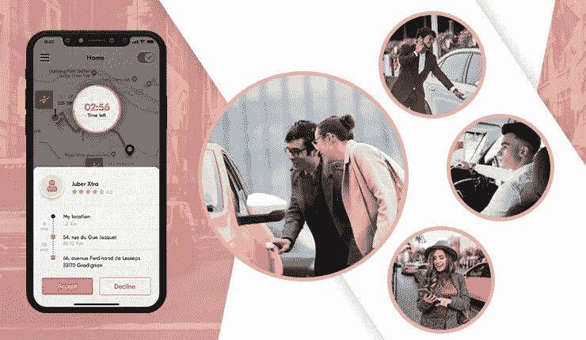
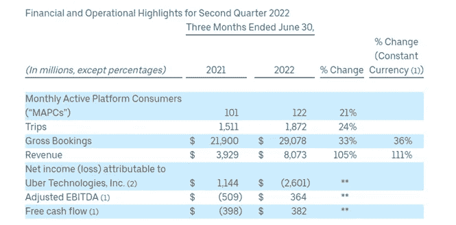
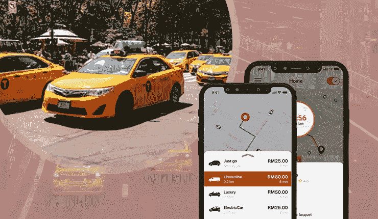
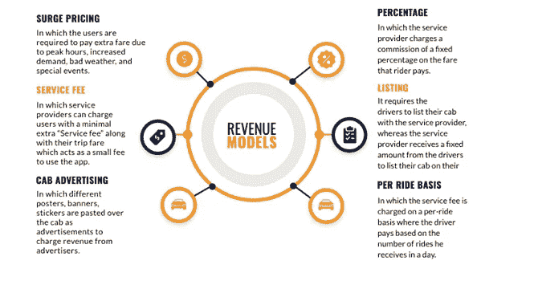

# 优步克隆应用——它如何支持出租车业务转型？

> 原文：<https://medium.com/codex/uber-clone-app-how-it-supports-taxi-business-transformation-77464870a576?source=collection_archive---------12----------------------->

优步克隆应用

我相信你的手机上可能有很多打车应用，其中最突出的是优步。自 2009 年问世以来，它成为那些试图将出租车业务运营数字化的人的灵感来源。这导致了此后众多类似优步的打车应用的推出。

因此，该行业的良好发展前景是多方面的，今天的" ***在线打车服务市场预计到 2026 年将增长 534.8 亿美元"*** 因此，建议那些计划给自己的打车企业一个在线化身的人构建解决方案。怎么会？定制的优步克隆应用程序。

随着时间的推移，主要的初创公司已经意识到，与从头开始构建应用程序相比，定制应用程序是更好的选择。它节省了时间和资金。

所以，你知道为什么你应该因此得到这个解决方案，以你的出租车业务的优势。

# 优步统计

*看看下面这张诱人的* [*优步统计*](https://www.peppyocean.com/blog/uber-stats/) *。*

图片来源:investor.uber.com

看上面的图片，你可以清楚地看到乘客数量、出行次数和收入比率都在稳步增长。

除了上图中的一个，还有一系列吸引人的数字，让你对这家打车巨头的受欢迎程度有了基本的了解。

优步在 2021 年创造了 174 亿美元的收入

总预订量增长了 33%至 36%

2020 年第四季度，这家打车巨头拥有 9300 万用户

69 个国家的 10，000 个城市提供优步服务

58.7%的司机使用优步提供乘车服务

这些数字足以让人了解这家打车巨头为何如此受欢迎，以及它为何吸引了那些希望将其出租车业务数字化的人的注意。

# 如何开发白标优步克隆 App？要遵循的步骤

优步喜欢打车 App

## **1。了解 App 操作**

如果你知道优步应用程序的工作流程，就很容易理解增加哪些功能会带来价值。因此，首先要确保你对这个领域有所了解。

简单地说，如果我必须解释应用程序的操作，打车巨头的功能很简单。骑手在进入应用程序时添加他们的位置信息，并从不同的骑行选项中选择骑行模式。然后，他们与附近接受他们乘坐的司机取得联系。此后，骑手和司机都可以通过应用程序直接保持联系，并跟踪对方的行踪，特别是在后者到达之前。

因此，建议你在继续之前有一个想法，开发一个类似优步的打车应用程序，以便乘客可以方便地乘坐。

## 2.强制性特征知识

开发打车应用程序时，你应该记住的下一点是其不同功能的知识。

在讨论特性时，该解决方案有三个主要部分，分别是骑手、驱动程序和管理面板。

因此，在这三个部分中添加以下组件，以便它们能够以最大的便利性和简单性来执行其功能。

> **对于骑手—**

1.票价计算

2.SOS 按钮

3.应用内通话和聊天

4.多种支付方式

5.取消乘车

> **对于司机—**

1.设置可用性

2.接受/拒绝乘坐请求

3.收入跟踪

4.开始/结束行程

5.评价客户

> **用于管理面板**

1.驱动程序管理

2.骑手管理

3.车辆管理

4.报告和分析

5.手动预订添加

## 3.货币化战略

任何企业创业背后的主要目标是有一个货币化战略。这对于让风险企业思考如何利用应用程序的能力来盈利至关重要。因此，如果你正在建立一个类似优步的打车应用程序，你应该有这个计划。

在下图中，我描述了通过你的应用程序创造收入的不同方式。

图片来源:viprabusiness.com

如你所见，有六种盈利方式。

他们是-

**高峰定价—** 乘客在高峰时段支付额外费用

**服务费—** 服务提供商收取最低限度的“服务费”和“车费”

**汽车广告—** 海报、广告等。，在应用程序上列出，广告客户由出租车公司支付费用

**每次乘车基础—** 每次乘车向司机收取的服务费。司机根据他们提供的乘车次数付款

**列表—** 司机列出他们的出租车，出租车公司从司机那里收到一笔费用

*   **百分比—** 根据乘客支付的车费向司机收取的固定百分比佣金

## 4.联系专门的优步克隆应用开发公司离岸

一旦您熟练掌握了操作和功能，您就可以继续前进，与一个专门的离岸合作伙伴联系，他们在出租车预订应用程序开发服务方面拥有所需的技能和专业知识。在这样做的时候，我建议你访问好公司和其他类似的网站。检查投资组合，掌握组织在优步克隆应用程序开发。这将确保开发应用程序的旅程仍然愉快。它还将确保他们开发的定制应用程序允许您的企业以最适合您的方式成功扩展和增长。

这带来了一个非常关键的问题。我如何知道与我合作的企业是否有能力处理这项任务？要回答这个问题，请检查以下内容-

评估用户界面/UX 设计

与您合作的组织的运营期限

检查他们在沟通中保持的清晰程度

他们如何启动应用程序

一旦这些领域的审查完成，你可以肯定你是在与正确的专业团队合作，他们将把你的业务推向成功和巨大的收入。

了解了所有这些方面，我们准备好进入一个关键话题——优步克隆应用开发的[成本](https://www.peppyocean.com/uber-clone-app/)。

为什么成本至关重要？因为错误地花费在从零开始构建一个应用程序上不是一个明智的商业主张。你必须节省它。

作为一家出租车初创公司，使用白色标签的优步克隆应用程序，你可以节省预算。

***读也:***

 [## 优步克隆应用程序开发——它在出租车创业公司中越来越受欢迎的原因

### 优步的出现给拼车体验带来了一场革命，也让打车行业变得非常…

medium.com](/nerd-for-tech/uber-clone-app-development-reasons-for-its-growing-popularity-among-taxi-startups-1503614f1ea4) 

# 优步克隆应用程序开发的预计成本

当你开始优步克隆应用程序开发之旅，以获得一个类似优步的打车应用程序时，成本大约在 18，000 美元至 45，000 美元之间(适用于 Android 和 iOS)。对于管理面板，您必须分配的资金是 12，000 美元。

所以现在，你已经很好地掌握了当你开发像应用程序一样的白色标签优步时，使你的旅程方便的步骤。你也需要记住一些要点。

**开发类似优步的打车应用时需要记住的几点**

制定好你的营销策略

保持货币化战略，以获得赚取足够收入的能力

掌握应用功能。

深入了解支持轻松应用操作的特性

联系一家专门的[优步克隆应用开发公司](https://www.peppyocean.com/)，该公司将帮助你努力获得一款定制的类似优步的打车应用，从而成功实现增长和可扩展性。

一旦成功覆盖所有这些领域，你可以肯定你的出租车预订应用程序将成为你的出租车初创企业成功的门户，并支持你获得可观的收入。

# 包扎

当你踏上成为出租车行业中一个不可或缺的名字的旅程时，你应该正确地执行出租车预订应用程序开发服务。怎么会？联系熟悉优步克隆应用程序开发艺术的专业合作伙伴。他们自始至终提供的支持将确保骑行直接提供给骑手！此外，它将保证你从第一天开始就获得很高比例的回报和利润。